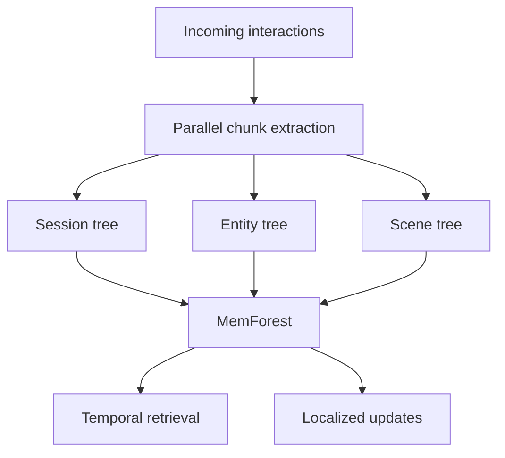
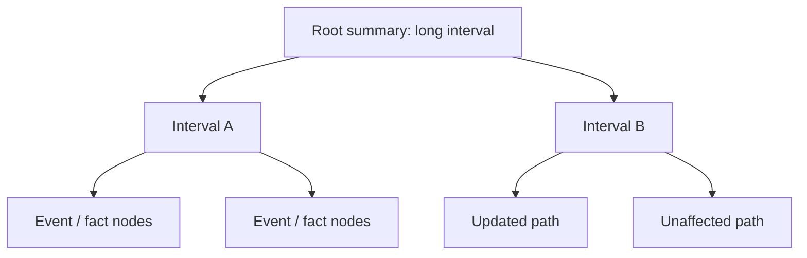

## 왜 이 논문이 중요한가

장기 상호작용 에이전트에서 메모리는 더 이상 부가 기능이 아닙니다. 사용자의 선호, 이전 결정, 시간에 따라 바뀌는 상태를 계속 유지해야 하기 때문입니다. 그런데 실제로 persistent memory를 붙여보면 병목은 검색보다 **쓰기(write)와 유지보수(update)** 쪽에서 먼저 드러납니다.

**MemForest**는 이 문제를 정면으로 다룹니다. 핵심 아이디어는 간단합니다.

> 에이전트 메모리를 거대한 요약문으로 계속 다시 쓰지 말고, 시간 순서가 있는 작은 트리들의 숲으로 관리하자.

논문은 이를 **write-efficient temporal data management problem**, 즉 쓰기 효율적인 시간 데이터 관리 문제로 재정의합니다. 이 관점 전환이 꽤 중요합니다. 메모리를 "LLM이 요약해서 저장하는 텍스트"가 아니라 "시간에 따라 갱신되는 인덱스 구조"로 본다는 뜻이니까요.

## 기존 메모리 시스템의 병목

기존 에이전트 메모리 시스템은 대체로 다음 흐름을 가집니다.

1. 대화나 이벤트가 들어온다.
2. LLM이 중요한 내용을 추출한다.
3. 기존 메모리 상태를 읽는다.
4. 새 내용을 반영해서 전체 또는 큰 단위의 상태를 다시 쓴다.

이 방식은 작은 규모에서는 잘 작동합니다. 하지만 장기 상호작용이 쌓이면 두 가지 문제가 생깁니다.

- **coarse-grained state management**: 메모리 상태를 너무 큰 덩어리로 관리해서 작은 변화에도 큰 범위를 갱신해야 합니다.
- **sequential update pipeline**: 추출과 갱신이 순차적으로 묶여 있어 대화가 길어질수록 쓰기 지연이 커집니다.

쉽게 말하면, "오늘 한 가지 사실이 바뀌었을 뿐인데, 일기장 전체 요약을 다시 쓰는" 구조입니다. 메모리가 커질수록 지연이 늘어나는 건 당연합니다.

## MemForest의 핵심: 병렬 추출 + 시간축 트리

MemForest는 이 병목을 두 단계로 풉니다.

### 1. 병렬 chunk extraction

먼저 메모리 생성을 하나의 긴 LLM 파이프라인으로 묶지 않습니다. 입력을 chunk 단위로 나누고, 각 chunk에서 필요한 메모리 항목을 독립적으로 추출합니다. 이렇게 하면 쓰기 경로가 순차 병목에서 벗어나 병렬화될 수 있습니다.

### 2. MemTree: hierarchical temporal index

두 번째가 논문의 핵심인 **MemTree**입니다. MemTree는 메모리를 평평한 전역 요약이 아니라 **시간 순서가 있는 계층형 트리**로 조직합니다.

각 트리는 특정 범위의 기억을 담당합니다. 새 정보가 들어오면 전체 메모리를 다시 쓰는 대신, 영향을 받는 트리 경로의 노드만 갱신합니다.

이 구조의 장점은 명확합니다.

- 새 메모리 삽입이 영향을 받는 경로로 제한됩니다.
- 과거 상태와 최신 상태를 시간축에서 함께 보존할 수 있습니다.
- 검색 시 루트 요약에서 시작해 관련 시간 구간으로 내려갈 수 있습니다.
- 전체 상태 재작성 대신 per-node update가 가능해집니다.

결국 MemForest는 "메모리를 잘 요약하는 방법"보다 "메모리를 덜 다시 쓰는 방법"에 집중합니다.

## 실험 결과

논문은 LongMemEval-S와 LoCoMo 두 장기 메모리 벤치마크에서 평가했습니다. 가장 눈에 띄는 결과는 LongMemEval-S입니다.

| 항목 | 결과 |
|------|------|
| 벤치마크 | LongMemEval-S |
| 주요 지표 | pass@1 |
| MemForest 성능 | 79.8% |
| 비교 포인트 | stateful baseline 중 최고 성능 |
| 쓰기 처리량 | EverMemOS 등 최신 접근 대비 약 6배 |

성능만 보면 "조금 더 좋은 메모리 시스템"으로 보일 수 있지만, 중요한 건 정확도와 쓰기 처리량을 동시에 본다는 점입니다. 장기 상호작용 에이전트에서는 메모리 정확도만큼이나 **메모리를 계속 업데이트할 수 있는 비용 구조**가 중요합니다.

## 무엇이 새롭나

MemForest의 새로움은 세 가지로 볼 수 있습니다.

### 1. persistent memory를 데이터 시스템 문제로 본다

많은 에이전트 메모리 논문은 retrieval quality, summarization quality, question answering accuracy를 중심으로 논의합니다. MemForest는 한 발 내려와서 "이 메모리 시스템은 계속 쓸 수 있는가?"를 묻습니다.

프로덕션 에이전트 입장에서는 이 질문이 훨씬 현실적입니다. 사용자가 매일 대화하는데 업데이트 한 번마다 전체 상태를 다시 써야 한다면, 정확도가 좋아도 운영 비용이 버티기 어렵습니다.

### 2. 시간 추론에 맞는 저장 구조를 쓴다

장기 메모리에서 어려운 질문은 대개 시간과 얽힙니다.

- "지난번에 내가 뭐라고 했지?"
- "그 이후에 바뀐 결정이 있었나?"
- "최근 상태 기준으로 뭐가 맞지?"

평평한 벡터 검색만으로는 이런 질문에 약합니다. MemTree는 시간 구간을 구조적으로 보존하기 때문에, 메모리의 temporal fidelity를 유지하기 좋습니다.

### 3. 쓰기 경로를 병렬화한다

에이전트 메모리는 읽기만 하는 지식베이스가 아닙니다. 매 대화마다 계속 쓰입니다. MemForest가 chunk extraction을 병렬화하고 local update로 갱신 범위를 줄인 건, 장기 실행 에이전트의 실제 병목을 잘 짚은 설계입니다.

## 한계와 질문

좋은 방향이지만 남는 질문도 있습니다.

- 메모리 내용이 빠르게 변하거나 모순될 때, 트리 구조가 얼마나 잘 재조정될까?
- entity, session, scene 같은 tree scope를 누가 어떻게 정할까?
- 장기 운영 중 잘못 추출된 노드가 상위 요약에 퍼지면 어떻게 복구할까?
- 벡터 검색, 그래프 메모리, 파일 기반 메모리와 결합할 때 어떤 하이브리드 구조가 가장 안정적일까?

특히 scope 결정은 중요합니다. 트리를 잘못 나누면 local update의 장점이 줄어들고, 반대로 너무 잘게 나누면 검색과 통합 비용이 커질 수 있습니다.

## OpenClaw 같은 에이전트에 주는 시사점

OpenClaw나 Claude Code, Codex류의 장기 실행 에이전트는 이미 파일 기반 메모리와 세션 로그를 사용합니다. 여기서 MemForest의 아이디어를 가져오면 다음 방향이 가능합니다.

- 일일 노트를 단순 날짜 파일이 아니라 시간 구간 트리로 인덱싱하기
- 사용자, 프로젝트, 작업 종류별로 별도 MemTree 만들기
- 전체 MEMORY.md를 자주 다시 쓰지 않고 affected path만 갱신하기
- heartbeat나 dreaming 단계에서 lazy summary refresh 수행하기

즉, 현재의 "파일 기반 투명성"을 유지하면서도 내부 인덱스는 더 데이터 시스템답게 만들 수 있습니다.

## 결론

MemForest는 에이전트 메모리 연구에서 중요한 방향 전환을 보여줍니다. 장기 메모리의 병목은 단순히 "무엇을 검색할 것인가"가 아니라, **계속 쌓이는 기억을 얼마나 싸고 빠르게 유지할 것인가**입니다.

시간축 트리 구조는 이 문제에 잘 맞는 해법입니다. 모든 에이전트 메모리가 MemForest처럼 되어야 한다고 보기는 어렵지만, persistent memory를 설계하는 사람이라면 이 논문의 문제 정의는 꼭 봐야 합니다.

---

**논문**: Han Chen et al., "MemForest: An Efficient Agent Memory System with Hierarchical Temporal Indexing", arXiv:2605.23986, 2026.

**링크**: [Hugging Face Papers](https://huggingface.co/papers/2605.23986), [arXiv](https://arxiv.org/abs/2605.23986)
