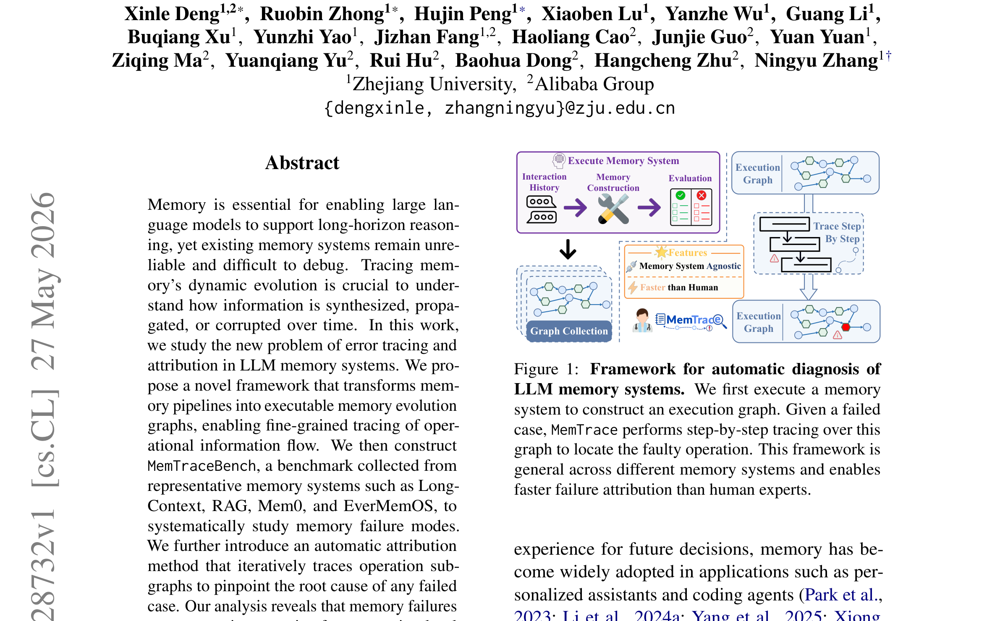
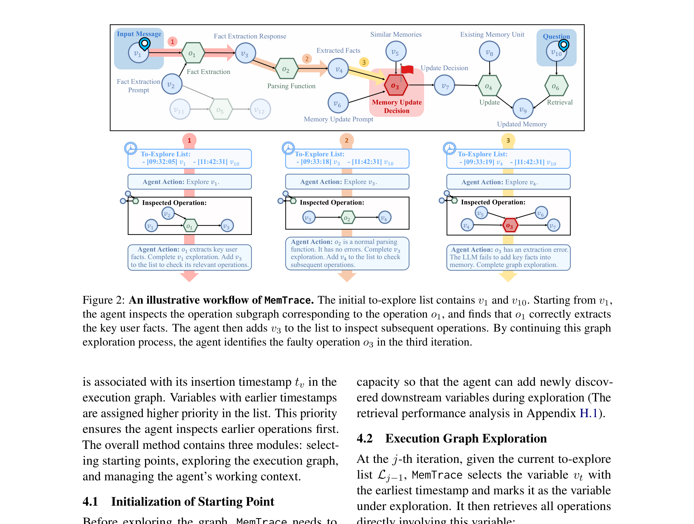
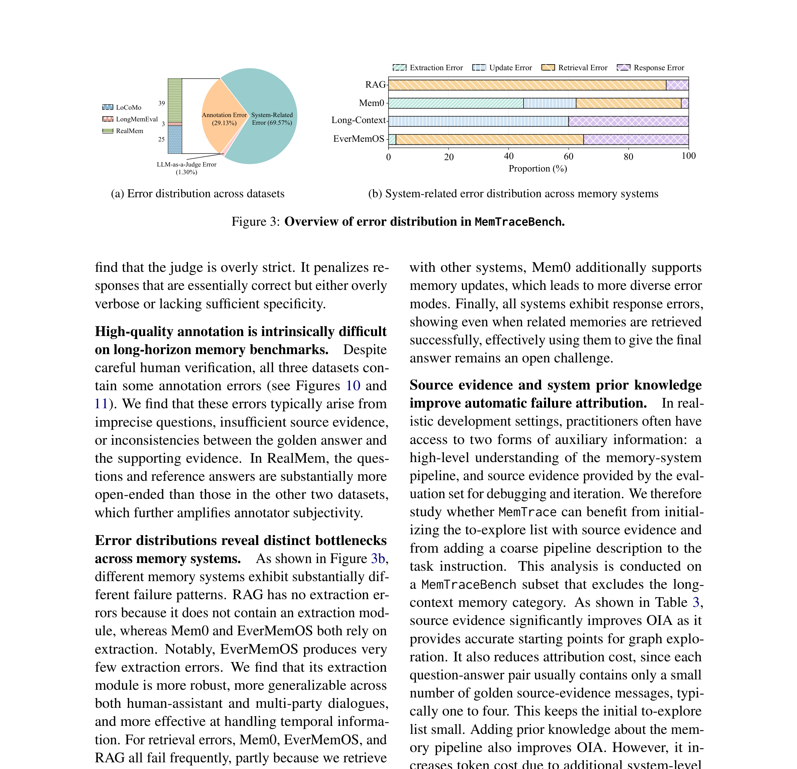
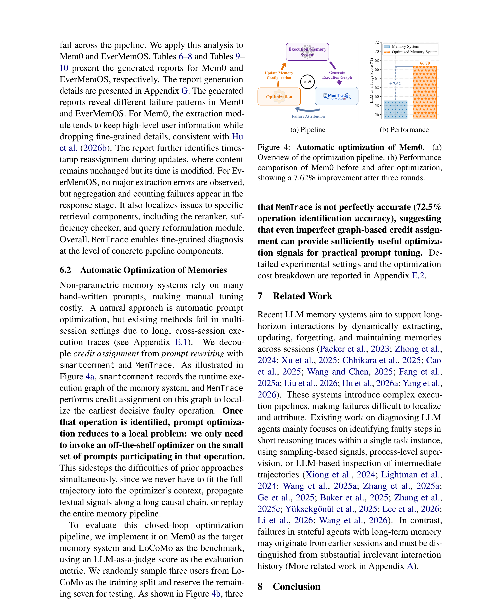

LLM 에이전트에 메모리를 붙이면 멀티턴 대화와 장기 태스크가 가능해진다. 문제는 메모리가 붙으면서 **에러의 원인을 추적하기 극도로 어려워진다**는 점이다. 오늘 다룰 논문 **MemTrace**는 바로 이 지점을 정면으로 공략한다.

> **"메모리 증강 에이전트가 실패했을 때, 어디서부터 잘못됐는지 어떻게 찾아낼 것인가?"**

이 글에서는 **[Tracing and Attributing Errors in Large Language Model Memory Systems](https://arxiv.org/abs/2605.28732)** (Deng et al., 2026) 논문을 바탕으로, 왜 LLM 메모리 디버깅이 어려운지, MemTrace가 어떻게 이 문제를 푸는지, 어떤 인사이트를 얻을 수 있는지 정리해보겠습니다.

## 논문 한 줄 요약

**MemTrace는 LLM 메모리 시스템의 실행 과정을 "메모리 진화 그래프"로 변환하고, 실패한 케이스의 원인 연산을 자동으로 추적·특정하는 프레임워크다.**

단순히 "틀렸다"가 아니라,

- 어느 연산에서 정보가 손실됐는지
- 어느 시점에 잘못된 업데이트가 일어났는지
- 검색 단계에서 정렬이 어긋났는지

까지 세밀하게 추적합니다.



## 왜 이 논문이 중요할까?

### 상태 없는 에이전트 vs 메모리 있는 에이전트

기존 에이전트 디버깅 연구는 주로 **상태 없는(stateless) 에이전트**에 초점을 맞췄다. 이 경우 에러가 현재 실행 궤적 안에 국한되어 있다 — 잘못된 도구 호출, 검색 결과, 추론 단계 같은 것들이다.

하지만 **메모리 증강 에이전트**는 근본적으로 다르다.

- 사용자 선호가 처음엔 올바르게 저장되었다가, 이후 업데이트에서 잘못 덮어씌워질 수 있다
- 이 에러는 훨씬 나중에 검색이나 응답 생성 단계에서야 드러난다
- 단순한 시간순 로그만으로는 **어느 연산이 원인이고 어떻게 전파됐는지** 파악이 불가능하다

### 기존 메모리 벤치마크의 한계

LoCoMo, LongMemEval, RealMem 같은 기존 벤치마크들은 **결과 중심(outcome-oriented)**이다. 시스템이 정보를 잘 저장·검색·활용했는지는 알 수 있지만, 실패가 **어떤 인과 경로를 통해 발생하고 전파됐는지**는 복원하지 못한다.

MemTrace는 이 **추적 가능성(traceability) 갭**을 메우려는 시도다.

## 핵심 아이디어: 실행 그래프(Execution Graph)

MemTrace의 핵심은 메모리 시스템의 실행을 **이분 방향 비순환 그래프(DAG)** 로 모델링하는 것이다.

```
G = (V, O, E)
```

- **V (변수 노드)**: 실행 중 생성되는 구체적인 산출물 — 원본 메시지, 검색된 메모리 유닛, 중간 요약, 프롬프트 등
- **O (연산 노드)**: 계산 단계 — LLM 추론, 도구 호출, 검색, 필터링, 파싱 등
- **E (방향 간선)**: 변수와 연산 사이의 정보 흐름

각 연산은 입력 변수를 받아 출력 변수를 생성한다. 이 그래프는 **어떤 연산이 어떤 변수를 소비하고, 수정하고, 덮어쓰고, 전파하는지**를 명시적으로 포착한다.

### 왜 시간순 로그로는 안 되는가?

시간순 로그는 평평한(flat) 시퀀스다. 메모리 시스템의 실행 추적은 수십 MB까지 자라날 수 있고, 서로 다른 연산과 시간 단계에 걸쳐 의존성이 얽혀 있다. 그래프 구조가 없으면 "이 메모리 유닛이 언제 만들어져서 어디에 쓰였는가"를 추적할 수 없다.



## 문제 정의: Decisive Error Set

MemTrace는 **"Decisive Error Set(결정적 에러 집합)"** 이라는 개념을 도입한다.

실행 그래프 G가 주어졌을 때, 찾고자 하는 것은 다음 세 조건을 만족하는 **최소한의 연산 집합**이다:

1. **해당 연산들이 실제로 잘못 실행됨**
2. **그 상위(업스트림) 조상 연산들은 모두 정상 작동함**
3. **해당 연산의 잘못된 출력을 올바른 것으로 교체하면 전체 실행이 성공으로 복원됨**

여기에 **최소성(minimality)** 조건이 붙는다 — 하나라도 빼면 인과적 충분성이 깨지는 가장 작은 집합이어야 한다.

이건 쉽게 말해 **"이 연산 하나(또는 몇 개)만 고치면 전체가 정상 작동한다"는 최소 복구 프론티어**를 찾는 것이다.

## MemTraceBench: 어떻게 구성됐나?

연구진은 메모리 시스템 에러 귀인을 평가할 벤치마크가 없었기 때문에 **MemTraceBench**를 새로 구축했다.

### 데이터 소스
- **LoCoMo** (Maharana et al., 2024)
- **LongMemEval** (Wu et al., 2025)
- **RealMem** (Bian et al., 2026)

### 평가 대상 메모리 시스템 (4종)
| 시스템 | 유형 |
|---|---|
| Long-Context | 컨텍스트 윈도우 내 전체 유지 |
| RAG | 검색 기반 증강 생성 |
| Mem0 | 상용 메모리 관리 플랫폼 |
| EverMemOS | 운영체제형 메모리 관리 시스템 |

### 구축 과정
1. 각 메모리 시스템의 소스 코드에 추적 코드(instrumentation)를 삽입
2. 샘플 궤적(trajectory)에서 실행하여 **1,514개의 개별 에러** 수집
3. 5명의 어노테이터가 에러 연산, 에러 유형, 설명을 직접 라벨링
4. 최종 **160개의 시스템 관련 실패 케이스**로 구성

각 케이스에는 질문-정답 쌍, 전체 실행 추적, 정답 에러 라벨, 장애 연산, 인간 설명이 포함된다.



### smartcomment: 가벼운 추적 패키지

기존 추적 프레임워크는 이벤트 중심이라 **변수의 진화와 의존성**을 직접 추적하지 못했다. 연구진은 이를 위해 **smartcomment**라는 경량 추적 패키지를 개발했다. 개발자가 지정한 연산, 변수, 의존성을 자동으로 기록한다.

## MemTrace 자동 귀인 방법

MemTrace의 자동 에러 귀인은 두 단계로 작동한다:

### 1단계: 관련 소스 메시지 검색
실패한 케이스의 질문과 정답을 기반으로, 실행 그래프에서 관련 있는 소스 메시지를 검색한다.

### 2단계: 정보 흐름 서브그래프 역추적
검색된 메시지에서 시작해, 실행 그래프의 간선을 따라 **역방향으로** 연산 서브그래프를 탐색한다. 각 연산을 검사하며:

- 이 연산이 올바르게 실행됐는가?
- 입력 변수에 문제가 없는가?
- 출력 변수에 정보 손실이 있는가?

이 과정을 반복하며 장애 연산을 특정한다.

### 사람 전문가보다 빠르다

논문에 따르면 MemTrace는 인간 전문가보다 **더 빠르게** 장애 원인을 특정한다. 실행 그래프 위에서 체계적으로 추적하므로, 로그를 수동으로 뒤지는 것보다 효율적이다.

## 핵심 발견: 메모리 실패는 체계적이다

MemTraceBench 분석을 통해 몇 가지 중요한 패턴이 드러났다:

### 1. 정보 손실 (Information Loss)
메모리 저장이나 업데이트 과정에서 핵심 정보가 누락되는 경우. 요약이 과도하게 압축되거나, 중요한 속성이 빠지는 식이다.

### 2. 검색 정렬 오류 (Retrieval Misalignment)
저장은 됐지만, 검색 시 관련 메모리를 제대로 찾지 못하는 경우. 임베딩 공간의 불일치나 랭킹 오류가 원인이다.

### 3. 업데이트 충돌 (Update Overwrite)
나중에 들어온 정보가 기존에 올바르게 저장된 정보를 덮어쓰는 경우. 특히 멀티턴 대화에서 빈번하게 발생한다.

### 4. 전파 에러 (Propagation)
초기에는 미미했던 에러가 후속 연산을 거치며 증폭되는 경우. 이게 가장 디버깅하기 어려운 유형이다.

이 에러들은 **비체계적인 랜덤 실수가 아니라 메모리 파이프라인의 특정 연산 수준에서 체계적으로 발생**한다는 점이 핵심이다. 체계적이므로, 원인을 찾으면 **고칠 수도 있다**.



## 클로즈드 루프: 에러 귀인 → 자동 최적화

MemTrace의 가장 실용적인 기여는 에러 분석에 그치지 않고 **자동 시스템 최적화**까지 이어진다는 점이다.

핵심 아이디어는 이렇다:

1. MemTrace가 실패 케이스의 장애 연산과 에러 유형을 특정
2. 이 정보를 **프롬프트 최적화**의 신호로 사용
3. 장애 연산 주변의 프롬프트를 자동 수정
4. 수정된 시스템으로 재실행

결과? **최대 7.62%의 종단 태스크 성능 향상**.

에러를 찾아내는 것만으로 끝나는 게 아니라, **발견한 에러로부터 시스템을 자동 개선하는 클로즈드 루프**를 구축한 점이 이 논문의 가장 강력한 부분이다.

## 이 논문이 주는 실전 인사이트

### 1. 메모리 시스템 디버깅은 근본적으로 다른 문제다
일반적인 에이전트 디버깅과 메모리 디버깅은 다른 문제 영역이다. 메모리는 **시간을 가로지르는 의존성**을 갖기 때문에, 단순한 로그 분석으로는 원인을 추적할 수 없다. 그래프 기반 추적이 필수적이다.

### 2. 실행 그래프는 범용 디버깅 도구가 될 수 있다
MemTrace의 실행 그래프 표현은 메모리 시스템에만 국한되지 않는다. RAG 파이프라인, 에이전트 워크플로, 멀티스텝 추론 등 **상태를 유지하는 모든 시스템**에 적용 가능하다.

### 3. 에터리뷰션 → 자동 개선 루프가 미래다
문제를 찾는 것과 고치는 것을 연결하는 클로즈드 루프는, LLM 시스템 운영의 자동화 방향을 보여준다. 향후 프로덕션 환경에서도 이런 자가 진단·자가 개선 루프가 표준이 될 가능성이 높다.

## 한계

좋은 논문이지만 몇 가지 한계도 있다:

- **160개 케이스**는 벤치마크로서 의미 있지만, 규모 측면에서 확장이 필요하다
- 4종 메모리 시스템만 다루고 있어, 다른 아키텍처(예: 벡터 DB 기반, 그래프 메모리)에 대한 일반성은 추가 검증이 필요하다
- 에러 귀인의 정확도가 여전히 완벽하지 않다 — 메모리 시스템 진단 자체가 어려운 문제라는 걸 논문도 인정한다
- 프롬프트 최적화로만 개선을 시도했고, 시스템 구조 자체의 변경은 다루지 않는다
- 코드가 아직 공개되지 않았다 (GitHub: zjunlp/MemTrace 예정)

## 마무리

MemTrace는 LLM 메모리 시스템의 **"블랙박스를 열어보는 도구"**다. 에이전트에 메모리를 붙이는 건 이제 흔한 일이 됐지만, 그 메모리가 왜 실패하는지를 체계적으로 추적하는 연구는 거의 없었다. 이 논문은 그 공백을 채우는 중요한 첫걸음이다.

특히 **에러 귀인 → 자동 최적화**의 클로즈드 루프는, 단순한 분석을 넘어 실제로 시스템을 개선하는 방향까지 제시한다는 점에서 가치가 크다.

에이전트 개발, RAG 파이프라인 구축, 메모리 시스템 설계에 관심이 있다면 꼭 읽어볼 만한 논문이다.

---

## 참고 링크

- 논문: [arXiv 2605.28732](https://arxiv.org/abs/2605.28732)
- HTML 버전: [https://arxiv.org/html/2605.28732v1](https://arxiv.org/html/2605.28732v1)
- 코드 (예정): [github.com/zjunlp/MemTrace](https://github.com/zjunlp/MemTrace)
- HuggingFace Papers: [https://huggingface.co/papers/2605.28732](https://huggingface.co/papers/2605.28732)
