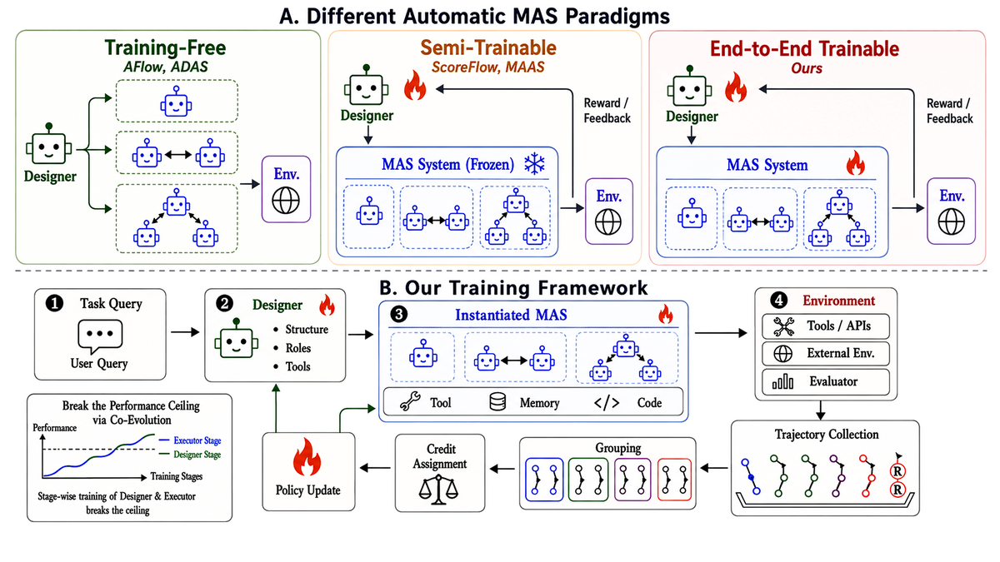
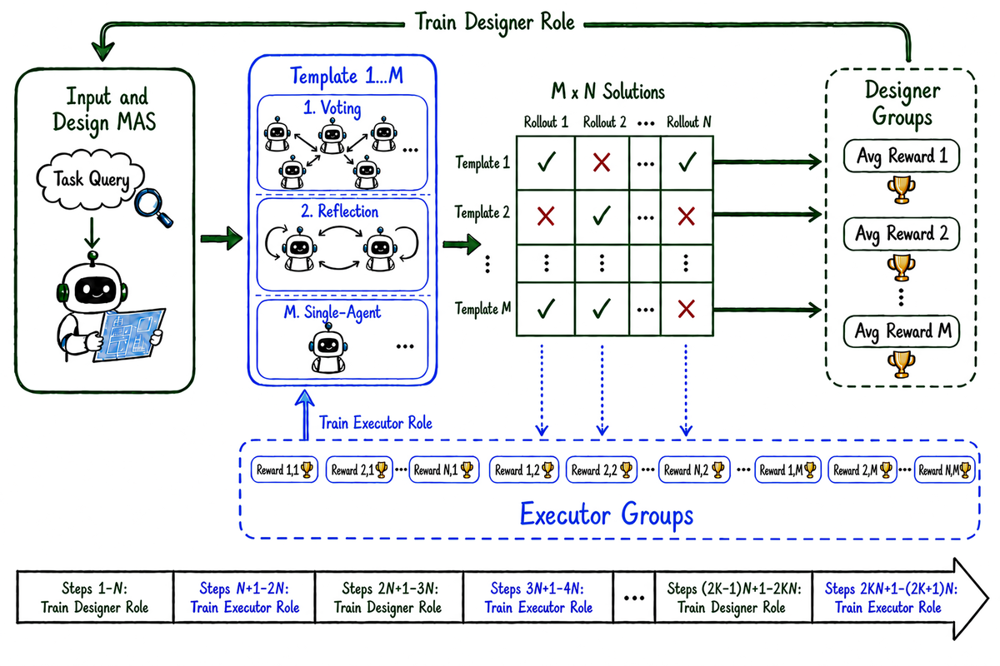
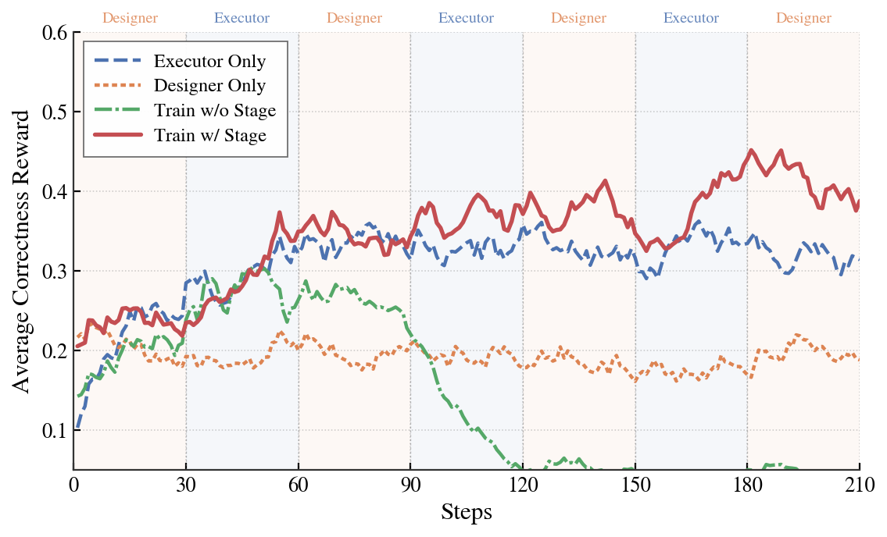
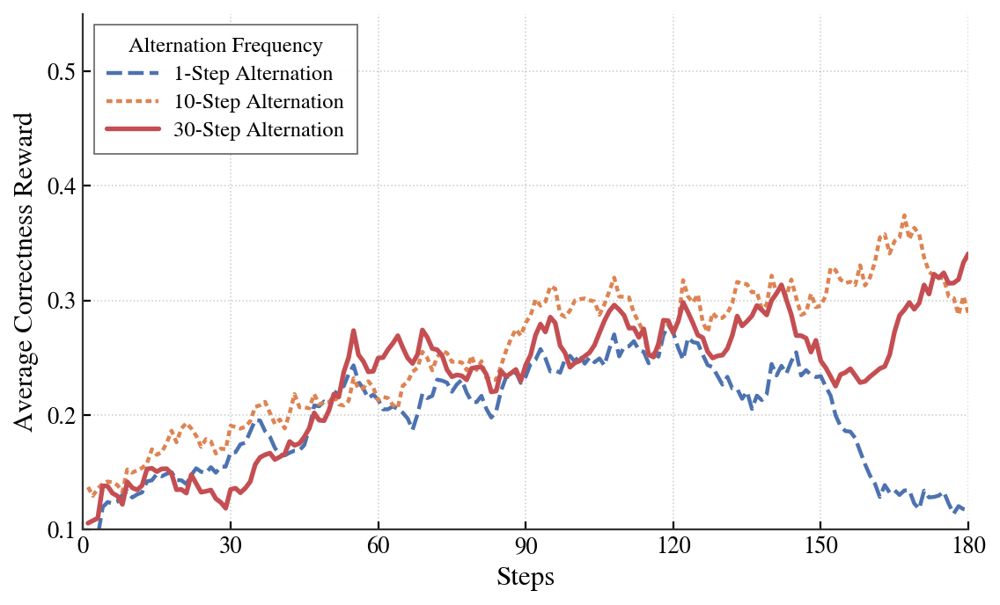

멀티에이전트 시스템(MAS)은 이미 AI 세계의 대세다. 의료 진단, 과학 발견, 금융 거래, 소프트웨어 엔지니어링까지 — 여러 AI 에이전트가 협력해서 단일 에이전트보다 훨씬 복잡한 문제를 푼다.

하지만 여기엔 한 가지 딜레마가 있었다. 누가 이 에이전트 팀을 *설계*하는가?

## 문제: 동결된 실행자의 천장

기존 자동 멀티에이전트 시스템은 두 가지 방식이 있었다.

**첫째, 훈련 없는 테스트 타임 탐색.** 프롬프트, 역할, 워크플로우를 추론 시간에 검색해 최적의 에이전트 구성을 찾는다. 모델 파라미터는 건드리지 않는다.

**둘째, 반만 훈련하는 방식.** 메타 수준의 디자이너(설계자)만 최적화하고, 실제 실행하는 에이전트들은 고정(frozen)해 둔다.

여기서 Oregon State University, UCSD, Penn State, Amazon AGI, AG2AI 연합팀이 던진 질문이 명확하다.

> 실행하는 에이전트는 왜 가만히 두나?

이것이 바로 **"동결된 실행자 천장(Frozen-Executor Ceiling)"**이다. 아무리 훌륭한 시스템 설계를 만들어도, 실행하는 쪽이 변하지 않으면 한계가 있다. 설계자와 실행자 사이에 파라미터 수준의 연결이 없으면 진정한 공동 진화(co-evolution)가 불가능하다.

## MetaAgent-X: 설계자와 실행자를 동시에 학습시킨다

[MetaAgent-X](https://arxiv.org/abs/2605.14212)의 핵심 아이디어는 단순하다.

**디자이너(설계자)와 익스큐터(실행자)를 같이 강화학습으로 훈련시킨다.**

구체적으로 이렇게 작동한다.

1. **디자이너**가 주어진 작업에 맞는 멀티에이전트 시스템을 Python 스크립트로 생성한다. 역할, 프롬프트, 통신 패턴, 실행 흐름을 모두 포함한다.

2. **익스큐터**가 생성된 시스템을 환경에서 실행한다. 에이전트 트rajектory, 도구 호출, 결과 보상을 모두 기록한다.

3. **역할 인식 크레딧 할당(Role-aware Credit Assignment)**으로 각 역할에 맞는 피드백을 준다. 성공했을 때 설계가 좋았는지, 실행이 좋았는지를 분리해서 평가한다.

4. **GRPO(Group Relative Policy Optimization)**로 양쪽 정책을 업데이트한다.

## 핵심 메커니즘 1: 계층적 롤아웃

가장 까다로운 문제는 "공로를 누구에게 돌릴 것인가?"다. 멀티에이전트 시스템이 성공했을 때, 그것이 설계가 좋아서인지 실행이 좋아서인지 알기 어렵다.

MetaAgent-X는 **트리 구조 롤아웃**으로 이 문제를 푼다.

- 각 질문에 대해 디자이너가 **M개**의 서로 다른 시스템 설계를 생성한다.
- 각 설계에 대해 익스큐터가 **N개**의 독립적 실행 롤아웃을 수행한다.
- M×N 평가 행렬이 만들어진다.

**디자이너 어드밴티지:** 각 설계의 평균 실행 성과를 다른 설계들과 비교한다. N번의 실행을 평균내면 실행 수준의 무작위성이 제거되고, 설계 자체의 질이 드러난다.

**익스큐터 어드밴티지:** 같은 질문에 대한 모든 실행 트rajектory를 하나의 GRPO 그룹으로 묶어 비교한다. 설계가 다르더라도 실행자의 능력을 독립적으로 평가할 수 있다.

## 핵심 메커니즘 2: 단계적 공동 진화(Stagewise Co-evolution)

디자이너와 익스큐터를 동시에 학습시키면 서로가 서로의 환경이 되어버려 불안정해진다. 디자이너가 바뀌면 익스큐터의 학습 환경이 바뀌고, 익스큐터가 바뀌면 디자이너가 받는 피드백이 바뀐다.

MetaAgent-X는 이를 **단계적 학습**으로 해결한다.

- **Stage 1:** 먼저 익스큐터를 고정하고 디자이너만 학습시킨다. 기본적인 설계 능력을 확보한다.
- **Stage 2:** 디자이너를 고정하고 익스큐터만 학습시킨다. 주어진 설계를 잘 실행하는 능력을 키운다.
- **이후:** 교대로, 혹은 동시에 학습하면서 점진적으로 공동 진화시킨다.

이 단계적 접근이 중요한 이유는 초기부터 양쪽을 동시에 움직이면 학습 신호가 너무 시끄럽기 때문이다.

## 실험 결과: 최대 21.7% 성능 향상

6개 수학/코드 벤치마크, 2개 기본 모델(Qwen3-8B, Qwen3-4B)에서 테스트했다.

| 비교 대상 | Qwen3-8B | Qwen3-4B |
|---|---|---|
| Single Agent GRPO | 기준선 | 기준선 |
| **MetaAgent-X RL** | **+11.17%** | **+12.80%** |
| 기존 Auto MAS 대비 | **최대 +21.7%** | **최대 +21.7%** |

주목할 만한 점:

- **단순한 에이전트 협업 추가만으로도** 단일 에이전트 대비 큰 폭의 향상
- **종단간 훈련이 핵심** — 디자이너만 학습하는 방식보다 일관되게 우수
- **두 역할 모두 학습 내내 개선** — 어블레이션에서 확인

## 왜 중요한가: 세 가지 시사점

**1. "자동"의 의미가 바뀐다.**

기존 "자동 멀티에이전트"는 사람이 설계한 틀 안에서 최적화하는 수준이었다. MetaAgent-X는 시스템 설계 자체를 학습의 대상으로 만들었다. 어떤 에이전트를 어떻게 구성할지를 모델이 스스로 배운다.

**2. 공동 진화의 역학이 드러났다.**

설계자와 실행자가 어떻게 서로를 끌어올리는지, 그 과정이 어떤 단계를 거치는지를 처음으로 체계적으로 분석했다. 이건 앞으로 에이전트 시스템 설계의 가이드가 된다.

**3. 실용적 패러다임의 전환.**

이 논문은 "종단간 훈련 가능한 자동 MAS"를 실용적 패러다임으로 확립했다. 스스로 설계하고 스스로 실행하는 에이전트 모델을 만드는 길이 열렸다.

## 한계와 앞으로의 방향

- 8B, 4B 모델 기준이므로 대규모 모델에서의 효과는 추가 검증이 필요하다.
- 수학과 코드 벤치마크에 집중되어 있어, 다른 도메인(의료, 금융 등)에서의 일반화는 열린 질문이다.
- 학습 비용 — M×N 롤아웃 구조 때문에 훈련 시 컴퓨팅 자원이 많이 필요하다.

---

**논문:** [Breaking the Ceiling of Automatic Multi-Agent Systems via End-to-End Reinforcement Learning](https://arxiv.org/abs/2605.14212)

**저자:** Yaolun Zhang, Yujie Zhao, Nan Wang, Yiran Wu, Jiayu Chang, Yizhao Chen, Qingyun Wu, Jishen Zhao, Huazheng Wang

**소속:** Oregon State University, UCSD, Amazon AGI, Pennsylvania State University, AG2AI Inc.

**발표일:** 2026년 5월 14일
