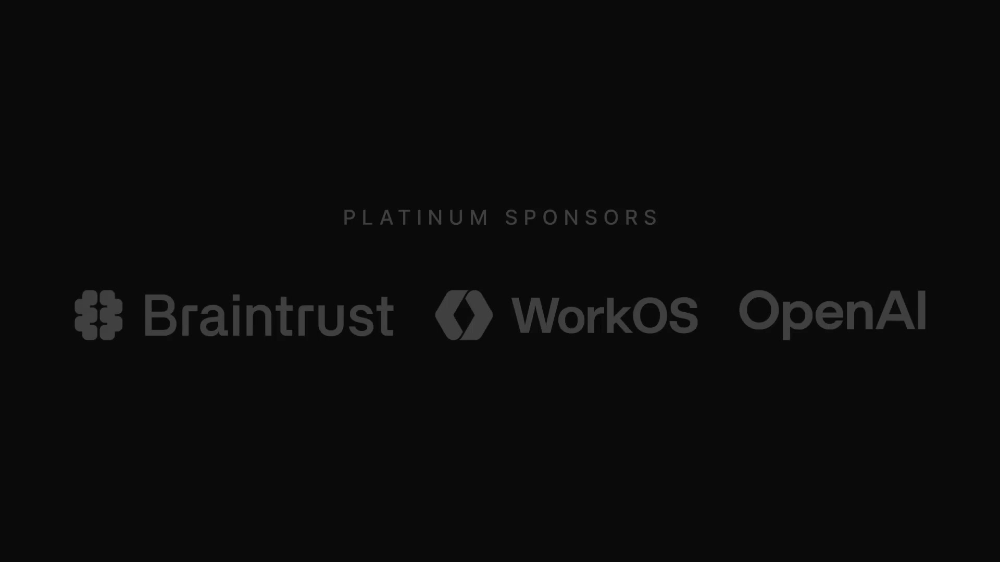
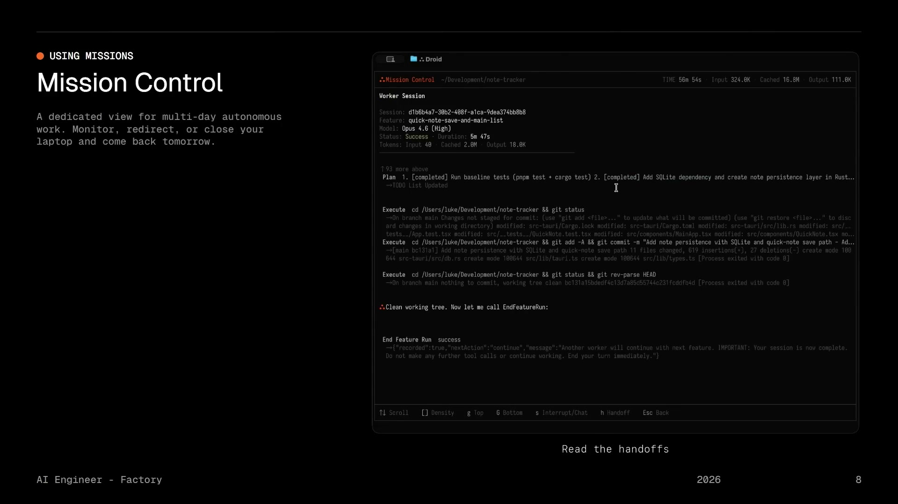
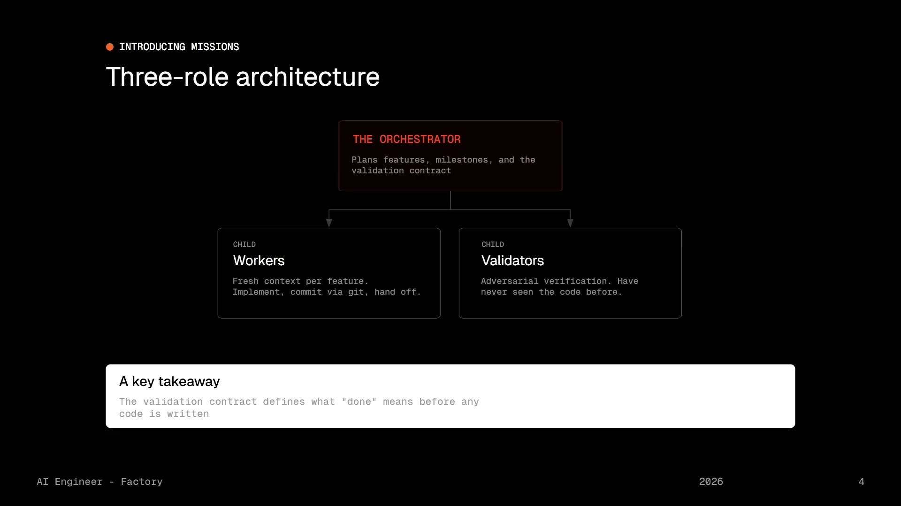
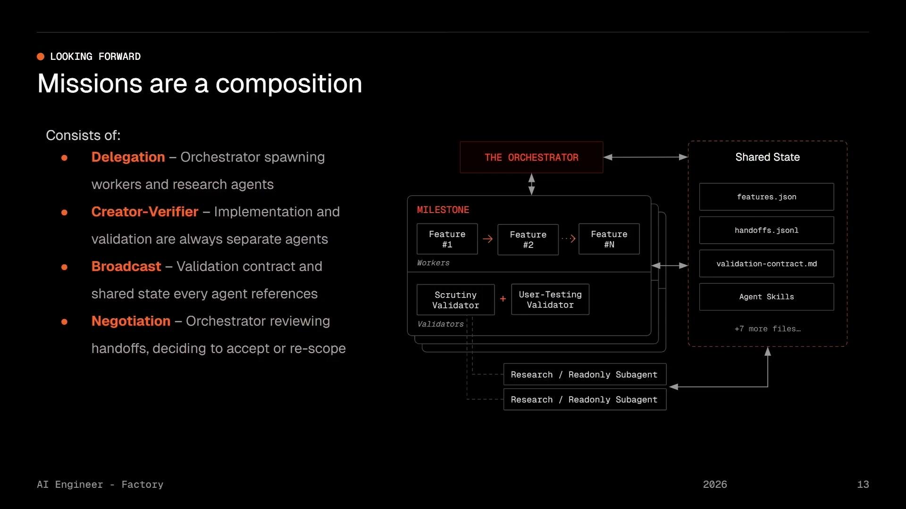

무대 위에 선 남자가 한 문장을 던진다.

> "Assembling agent teams that solve problems **15배 더 어렵고** 복잡한 수준의 문제를 푼다."

Luke Alvoeiro. Factory의 엔지니어다. 5월 6일 AI Engineer Europe에서 던진 이 선언은 사실 우리가 놓치고 있던 부분을 정확히 찌른다. 지금껏 우리는 ChatGPT 하나, Gemini 하나, Claude 하나씩 쓰고 있었다. 근데 **여러 에이전트가 한 팀처럼 움직이면 어떨까?** 그게 바로 Factory의 "Missions"다.

## 5가지 다중 에이전트 패턴, 언제 써야 할까

발표 초반에 Luke는 "다중 에이전트"를 이루는 5가지 기본 패턴을 펼쳐 보인다.

1. **Delegation** — 한 에이전트가 다른 에이전트를 불러서 부분 작업 처리. 가장 단순한 패턴.
2. **Creator-Verifier** — 한 에이전트는 만들고, 다른 에이전트는 검증. 창작자의 편향을 제거하는 효과.
3. **Direct Communication** — 에이전트끼리 코디네이터 없이 직접 대화. 다만 상태 관리가 복잡해진다.
4. **Negotiation** — 두 에이전트가 공유 자원을 두고 협상. Win-win이 가능할 때 최고.
5. **Broadcast** — 한 에이전트가 상태 업데이트를 여럿에게 공유. 팀의 일관성을 지키는 핵심.

여기서 핵심은 "상황에 따라 다르다"는 거다. Delegation은 간단한 작업에, Creator-Verifier는 품질이 중요한 작업에, Broadcast는 팀 전체가 한목소리를 유지해야 할 때다.

## 핵심 통찰: "지능이 병목이 아니다"

영상 중반부에 Luke가 던지는 질문이 핵심을 찌른다.

## "다음 모델이 나오면, 시스템이 깨질까 아니면 더 똑똑해질까?"

영상 후반부로 가면서 Luke가 던지는 질문이 바뀐다. 기술적 "어떻게"에서 아키텍처 "왜"로.

> "When the next model drops, does the system get better or break?"

이 질문은 실무자라면 누구나 가져봤을 법하다. OpenAI가 새 모델을 내놓으면, 우리는 코드를 다시 짜야 한다. 근데 Factory의 Missions는 다르다.

**오케스트레이션 로직은 프롬프트와 스킬에 산다.** 코드가 아니라.

- 기능을 어떻게 분해할 건가? → 프롬프트로 정의
- 실패하면 어떻게 처리할 건가? → 스킬(Skill)로 구현
- 언제 에스컬레이션할 건가? → 프롬프트로 지시

그래서 새 모델이 나와도 **코드는 안 건드린다.** 새 모델이 들어오면 시스템이 그냥 더 똑똑해진다.

## 에이전트들은 어떻게 24시간, 나흘 동안 협력할까?

여기가 핵심이다. Missions의 "Structured Handoffs" 메커니즘.

한 에이전트가 일을 마치면, **다음 에이전트에게 정확히 뭘 전달해야 할까?**

- ✅ 뭘 구현했는가?
- ❌ 뭐가 안 됐는가?
- 🔧 어떤 명령을 실행했고, 종료 코드는 뭔가?
- ⚠️ 중간에 어떤 이슈가 생겼는가?
- 📋 정해진 절차를 따랐는가?

이걸 **구조화된 형식**으로 전달하면, 다음 에이전트가 "지금까지 뭐가 됐는지" 5초 안에 파악한다. 정보 손실이 없다. 그래서 하루를 넘는 장시간 작업에서도 팀이 흩어지지 않는다.

## 계획, 구현, 검증 — 각각 다른 모델을 쓴다

마지막 통찰. "모든 단계에 최고의 모델을 쓸 수 없을까?" 그건 경제적 현실과 맞지 않는다.

그래서 Missions는 **역할별로 다른 모델을 선택**한다.

| 역할 | 특성 | 예시 |
|------|------|------|
| **계획(Planning)** | 느리지만 신중한 추론. 전략적 질문, 제약조건 분석 | Claude Opus (비용 높지만 깊은 사고) |
| **구현(Implementation)** | 코드 작성 능력과 창의성. 빠른 생성, 도구 사용 능력 | Claude Sonnet (빠르고 실용적) |
| **검증(Validation)** | 엄격한 지시 따르기. 다른 공급자 사용 (학습 데이터 편향 제거) | 다른 회사 모델 (OpenAI, Gemini 등) |

이게 비용 효율성과 품질의 균형을 맞추는 방법이다.

## 코난쌤의 교실에서, 우리의 업무에서

이 발표는 사실 세 그룹에게 다르게 들린다.

**AI 교육자라면**: "아, 학생들한테 '팀을 짜는' 에이전트 시나리오를 만들어볼 수 있겠네."

**업무 자동화를 하는 사람이라면**: "내가 지금 쓰고 있는 ChatGPT API 시스템이, 다중 에이전트 설계로 바뀌면 더 튼튼해질 수 있겠다."

**장기 AI 프로젝트를 운영하는 팀이라면**: "모델 업그레이드 때마다 코드를 뜯어고칠 필요가 없는 아키텍처가 있다는 거네."

이게 Missions의 정답이다. 복잡한 문제는 **혼자가 아니라 팀이** 푼다. 그 팀이 장시간 일관되게 움직이려면, 구조화된 핸드오프와 명확한 역할 분담이 필요하다. 그리고 새로운 모델이 나올 때마다 시스템이 자동으로 업그레이드되는 아키텍처를 만들어야 한다.

Luke Alvoeiro가 던진 이 메시지는, 결국 이거다: **에이전트는 도구가 아니라, 팀의 동료다.**

---

**참고**: 이 글은 Luke Alvoeiro의 AI Engineer Europe 발표 "[Missions: Multi-Agent Systems That Ship for Days](https://www.youtube.com/watch?v=ow1we5PzK-o)" (2026-05-06)를 정리한 것입니다. Factory의 공식 문서는 [factory.ai](https://factory.ai) 에서 확인할 수 있습니다.
