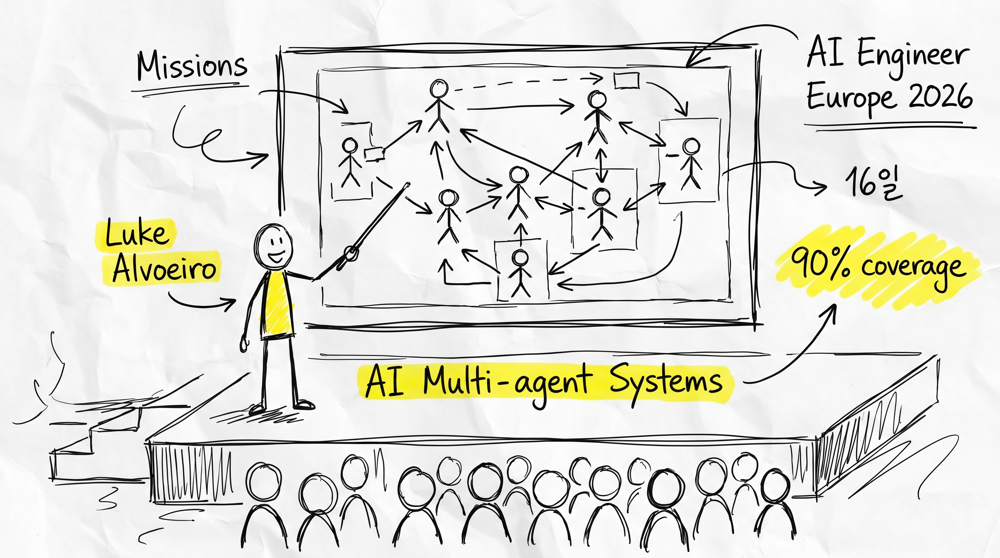
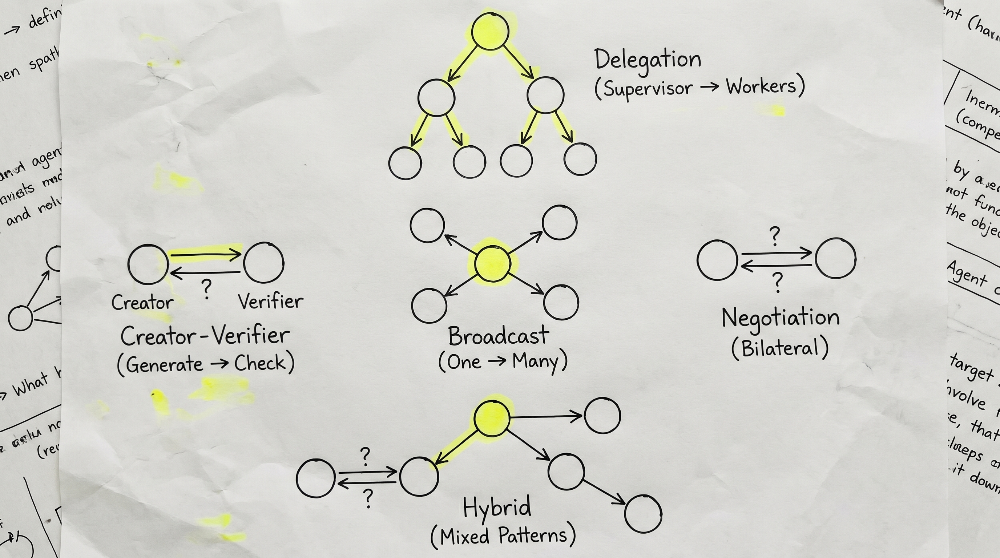
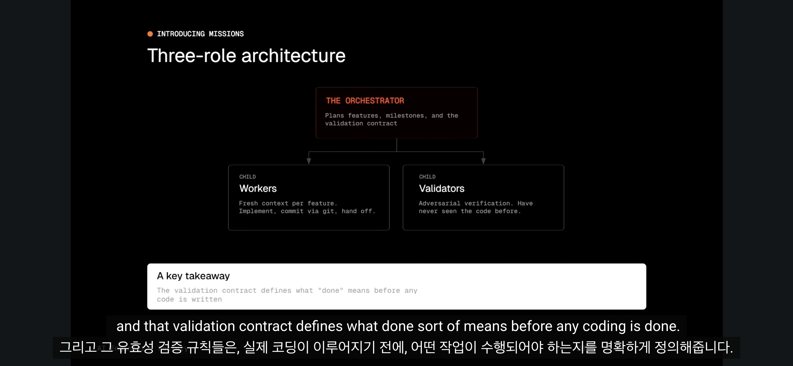
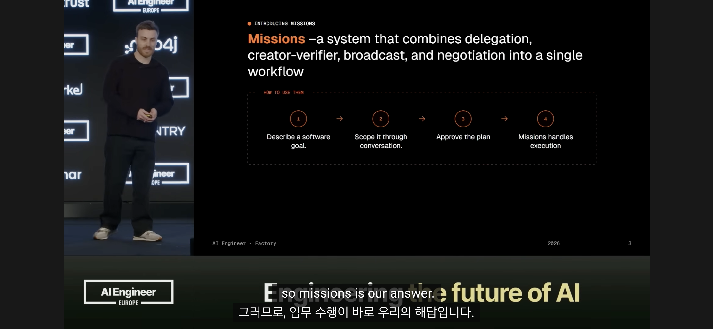

London, AI Engineer Europe 2026. 무대 위에서 한 남자가 말한다. "우리 팀은 16일 동안 Slack 클론을 90% 테스트 커버리지로 빌드했습니다. 인간은 주기적으로 확인만 했고요."

Luke Alvoeiro, Factory의 Product/Tech Lead는 이제 한국의 개발자, AI 엔지니어들도 알아야 할 비결을 공개한다. AI가 스스로 코드를 작성하는 게 아니라, 여러 AI가 *함께* 일하는 방식이 얼마나 강력한지를.

## 문제는 AI의 지능이 아니라 인간의 관심용량이다

가장 먼저 깨달아야 할 진실이 있다.

1. AI는 이미 충분히 똑똑하다. 복잡한 작업을 처리할 능력이 있다. 문제는 다른 데 있다.

2. 병목은 인간 엔지니어가 감시할 수 있는 용량이다. 한 사람이 동시에 열 개, 스무 개의 AI 워커를 관리할 수 없다. 한 번에 한두 가지만 신경 쓸 수 있다.

3. 이 간단한 통찰이 모든 것을 바꾼다. Factory의 핵심 질문은 이것이었다. "인간이 처리할 수 있는 주의(attention) 내에서 AI 팀의 처리량을 어떻게 극대화할까?"

## 5가지 멀티에이전트 패턴이 모두 필요했다

처음부터 설계를 시작했을 때, Factory 팀이 발견한 건 다양한 협력 방식들이었다.

1. **Delegation** — 오케스트레이터가 작업을 나누어 여러 워커에게 할당한다. 가장 직관적인 방식이지만, 충돌 위험이 크다.

2. **Creator-Verifier** — 한 에이전트가 코드를 작성하고, 다른 에이전트가 검증한다. 검증자는 독립적인 관점을 유지해야 한다.

3. **Broadcast** — 같은 문제를 여러 에이전트에게 주고 가장 좋은 결과를 선택한다. 비용이 들지만 품질이 올라간다.

4. **Negotiation** — 에이전트끼리 의견을 나누고 합의에 도달한다. 더 복잡하지만 자율적이다.

5. **한 가지 더** — 다섯 번째 패턴은 위의 네 가지를 특정 문제에 맞게 조합하는 것이었다.

Factory의 수월한 점은 이들을 모두 한 아키텍처에 녹여냈다는 것이다.

## 3개 역할이 핵심이다 — 오케스트레이터, 워커, 검증자

실제 시스템은 이렇게 구성된다.

1. **오케스트레이터(Orchestrator)** — 계획을 세운다. 큰 문제를 작은 문제로 나누고 무엇을 누가 할지 결정한다.

2. **워커(Workers)** — 구현한다. 코드를 쓰고, 테스트를 추가하고, 리팩토링한다.

3. **검증자(Validators)** — 적대적 입장에서 검토한다. 버그를 찾고, 엣지 케이스를 제시한다.

가장 중요한 통찰은 검증자의 역할 설계에 있다. 단순히 "이거 맞아?"라고 묻는 게 아니라, **검증 조건을 미리 정의**하는 것이다.

코드를 작성하기 전에, 검증자와 오케스트레이터가 함께 "이 코드는 다음 세 가지를 만족해야 한다"고 정의한다. 그 다음에야 워커가 코드를 작성한다. 검증자는 구현 편향 없이 순수하게 그 조건들을 확인한다.

## 병렬 처리는 악이다 — 직렬 실행의 승리

여기서 충격적인 발견이 나온다.

1. **직관적 생각:** AI 에이전트들이 동시에 여러 작업을 하면 더 빠르지 않을까?

2. **현실:** 동시에 여러 에이전트가 작업하면 충돌, 중복, 엣지 케이스 누락이 극적으로 늘어난다.

3. **해법:** 직렬 실행(serial execution). 한 번에 한 에이전트만 작업하게 한다. 느려 보이지만, 다중 날짜 미션(multi-day missions)에서는 정확도가 훨씬 높다.

Factory가 16일간 Slack 클론을 빌드할 때, 동시 작업 스트림이 10개에서 30개로 증가했음에도 에러율은 오히려 떨어졌다. 왜? 직렬 실행으로 각 단계의 결과가 다음 단계의 입력이 되기 때문이다.

## Validation Contracts — 구현 전에 약속한다

Factory의 핵심 혁신 중 하나가 바로 이것이다.

일반적인 방식: 코드 작성 → 테스트 → 수정 → 테스트 → ... (무한 반복)

Factory의 방식: **검증 조건 정의 → 코드 작성 → 조건 확인 (한 번에 끝)**

예를 들어, "사용자 인증 모듈"을 만든다면:

- 정의 단계에서 "토큰은 1시간 내에 만료되어야 하고, 리프레시는 7일간 가능해야 하고, 동시성 문제는 발생하지 않아야 한다"고 명시한다.
- 워커는 이 세 가지를 모두 충족하는 코드를 작성한다.
- 검증자는 정확히 이 세 가지를 확인한다.

이렇게 하면 다시 쓸 필요가 없다.

## 16일 동안 뭘 했나 — Slack 클론 사례

숫자로 보자.

1. **대상:** Slack 클론 구현
2. **기간:** 16일
3. **테스트 커버리지:** 90%
4. **인간 개입:** 주기적 체크만
5. **동시 작업 스트림:** 10 → 30개로 증가
6. **에러 발생:** 오히려 감소

이게 뭐가 대단한데? 기존 방식이라면 16일 동안 한두 명의 시니어 엔지니어가 밤을 새며 이 규모의 시스템을 만들었을 거다. 여기선 AI 팀이 했다. 인간은 아침에 한 번, 저녁에 한 번 "진행 상황 어때?" 정도만 봤다.

## 각 역할에는 다른 LLM을 배정한다

여기서도 중요한 디자인 선택이 숨어 있다.

1. **오케스트레이터:** 큰 그림을 그려야 하므로, 추론 능력이 강한 고급 모델.
2. **워커:** 정해진 조건에서 코드를 작성하기만 하면 되므로, 더 빠르고 저렴한 모델도 가능.
3. **검증자:** 엣지 케이스를 찾아야 하므로, 비판적 사고가 강한 모델.

Factory의 발견은 이것이다. 각 역할에 제일 비싼 모델을 쓸 필요가 없다. 오히려 **역할에 맞는 모델을 선택하면** 복리 효과가 나타난다. 모델 세대가 바뀌어도 시스템이 자동으로 더 나아진다.

OpenAI, Anthropic, Google의 새 모델이 나올 때마다 시스템 전체가 이득을 본다는 뜻이다.

## 30일 미션이 가능할까

Luke는 이렇게 말한다. "네, 가능합니다."

Factory의 단기 목표는 30일 동안 실무 규모의 소프트웨어 시스템을 엔지니어 팀 없이 완성하는 것이다. 병목은 더 이상 AI의 능력이 아니다. 오케스트레이션 레이어다. 

경쟁 우위는 여기에 있다. 누가 멀티에이전트 오케스트레이션을 더 잘 설계하는가. 누가 검증 조건을 더 명확하게 정의하는가. 누가 직렬/병렬의 균형을 더 잘 잡는가.

## 한국의 개발자에게 이게 뭘 의미하는가

1. **자동화의 미래는 에이전트 관리다.** 단순히 "좋은 프롬프트 쓰기"가 아니라, 여러 AI를 조율하는 능력이 핵심 경쟁력이 된다.

2. **검증 구조가 정말 중요하다.** "한 AI가 생성하고 다른 AI가 검증"하는 식의 구조를 미리 설계하면, 다시 작업할 확률이 크게 줄어든다.

3. **속도가 아니라 정확도를 먼저 잡아라.** 병렬 처리의 유혹에서 벗어나서, 직렬 실행의 안정성부터 확보하자.

4. **오케스트레이션 능력이 차이다.** 최고급 모델을 무한정 쓸 필요는 없다. 역할에 맞는 모델을 선택하고, 오케스트레이션으로 승부한다.

앞으로 개발팀은 "코드를 잘 쓰는 능력"뿐만 아니라 "AI를 잘 조율하는 능력"이 필요해진다. Factory의 Missions는 그 미래의 스케치다.
