Luke Alvoeiro. Block에서 오픈소스 코딩 에이전트 Goose를 만들었고, 지금은 Factory에서 멀티에이전트 시스템의 핵심을 설계하고 있는 엔지니어다.

최근 AI Engineer 컨퍼런스에서 그가 공개한 게 하나 있다. 자기 팀이 만든 Missions라는 시스템이 **16일 연속으로 AI 에이전트들을 돌려서 Slack 클론을 완성**했다는 거다. 코드 리뷰도 자동으로, 테스트도 자동으로, 버그를 찾아내는 것도 자동으로.

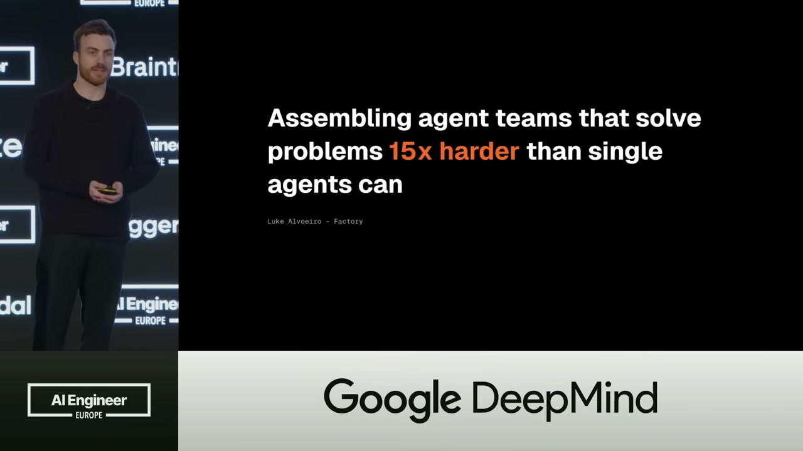
*AI Engineer Europe에서 발표하는 Luke Alvoeiro. 단일 에이전트보다 15배 어려운 문제를 푸는 에이전트 팀 조립법을 공개했다.*

## "병목은 지능이 아니라 인간의 관심"

Luke가 처음 던진 질문은 직설적이다.

> "지금 소프트웨어 엔지니어링의 가장 큰 병목이 뭐냐고 물으면, 보통은 '지능'이라고 생각합니다. 하지만 제 주장은 다릅니다. **병목은 인간의 관심입니다.**"

왜? 최고의 엔지니어도 동시에 몇 개의 작업만 진행할 수 있다. 백로그에는 50개의 기능이 있어도, 하루에 몇 개만 진행할 수 있다는 뜻이다. 왜냐하면 모든 작업이 인간의 승인과 검토를 필요로 하니까.

> "오늘날의 모델은 50개를 모두 이해하고 짤 수 있지만, 그걸 감시할 대역폭이 없다는 거죠."

이 말 한마디가 Factory가 Missions를 만든 이유다.

## 멀티에이전트의 5가지 방식

그런데 "멀티에이전트"라고 해도 다 같은 건 아니다. Luke는 현재 떠도는 프레임워크들을 5가지로 정리했다.

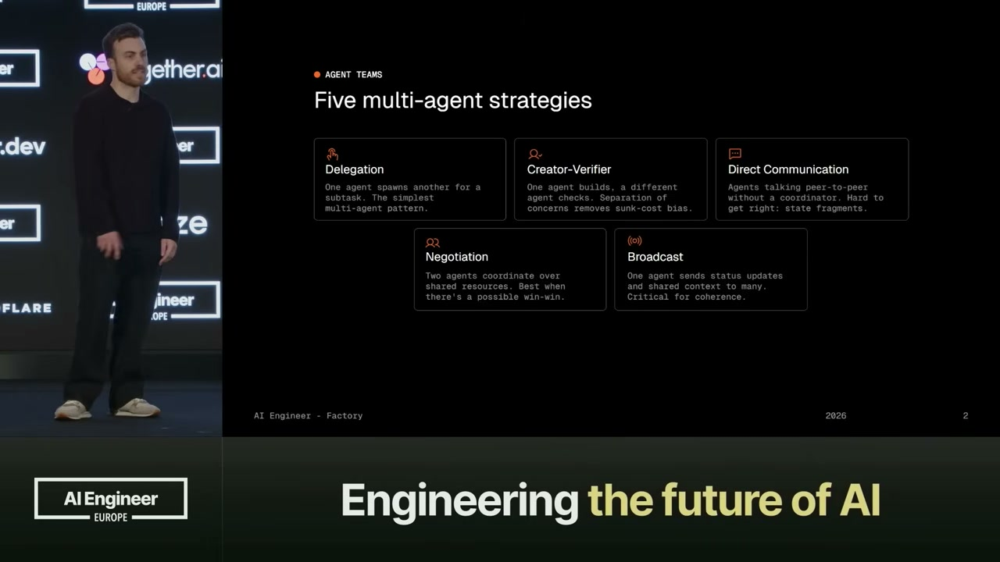
*Luke가 정리한 멀티에이전트 통신 패턴 5가지. Delegation, Creator-Verifier, Direct Communication, Negotiation, Broadcast.*

1. **Delegation (위임)** — 한 에이전트가 다른 에이전트를 호출한다. 가장 단순한 형태다.
2. **Creator-Verifier (창작-검증)** — 한 에이전트가 만들고, 다른 신선한 관점의 에이전트가 검사한다. 인간의 코드 리뷰처럼.
3. **Direct Communication (직접 대화)** — 에이전트끼리 중재자 없이 DM처럼 대화한다. 하지만 상태가 분산되기 쉽다.
4. **Negotiation (협상)** — 여러 에이전트가 같은 자원(API, 코드베이스 일부)을 두고 상호작용한다. Win-win 상황을 만들 수 있다.
5. **Broadcast (방송)** — 한 에이전트가 정보를 여럿에게 퍼트린다. 상태 업데이트나 새로운 제약사항 공유할 때 필수다.

> "대부분의 시스템은 한두 가지만 쓰거나, 섞이는데 조화가 안 맞습니다. Missions는 이 중 4개를 조화롭게 짜고, 특히 며칠 동안 계속 돌아도 헤매지 않도록 구조화했어요."

## Missions의 3-Role 구조

Missions의 비결은 역할의 분리에 있다.

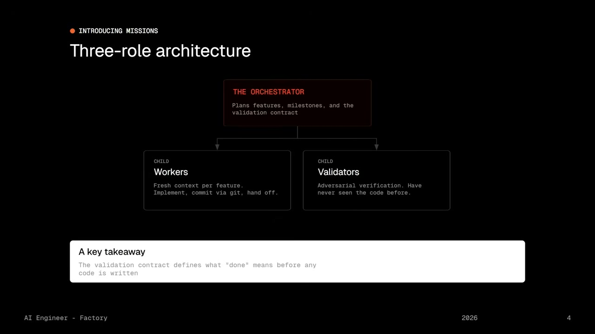
*Orchestrator가 계획하고, Workers가 구현하고, Validators가 검증한다. Validation Contract가 코딩 전에 완료 기준을 정의한다.*

**Orchestrator (조율자)** — 사용자의 목표를 받아서 '뭘 할 건지'를 정한다. 전략적 질문을 던지고, 요구사항의 불명확한 부분을 캐낸다. 그리고 **Validation Contract**를 만드는데, 이게 가장 중요하다.

Validation Contract는 "코드를 짜기 전에" 정의되는 검증 기준이다. 뭐가 "완료"인지를 미리 정한다는 뜻이다.

**Workers (작업자)** — 한 명씩 기능을 담당한다. 이전 에이전트가 남긴 깨끗한 코드베이스에서 시작한다. 자기 일만 하고, Git으로 커밋한다. 그럼 다음 워커는 깨끗한 상태에서 시작할 수 있다.

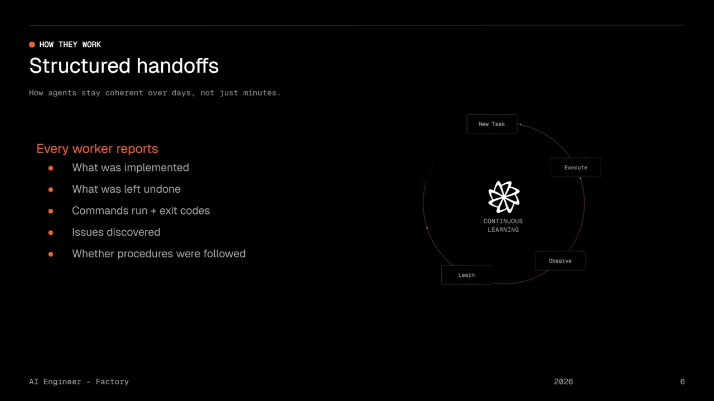
*Worker가 기능을 구현하는 방식. 깨끗한 컨텍스트, Git 커밋 기반 인수인계.*

**Validators (검증자)** — 두 가지 종류가 있다.

- **Scrutiny Validator**: 테스트, 타입체크, 린트 실행. 각 기능마다 전담 코드 리뷰 에이전트 할당.
- **User Testing Validator**: 실제로 앱을 띄우고 버튼을 클릭해본다. 폼을 채운다. 페이지가 제대로 나타나는지 본다.

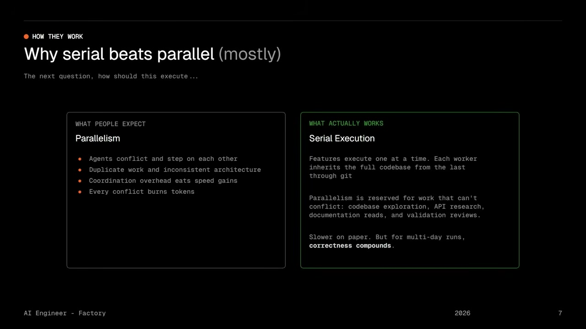
*Scrutiny Validator가 코드를 검증하는 구조. 각 기능마다 전담 리뷰 에이전트가 할당된다.*

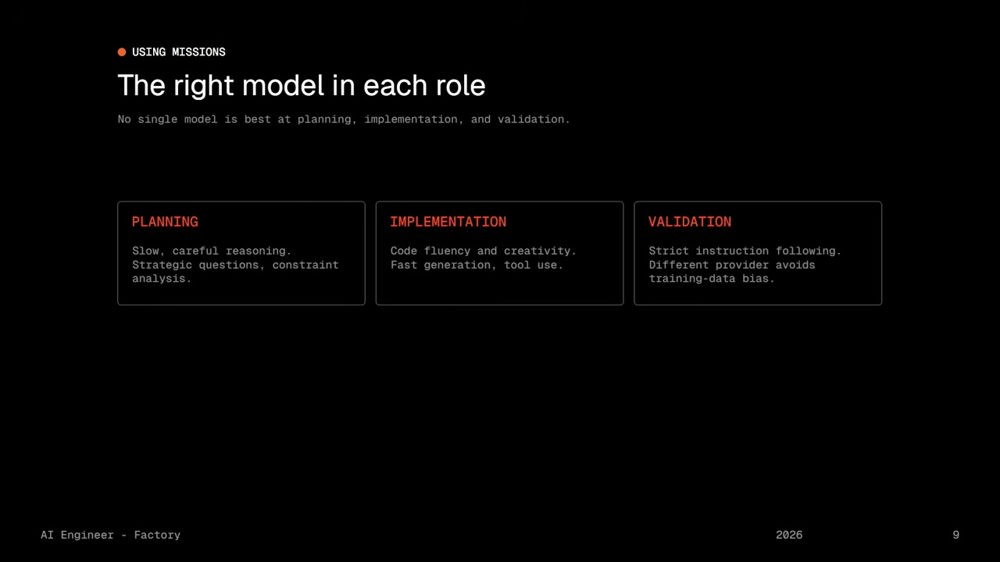
*User Testing Validator는 앱을 직접 띄워서 버튼 클릭, 폼 입력 등을 수행하며 기능을 검증한다.*

> "가장 중요한 부분은, 두 검증자 모두 **코드를 본 적 없다**는 거예요. 신선한 눈으로 검사합니다."

Luke가 공개한 수치는 놀랍다: Missions의 가장 긴 실행은 **16일**이었다. (일반적인 스프린트보다 길다.)

어떻게 가능했을까?

- **Validation Contract로 명확성 확보** — 코드를 짜기 전에 "뭐가 맞는지"를 수백 개의 어설션으로 정의한다.
- **Structured Handoff (구조화된 인수인계)** — 워커가 끝낼 때, 단순히 "끝났어"라고 하지 않는다. 뭘 완료했는지, 뭘 못 했는지, 어떤 명령을 실행했는지, Exit code가 뭐였는지를 다 기록한다.

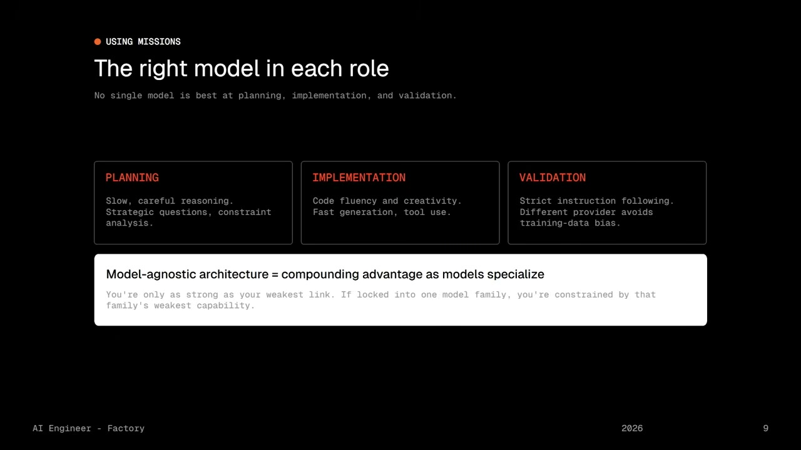
*Worker 완료 시 작성하는 구조화된 인수인계 문서. 완료/미완료/명령어/exit code/이슈/절차 준수 여부를 모두 기록한다.*

- **Serial Execution with Targeted Parallelization** — 병렬 처리가 빠르다고 생각하지만, 에이전트들이 서로 방해한다. Factory는 기능 단위로는 순차 실행하되, 읽기 작업(코드베이스 검색, API 조사)은 병렬화한다.

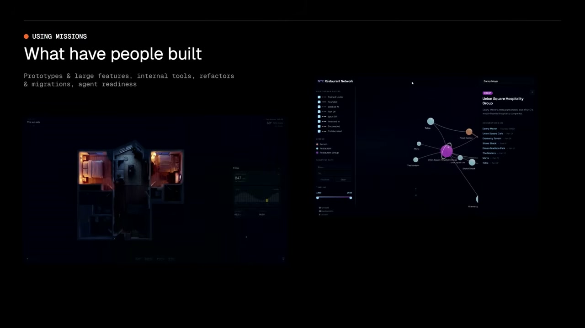
*병렬이 아니라 직렬 실행. 읽기 작업만 내부 병렬화. 느려 보이지만 오류율이 극적으로 낮아진다.*

> "너무 느려 보이지만, 오류율이 극적으로 떨어집니다. 며칠 도는 시스템에선 정확성이 복리처럼 쌓여요."

## Mission Control — 며칠짜리 작업을 관리하는 UI

일반적인 채팅 인터페이스는 며칠 동안 도는 작업에 맞지 않는다. 그래서 Factory는 전용 뷰를 만들었다.

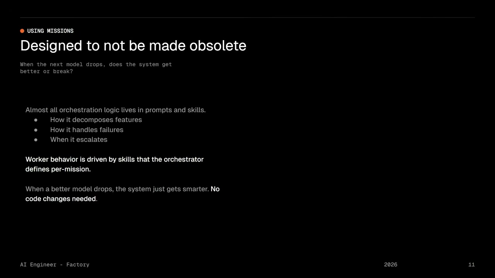
*Mission Control — 며칠 도는 미션을 비동기로 관리하는 전용 대시보드.*

프로젝트 매니저처럼 구현을 감시할 수도 있고, 그냥 친구 만나러 가도 된다.

## 실제로는 어떻게 작동할까? Slack 클론 사례

Luke가 보여준 실제 데이터는 구체적이다. Slack 클론을 Missions로 만들 때:

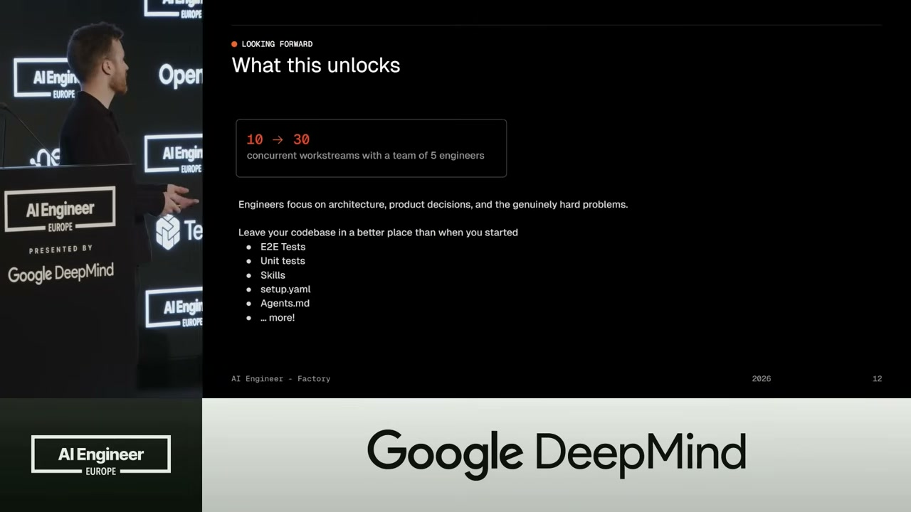
*Slack 클론 빌드 과정의 실제 데이터. 구현 60%, 검증 40%의 시간과 토큰 분배.*

- 시간 배분: 구현 60%, 검증 40%
- 토큰 사용: 구현 60%, 검증 40%
- 테스트 커버리지: 마지막 결과물의 **90%**가 테스트로 커버됨
- 최종 코드 분포: 실제 기능이 50%, 테스트가 50%

> "검증이 절대 처음에 성공하지 않아요. 거의 항상 후속 기능이 필요합니다. **그게 이 시스템의 가치예요.**"

## 그래서 팀은 뭘 하나?

경제학적 변화가 생긴다.

- 과거: 5명의 엔지니어가 10개 워크스트림 진행
- 지금: 5명이 **30개** 워크스트림 관리 가능

근데 중요한 부분은 팀이 뭘 하는가다.

> "팀은 아키텍처, 제품 결정 같은 흥미로운 문제에 집중할 수 있어요. 실행은 시스템이 합니다."

그리고 코드베이스는 더 깨끗해진다. 테스트가 많고, 구조가 좋으니까.

## "Droid Whispering" — 올바른 모델을 올바른 자리에

여기서 Luke가 던진 새로운 개념이 있다: **"Droid Whispering"**

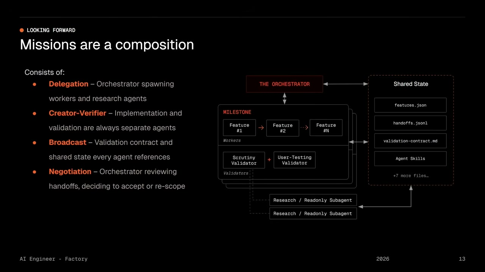
*역할별로 다른 모델을 배치하는 전략. Planning은 느린 추론, Implementation은 빠른 코딩, Validation은 정확한 지시 따르기.*

> "어떤 모델을 어디에 놓을 건지가 중요합니다."

- **Planning**: 느리고 신중한 사고 능력
- **Implementation**: 빠른 코딩, 창의력
- **Validation**: 정확한 지시 따르기

> "어떤 모델도 세 가지를 다 잘하지 못합니다. 그래서 의도적으로 선택해야 합니다."

심지어 검증용 모델을 완전히 다른 제공자에서 가져올 수도 있다. 같은 학습 데이터의 편향을 피하려고.

> "이게 모델에 구애받지 않는 아키텍처의 장점입니다. 모델이 개선될 때마다 시스템도 자동으로 개선되니까요."

## Bitter Lesson — 다음 모델이 와도 안 무너지는 구조

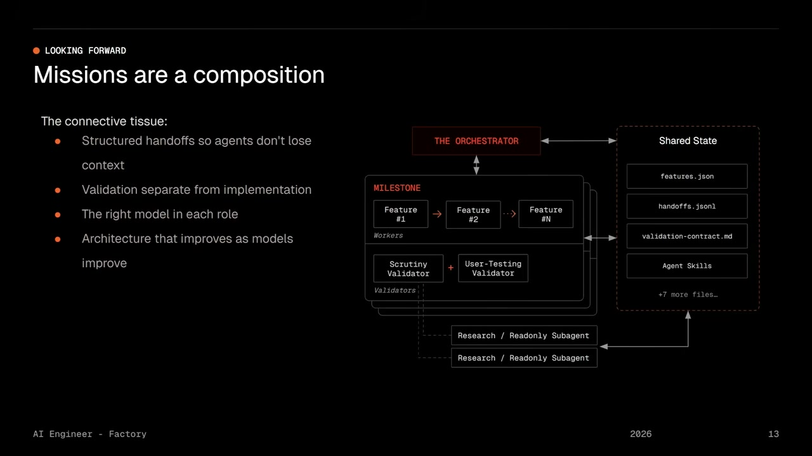
*하드코딩된 state machine 대신 프롬프트와 스킬로 오케스트레이션을 정의. 모델이 발전할수록 시스템도 자동으로 좋아진다.*

멀티에이전트 시스템을 만드는 사람들의 공포: **다음 모델 릴리스가 아키텍처를 하루아침에 구식으로 만드는 것.**

Factory의 해결책:
- 오케스트레이션 로직의 대부분을 프롬프트와 스킬로 정의 (약 700줄)
- 하드코딩된 state machine 대신, **4문장만 바꿔도** 실행 전략이 변함
- Worker 행동은 orchestrator가 mission마다 정의한 스킬로 구동

> "Missions ensure the discipline, and the models provide the intelligence."

## 결론: "Open Droid, /missions 실행해봐"

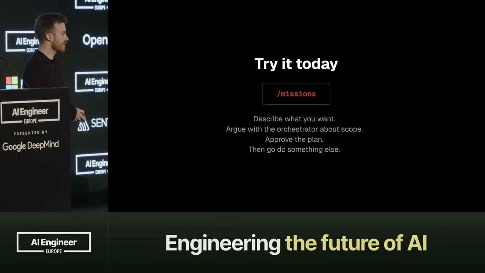
*"Orchestrator와 스코프를 놓고 싸우세요. 계획을 승인하고 나서 다른 일을 하세요."*

Luke의 마지막 메시지는 단순하다.

> "Orchestrator와 스코프를 놓고 싸우세요. 계획을 승인하고 나서 **다른 일을 하세요**. 16일 후에 와보면 일이 끝나 있을 거예요."

이건 단순한 신기술이 아니다. 이건 인간의 관심이라는 희소 자원을 해방하는 거다. 아키텍처와 제품 결정에 집중하고, 구현은 AI 팀에 맡기는 거다.

그리고 코드는 더 좋아진다.

**당신도 가져갈 메시지:**

- 멀티에이전트를 제대로 쓰려면 **명확한 역할 분리**가 필수다.
- 병렬화가 항상 빠른 건 아니다. **Serial + Targeted Parallel**이 정확성에서 이긴다.
- 검증은 구현 후가 아니라 **구현 전에 기준을 정해야** 한다.
- 올바른 모델을 올바른 자리에 놓는 게, 다음 세대 AI 팀의 **경쟁력**이다.

---

**원본 영상**: [Missions: Multi-Agent Systems That Ship for Days — Luke Alvoeiro, Factory | AI Engineer](https://www.youtube.com/watch?v=ow1we5PzK-o)
