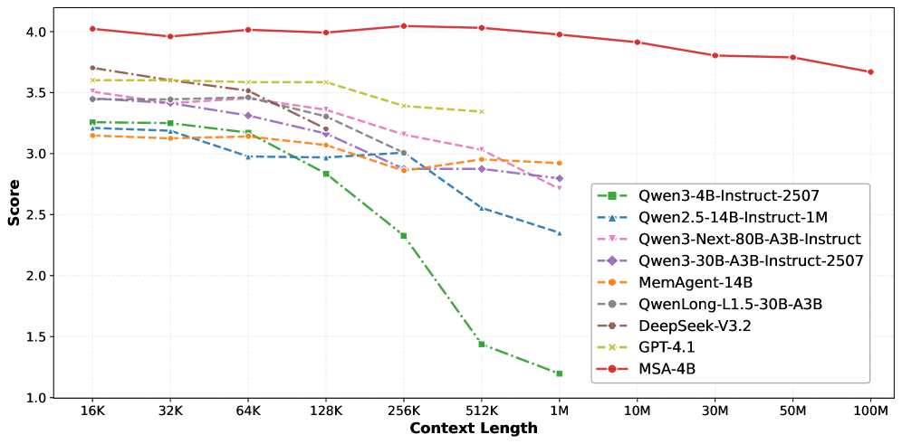
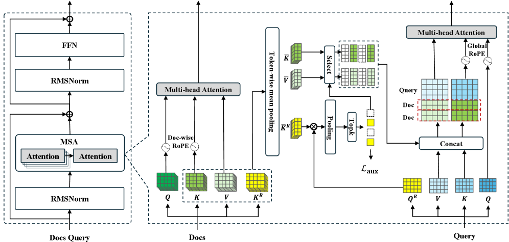
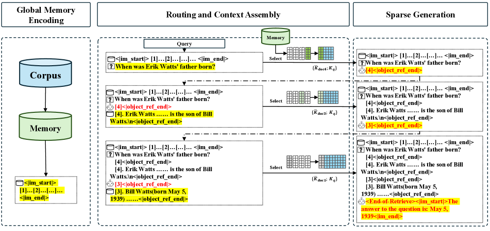
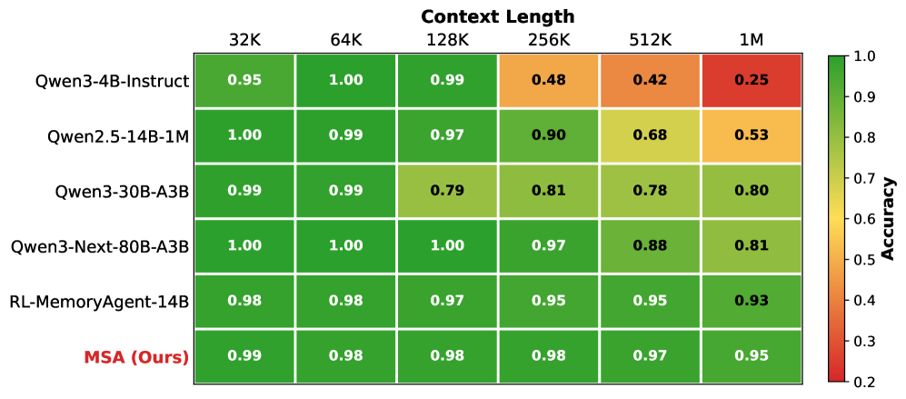

*그림 1: MSA의 전체 구조를 보여주는 개념도입니다. 거대 메모리에서 질문과 관련된 부분만 선택적으로 attends하는 방식을 시각화합니다.*

AI가 긴 글을 잘 읽는다고 말할 때, 우리는 보통 "컨텍스트 윈도우가 커졌다"고 표현합니다. 그런데 이번 논문은 그 한 걸음을 더 밀어붙입니다. **MSA(Memory Sparse Attention)** 는 단순히 입력 길이를 늘리는 수준이 아니라, **1억 토큰 규모의 메모리**를 다룰 수 있는 구조를 제안합니다.

숫자만 보면 감이 잘 안 옵니다. 1억 토큰은 책 수백 권, 기업 문서 아카이브, 혹은 한 사람의 장기 기록에 가까운 규모입니다. 그래서 이 논문은 단순한 모델 개선이 아니라, **"AI가 얼마나 긴 시간과 많은 자료를 기억할 수 있는가"** 라는 질문에 꽤 본격적으로 답하려는 시도라고 볼 수 있습니다.

오늘은 이 논문을 어렵지 않게 정리해보겠습니다.

## 한눈에 보는 핵심

- 논문명: **MSA: Memory Sparse Attention for Efficient End-to-End Memory Model Scaling to 100M Tokens**
- 핵심 주장: **16K에서 100M 토큰 규모로 확장하면서도 성능 저하를 9% 미만으로 억제**
- 핵심 아이디어: **필요한 메모리만 골라 보는 sparse attention 구조**
- 실무 포인트: RAG를 완전히 대체한다기보다, **매우 긴 문맥과 복잡한 추론이 필요한 영역**에서 강력한 선택지가 될 수 있음
- 교육 포인트: "AI는 모든 것을 한 번에 읽는 게 아니라, 필요한 기억을 골라 접근한다"는 개념을 설명하기 좋음

## 왜 이 논문이 중요한가

지금까지의 대형 언어모델은 컨텍스트 길이가 계속 늘어났습니다.

- 몇 년 전: 4K~8K 토큰
- 그다음: 32K~128K 토큰
- 최근: 수십만~100만 토큰 수준

이 정도만 해도 엄청난 발전이지만, 실제 활용에서는 여전히 부족한 경우가 많습니다.

예를 들면 이런 상황입니다.

- 회사 전체 매뉴얼과 회의록을 모두 참고해야 하는 AI
- 수천 페이지짜리 판례·법률 문서를 읽어야 하는 AI
- 학생의 장기 학습 이력과 피드백을 기억해야 하는 AI 튜터
- 몇 달간 이어지는 프로젝트 맥락을 놓치지 않아야 하는 에이전트

즉, "긴 문서 하나"가 아니라 **아주 많은 기억을 장기간 다루는 문제**가 중요해지고 있습니다.

## 기존 방식은 왜 한계가 있었을까

긴 문맥 문제를 해결하려는 접근은 이미 많았습니다. 하지만 다 장단점이 있습니다.

### 1. RAG(검색 기반 접근)
가장 널리 쓰이는 방법입니다. 필요한 문서를 검색해서 일부만 모델에게 넣어주는 방식이죠.

장점은 효율적이라는 점입니다. 하지만 단점도 분명합니다.

- 검색이 잘못되면 중요한 정보를 놓칠 수 있음
- 검색 시스템과 생성 모델이 분리되어 있음
- 여러 문서를 엮는 복합 추론에서는 한계가 생길 수 있음

### 2. 긴 컨텍스트를 그대로 늘리는 방식
모델 입력 창 자체를 계속 키우는 방식입니다.

직관적이지만, 모든 토큰이 서로를 보는 attention 구조는 계산 비용이 너무 큽니다. 길이가 커질수록 연산량과 메모리 사용량이 빠르게 폭증합니다.

### 3. 선형 어텐션·압축 메모리 계열
효율성은 좋지만, 아주 긴 범위로 가면 세부 정보 손실이나 정밀도 저하 문제가 생길 수 있습니다.

그래서 이 논문의 질문은 분명합니다.

> **정확도를 유지하면서, 정말 큰 메모리를, end-to-end로 학습 가능한 방식으로 다룰 수 없을까?**

*그림 2: 기존 방식들과 MSA의 구조적 차이를 비교한 다이어그램입니다.*

## MSA는 무엇을 바꿨나

MSA의 핵심은 의외로 직관적입니다.

**모든 메모리를 다 보지 말고, 지금 질문에 필요한 메모리만 골라서 보자.**

즉, 전체 문서를 무식하게 전부 훑는 것이 아니라, 먼저 관련성이 높은 문서 후보를 추리고, 그다음 그 문서들에 집중해서 attention을 수행합니다.

이 발상 자체는 검색과 비슷해 보일 수 있지만, 논문은 이를 **모델 내부 메커니즘으로 더 긴밀하게 통합**하려고 합니다.

### 핵심 기술 1. Top-k Sparse Attention
논문은 문서별로 라우팅 키를 만들고, 질문과의 유사도를 계산한 뒤 **상위 k개 문서만 선택**합니다.

쉽게 말하면,

- 전체 도서관을 다 읽는 것이 아니라
- 먼저 "지금 질문과 관련 있을 책"을 추린 뒤
- 그 책들만 정밀하게 읽는 방식입니다.

이렇게 하면 계산량을 크게 줄이면서도 필요한 정보에 집중할 수 있습니다.

### 핵심 기술 2. Document-wise RoPE
긴 문맥을 다룰 때 흔히 생기는 문제 중 하나가 위치 정보 처리입니다. 문서가 너무 길어지면 위치 인코딩이 흔들리거나, 학습 때 보지 못한 길이에서 성능 저하가 커질 수 있습니다.

이 논문은 **문서 단위로 위치를 다루는 방식**을 제안해, 훈련 시보다 훨씬 긴 길이까지 외삽할 수 있도록 설계합니다.

### 핵심 기술 3. Memory Interleaving
하나의 질문이 단 한 번의 검색으로 해결되지 않는 경우가 많습니다. 어떤 문제는 여러 단계를 거쳐 기억을 다시 찾고, 다시 읽고, 다시 추론해야 하죠.

MSA는 이런 과정을 위해 **검색과 생성의 반복 흐름**을 지원합니다. 즉, 한 번 보고 끝나는 것이 아니라, 필요하면 메모리를 다시 참조하는 구조를 지향합니다.

*그림 3: Top-k Sparse Attention과 Document-wise RoPE의 작동 원리를 보여주는 기술 다이어그램입니다.*

## 논문이 주장하는 성과

가장 눈에 띄는 숫자는 이겁니다.

### 1. 1억 토큰까지 확장
논문은 **16K에서 100M 토큰까지 메모리 규모를 확장**하면서도 성능 저하를 9% 미만으로 억제했다고 주장합니다.

이건 단순히 "엄청 길다" 수준이 아니라, 이제 AI가 **대규모 장기 기억을 다루는 방향**으로 아키텍처가 진화하고 있다는 신호로 볼 수 있습니다.

### 2. 2×A800 GPU에서 100M 토큰 추론
100M 토큰이면 보통 상상만 해도 하드웨어가 무서울 정도인데, 논문은 **2장의 A800 GPU로 추론 가능**하다고 설명합니다.

물론 이 말이 "누구나 쉽게 쓸 수 있다"는 뜻은 아닙니다. 여전히 매우 높은 하드웨어 요구사항입니다. 하지만 연구 단계에서 **물리적으로 가능한 설계**를 보여줬다는 점은 의미가 있습니다.

### 3. QA 계열 벤치마크에서 강한 성능
연구 노트 기준으로 보면, MSA는 여러 QA 벤치마크에서 강한 결과를 보였고, 특히 **multi-hop 추론**에서 강점이 드러납니다.

이건 중요합니다. 긴 메모리는 단순히 많이 저장하는 것보다, **멀리 떨어진 정보를 연결해 답을 만드는 능력**이 더 중요하기 때문입니다.

*그림 4: 16K에서 100M 토큰까지 확장했을 때의 성능 변화를 보여주는 실험 결과 그래프입니다.*

## 이 논문을 어떻게 이해하면 좋을까

저는 이 논문을 이렇게 해석하는 게 좋다고 봅니다.

### "긴 컨텍스트"에서 "장기 메모리"로 넘어가는 전환점
우리는 그동안 컨텍스트 길이를 주로 "한 번에 얼마나 많이 넣을 수 있나"로 봤습니다. 하지만 앞으로 더 중요한 질문은 아마 이쪽일 겁니다.

- 얼마나 많이 기억할 수 있는가?
- 그중에서 필요한 것을 얼마나 잘 찾는가?
- 여러 기억을 엮어 얼마나 길게 추론할 수 있는가?

MSA는 바로 이 세 질문을 동시에 건드리는 논문입니다.

### RAG의 경쟁자라기보다, 다른 축의 해법
이 논문을 보고 "그럼 이제 RAG는 끝났네"라고 해석하면 과합니다. 실제로는 둘의 쓰임이 다를 가능성이 큽니다.

- **실시간으로 문서가 자주 바뀌는 환경**: 여전히 RAG가 유리할 수 있음
- **정교한 장기 기억과 다단계 추론이 중요한 환경**: MSA류 구조가 더 매력적일 수 있음

즉, RAG와 MSA는 완전한 대체 관계라기보다, **문제 유형에 따라 선택이 달라질 도구**로 보는 쪽이 더 현실적입니다.

## 교육 현장에서 설명하기 좋은 비유

이 논문은 초등학생이나 일반인에게 설명할 때도 꽤 재미있는 비유가 가능합니다.

### 도서관 비유
- **기존 긴 컨텍스트 모델**: 도서관 책을 가능한 많이 책상 위에 펼쳐놓고 읽기
- **RAG**: 사서가 검색해서 관련 책 몇 권만 가져다주기
- **MSA**: 사서가 책 전체 구조를 잘 알고 있고, 질문에 따라 정말 볼 가치가 큰 책과 부분만 빠르게 골라 펼쳐주기

이 비유의 좋은 점은, "기억이 크다"는 말이 단순히 저장 공간이 크다는 뜻이 아니라, **필요할 때 잘 접근하고 활용하는 구조**라는 점까지 전달할 수 있다는 것입니다.

## 실무적으로 어디에 쓸 수 있을까

이 논문이 바로 내일부터 서비스에 들어가진 않더라도, 방향성은 분명합니다.

### 가능성이 큰 분야
- 기업 내부 지식 검색과 장기 업무 기록 관리
- 개인 AI 비서의 장기 메모리
- 장기간 학습 데이터를 반영하는 교육 AI
- 복잡한 기술 문서/의료 기록/법률 문서 분석
- 장기 프로젝트를 이어가는 에이전트 시스템

특히 코난쌤처럼 **AI 교육과 실용적 업무 자동화**를 함께 보는 관점에서는, 이 논문이 "모델 크기 경쟁"보다 더 중요한 메시지를 줍니다.

> 앞으로의 AI 경쟁력은 단순히 똑똑함뿐 아니라, **얼마나 잘 기억하고, 그 기억을 얼마나 잘 꺼내 쓰는가**로 옮겨갈 수 있다.

## 한계도 분명히 봐야 한다

좋은 논문일수록 장점만이 아니라 한계도 같이 봐야 합니다.

### 1. 아직 범용성은 더 검증이 필요함
연구 노트 기준으로 보면, 실험 백본은 Qwen3-4B 계열 중심입니다. 다른 계열 모델에서도 비슷한 효과가 안정적으로 나올지는 더 봐야 합니다.

### 2. 평가가 특정 태스크에 치우쳤을 수 있음
QA나 Needle-in-a-Haystack 계열 성능은 인상적이지만, 창의적 글쓰기나 일반 대화 같은 영역까지 같은 강점이 이어질지는 아직 불확실합니다.

### 3. 실제 배포는 여전히 어렵다
2×A800이면 연구·산업 기준으로도 가벼운 환경은 아닙니다. 또한 메모리 병렬화와 오프로드 등 구현 난이도도 높습니다.

즉, 이 논문은 "당장 누구나 쓰는 기술"이라기보다, **앞으로 장기 메모리 AI가 어디로 갈지 보여주는 강한 시그널**에 가깝습니다.

## 코난쌤 관점에서 보면

이 논문은 단순히 연구 성과 하나를 소개하는 데서 끝내기 아깝습니다. 교육적으로도 아주 좋은 소재입니다.

왜냐하면 요즘 사람들은 AI를 볼 때 주로 "정답을 잘 맞히는가"만 보는데, 실제로는 **기억 구조**가 점점 더 중요해지고 있기 때문입니다.

앞으로 AI 수업이나 콘텐츠에서는 이런 질문을 던져볼 수 있습니다.

- AI는 어디까지 기억할 수 있을까?
- 많이 기억하는 것과 잘 찾는 것 중 무엇이 더 중요할까?
- RAG와 장기 메모리 모델은 어떻게 다를까?
- 미래의 AI 튜터나 AI 비서는 어떤 메모리 구조를 가져야 할까?

이런 질문은 단순 기술 소개를 넘어서, **AI 리터러시 교육** 주제로도 확장성이 큽니다.

## 마무리

MSA는 "컨텍스트를 더 길게"라는 흐름을 넘어, **"AI에게 장기 메모리를 어떻게 줄 것인가"** 라는 더 본질적인 질문으로 넘어가는 논문입니다.

아직은 연구 단계의 성격이 강하고, 실제 제품으로 널리 쓰이기까지는 시간이 필요합니다. 그래도 분명한 건 있습니다.

앞으로의 AI는 단순히 많이 아는 모델이 아니라,
**오래 기억하고, 필요한 순간에 잘 꺼내 쓰는 모델** 쪽으로 진화하고 있다는 점입니다.

MSA는 그 방향을 꽤 선명하게 보여준 사례라고 할 수 있습니다.

## 한 줄 정리

> **MSA는 AI가 모든 문서를 다 읽는 대신, 필요한 기억만 똑똑하게 골라 보게 만들어 1억 토큰 규모의 장기 메모리에 도전한 논문입니다.**

## 함께 보면 좋은 포인트

- 긴 컨텍스트 모델과 RAG의 차이
- 장기 메모리 AI가 에이전트에 미칠 영향
- 교육용 AI 튜터에서 "기억"이 왜 중요한가

## 참고 자료

- Hugging Face Papers: https://huggingface.co/papers/2603.23516
- arXiv: https://arxiv.org/abs/2603.23516
- arXiv HTML: https://arxiv.org/html/2603.23516
