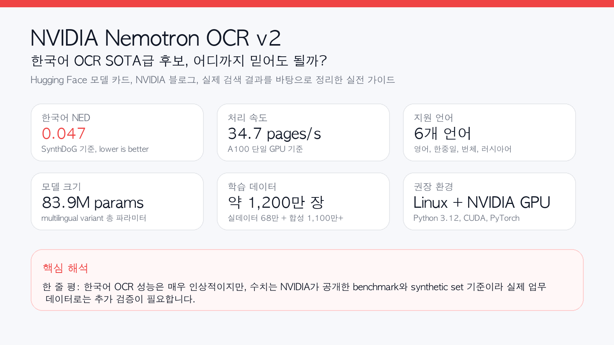
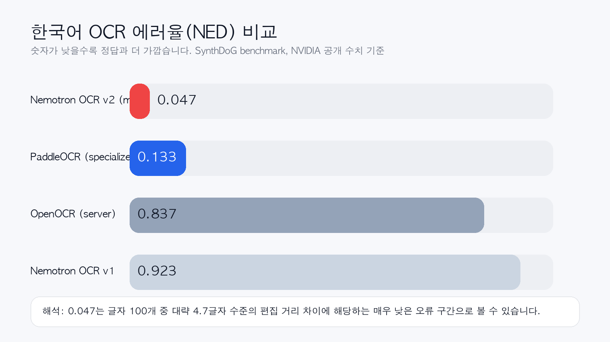
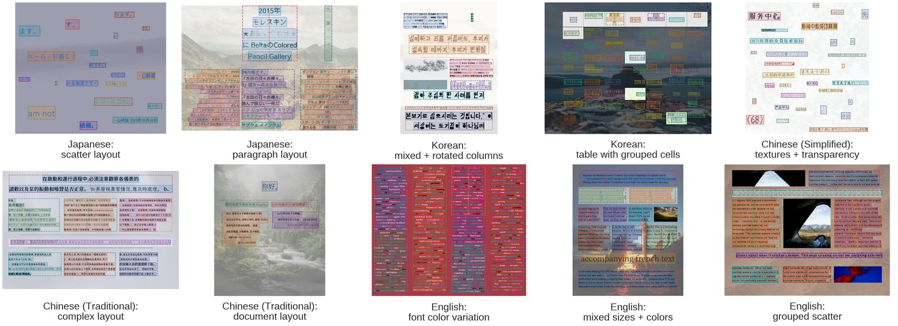
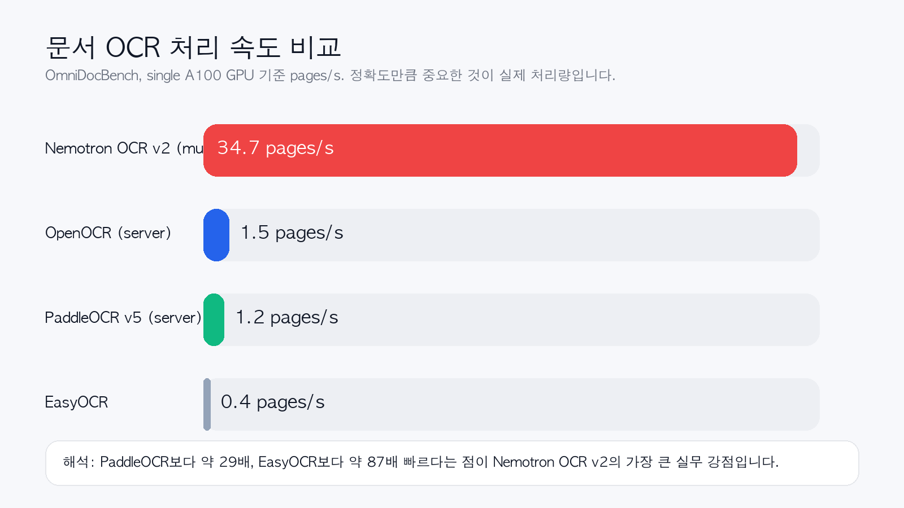
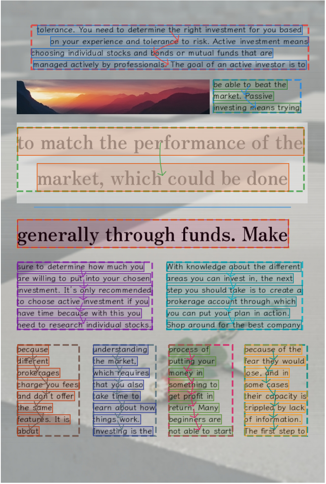

> 원문 및 참고: [Hugging Face 모델 카드](https://huggingface.co/nvidia/nemotron-ocr-v2), [NVIDIA/Hugging Face 블로그](https://huggingface.co/blog/nvidia/nemotron-ocr-v2), [Quickstart](https://huggingface.co/nvidia/nemotron-ocr-v2/blob/main/quickstart.md), [관련 Threads 글](https://www.threads.com/@byeongki_j/post/DXRpWiKFOLS)



## 한 줄 요약

**Nemotron OCR v2는 한국어 OCR에서도 매우 강한 결과를 보인 NVIDIA의 오픈 모델**입니다. 특히 공개된 SynthDoG 벤치마크에서 **한국어 NED가 0.047**로 제시되어, PaddleOCR specialized의 **0.133**보다 낮았습니다. 다만 이 숫자는 **NVIDIA가 공개한 synthetic benchmark 기준**이므로, 실제 업무 문서에서도 그대로 SOTA라고 단정하기보다는 **SOTA급 후보, 혹은 한국어 OCR에서 매우 강력한 공개 모델**이라고 부르는 편이 정확합니다.

## 왜 갑자기 다들 Nemotron OCR v2를 말할까?

이번 모델이 주목받는 이유는 단순히 "새 OCR 모델이 나왔다" 수준이 아니기 때문입니다. 실제 검색 결과와 Threads 요약에서 반복해서 등장하는 포인트는 딱 3가지였습니다.

1. **한국어 성능 수치가 유난히 강하다**
   - 한국어 NED 0.047
   - PaddleOCR specialized 0.133보다 낮음
2. **속도가 비정상적으로 빠르다**
   - 단일 A100 기준 **34.7 pages/s**
3. **핵심 메시지가 명확하다**
   - NVIDIA가 직접 남긴 문장, **"The Problem: Data, Not Architecture."**

즉, 이 모델의 포인트는 "OCR 아키텍처를 살짝 바꿨다"가 아니라, **다국어 OCR의 성패는 결국 데이터가 좌우한다**는 메시지를 아주 강하게 던졌다는 데 있습니다.

## Nemotron OCR v2는 어떤 모델인가?

Nemotron OCR v2는 단일 OCR 엔진이라기보다, 아래 3개 모듈이 결합된 **end-to-end OCR 파이프라인**에 가깝습니다.

- **Text Detector**: 텍스트 위치를 찾음
- **Text Recognizer**: 찾은 영역의 글자를 읽음
- **Relational Model**: 읽기 순서, 블록 관계, 레이아웃 구조를 추론함

NVIDIA가 공개한 구조 설명에 따르면:

- Detector backbone: **RegNetX-8GF**
- Recognizer: **Transformer 기반 시퀀스 인식기**
- Relational module: **문서 레이아웃과 reading order 추론**

특히 multilingual 버전은 단순 단어 OCR이 아니라 **문장/라인 단위 처리와 구조 분석**까지 고려한 쪽이라, 표, 차트, 인포그래픽, 복합 문서 같은 실제 업무 문서에 더 잘 맞는 설계입니다.

## 한국어 OCR 성능, 정말 SOTA라고 불러도 될까?

제 결론은 이렇습니다.

> **한국어 synthetic benchmark 기준으로는 SOTA급이라고 불러도 무리가 없지만, 모든 한국어 실문서 환경에서 절대적 SOTA라고 단정하는 건 아직 이릅니다.**

왜냐하면 NVIDIA가 모델 카드에서 공개한 **한국어 직접 수치**는 SynthDoG 기준이기 때문입니다.



### 한국어 NED 비교 (SynthDoG, lower is better)

| 모델 | 한국어 NED |
|------|-----------:|
| **Nemotron OCR v2 (multilingual)** | **0.047** |
| PaddleOCR (specialized) | 0.133 |
| OpenOCR (server) | 0.837 |
| Nemotron OCR v1 | 0.923 |

이 표만 보면 메시지는 명확합니다.

- Nemotron OCR v1은 한국어에서 사실상 거의 못 읽는 수준에 가까웠습니다.
- PaddleOCR specialized는 꽤 강합니다.
- 그런데 Nemotron OCR v2 multilingual은 여기서 한 번 더 크게 내려갑니다.

즉, **"한국어도 지원"**이 아니라 **"한국어에서 꽤 잘 읽는다"** 쪽에 더 가깝습니다.

다만 조심할 점도 있습니다.

- 이 수치는 **NVIDIA 공개 benchmark**입니다.
- 한국어 실문서 전용 공개 리더보드 전체를 가져와 비교한 것은 아닙니다.
- OmniDocBench 표는 영어, 중국어, mixed 문서 중심이라 **한국어 실문서 일반화 성능을 직접 보장하진 않습니다.**

그래서 표현을 조금 정교하게 해야 합니다.

### 가장 정확한 표현

- **공개된 synthetic benchmark 기준 한국어 OCR SOTA급**
- **한국어를 포함한 다국어 OCR에서 현재 가장 인상적인 오픈 모델 중 하나**
- **실무 투입 전에는 내 문서셋으로 재검증이 필요한 모델**

이 정도가 가장 균형 잡힌 평가입니다.

## NED가 뭐길래 0.047에 다들 놀라는가?

OCR 글을 읽다 보면 CER, WER, accuracy와 함께 **NED**가 자주 등장합니다.

NED는 **Normalized Edit Distance**, 즉 **정규화된 편집 거리**입니다.

쉽게 말하면,

- 정답 텍스트와
- 모델이 읽어낸 텍스트 사이의 차이를
- 문자열 길이로 정규화해서 보는 지표입니다.

보통 직관적으로는 이렇게 이해하면 됩니다.

```text
NED = 편집거리(Edit Distance) / 더 긴 문자열 길이
```

여기서 편집거리는 아래 세 연산 횟수입니다.

- 삽입
- 삭제
- 치환

예를 들어 정답이 `대한민국`인데 OCR 결과가 `대힌민국`이면, 한 글자가 잘못 읽힌 것이므로 편집거리는 1입니다.

### NED는 낮을수록 좋다

Nemotron OCR v2 문서와 OmniDocBench 표는 **lower is better** 기준입니다.

- **0.000**: 완벽히 일치
- **0.050**: 거의 맞음
- **0.100**: 눈에 띄는 오인식이 조금 있음
- **0.500 이상**: 결과가 많이 틀렸을 가능성 큼
- **0.900 수준**: 사실상 거의 다른 문자열

그래서 **한국어 NED 0.047**은 꽤 강한 숫자입니다. 아주 거칠게 말하면, 글자 100개를 읽을 때 편집거리 기준으로 약 4.7 수준의 차이만 난다는 뜻에 가깝습니다.

### 왜 헷갈리는가?

일부 자료나 라이브러리는 `1 - NED` 형태를 accuracy처럼 보여주기도 합니다. 그래서 같은 "normalized edit distance"라는 말을 보더라도,

- 어떤 문서는 **낮을수록 좋다**
- 어떤 구현은 **높을수록 좋다**

처럼 보일 수 있습니다.

이번 Nemotron OCR v2 글에서는 **NVIDIA가 표에 명시한 방식**, 즉 **낮을수록 좋은 NED**로 이해하면 됩니다.

## 이 모델이 강한 이유, NVIDIA는 왜 "Data, Not Architecture"라고 했을까?

이번 글에서 제가 가장 흥미롭게 본 부분은 바로 여기입니다.

NVIDIA는 Nemotron OCR v2의 성능 향상 핵심을 **새로운 마법 같은 아키텍처**보다 **데이터 전략**에 두고 있습니다.

공개된 학습 데이터 설명을 보면 대략 이렇습니다.

- 총 학습 이미지 수: **약 1,200만 장**
- 실데이터: **약 68만 장**
- 합성 데이터: **1,100만 장 이상**
- 언어: 영어, 일본어, 한국어, 러시아어, 중국어(간체/번체)

합성 데이터에는 다음이 포함됩니다.

- 렌더링된 다국어 문서 페이지
- 차트와 인포그래픽 텍스트
- 테이블 이미지
- 손글씨 문서
- 열화된 historical document 스타일 데이터

즉, 한국어 OCR 성능이 갑자기 좋아진 이유를 단순히 모델 구조 변경으로 보기보다, **한국어를 포함한 다국어 synthetic data를 매우 크게 밀어 넣은 결과**로 보는 게 맞습니다.


*Hugging Face Space에 공개된 Nemotron OCR v2 예시 이미지 모음*

이 관점은 교육적으로도 꽤 중요합니다. OCR 성능 개선은 모델만 키운다고 해결되지 않고, 결국 **문자 체계별 데이터 설계와 실제 문서 분포를 얼마나 잘 반영했는가**가 핵심이라는 뜻이기 때문입니다.

## 속도는 어느 정도인가?

정확도만 강조하면 실무에서는 반쪽짜리입니다. 문서 OCR은 결국 **처리량**이 중요합니다.



### OmniDocBench 처리 속도 (single A100)

| 모델 | 처리 속도 |
|------|----------:|
| **Nemotron OCR v2 (multilingual)** | **34.7 pages/s** |
| OpenOCR (server) | 1.5 pages/s |
| PaddleOCR v5 (server) | 1.2 pages/s |
| EasyOCR | 0.4 pages/s |

이 수치가 맞다면 Nemotron OCR v2의 장점은 아주 분명합니다.

- PaddleOCR v5 server 대비 약 **29배 빠름**
- EasyOCR 대비 약 **87배 빠름**

물론 이 역시 NVIDIA 공개 benchmark 기준입니다. 그래도 방향성은 분명합니다. **이 모델은 정확도만 챙긴 연구용 OCR이 아니라, 실제 대량 처리용 production OCR을 노리고 설계된 모델**입니다.

## Nemotron OCR v2 multilingual과 English 버전 차이

Nemotron OCR v2는 두 가지 버전으로 공개됩니다.

### 1) `v2_english`
- 영어 최적화
- word-level region handling
- 총 파라미터 약 **53.8M**

### 2) `v2_multilingual`
- 영어, 한국어, 일본어, 러시아어, 중국어(간체/번체) 지원
- line-level region handling
- 총 파라미터 약 **83.85M**

세부적으로 multilingual recognizer가 더 큽니다.

| 항목 | v2_english | v2_multilingual |
|------|-----------:|----------------:|
| Transformer layers | 3 | 6 |
| Hidden dimension | 256 | 512 |
| FFN width | 1024 | 2048 |
| Max sequence length | 32 | 128 |
| Charset size | 855 | 14,244 |
| 총 파라미터 | 53.83M | 83.85M |

한국어 OCR이 목적이라면 당연히 **multilingual 버전**을 쓰는 편이 맞습니다.

## Hugging Face에서 Nemotron OCR v2 사용하는 방법

Nemotron OCR v2는 Hugging Face 모델 카드 기준으로 **Python 3.12 + CUDA + PyTorch + NVIDIA GPU** 환경을 권장합니다.

### 1. 기본 설치

```bash
git lfs install
git clone https://huggingface.co/nvidia/nemotron-ocr-v2
cd nemotron-ocr-v2

# 예시: CUDA 12.8용 PyTorch
pip install torch torchvision --index-url https://download.pytorch.org/whl/cu128

# CUDA extension 빌드를 위해 no-build-isolation 권장
pip install --no-build-isolation -v .
```

여기서 중요한 점은 **이 패키지가 CUDA C++ extension을 빌드한다는 것**입니다. 그래서 PyTorch CUDA 버전과 시스템의 `nvcc` major version이 맞아야 합니다.

예를 들어,

- `torch+cu128`이면
- 시스템 CUDA toolkit도 **12.x 계열**이어야 안전합니다.

### 2. 설치 확인

```bash
python -c "from nemotron_ocr.inference.pipeline_v2 import NemotronOCRV2; print('OK')"
```

### 3. 가장 기본적인 추론 예시

```python
from nemotron_ocr.inference.pipeline_v2 import NemotronOCRV2

# 기본값은 multilingual
ocr = NemotronOCRV2()

predictions = ocr("ocr-example-input-1.png", merge_level="paragraph")

for pred in predictions:
    print(
        pred["text"],
        pred["confidence"],
        pred["left"], pred["upper"], pred["right"], pred["lower"]
    )
```

### 4. 영어 전용 모델 사용

```python
from nemotron_ocr.inference.pipeline_v2 import NemotronOCRV2

ocr_en = NemotronOCRV2(lang="en")
preds = ocr_en("sample.png")
```

### 5. 로컬 체크포인트로 실행

```python
from nemotron_ocr.inference.pipeline_v2 import NemotronOCRV2

ocr_local = NemotronOCRV2(model_dir="./v2_multilingual")
preds = ocr_local("sample.png")
```

### 6. merge level 조절

```python
ocr("sample.png", merge_level="word")
ocr("sample.png", merge_level="sentence")
ocr("sample.png", merge_level="paragraph")  # 기본값
```

### 7. 더 가볍게 돌리는 모드

```python
# detector only: 박스만 뽑고 텍스트 인식은 생략
ocr_det = NemotronOCRV2(detector_only=True)

# relational model 생략: 더 빠르지만 읽기 순서/구조 정보는 약해짐
ocr_fast = NemotronOCRV2(skip_relational=True)
```

## Docker로도 가능하다

Hugging Face 문서에는 Docker 방식도 안내되어 있습니다.

```bash
docker run --rm --gpus all nvcr.io/nvidia/pytorch:25.09-py3 nvidia-smi

docker compose run --rm nemotron-ocr \
  bash -lc "python example.py ocr-example-input-1.png --merge-level paragraph"
```

즉, 로컬 호스트에 이것저것 직접 깔기 싫다면 **NVIDIA Container Toolkit이 잡힌 Docker 환경**으로 빠르게 시험해볼 수 있습니다.

## 권장 하드웨어 사양은?

모델 카드에서 사실상 요구하는 조건은 아래에 가깝습니다.

### 필수에 가까운 조건

- **OS**: Linux amd64
- **Python**: 3.12
- **GPU**: NVIDIA GPU
- **CUDA toolkit**: `nvcc`가 PATH에 있어야 함
- **Framework**: PyTorch

### 문서에 명시된 지원 GPU 계열

- NVIDIA Ampere
- NVIDIA Hopper
- NVIDIA Lovelace
- NVIDIA Blackwell

### 문서에 예시로 언급된 하드웨어

- H100 PCIe / SXM
- A100 PCIe / SXM
- L40S
- L4
- A10G
- H200 NVL
- B200
- RTX PRO 6000 Blackwell Server Edition

즉, **Mac에서 대충 pip install 해서 가볍게 돌리는 타입의 모델은 아닙니다.** 이 모델은 처음부터 **Linux + CUDA + NVIDIA GPU 서버**를 겨냥하고 있습니다.

## 이 모델은 어떤 곳에 잘 맞을까?

Nemotron OCR v2는 아래 시나리오에서 특히 매력적입니다.

### 1. 다국어 문서 수집 파이프라인
- 영문 문서만이 아니라 한국어, 일본어, 중국어까지 함께 다루는 경우
- 문서 OCR 후 RAG 인덱싱을 해야 하는 경우

### 2. PDF/문서 인텔리전스
- 표, 차트, 인포그래픽, 블록 문서가 많을 때
- reading order와 구조 정보가 중요할 때

### 3. 대량 배치 처리
- 정확도도 중요하지만 처리 속도가 더 중요할 때
- 단순 데모가 아니라 production OCR ingest 파이프라인이 필요할 때

### 4. 에이전트 워크플로우
- OCR 결과를 그냥 텍스트로만 끝내는 것이 아니라
- 검색, 요약, 추출, 질의응답까지 연결해야 할 때


*Hugging Face Space 예시. 텍스트 영역 탐지와 인식 결과를 함께 보여준다.*

## 실무 관점에서 아쉬운 점도 있다

좋은 점만 말하면 오히려 판단을 흐립니다. 저는 아래 4가지는 꼭 같이 봐야 한다고 생각합니다.

### 1. 한국어 성능은 매우 좋아 보이지만, 공개 수치는 synthetic benchmark 중심이다
실제 학교 공문, 스캔 PDF, 사진 찍은 가정통신문, 세로쓰기 혼합 문서까지 다 잘 된다고 바로 단정하면 안 됩니다.

### 2. Mac 친화적이지 않다
Apple Silicon에서 가볍게 로컬 테스트하는 유형이 아니라, **NVIDIA GPU 서버 기반 운영**에 더 어울립니다.

### 3. 설치가 아주 가볍진 않다
CUDA extension 빌드가 들어가므로, Python 패키지 하나 툭 설치하는 느낌과는 다릅니다.

### 4. 문서 OCR 최적화 모델이지, 범용 VLM 대체재는 아니다
텍스트 추출과 구조화에는 강하지만, 복잡한 시각 추론 전체를 대신하는 모델로 보면 안 됩니다.

## 그래서 누구에게 추천할까?

### 추천하는 경우
- 한국어 포함 다국어 OCR이 필요하다
- PaddleOCR보다 더 공격적인 성능과 속도를 원한다
- RAG, 문서 검색, PDF 파이프라인을 만들고 있다
- NVIDIA GPU 서버 환경이 이미 있다

### 아직 지켜봐도 되는 경우
- Mac에서 개인용 OCR을 가볍게 돌리고 싶다
- 한국어 단일 문서만 다루고, 이미 PaddleOCR 파이프라인이 안정적이다
- benchmark보다 실제 배포 검증이 더 중요하다

## 결론

Nemotron OCR v2는 오랜만에 나온 **"진짜 실무형 OCR 모델"**에 가깝습니다.

특히 한국어 관점에서 보면,

- **한국어 NED 0.047**이라는 강한 수치가 있고
- 다국어 OCR 구조가 탄탄하며
- 처리량도 매우 공격적이고
- 문서 구조까지 고려한 설계라는 점에서

충분히 **"한국어 OCR SOTA급 후보"**라고 부를 만합니다.

다만 저는 이렇게 정리하고 싶습니다.

> **Nemotron OCR v2는 지금 당장 가장 흥미로운 한국어 OCR 오픈 모델 중 하나다. 하지만 진짜 승부는 내 문서셋에서 다시 확인해야 한다.**

그게 benchmark를 실무로 번역할 때 가장 정직한 태도입니다.

---

## FAQ

### Q1. NED 0.047이면 정확도가 95.3%라는 뜻인가요?
정확히 같은 개념은 아닙니다. NED는 편집거리 기반 지표라서 문자 단위 accuracy와 1:1 대응하진 않습니다. 다만 **매우 낮은 오류 구간**이라는 해석은 가능합니다.

### Q2. 한국어 OCR만 보면 PaddleOCR보다 무조건 낫나요?
공개된 SynthDoG 표에서는 그렇습니다. 하지만 실제 영수증, 스캔 품질, 손글씨, 기울기, 배경 노이즈 등 환경이 다르면 결과는 달라질 수 있으므로 반드시 자체 검증이 필요합니다.

### Q3. MacBook에서도 바로 돌릴 수 있나요?
문서상 권장 환경은 **Linux amd64 + NVIDIA GPU**입니다. Mac에서 가볍게 돌리는 용도와는 거리가 있습니다.

### Q4. 어떤 버전을 써야 하나요?
한국어가 목표라면 **multilingual 버전**을 쓰는 편이 맞습니다. English 전용 버전은 한국어용이 아닙니다.

### Q5. OCR 이후에 RAG 파이프라인으로 연결하기 좋은가요?
좋습니다. bounding box, text, confidence, 구조 정보까지 함께 다룰 수 있어서, 단순 텍스트 추출보다 **문서 청킹, citation, 레이아웃 보존** 측면에서 유리합니다.

---

## 출처

- [nvidia/nemotron-ocr-v2, Hugging Face 모델 카드](https://huggingface.co/nvidia/nemotron-ocr-v2)
- [Building a Fast Multilingual OCR Model with Synthetic Data](https://huggingface.co/blog/nvidia/nemotron-ocr-v2)
- [Nemotron OCR v2 Quickstart](https://huggingface.co/nvidia/nemotron-ocr-v2/blob/main/quickstart.md)
- [Byeongki Jeong님의 Threads 글](https://www.threads.com/@byeongki_j/post/DXRpWiKFOLS)
