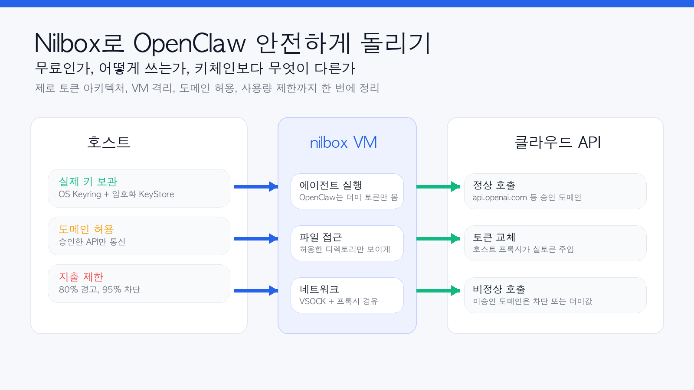
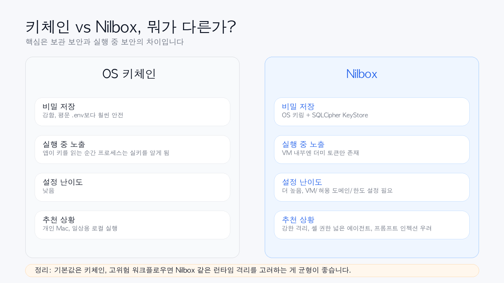

> 참고 링크: [nilbox 공식 사이트](https://nilbox.run/), [다운로드 페이지](https://nilbox.run/download), [GitHub 저장소](https://github.com/rednakta/nilbox), [README.ko](https://github.com/rednakta/nilbox/blob/main/README.ko.md), [Zero Token Architecture 문서](https://github.com/rednakta/nilbox/blob/main/docs/zero-token-architecture.md)



## 한 줄 요약

**Nilbox는 OpenClaw를 실제 VM 안에서 실행하면서, 에이전트에게 진짜 API 키를 직접 주지 않도록 설계한 무료 오픈소스 보안 런타임**입니다. 핵심은 단순 저장 보안이 아니라, **실행 중(runtime)에도 에이전트가 실토큰을 보지 못하게 하는 구조**에 있습니다.

## 왜 Nilbox가 화제가 되는가

OpenClaw 같은 에이전트는 매력적이지만, 동시에 꽤 무섭습니다.

- 셸 접근이 필요하고
- 파일 시스템을 읽고
- 브라우저나 플러그인도 붙고
- 외부 API를 계속 호출합니다

여기서 제일 민감한 것은 결국 **API 키**입니다. 많은 환경에서 이 키는 `.env` 파일이나 환경변수로 전달됩니다. 이 방식은 보관은 편하지만, 에이전트가 실행되는 순간 결국 **프로세스 안에 실제 키가 존재**하게 됩니다.

Nilbox는 이 지점을 정면으로 건드립니다.

> "누군가에게 API 키를 직접 주고 싶지 않다면, 그 사람의 코드가 실행되는 곳에 키를 두지 말라."

이 철학이 Nilbox의 핵심입니다.

## Nilbox는 정확히 뭐 하는 도구인가

현재 공개된 문서를 기준으로 보면 Nilbox는 이렇게 이해하면 가장 쉽습니다.

- **OpenClaw를 격리된 VM 안에서 실행**하고
- **실제 API 키는 호스트 쪽의 암호화된 키스토어에 보관**하고
- VM 내부의 OpenClaw에는 **더미 값만 보여주며**
- 실제 요청이 승인된 도메인으로 나갈 때만 **호스트 프록시가 실토큰으로 바꿔서 전달**합니다

즉 VM 안에서 보면 이렇게 보입니다.

```bash
# VM 내부
ANTHROPIC_API_KEY=ANTHROPIC_API_KEY
OPENAI_KEY=OPENAI_KEY
GEMINI_API_KEY=GEMINI_API_KEY
```

겉으로는 "키가 있는 것처럼" 보이지만, 사실은 그냥 **문자열 placeholder**입니다.

반대로 정상적인 요청이 `api.openai.com` 같은 허용된 도메인으로 나가면, 호스트 프록시가 그 문자열을 **실제 키로 교체**해서 전송합니다.

이 구조를 nilbox는 **Zero Token Architecture**라고 부릅니다.

## 그냥 키체인에 저장하면 되는 것 아닌가?

이 질문이 가장 중요합니다. 저도 처음엔 같은 생각이었습니다.

그리고 결론부터 말하면,

> **일반적인 개인용 로컬 사용에서는 키체인이 더 현실적인 기본값이고, Nilbox는 그보다 더 강한 실행 중 보안을 원하는 사람에게 맞는 선택지**입니다.

왜냐하면 둘이 해결하는 문제가 다르기 때문입니다.



### 키체인이 잘하는 것

- 평문 `.env`보다 훨씬 안전한 저장
- OS 차원의 보호
- 설정이 비교적 단순함

### 키체인이 못 막는 것

- 앱이 실행되면서 키를 꺼내 쓰는 순간, **그 프로세스는 결국 실키를 알게 됨**
- 프롬프트 인젝션, 악성 dependency, 로그 유출이 터지면 **실행 중 키 노출 가능성**이 생김

### Nilbox가 노리는 것

- 키를 안전하게 저장하는 것뿐 아니라
- **실행 중에도 VM 내부의 에이전트가 실키를 직접 못 보게 하는 것**

즉 차이는 이렇게 정리됩니다.

- **키체인**: 보관 보안(at rest)에 강함
- **Nilbox**: 실행 중 보안(runtime)에 더 강한 구조

## Nilbox는 무료인가?

현재 공개된 nilbox 사이트와 GitHub 저장소 기준으로는 다음처럼 이해하면 됩니다.

- **무료**
- **오픈소스**
- 라이선스: **GPLv3**
- README 기준 버전 표기: **0.1.8**

다만 여기서 주의할 점이 있습니다.

### 무료인 것은 Nilbox 자체다

Nilbox가 무료여도 아래 비용은 따로 듭니다.

- OpenAI API 비용
- Anthropic API 비용
- Gemini API 비용
- GitHub, AWS 등 연동 서비스 비용

즉 Nilbox는 **보안 실행 환경**이지, 모델 사용료를 없애주는 서비스는 아닙니다.

오히려 nilbox는 반대로 **토큰 사용량 추적과 지출 제한** 기능을 강조합니다.

- 프로바이더별 사용량 추적
- 80% 경고
- 95% 차단 같은 사용량 제한

그래서 "무료"라는 말은 **앱/런타임 자체가 무료**라는 의미로 받아들이는 게 맞습니다.

## 공개 자료 기준 Nilbox 사용법, 실제 흐름은 이렇다

사이트에서는 "2분 안에 시작"과 "원클릭 설치"를 내세우지만, 실제로는 아래 흐름으로 이해하는 것이 가장 현실적입니다.

## 1. Nilbox 다운로드

공식 사이트의 다운로드 페이지에서 플랫폼별 앱을 받습니다.

- macOS
- Windows
- Linux

현재 다운로드 페이지에서 확인되는 정보 기준으로는:

- macOS 13+ (Ventura)
- 메모리 8GB 최소, 16GB 권장
- 디스크 20GB 이상 권장
- SSD 추천

또한 자동 업데이트와 Ed25519 서명 검증, SHA256 체크섬 제공도 강조하고 있습니다.

## 2. Nilbox를 실행해 VM을 만든다

Nilbox는 컨테이너가 아니라 **실제 VM**을 띄우는 방향입니다.

문서에 따르면:

- macOS: **Apple Virtualization.framework**
- Linux / Windows: **QEMU**

즉 OpenClaw는 호스트가 아니라, Nilbox가 관리하는 **격리된 게스트 환경** 안에서 돌아갑니다.

## 3. 실토큰은 호스트 쪽에 저장한다

여기가 핵심입니다.

Nilbox는 실토큰을 VM 안이 아니라 **호스트 쪽 암호화된 KeyStore**에 보관합니다. README와 보안 문서에 따르면 저장 구조는 대략 아래와 같습니다.

- **OS Keyring**: macOS Keychain / Linux secret-service / Windows Credential Manager
- **SQLCipher 기반 암호화 DB**: 호스트의 keystore

즉 재미있게도, Nilbox도 결국 내부적으로 **OS 키링을 활용**합니다. 다만 차이는 거기서 끝나지 않고, **실토큰이 VM 안으로 들어가지 않게 만든다**는 점입니다.

## 4. VM 안에서는 더미 환경변수만 쓴다

OpenClaw는 VM 안에서 보통 아래 같은 값을 보게 됩니다.

```bash
ANTHROPIC_API_KEY=ANTHROPIC_API_KEY
OPENAI_KEY=OPENAI_KEY
GITHUB_TOKEN=GITHUB_TOKEN
```

이 값들은 비밀키가 아니라 단순한 이름 문자열입니다.

그래서 에이전트가 환경변수를 읽더라도 얻는 것은

- `OPENAI_KEY`
- `ANTHROPIC_API_KEY`
- `GITHUB_TOKEN`

같은 **껍데기 값**뿐입니다.

## 5. 허용 도메인과 네트워크 규칙을 설정한다

Nilbox는 단순히 토큰만 감추는 게 아니라, **어디로 나갈 수 있는지**도 제어합니다.

문서 기준으로 보이는 핵심 기능은 이렇습니다.

- **도메인 게이팅**: Allow Once / Allow Always / Deny
- **네트워크 allowlist**: 승인된 도메인만 통신 허용
- **DNS blocklist**
- **디렉토리 단위 접근 제어**

이게 중요한 이유는, 설령 에이전트가 악성 프롬프트에 속아도

- 승인되지 않은 도메인으로는 요청이 차단되고
- 승인된 도메인이라고 해도 토큰 치환은 **도메인별 정책**에 따라 이루어지기 때문입니다.

## 6. 지출 한도를 설정한다

Nilbox의 실무적인 장점 중 하나는 이 부분입니다.

에이전트 자동화에서 무서운 건 보안만이 아니라 **비용 폭주**입니다.

Nilbox는 다음을 지원한다고 설명합니다.

- 프로바이더별 사용량 추적
- 일정 수준 경고
- 한도 초과 시 자동 차단

즉 "보안"과 함께 "API 폭주 방지"까지 묶어서 다루려는 도구로 보는 것이 맞습니다.

## 7. OpenClaw를 VM 안에 설치해 실행한다

현재 공개 README를 보면 Nilbox 안에서 OpenClaw를 구동하는 방식은 두 갈래로 이해할 수 있습니다.

### 쉬운 방식
- nilbox의 **App Store**를 이용해 앱을 설치
- Linux에 익숙하지 않은 사람을 위한 원클릭 흐름

### 수동 방식
- VM 안 터미널로 접속해서 OpenClaw를 직접 설치
- 익숙한 사람은 셸에서 직접 구성 가능

즉 "터미널 없이도 가능하게 설계했지만, 원하면 직접 만질 수도 있는" 방향입니다.

## 8. 승인된 도메인만 통신시키며 실제로 사용한다

이후 실사용 단계에서는 이런 흐름이 반복됩니다.

1. OpenClaw가 VM 안에서 API 요청 생성
2. 로컬 프록시로 요청 전달
3. Nilbox 호스트 프록시가 목적지 도메인 확인
4. 승인된 도메인이면 더미 값을 실토큰으로 교체
5. 사용량 기록 및 한도 체크
6. 응답 반환

이 과정을 OpenClaw는 거의 의식하지 않고, **수정 없이 그대로 실행**됩니다.

## 기술적으로는 어떻게 작동하나

공개된 Zero Token Architecture 문서를 기반으로 정리하면 대략 이렇습니다.

1. VM 안에는 실토큰이 없음
2. 모든 아웃바운드 요청은 프록시를 거침
3. 프록시가 목적지 도메인을 검사함
4. 신뢰된 도메인일 때만 환경변수 이름을 실제 키로 치환함
5. 신뢰되지 않은 도메인은 차단하거나 더미값만 전달함

이 구조 덕분에, 설령 VM 안이 뚫려도 공격자가 직접 얻는 것은 보통 **실키가 아니라 변수명 문자열**뿐입니다.

## Nilbox의 장점

제가 보기에 Nilbox의 장점은 꽤 분명합니다.

### 1. 실행 중 키 노출을 줄인다
이건 키체인만으로는 해결이 덜 되는 영역입니다.

### 2. 실제 VM 격리라서 컨테이너보다 한 단계 강한 모델이다
README도 이 점을 꽤 강하게 강조합니다.

### 3. 도메인 단위 제어가 좋다
에이전트가 어디로 통신하는지 제어하고, 승인 흐름을 둘 수 있다는 점이 실전적입니다.

### 4. 비용 폭주 방지 기능이 같이 붙어 있다
개인 사용자 입장에서는 이게 생각보다 큽니다.

### 5. OpenClaw 코드 자체를 수정하지 않아도 된다
이건 정말 중요합니다. 보안 도구인데 기존 워크플로우를 많이 바꾸지 않는 쪽이기 때문입니다.

## 단점과 한계도 분명하다

이 부분은 꼭 같이 말해야 합니다.

### 1. 설정 복잡도는 키체인보다 높다
VM, 허용 도메인, 디렉토리 매핑, 토큰 설정, 한도 설정까지 들어가니 당연히 더 무겁습니다.

### 2. 모든 위험을 없애지는 못한다
예를 들어 문서 FAQ도 인정하듯,

- 승인된 도메인에서의 남용 가능성
- 호스트 자체가 뚫리는 상황
- 민감한 파일 내용 자체가 외부로 나가는 문제

까지 전부 해결되진 않습니다.

즉 Nilbox는 **토큰 탈취와 무제한 외부 통신**을 줄이는 데 강하지만, 모든 보안 문제의 만능열쇠는 아닙니다.

### 3. 아직은 초기 프로젝트 느낌이 있다
버전 표기나 문서 흐름을 보면 아직 성숙한 대중 서비스보다는 **빠르게 발전 중인 오픈소스 프로젝트**에 더 가깝습니다.

### 4. 개인 일상용에는 과할 수 있다
단순한 개인 비서 수준으로 OpenClaw를 쓴다면, 키체인 + 로컬 기본 보안만으로도 충분한 경우가 많습니다.

## 어떤 사람에게 특히 잘 맞을까?

### 추천하는 경우
- OpenClaw에 **셸 권한**을 넓게 줄 예정인 사람
- 브라우저 자동화, 플러그인, 외부 스크립트 등 **공격면이 넓은 사용 방식**을 쓰는 사람
- 프롬프트 인젝션이나 dependency 리스크가 실제로 걱정되는 사람
- 에이전트를 장시간 자동 실행하며 **비용 상한선**도 관리하고 싶은 사람
- 별도 Mac Mini를 추가 구매하지 않고 **집에 있는 여분 노트북**을 활용하고 싶은 사람

### 굳이 지금 안 써도 되는 경우
- 혼자 쓰는 개인 Mac에서 간단한 비서형 OpenClaw만 돌리는 경우
- 설정 복잡도를 싫어하는 경우
- 키체인과 로컬 계정 보안만으로도 충분히 만족하는 경우

## 내 결론: 기본값은 키체인, 고위험 워크플로우는 Nilbox

저는 이렇게 정리하는 게 가장 현실적이라고 봅니다.

> **개인 로컬 사용의 기본값은 키체인, 고위험 워크플로우에서는 Nilbox 같은 런타임 격리가 더 설득력 있다.**

왜냐하면 Nilbox가 해결하는 문제는 분명 강력하지만, 그만큼 설정 복잡도와 운영 부담도 올라가기 때문입니다.

그래도 이 프로젝트가 흥미로운 이유는 명확합니다.

- 단순히 "키를 어디 저장할까"가 아니라
- **"에이전트가 실행 중에도 실키를 직접 못 보게 만들 수 있을까"**
- 라는 질문을 실제 제품 형태로 밀어붙이고 있기 때문입니다.

이 질문 자체가 앞으로 에이전트 보안에서 점점 더 중요해질 가능성이 큽니다.


*GitHub 저장소에 공개된 nilbox 화면 예시*

## FAQ

### Q1. Nilbox는 정말 무료인가요?
현재 공개 사이트와 GitHub 기준으로는 무료, 오픈소스, GPLv3입니다. 다만 모델 API 호출 비용은 별도입니다.

### Q2. Nilbox 안에서도 키체인을 쓰나요?
네. 공개 문서 기준으로는 macOS Keychain, Linux secret-service, Windows Credential Manager 같은 OS 키링과 SQLCipher 기반 암호화 키스토어를 함께 씁니다.

### Q3. OpenClaw를 수정해야 하나요?
문서상으로는 **수정 없이 실행 가능**한 구조를 목표로 합니다. 토큰 치환은 호스트 프록시에서 일어나기 때문입니다.

### Q4. 키체인보다 무조건 좋은가요?
무조건은 아닙니다. 키체인은 더 단순하고 충분히 좋은 기본값입니다. Nilbox는 그보다 더 강한 실행 중 보안을 원하는 경우에 의미가 큽니다.

### Q5. Mac Mini 같은 별도 장비가 꼭 필요한가요?
Nilbox 쪽 설명은 "기존에 가지고 있는 노트북으로도 충분하다"는 방향입니다. 즉 별도 전용 하드웨어 구매를 전제로 하진 않습니다.

---

## 출처

- [nilbox 공식 사이트](https://nilbox.run/)
- [nilbox 다운로드 페이지](https://nilbox.run/download)
- [rednakta/nilbox GitHub 저장소](https://github.com/rednakta/nilbox)
- [README.ko](https://github.com/rednakta/nilbox/blob/main/README.ko.md)
- [Zero Token Architecture 문서](https://github.com/rednakta/nilbox/blob/main/docs/zero-token-architecture.md)
