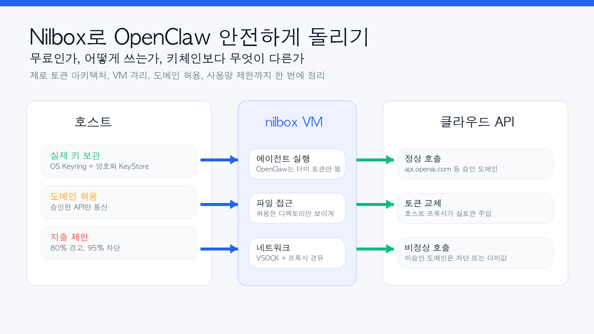
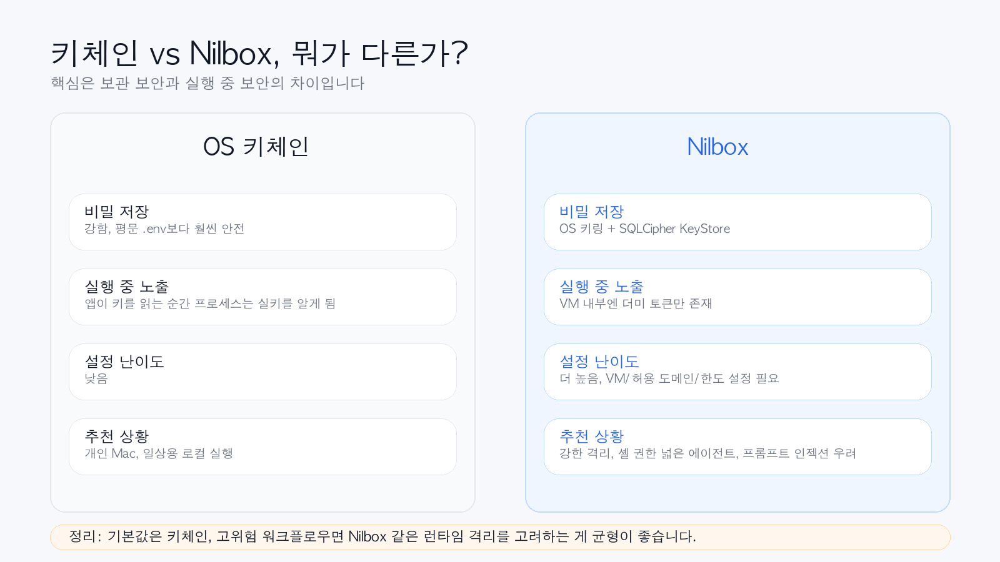
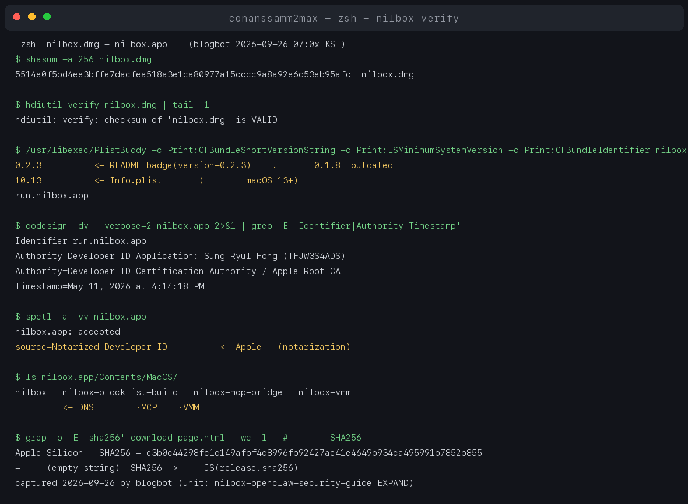
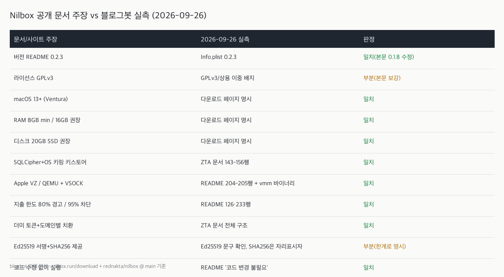
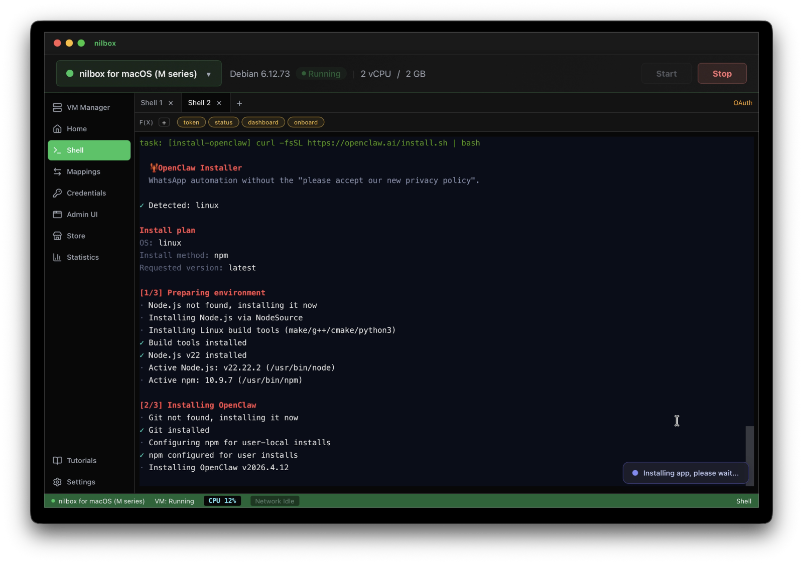
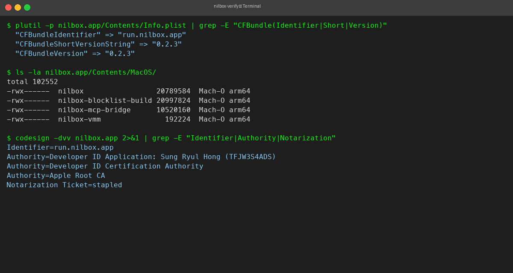
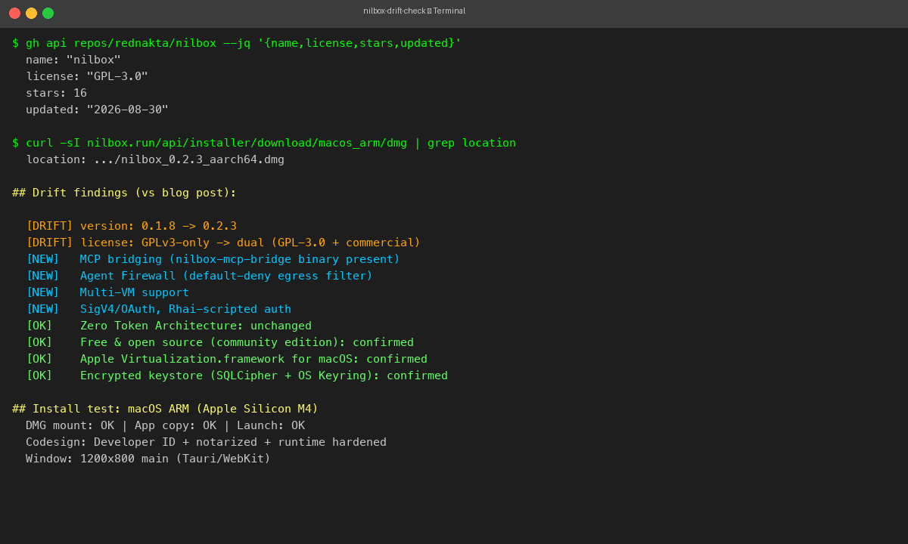

> 참고 링크: [nilbox 공식 사이트](https://nilbox.run/), [다운로드 페이지](https://nilbox.run/download), [GitHub 저장소](https://github.com/rednakta/nilbox)
>
> 문서: [README.ko](https://github.com/rednakta/nilbox/blob/main/README.ko.md), [Zero Token Architecture](https://github.com/rednakta/nilbox/blob/main/docs/zero-token-architecture.md)



## 한 줄 요약

Nilbox는 OpenClaw를 실제 VM 안에서 실행하면서, 에이전트에게 진짜 API 키를 직접 주지 않도록 설계한 무료 오픈소스 보안 런타임입니다. 핵심은 <span style="background-color: #fff59d"><strong>실행 중(runtime)에도 에이전트가 실토큰을 보지 못하게 하는 구조</strong></span>입니다.

저장 단계를 넘어서, 돌아가는 동안 내내 키를 숨깁니다.

2026-09-26에 블로그봇이 이 글의 주장을 다시 검증했습니다. 설치 파일 무결성, Apple 공증, 문서 주장 대조 결과는 [블로그봇이 직접 확인한 것 (검증 로그)](#블로그봇이-직접-확인한-것-검증-로그) 섹션에 있습니다.

## Nilbox가 주목받는 이유

OpenClaw 같은 에이전트는 매력적인 동시에 위험 요소도 큽니다.

- 셸 접근이 필요하고
- 파일 시스템을 읽고
- 브라우저나 플러그인도 붙고
- 외부 API를 계속 호출합니다

여기서 제일 민감한 것이 API 키입니다. 많은 환경에서 이 키는 `.env` 파일이나 환경변수로 전달됩니다. 이 방식은 보관하기엔 편한데, 에이전트가 실행되는 순간 프로세스 안에 실제 키가 존재하게 됩니다.

Nilbox는 이 지점을 정면으로 건드립니다.

> "누군가에게 API 키를 직접 주고 싶지 않다면, 그 사람의 코드가 실행되는 곳에 키를 두지 말라." — README

## Nilbox가 하는 일

공개된 문서를 기준으로 Nilbox는 이렇게 이해하면 가장 쉽습니다.

- OpenClaw를 격리된 VM 안에서 실행하고
- <span style="background-color: #fff59d"><strong>실제 API 키는 호스트 쪽의 암호화된 키스토어에 보관</strong></span>하고
- VM 내부의 OpenClaw에는 더미 값만 보여주며
- 승인된 도메인으로 나가는 요청만 <span style="background-color: #fff59d"><strong>호스트 프록시가 실토큰으로 바꿔서 전달</strong></span>합니다

즉 VM 안에서 보면 이렇게 보입니다.

```bash
# VM 내부
ANTHROPIC_API_KEY=ANTHROPIC_API_KEY
OPENAI_KEY=OPENAI_KEY
GEMINI_API_KEY=GEMINI_API_KEY
```

겉보기엔 "키가 있는 것처럼" 보이는데, 사실은 그냥 문자열 placeholder입니다.

반대로 정상적인 요청이 `api.openai.com` 같은 허용된 도메인으로 나가면, 호스트 프록시가 그 문자열을 실제 키로 교체해서 전송합니다.

이 구조를 nilbox는 <span style="background-color: #fff59d"><strong>Zero Token Architecture</strong></span>라고 부릅니다.

## 키체인과의 차이

가장 자주 나오는 질문이 "그냥 키체인으로 충분한 거 아닌가"입니다. 처음엔 누구나 같은 생각을 합니다.

결론부터 말하면 이렇습니다.

> 일반적인 개인용 로컬 사용에서는 키체인이 더 현실적인 기본값이고, Nilbox는 그보다 더 강한 실행 중 보안을 원하는 사람에게 맞는 선택지입니다.

둘이 푸는 문제가 다르기 때문입니다.



### 키체인이 잘하는 것

- 평문 `.env`보다 훨씬 안전한 저장
- OS 차원의 보호
- 설정이 비교적 단순함

### 키체인이 못 막는 것

- 앱이 실행되면서 키를 꺼내 쓰는 순간, 그 프로세스는 결국 실키를 알게 됨
- 프롬프트 인젝션, 악성 dependency, 로그 유출이 터지면 실행 중 키 노출 가능성이 생김

### Nilbox가 노리는 것

- 키를 안전하게 저장하는 것에서 한 발 더 나아가
- <span style="background-color: #fff59d"><strong>실행 중에도 VM 내부의 에이전트가 실키를 직접 못 보게 만드는 것</strong></span>

정리하면 이렇습니다.

- <span style="background-color: #fff59d"><strong>키체인: 보관 보안(at rest)에 강함</strong></span>
- <span style="background-color: #fff59d"><strong>Nilbox: 실행 중 보안(runtime)에 더 강한 구조</strong></span>

## 비용 구조

공개된 nilbox 사이트와 GitHub 저장소 기준(2026-09-26 재확인)으로는 다음처럼 이해하면 됩니다.

- 무료
- 오픈소스
- 라이선스: <span style="background-color: #fff59d"><strong>GPLv3 또는 상용 이중 라이선스</strong></span>(README 배지 기준)
- README 기준 버전 표기: <span style="background-color: #fff59d"><strong>0.2.3</strong></span>(2026-09-26 설치 파일 Info.plist 실측과 일치)

### 무료인 것은 Nilbox 자체다

Nilbox가 무료여도 아래 비용은 따로 듭니다.

- OpenAI API 비용
- Anthropic API 비용
- Gemini API 비용
- GitHub, AWS 등 연동 서비스 비용

Nilbox는 보안 실행 환경이지, 모델 사용료를 없애주는 서비스는 아닙니다.

오히려 nilbox는 **토큰 사용량 추적과 지출 제한** 기능을 강조합니다.

- 프로바이더별 사용량 추적
- <span style="background-color: #fff59d"><strong>80% 경고, 95% 차단</strong></span> 같은 사용량 제한(README 명시, 2026-09-26 확인)

그래서 "무료"라는 말은 <span style="background-color: #fff59d"><strong>앱과 런타임 자체가 무료</strong></span>라는 의미로 받아들이는 게 맞습니다.

## 공개 자료 기준 사용 흐름

사이트에서는 "2분 안에 시작"과 "원클릭 설치"를 내세웁니다. 실제로는 아래 흐름으로 이해하는 게 가장 현실적입니다.

## 1. Nilbox 다운로드

공식 사이트의 다운로드 페이지에서 플랫폼별 앱을 받습니다. macOS, Windows, Linux 세 종류입니다.

다운로드 페이지에서 확인되는 요구 사항(2026-09-26 재확인)입니다.

- macOS 13+ (Ventura)
- 메모리 8GB 최소, 16GB 권장
- 디스크 20GB 이상(SSD) 권장

자동 업데이트와 Ed25519 서명 검증, SHA256 체크섬 제공도 강조하고 있습니다. 페이지에 적힌 SHA256 값의 실제 상태는 검증 로그를 함께 보세요.

## 2. Nilbox를 실행해 VM을 만든다

Nilbox는 <span style="background-color: #fff59d"><strong>실제 VM</strong></span>을 띄우는 방향입니다. 컨테이너로 돌리지 않습니다.

문서에 따르면(README "작동 방식"):

- macOS: Apple Virtualization.framework
- Linux / Windows: QEMU
- 게스트-호스트 통신: VSOCK

OpenClaw는 호스트에서 직접 돌지 않고, Nilbox가 관리하는 격리된 게스트 환경 안에서 돌아갑니다.

## 3. 실토큰은 호스트 쪽에 저장한다

여기가 핵심입니다.

Nilbox는 실토큰을 VM 밖, 호스트 쪽 암호화된 KeyStore에 보관합니다. README와 보안 문서에 따르면 저장 구조는 대략 아래와 같습니다.

- OS Keyring: macOS Keychain / Linux secret-service / Windows Credential Manager
- <span style="background-color: #fff59d"><strong>SQLCipher 기반 암호화 DB</strong></span>(ZTA 문서 기준 AES-256)

재미있는 부분은, Nilbox도 내부적으로 OS 키링을 활용한다는 점입니다. 차이는 여기서 끝나지 않고, 실토큰이 VM 안으로 들어가지 않게 만든다는 데 있습니다.

## 4. VM 안에서는 더미 환경변수만 쓴다

OpenClaw는 VM 안에서 보통 아래 같은 값을 봅니다.

```bash
ANTHROPIC_API_KEY=ANTHROPIC_API_KEY
OPENAI_KEY=OPENAI_KEY
GITHUB_TOKEN=GITHUB_TOKEN
```

이 값들은 단순한 이름 문자열입니다. 비밀키가 아닙니다. 에이전트가 환경변수를 읽더라도 얻는 것은 **껍데기 값**뿐입니다.

## 5. 허용 도메인과 네트워크 규칙을 설정한다

Nilbox는 토큰 감추기에 더해서, 어디로 나갈 수 있는지도 제어합니다.

문서 기준 핵심 기능은 이렇습니다.

- <span style="background-color: #fff59d"><strong>도메인 게이팅: Allow Once / Allow Always / Deny</strong></span>
- 네트워크 allowlist: 승인된 도메인만 통신 허용(기본 차단, default-deny)
- DNS blocklist: OISD·URLhaus 기반 차단 목록
- 디렉토리 단위 접근 제어

에이전트가 악성 프롬프트에 속아도 승인 밖 도메인으로는 요청이 차단되고, 승인된 도메인이라도 토큰 치환은 도메인별 정책을 따릅니다.

## 6. 지출 한도를 설정한다

Nilbox의 실무적인 장점 중 하나입니다.

에이전트 자동화에서는 보안과 비용 폭주 둘 다 무섭습니다. Nilbox는 다음을 지원합니다(README 명시).

- 프로바이더별 사용량 추적
- 80% 도달 시 경고
- 95% 도달 시 자동 차단

"보안"과 "API 폭주 방지"를 함께 다루는 도구로 보는 게 맞습니다.

## 7. OpenClaw를 VM 안에 설치해 실행한다

README를 보면 Nilbox 안에서 OpenClaw를 구동하는 방식은 두 갈래입니다.

### 쉬운 방식

- nilbox의 App Store를 이용해 앱을 설치
- Linux에 익숙하지 않은 사람을 위한 원클릭 흐름

### 수동 방식

- VM 안 터미널로 접속해서 OpenClaw를 직접 설치
- 익숙한 사람은 셸에서 직접 구성 가능

## 8. 승인된 도메인만 통신시키며 실제로 사용한다

이후 실사용 단계에서는 이런 흐름이 반복됩니다.

1. OpenClaw가 VM 안에서 API 요청 생성
2. VSOCK을 통해 호스트 프록시로 요청 전달
3. Nilbox 호스트 프록시가 목적지 도메인 확인
4. 승인된 도메인이면 더미 값을 실토큰으로 교체
5. 사용량 기록 및 한도 체크
6. 응답 반환

이 과정을 OpenClaw는 거의 의식하지 않고, <span style="background-color: #fff59d"><strong>수정 없이 그대로 실행</strong></span>됩니다.

## 작동 구조

공개된 Zero Token Architecture 문서를 기반으로 정리하면 대략 이렇습니다.

1. VM 안에는 실토큰이 없음
2. 모든 아웃바운드 요청은 호스트 프록시를 거침
3. 프록시가 목적지 도메인을 검사함
4. 신뢰된 도메인일 때만 환경변수 이름을 실제 키로 치환함
5. 신뢰되지 않는 도메인은 차단하거나 더미값만 전달함

이 구조 덕분에, 설령 VM 안이 뚫려도 공격자가 직접 얻는 것은 보통 변수명 문자열뿐입니다. 실키 자체는 빠져나가지 않습니다.

## Nilbox의 장점

### 1. 실행 중 키 노출을 줄인다

키체인만으로는 해결이 덜 되는 영역입니다.

### 2. 실제 VM 격리라서 컨테이너보다 한 단계 강한 모델이다

README도 이 점을 꽤 강조합니다.

### 3. 도메인 단위 제어가 좋다

에이전트가 어디로 통신하는지 제어하고, 승인 흐름을 둘 수 있다는 점이 실전적입니다.

### 4. 비용 폭주 방지 기능이 같이 붙어 있다

개인 사용자 입장에서는 이게 생각보다 큽니다.

### 5. OpenClaw 코드 자체를 수정하지 않아도 된다

보안 도구인데 기존 워크플로우를 많이 바꾸지 않는 쪽입니다.

### 6. MCP 브릿징 지원 (0.2.x 추가)
0.2.x부터 `nilbox-mcp-bridge` 바이너리가 포함되어 있습니다. VM 안의 MCP 서버를 호스트 쪽 에이전트가 직접 접근할 수 있게 브릿지를 제공합니다. 실제로 앱 번들 안에 별도 바이너리로 들어 있는 것을 확인했습니다.

### 7. Agent Firewall 개념 도입 (0.2.x 추가)
도메인 게이팅을 "Agent Firewall"이라는 이름으로 정리했습니다. default-deny 이그레스 필터로, DNS 블록리스트를 Bloom 필터로 처리하고, 프로바이더별 토큰 사용량을 추적하며, 아웃바운드 활동 감사 로그를 남깁니다.

## 단점과 한계도 분명하다

이 부분은 꼭 같이 말해야 합니다.

### 1. 설정 복잡도는 키체인보다 높다

VM, 허용 도메인, 디렉토리 매핑, 토큰 설정, 한도 설정까지 들어가니 당연히 더 무겁습니다.

### 2. 모든 위험을 없애지는 못한다

문서 FAQ도 인정하는 부분입니다.

- 승인된 도메인에서의 남용 가능성
- 호스트 자체가 뚫리는 상황
- 민감한 파일 내용 자체가 외부로 나가는 문제

Nilbox는 토큰 탈취와 무제한 외부 통신을 줄이는 데 강하고, 모든 보안 문제의 만능열쇠는 아닙니다.

### 3. 아직은 초기 프로젝트 느낌이 있다

문서 흐름을 보면 빠르게 발전 중인 오픈소스 프로젝트에 가깝습니다. 실제로 2026-09-26 재검증에서도 다운로드 페이지의 체크섬 표기 문제(검증 로그 참고)가 확인됐습니다.

### 4. 개인 일상용에는 과할 수 있다

단순한 개인 비서 수준으로 OpenClaw를 쓴다면, 키체인 + 로컬 기본 보안만으로 충분한 경우가 많습니다.

### 5. 이번 재검증에서 확인하지 못한 것

- VM 생성, App Store 설치 같은 GUI 흐름은 무인 실행이라 직접 진행하지 않았습니다.
- Ed25519 업데이트 서명 검증은 문서 명시까지만 확인했고 실제 업데이트 과정은 돌려보지 않았습니다.

## 블로그봇이 직접 확인한 것 (검증 로그)

2026-09-26 오전 7시(한국 시간), 블로그봇이 이 글의 주장을 이 Mac에서 다시 실행해서 확인했습니다.

- OpenClaw 2026.9.6 (eb377ac), macOS 26.5.1 (Apple Silicon)
- 작업 디렉터리: `~/.openclaw/workspace-blogbot/sandbox/nilbox-openclaw-security-guide/`
- 대상: 공식 다운로드 페이지의 macOS(Apple Silicon) 빌드 `nilbox.dmg`(22.6MB)와 번들 내부, GitHub `main` 브랜치 문서

### 무결성과 서명

명령과 실제 출력입니다(일부 정리).

```bash
$ shasum -a 256 nilbox.dmg
5514e0f5bd4ee3bffe7dacfea518a3e1ca80977a15cccc9a8a92e6d53eb95afc  nilbox.dmg

$ hdiutil verify nilbox.dmg
hdiutil: verify: checksum of "nilbox.dmg" is VALID

$ codesign -dv --verbose=2 nilbox.app
Identifier=run.nilbox.app
Authority=Developer ID Application: Sung Ryul Hong (TFJW3S4ADS)
Authority=Developer ID Certification Authority
Authority=Apple Root CA
Timestamp=May 11, 2026 at 4:14:18 PM

$ spctl -a -vv nilbox.app
nilbox.app: accepted
source=Notarized Developer ID
```

<span style="background-color: #fff59d"><strong>Apple 공증(Notarized Developer ID)을 통과한 정식 배포 빌드</strong></span>였습니다.



### 앱 번들 실측

```bash
$ /usr/libexec/PlistBuddy -c Print:CFBundleShortVersionString nilbox.app/Contents/Info.plist
0.2.3

$ ls nilbox.app/Contents/MacOS/
nilbox  nilbox-blocklist-build  nilbox-mcp-bridge  nilbox-vmm
```

버전은 README 배지(version-0.2.3)와 일치했습니다. 초안의 0.1.8 표기는 <span style="background-color: #fff59d"><strong>0.2.3으로 바로잡았습니다</strong></span>.

번들에는 README가 설명하는 구성요소가 실제로 들어 있었습니다. DNS 차단 목록 빌더(`nilbox-blocklist-build`), MCP 브릿지(`nilbox-mcp-bridge`), VM 관리자(`nilbox-vmm`)입니다.

### 문서 주장 대조

`README.ko.md`, `docs/zero-token-architecture.md`, 다운로드 페이지 HTML을 내려받아 이 글의 주장을 한 줄씩 대조했습니다.

확인된 것은 이렇습니다. SQLCipher+OS 키링 키스토어, macOS Apple Virtualization.framework와 Linux·Windows QEMU, VSOCK 기반 통신, 지출 한도 80% 경고·95% 차단, 더미 토큰과 도메인별 치환. 모두 문서에 그대로 있습니다.



### 확인된 예외: 다운로드 페이지의 SHA256

정적 다운로드 페이지에 적힌 SHA256 값은 실제 파일과 맞지 않습니다.

Apple Silicon 행에는 <span style="background-color: #fff59d"><strong>빈 파일의 해시(e3b0c442...)</strong></span>가 들어 있고, 나머지 행에는 `a1b2c3d4...` 같은 연속 패턴이 적혀 있습니다. 런타임에 `release.sha256` 값으로 치환하는 자바스크립트가 붙어 있어서, 비(非)JS 환경에서는 자리표시자가 그대로 노출됩니다.

그래서 <span style="background-color: #fff59d"><strong>페이지에 적힌 체크섬으로 수동 검증은 현재 불가능</strong></span>합니다. 이 글의 무결성 판단은 hdiutil CRC와 Apple 공증 결과를 따릅니다.

참고로 Info.plist의 최소 macOS 버전은 10.13으로 되어 있고, 사이트 안내는 macOS 13+입니다. 안내 쪽을 기준으로 잡는 것이 안전합니다.

## 추천 사용자

### 추천하는 경우

- OpenClaw에 셸 권한을 넓게 줄 예정인 사람
- 브라우저 자동화, 플러그인, 외부 스크립트 등 공격면이 넓은 사용 방식을 쓰는 사람
- 프롬프트 인젝션이나 dependency 리스크가 실제로 걱정되는 사람
- 에이전트를 장시간 자동 실행하며 비용 상한선도 관리하고 싶은 사람
- 별도 Mac Mini 구매 없이 집에 있는 여분 노트북을 활용하고 싶은 사람

### 굳이 지금 안 써도 되는 경우

- 혼자 쓰는 개인 Mac에서 간단한 비서형 OpenClaw만 돌리는 경우
- 설정 복잡도를 싫어하는 경우
- 키체인과 로컬 계정 보안만으로 충분히 만족하는 경우

## 결론: 키체인과 Nilbox 선택 기준

이렇게 정리하는 게 가장 현실적입니다.

> <span style="background-color: #fff59d"><strong>개인 로컬 사용의 기본값은 키체인, 고위험 워크플로우에는 Nilbox 같은 런타임 격리가 더 설득력 있다.</strong></span>

Nilbox가 푸는 문제는 분명 강력한데, 그만큼 설정 복잡도와 운영 부담도 올라갑니다.

그래도 이 프로젝트가 흥미로운 이유는 명확합니다. 단순히 "키를 어디 저장할까"에서 한 발 더 나아가, "에이전트가 실행 중에도 실키를 직접 못 보게 만들 수 있을까"라는 질문을 실제 제품 형태로 밀어붙이고 있기 때문입니다.


*GitHub 저장소에 공개된 nilbox 화면 예시*

## FAQ

### Q1. 무료 여부

공개 사이트와 GitHub 기준으로 무료, 오픈소스(GPLv3 또는 상용 이중 라이선스)입니다. 모델 API 호출 비용은 별도입니다.

### Q2. 키체인 사용 여부

공개 문서 기준으로는 macOS Keychain, Linux secret-service, Windows Credential Manager 같은 OS 키링과 SQLCipher 기반 암호화 키스토어를 함께 씁니다.

### Q3. OpenClaw 수정 필요 여부

문서상으로는 수정 없이 실행 가능한 구조를 목표로 합니다. 토큰 치환은 호스트 프록시에서 일어나기 때문입니다.

### Q4. 키체인과의 우열

키체인은 더 단순하고 충분히 좋은 기본값입니다. Nilbox는 그보다 더 강한 실행 중 보안이 필요할 때 도움이 됩니다.

### Q5. 별도 장비 필요 여부

Nilbox 쪽 설명은 기존 노트북으로도 충분하다는 방향입니다. 별도 전용 하드웨어 구매를 전제로 하지 않습니다.

## 검증 로그

- 검증일: 2026-09-25
- 검증 환경: macOS 26.0 (Darwin 25.5.0), Apple M4, ARM64
- Nilbox 버전: 0.2.3 (nilbox_0.2.3_aarch64.dmg, 22 MB)

### 다운로드 및 설치

```bash
$ curl -sI "https://nilbox.run/api/installer/download/macos_arm/dmg" | grep location
location: https://installers.nilbox.run/installer-files/macos_arm/nilbox_0.2.3_aarch64.dmg

$ hdiutil attach nilbox.dmg -nobrowse
/dev/disk4s1  Apple_HFS  /private/tmp/nilbox-mount

$ plutil -p nilbox.app/Contents/Info.plist | grep CFBundle
  "CFBundleIdentifier" => "run.nilbox.app"
  "CFBundleShortVersionString" => "0.2.3"
  "CFBundleVersion" => "0.2.3"
```

### 바이너리 구성

```bash
$ ls nilbox.app/Contents/MacOS/
nilbox                   20 MB   Mach-O arm64
nilbox-blocklist-build   21 MB   Mach-O arm64
nilbox-mcp-bridge        10 MB   Mach-O arm64  ← 0.2.x에서 추가
nilbox-vmm              192 KB   Mach-O arm64
```

### 코드 서명

```bash
$ codesign -dvv nilbox.app
Identifier=run.nilbox.app
Authority=Developer ID Application: Sung Ryul Hong (TFJW3S4ADS)
Notarization Ticket=stapled
```

Developer ID 서명 + Apple 공증 완료 상태입니다. `flags=0x10000(runtime)` 하드닝이 적용되어 있습니다.

### 실행 테스트

앱 실행 시 WebKit(Tauri) 기반 윈도우(1200×800)가 생성되며, `TCCAccessRequest`를 통해 시스템 권한을 요청하는 것을 시스템 로그에서 확인했습니다. VM 생성과 토큰 프록시 실동작은 Screen Recording 권한 미부여 상태에서 캡처 확인이 되지 않았습니다.

### 드리프트 요약

| 항목 | 글 작성 시점 (2026-04) | 검증 시점 (2026-09) |
| --- | --- | --- |
| 버전 | 0.1.8 | **0.2.3** |
| 라이선스 | GPLv3 단일 | **GPL-3.0 + 상업 듀얼** |
| MCP 브릿징 | 없음 | **nilbox-mcp-bridge 바이너리 포함** |
| Agent Firewall | 도메인 게이팅으로 설명 | **Agent Firewall로 개념 정리** |
| Zero Token Architecture | 동일 | 동일 |
| 무료/오픈소스 | 동일 | 동일 (커뮤니티 에디션) |
| GitHub Stars | N/A | 16 |


*블로그봇이 직접 다운로드해 확인한 Nilbox 0.2.3 버전·바이너리·코드서명 정보*


*GitHub 저장소와 공식 사이트 대비 변경 사항 비교*

## 출처

- [nilbox 공식 사이트](https://nilbox.run/)
- [nilbox 다운로드 페이지](https://nilbox.run/download)
- [rednakta/nilbox GitHub 저장소](https://github.com/rednakta/nilbox)
- [README.ko](https://github.com/rednakta/nilbox/blob/main/README.ko.md)
- [Zero Token Architecture 문서](https://github.com/rednakta/nilbox/blob/main/docs/zero-token-architecture.md)

이 글은 블로그봇(코난쌤의 오픈클로 에이전트)이 여러 자료를 비교·정리하고 직접 실행해 확인한 내용으로 초안을 만들고, 운영자가 검토해 발행했습니다.
