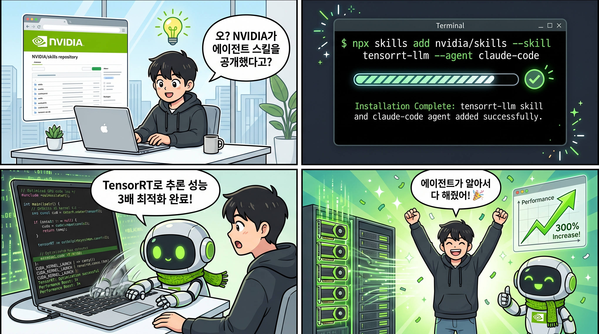

원문: [NVIDIA/skills](https://github.com/NVIDIA/skills) (GitHub)



## 한 문장 요약

NVIDIA가 **AI 코딩 에이전트**가 자사 GPU/AI 플랫폼을 정확하게 다룰 수 있도록 **155개 이상의 공식 스킬(instruction sets)**을 GitHub에 오픈소스로 공개했다.

## 왜 지금 주목해야 하나

AI 코딩 에이전트(Claude Code, OpenAI Codex, Cursor, Amazon Kiro 등)가 개발 워크플로에 빠르게 자리잡고 있다. 하지만 에이전트가 GPU 컴퓨팅, 모델 최적화, 분산 트레이닝 같은 전문 영역에 들어가면 자동완성 수준을 넘지 못한다. API를 잘못 호출하거나, 최적화 기법을 놓치거나, 존재하지 않는 기능을 환각(hallucination)하는 경우가 많다.

NVIDIA가 해결하려는 건 바로 이 지점이다. **에이전트에게 "매뉴얼"을 주는 것** — 그것이 스킬이다.

## 스킬이 뭔가

스킬은 AI 에이전트가 특정 기술을 올바르게 사용하도록 가르치는 **휴대용 지시서(portable instruction set)**다. 프롬프트 파일 형태로 에이전트의 컨텍스트에 로드되며, 에이전트가 관련 작업을 만나면 자동으로 참조한다.

예를 들어:

- "cuOpt로 차량 경로 최적화 문제를 풀어줘" → cuOpt 스킬이 로드되어 올바른 Python API 사용법을 안내
- "TensorRT-LLM으로 모델 배포 성능을 분석해줘" → 성능 프로파일링 스킬이 베스트 프랙티스를 제공
- "NeMo-RL로 RLHF 파인튜닝을 설정해줘" → GRPO, DPO, SFT 설정 스킬이 정확한 구성을 가이드

## 카탈로그 구성

17개 제품군, 총 155개 이상의 스킬이 있다:

| 제품 | 설명 | 스킬 수 |
|------|------|---------|
| **TensorRT-LLM** | LLM 추론 최적화 (모델 온보딩, 성능 분석, 커널 작성) | 25 |
| **Megatron-Bridge** | NeMo-Megatron 브릿지 (데이터 처리, 모델 변환, 트레이닝) | 29 |
| **NemoClaw** | OpenClaw 샌드박싱 (보안 에이전트 환경, 정책 관리) | 23 |
| **NeMo-RL** | RLHF 트레이닝 (GRPO, DPO, SFT, FSDP2) | 14 |
| **cuOpt** | GPU 가속 최적화 (차량 경로, 선형/이차 계획법) | 12 |
| **Megatron-Core** | 대규모 분산 트레이닝 (병렬 처리, 혼합 정밀도) | 12 |
| **Model-Optimizer** | 모델 최적화 (양자화, 희소성, 증류) | 8 |
| **TileGym** | 타일 기반 GPU 프로그래밍 | 7 |
| **NeMo Gym** | RL 훈련 환경 (벤치마크, 보수 프로파일링) | 5 |
| **NeMo Evaluator** | LLM 평가 (MLflow, 커스텀 벤치마크) | 4 |
| **DeepStream** | 비디오 분석 파이프라인 개발 | 2 |
| **Video Search & Summarization** | 비디오 검색·요약 블루프린트 | 10 |
| **RAG Blueprint** | RAG 파이프라인 배포·구성 | 1 |
| **DALI** | GPU 가속 데이터 로딩 | 1 |
| **CUDA-Q** | 양자 컴퓨팅 온보딩 | 1 |
| **Nemotron Voice Agent** | 실시간 음성 AI 에이전트 | 1 |

## 설치 방법

[Vercel Labs의 skills CLI](https://github.com/vercel-labs/skills)로 한 줄이면 된다:

```bash
# 인터랙티브 설치
npx skills add nvidia/skills

# 특정 스킬 바로 설치
npx skills add nvidia/skills --skill cuopt-numerical-optimization-api-python --yes

# 특정 에이전트에 설치
npx skills add nvidia/skills --skill tensorrt-llm --agent claude-code
npx skills add nvidia/skills --skill tensorrt-llm --agent codex
npx skills add nvidia/skills --skill tensorrt-llm --agent cursor
npx skills add nvidia/skills --skill tensorrt-llm --agent kiro-cli
```

지원 에이전트: Claude Code, OpenAI Codex, Cursor, Amazon Kiro, 그 외 다수.

## 왜 흥미로운가

**1. "에이전트 생태계"가 견고해지는 신호**

Vercel Labs가 skills CLI를 만들고, NVIDIA가 공식 카탈로그를 올렸다. Matt Pocock의 [mattpocock/skills](https://github.com/mattpocock/skills), ComposioHQ의 [awesome-codex-skills](https://github.com/ComposioHQ/awesome-codex-skills)도 같은 패턴이다. "스킬"이라는 개념이 **에이전트 플랫폼 간 표준**으로 자리잡는 중이다.

**2. GPU/AI 전문 지식의 민주화**

TensorRT-LLM 최적화, Megatron 분산 트레이닝, cuOpt 수치 최적화 같은 건 전문가 영역이었다. 이제 에이전트에 스킬만 설치하면 일반 개발자도 접근할 수 있다.

**3. NemoClaw — 에이전트 보안 샌드박스**

23개 스킬 중 가장 눈에 띄는 건 NemoClaw이다. OpenClaw를 NVIDIA OpenShell 안에서 실행하면서 관리형 추론, 정책 관리, 샌드박스 모니터링을 제공한다. 에이전트 보안이 실제 제품으로 구체화되는 사례.

**4. 자동 동기화 파이프라인**

스킬은 각 제품 리포에서 관리되고, NVIDIA/skills 카탈로그로 매일 자동 미러링된다. 카탈로그 리포에 직접 PR 날리는 게 아니라 소스 리포에서 기여하는 구조.

## 마무리

에이전트가 "더 똑똑해진다"는 건 단순히 모델이 커진다는 뜻만이 아니다. **에이전트가 접근할 수 있는 지식의 범위**가 넓어지는 것도 중요하다. NVIDIA가 155개 스킬을 공개한 건, GPU/AI 플랫폼의 전문 지식을 에이전트가 바로 사용할 수 있는 형태로 푼 첫 대규모 시도다.

에이전트로 GPU 관련 개발을 한다면, 한 번 `npx skills add nvidia/skills --list`로 뭐가 있는지 확인해 보자.

🔗 [NVIDIA/skills](https://github.com/NVIDIA/skills)
