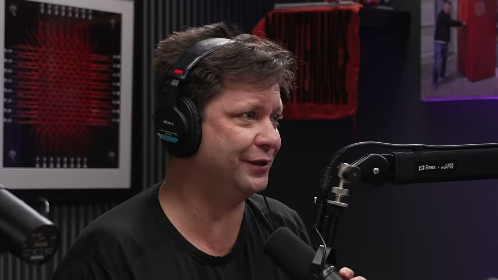
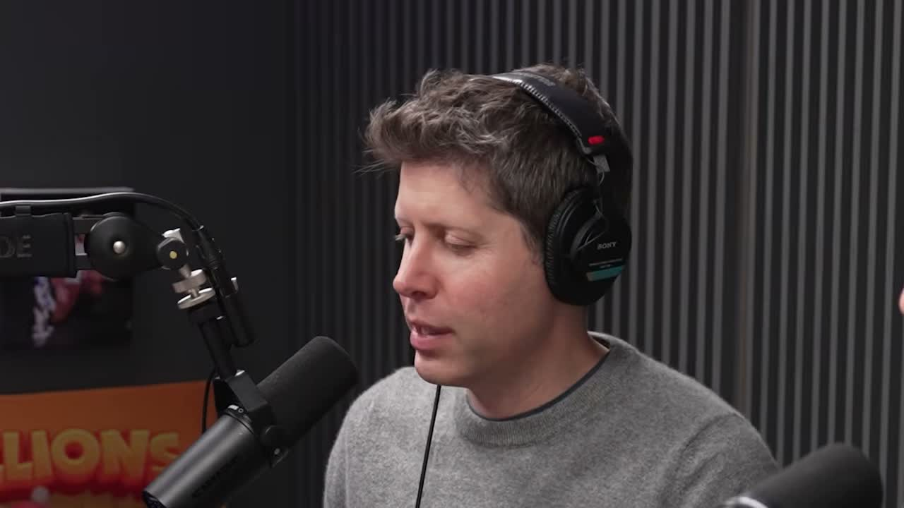
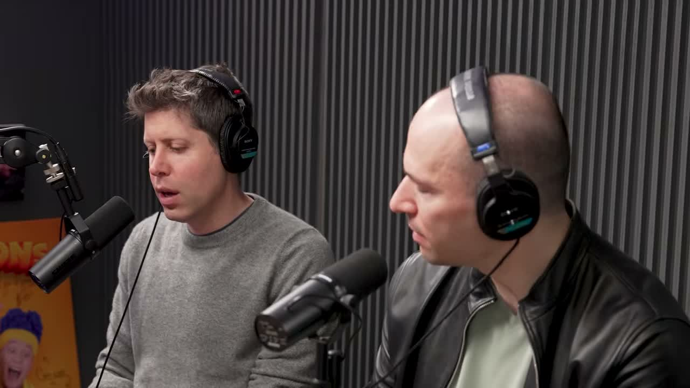
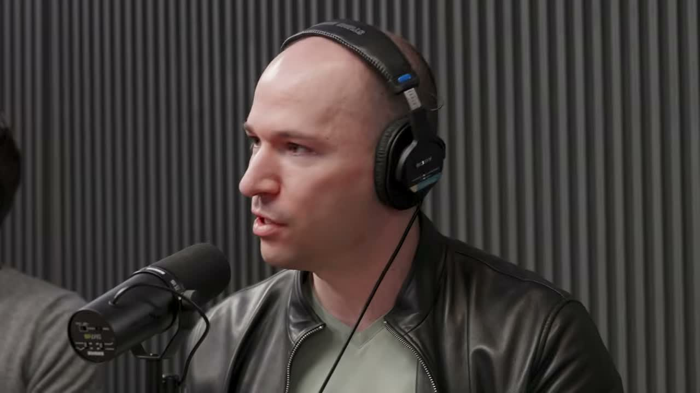

2015년 7월, 저녁 식사를 마친 두 사람이 차를 타고 샌프란시스코로 돌아가고 있었습니다.

샘 알트먼과 그렉 브록먼.

둘은 서로를 바라보며 이렇게 말했다고 합니다.

> “우리가 해야 한다.”  
> — Greg Brockman, 00:02:21

그때의 “해야 한다”는 말이 지금의 OpenAI가 됐습니다. 그리고 10년이 지난 뒤, 두 사람은 Core Memory Podcast에 처음으로 함께 출연했습니다. 영상 길이는 1시간 22분. 겉으로는 OpenAI의 과거와 일론 머스크와의 갈등을 다루는 인터뷰처럼 보이지만, 실제로는 앞으로 AI가 어디로 갈지 꽤 선명하게 보여주는 대화였습니다.

특히 코난쌤 독자 입장에서 중요한 키워드는 세 가지입니다.

- 에이전트
- 퍼스널 AGI
- 컴퓨트 접근성

OpenAI가 지금 어디에 집중하고 있는지, 그리고 교사·학부모·직장인이 무엇을 준비해야 하는지 하나씩 보겠습니다.

*2015년의 결심을 돌아보는 초반 장면. 이 인터뷰는 단순한 회고가 아니라 OpenAI의 다음 전략을 설명하는 자리였습니다.*

## AI 시대, 아이들은 무엇을 배워야 할까요?

샘 알트먼은 부모들이 AI에 대해 묻는 질문을 이렇게 다시 해석합니다.

> “부모들이 묻는 건 ‘내 아이가 무엇을 공부해야 하나’가 아닙니다. 진짜 질문은 ‘내 아이가 이 새 세상에서 어떻게 의미 있는 삶을 살 수 있을까’입니다.”  
> — Sam Altman, 00:12:00 부근

이 말이 중요한 이유가 있습니다.

AI 교육을 이야기할 때 우리는 자주 “무슨 도구를 배워야 하나요?”, “프롬프트를 어떻게 써야 하나요?”, “코딩을 계속 배워야 하나요?” 같은 질문으로 갑니다. 물론 필요한 질문입니다. 하지만 샘이 짚은 지점은 조금 더 깊습니다.

AI가 일을 대신하는 시대에 아이들이 배워야 할 것은 단순한 도구 사용법만이 아닙니다. 자신이 원하는 것을 설명하고, 판단하고, 방향을 정하고, AI가 만든 결과를 검토하는 힘입니다.

그렉 브록먼은 인터뷰에서 앞으로의 세대가 에이전트를 지금 어른들보다 훨씬 잘 쓰게 될 것이라고 말합니다.

> “지금 자라는 세대는 에이전트를 나보다 10배는 더 잘 쓰게 될 겁니다.”  
> — Greg Brockman, 00:43:21 부근

여기서 교육의 방향이 보입니다.

아이들에게 AI를 “조심해야 할 도구”로만 가르치면 부족합니다. 실제로 써보고, 실패해보고, 비교해보고, 다시 질문하게 해야 합니다. 샘은 ChatGPT가 세상을 바꾼 이유도 기술 자체가 가장 뛰어나서가 아니었다고 말합니다.

> “ChatGPT는 우리가 한 것 중 가장 인상적인 기술이 전혀 아니었습니다. 그런데 사람들이 직접 써볼 수 있었을 때, 세상이 동시에 ‘아, 이게 진짜구나’라고 업데이트됐습니다.”  
> — Sam Altman, 00:21:55 부근

설명이 아니라 경험이 인식을 바꾼다는 이야기입니다.

교실에서도 마찬가지입니다. AI 윤리, AI 원리, AI 역사도 중요하지만, 학생이 직접 “내가 해냈다”는 경험을 해야 합니다. AI가 대신해준 것이 아니라, AI와 함께 내가 만들었다는 감각이 필요합니다.

## 에이전트 시대에는 업무가 어떻게 바뀔까요?

이 인터뷰에서 가장 실무적인 부분은 그렉 브록먼이 말한 OpenAI의 전략 재편입니다.

그는 OpenAI가 지금 “에이전트 전환의 순간”에 있다고 말합니다. 그리고 Codex를 소프트웨어 엔지니어만을 위한 도구가 아니라, 모든 사람을 위한 도구로 확장하려 한다고 설명합니다.

> “Codex가 오늘날에는 소프트웨어 엔지니어를 위한 것처럼 보이지만, 우리는 이것을 모두를 위한 것으로 만들고 있습니다.”  
> — Greg Brockman, 00:53:45 부근

이 말은 꽤 큽니다.

지금까지 업무자동화는 대체로 이런 식이었습니다.

1. 사람이 문제를 정리한다.
2. 자동화할 수 있는 부분을 찾는다.
3. 스크립트나 노코드 도구를 만든다.
4. 사람이 계속 확인하고 고친다.

그런데 에이전트가 들어오면 구조가 바뀝니다.

사람은 “무엇을 해야 하는지”와 “어떤 기준으로 성공인지”를 말합니다. 에이전트는 그 목표를 쪼개고, 필요한 파일을 읽고, 코드를 만들고, 테스트하고, 중간에 막히면 다른 방법을 찾습니다.

이제 중요한 능력은 코드를 한 줄 한 줄 외우는 것이 아니라, 일을 설계하는 능력입니다.

- 목표를 분명히 말하는 능력
- 좋은 입력 자료를 주는 능력
- 결과물을 검수하는 능력
- 실패했을 때 로그와 원인을 읽는 능력
- 반복 가능한 워크플로우로 만드는 능력

업무자동화의 중심이 “도구 사용법”에서 “작업 설계”로 이동하고 있습니다.

그렉이 말한 Codex의 방향은 여기와 정확히 맞닿아 있습니다. 앞으로는 코딩을 직업으로 삼지 않는 사람도, 자기 업무를 에이전트에게 맡길 수 있어야 합니다. 엑셀 반복 작업, 문서 정리, 블로그 발행, 자료 조사, 수업 자료 제작도 같은 흐름으로 들어갑니다.

## OpenAI가 말하는 ‘퍼스널 AGI’는 무엇일까요?

그렉 브록먼은 앞으로 OpenAI가 가고 싶은 방향을 “퍼스널 AGI”라고 표현합니다.

> “우리가 가고 싶은 곳을 퍼스널 AGI라고 부르기 시작했습니다. 당신을 알고, 맥락을 알고, 신뢰할 수 있는 AI입니다.”  
> — Greg Brockman, 00:27:18 부근

지금 ChatGPT를 쓸 때 가장 귀찮은 점이 있습니다.

매번 설명해야 합니다.

내가 누구인지, 어떤 글을 쓰는지, 어떤 독자를 대상으로 하는지, 이전에 어떤 결정을 했는지, 어떤 말투를 좋아하는지 계속 알려줘야 합니다. 업무자동화에서도 마찬가지입니다. 프로젝트 구조, 파일 위치, 발행 규칙, 이미지 스타일, 검수 기준을 계속 반복해서 알려줘야 합니다.

퍼스널 AGI는 이 피로를 줄이겠다는 방향입니다.

그렉은 예시로 이런 장면을 듭니다. 내가 좋아하는 가수가 도시에 온다는 것을 AI가 먼저 알고, 좋은 좌석을 찾고, 가격을 비교하고, 내가 신뢰할 수 있는 방식으로 구매까지 돕는 것입니다.

핵심은 “더 똑똑한 챗봇”이 아닙니다.

나의 맥락을 오래 기억하고, 필요한 순간에 먼저 움직이며, 신뢰할 수 있는 판단을 내리는 AI입니다.

이 흐름은 블로그 작업에도 그대로 적용됩니다. 매번 “이런 톤으로 써줘”, “이미지는 이런 스타일로”, “본문에는 메타표현 쓰지 말고”를 반복하는 것이 아니라, 작업 규칙 자체를 파일과 워크플로우로 만들어두는 것입니다.

이번에 만든 유튜브 영상 기반 작업 흐름도 같은 방향입니다. 좋은 AI 활용은 즉흥적인 프롬프트가 아니라, 반복 가능한 작업 기억을 만드는 쪽으로 갑니다.

## AI는 불평등을 키울까요, 줄일까요?

영상 중반, 진행자가 샘에게 조금 더 솔직한 답변을 요구합니다. 그러자 샘은 “덜 순화된 버전”이라며 세 가지 미래를 이야기합니다.

> “모두가 주관적으로 10배 부자가 되는 미래가 있을 수 있습니다. 그런데 AI와 컴퓨트를 잘 쓰는 사람들은 엄청난 부자가 됩니다. 어쩌면 10명의 조만장자가 나올 수도 있죠.”  
> — Sam Altman, 00:39:05 부근

이 장면은 상당히 중요합니다.

샘은 AI가 모두를 풍요롭게 만들 수 있다고 봅니다. 하지만 동시에 AI와 컴퓨트에 접근할 수 있는 사람, 에이전트를 잘 다루는 사람, 이미 자본과 기회를 가진 사람이 더 빠르게 앞서갈 수 있다는 점도 인정합니다.

*“모두가 더 나아지지만 격차도 커질 수 있다”는 불편한 질문을 정면으로 다루는 장면입니다.*

그렉의 답은 교육 쪽에서 특히 중요합니다.

> “AI는 접근할 수 있다면 모두에게 기회입니다. 컴퓨트가 없다면 아무리 에이전트를 잘 써도 할 수 있는 일이 많지 않습니다.”  
> — Greg Brockman, 00:42:52 부근

AI 교육의 격차는 단순히 “프롬프트를 아느냐 모르느냐”가 아닙니다.

실제로 써볼 수 있는 환경이 있느냐. 충분히 실험할 수 있는 계정과 기기가 있느냐. 실패해도 다시 시도할 수 있는 시간이 있느냐. 이것이 격차가 됩니다.

학교에서 AI 교육을 한다면 여기까지 봐야 합니다.

좋은 강의 한 번보다 중요한 것은, 학생들이 반복해서 써볼 수 있는 환경입니다. AI를 한 번 시연하고 끝내는 것이 아니라, 아이들이 자기 질문을 넣고, 결과를 비교하고, 다시 고치는 경험을 해야 합니다.

## ChatGPT가 실제로 사람을 도운 사례는 무엇이었나요?

그렉은 ChatGPT가 사람들의 삶에 들어간 사례로 한 가족 이야기를 꺼냅니다.

한 아이가 심한 두통을 겪고 있었고, 가족은 MRI를 요청했지만 보험에서 거절당했습니다. 가족은 ChatGPT로 증상을 조사하고, MRI가 필요한 이유를 정리해 다시 요구했습니다. 결국 MRI가 승인됐고, 뇌종양이 발견됐으며, 아이는 치료받을 수 있었습니다.

> “그 가족은 ChatGPT 없이는 이 과정을 어떻게 헤쳐나갔을지 모르겠다고 말했습니다.”  
> — Greg Brockman, 00:14:06 부근

*AI의 가치는 거창한 미래 예측보다, 지금 누군가가 문제를 해결하는 방식에서 먼저 드러납니다.*

물론 의료 판단을 AI에게 맡기라는 뜻은 아닙니다. 하지만 정보 접근성의 관점에서는 의미가 큽니다.

AI는 전문가를 대체하기보다, 일반인이 전문가와 대화할 수 있는 준비를 돕습니다. 증상을 정리하고, 질문을 만들고, 선택지를 비교하고, 필요한 근거를 찾게 해줍니다.

교육에서도 이 관점이 중요합니다.

AI는 정답 자판기가 아니라 질문 준비 도구입니다. 학생이 더 좋은 질문을 하게 만들고, 교사가 더 깊은 피드백을 할 수 있게 만드는 도구로 봐야 합니다.

## 일론 머스크와 OpenAI는 왜 갈라졌을까요?

후반부에서는 피할 수 없는 이야기가 나옵니다. 일론 머스크와의 갈등입니다.

샘은 꽤 직접적으로 말합니다. 당시 OpenAI가 영리 구조로 전환해야 한다는 큰 방향에는 샘, 그렉, 일리야, 일론 모두 동의했다고 합니다. 문제는 통제권이었습니다.

> “일론은 절대적인 통제권을 요구했습니다. 한 사람이 인류의 미래 전체를 통제해서는 안 됩니다. 누구든 마찬가지입니다. 그게 우리가 No라고 한 이유였습니다.”  
> — Sam Altman, 01:17:37 부근

*지분이나 CEO 직함보다 더 받아들일 수 없었던 것은 ‘절대 통제권’이었다는 설명입니다.*

이 대목은 드라마처럼 소비하기 쉽습니다. 하지만 AI 거버넌스 관점에서 보면 중요한 질문이 남습니다.

강력한 AI를 누가 통제해야 하는가.

국가인가, 기업인가, 창업자인가, 연구자 집단인가, 시장인가.

OpenAI의 답이 완벽하다는 뜻은 아닙니다. 다만 샘은 적어도 “한 사람에게 절대 통제권을 줄 수는 없다”는 선을 분명히 긋습니다.

AI가 더 강력해질수록 기술 논쟁은 결국 거버넌스 논쟁이 됩니다. 모델 성능만 보는 시대는 지나가고 있습니다.

## OpenAI는 왜 ‘두려움 기반 마케팅’을 경계할까요?

샘은 강력한 AI를 소수에게만 제공해야 한다는 주장에 대해서도 비판적입니다.

> “폭탄을 만들었으니 피난처를 1억 달러에 팔겠다. 그런데 특정 기업에게만 팔겠다. 이런 접근이 어떻게 인류를 위한 AI인가요?”  
> — Sam Altman, 01:04:42 부근

그는 안전 문제가 실제로 존재한다는 점은 인정합니다. 하지만 공포를 앞세워 AI를 소수의 손에만 남겨두는 방식에는 반대합니다.

이 부분은 앞의 컴퓨트 접근성 이야기와 연결됩니다.

AI가 위험하다는 이유로 접근을 지나치게 제한하면, 결과적으로 이미 돈과 권력을 가진 사람만 더 강력한 AI를 쓰게 됩니다. 반대로 아무 제한 없이 공개하는 것도 위험합니다.

그래서 OpenAI가 강조하는 표현이 “점진적 공개”, 즉 iterative deployment입니다. 위험을 보면서 단계적으로 공개하고, 사용 경험을 통해 더 안전하게 만드는 방식입니다.

교육 현장에서도 비슷합니다.

AI를 무조건 금지하면 학생들은 몰래 씁니다. 무조건 허용하면 사고가 납니다. 필요한 것은 단계적 사용 규칙입니다.

- 어떤 과제에서 쓸 수 있는가
- 어디까지 도움을 받아도 되는가
- AI 사용 내용을 어떻게 표시할 것인가
- 결과물을 어떻게 검토할 것인가

AI 교육의 핵심은 “금지냐 허용이냐”가 아니라, 책임 있게 쓰는 구조를 만드는 것입니다.

## 이 인터뷰에서 가장 중요한 한 문장은 무엇일까요?

개인적으로 이 영상의 핵심은 이 문장에 가깝다고 봅니다.

> “AI는 접근할 수 있다면 모두에게 기회입니다.”  
> — Greg Brockman, 00:42:52 부근

AI는 모두에게 자동으로 기회가 되지 않습니다.

접근할 수 있어야 합니다. 써볼 수 있어야 합니다. 실패해볼 수 있어야 합니다. 그리고 그 경험을 자신의 일과 배움으로 연결할 수 있어야 합니다.

그래서 앞으로 AI 교육과 업무자동화에서 중요한 사람은 단순히 최신 모델 이름을 많이 아는 사람이 아닙니다.

좋은 작업 흐름을 만드는 사람입니다.

아이들에게 AI를 경험하게 해주는 교사. 반복 업무를 에이전트에게 맡길 수 있게 구조화하는 직장인. 자신의 맥락을 AI가 이해하도록 자료와 규칙을 정리하는 사람. 이런 사람들이 앞으로 더 큰 차이를 만들 가능성이 큽니다.

OpenAI 창업자들이 말한 미래는 거창했습니다. 퍼스널 AGI, 에이전트, 컴퓨트 경제, 로봇, 초지능.

하지만 지금 우리가 할 수 있는 첫걸음은 의외로 구체적입니다.

오늘 내 일 하나를 AI와 함께 다시 설계해보는 것.

아이들에게 AI를 설명만 하지 말고, 직접 만져보게 하는 것.

그리고 매번 즉흥적으로 묻는 대신, 좋은 작업 방식은 파일과 워크플로우로 남겨두는 것.

AI 시대의 격차는 도구를 아는 사람과 모르는 사람 사이에서만 생기지 않습니다. 경험을 축적하는 사람과 매번 처음부터 다시 시작하는 사람 사이에서 생깁니다.

---

## FAQ

### Q. 이 영상에서 OpenAI가 가장 강조한 방향은 무엇인가요?

에이전트입니다. Greg Brockman은 OpenAI가 에이전트 플랫폼, 모든 사람을 위한 컴퓨터 작업, 퍼스널 AGI에 집중하고 있다고 설명했습니다.

### Q. 퍼스널 AGI는 ChatGPT와 무엇이 다른가요?

단순히 질문에 답하는 챗봇이 아니라, 사용자의 맥락을 오래 기억하고 신뢰 기반으로 실제 행동까지 도와주는 개인 AI에 가깝습니다.

### Q. AI 교육에서 이 인터뷰가 주는 시사점은 무엇인가요?

AI를 설명하는 것보다 직접 경험하게 하는 것이 중요하다는 점입니다. ChatGPT가 세상을 바꾼 것도 사람들이 직접 써봤기 때문이라는 샘 알트먼의 발언이 핵심입니다.

### Q. AI가 불평등을 심화시킬 가능성은 없나요?

샘 알트먼도 그 가능성을 인정했습니다. 핵심 변수는 컴퓨트 접근성입니다. AI와 컴퓨트에 접근할 수 있는 사람이 더 많은 기회를 갖게 됩니다.

### Q. 일론 머스크와 OpenAI가 갈라진 이유는 무엇이라고 설명했나요?

샘 알트먼은 일론 머스크가 절대적인 통제권을 요구했고, “한 사람이 인류의 미래를 통제해서는 안 된다”는 이유로 거절했다고 설명했습니다.

---

**원본 영상:** Core Memory Podcast, “The OpenAI Founders On Their Plan To Battle Elon, Compute And Everything Else”  
https://www.youtube.com/watch?v=NCKQL0op30E
