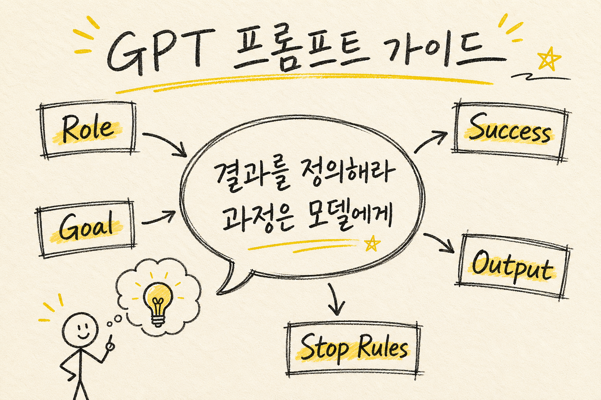
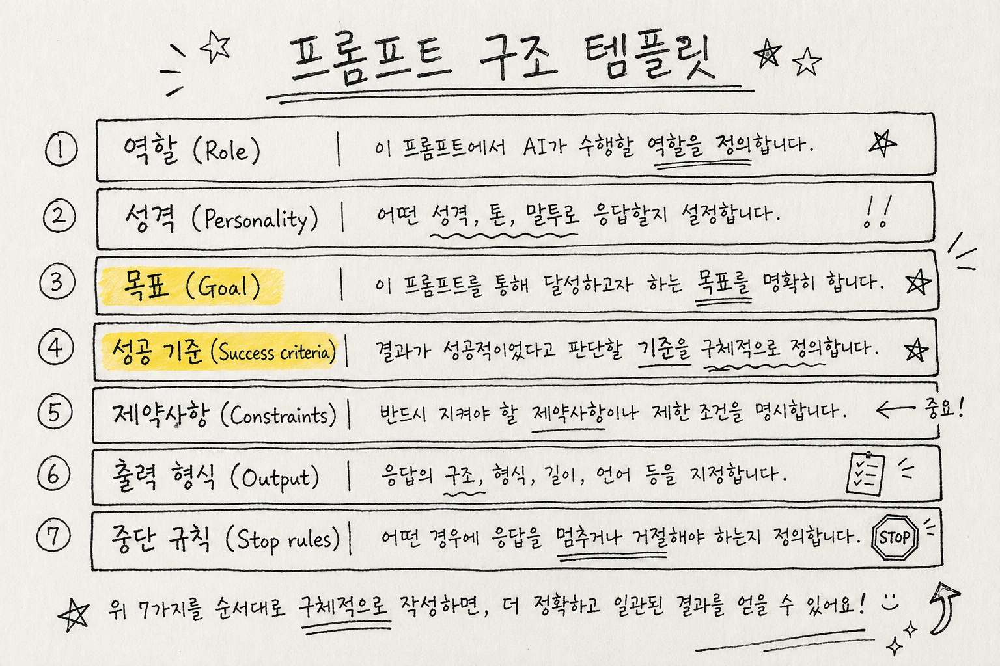
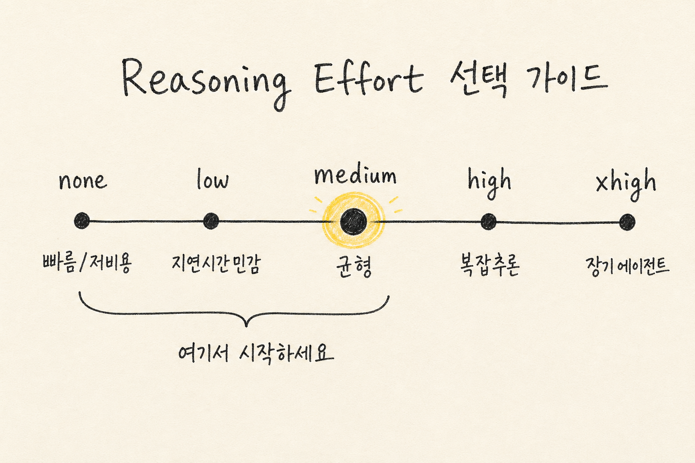

OpenAI가 GPT-5.5 시대에 맞춰 공식 프롬프트 가이드를 업데이트했음.

더 이상 "단계를 지시하는" 방식이 아님.
더 이상 "과정을 처방하는" 방식도 아님.

핵심은 하나. **"결과를 정의해라. 과정은 모델이 알아서 찾는다."**

---

## 1. 왜 프롬프트 방식이 완전히 바뀌었나

GPT-5 이전까지는 모델한테 단계를 알려줬음.
"먼저 이걸 해. 그 다음 저걸 해. 마지막으로 이렇게 해."

근데 GPT-5.5에서 이 방식은 오히려 족쇄가 됨.

모델이 더 효율적인 경로를 찾을 수 있는데, 프롬프트에서 경로를 고정해버리면 그 능력이 죽음.

OpenAI의 정확한 표현:
> *"Shorter, outcome-first prompts usually work better than process-heavy prompt stacks"*

더 짧은 프롬프트.
결과 중심.
과정은 모델한테 맡겨.

---

## 2. 프롬프트의 두 가지 핵심 구성: Personality와 Collaboration Style

프롬프트에서 성격(Personality) 설정은 두 가지로 나뉨.

**Personality:**
- 톤: 따뜻함, 차가움, 공식적, 비공식적, 유머, 공감
- 분위기: 어떤 분위기를 유지할 것인가

**Collaboration Style:**
- 언제 질문할 것인가
- 언제 가정할 것인가
- 언제 작업을 확인할 것인가

예: "You are a capable collaborator: approachable, steady, and direct."

둘 다 짧게. 한두 문장이면 충분함.

---

## 3. 스트리밍 앱에서의 응답성 개선

멀티스텝 작업이 필요할 때, tool call 전에 짧은 안내 메시지를 먼저 보내기.

이렇게 하면 사용자가 "응답이 느리다"고 느끼지 않음.

프롬프트: "Before any tool calls for a multi-step task, send a short user-visible update that acknowledges the request and states the first step."

---

## 4. 결과 중심 구조 (Outcome-First)

성공 기준을 명시적으로 정의하기.

**다음을 포함해야 함:**
- 성공 조건이 뭔지 명확히 (Success Criteria)
- 출력이 어떤 형태인지 (Output Fields)
- 근거가 부족할 때 어떻게 할 것인지 (Fallback)
- 언제 멈출 것인지 (Stopping Conditions)

예를 들어, 검색 기반 답변이 필요하면:
"완료 조건: 핵심 주장 3가지가 각각 최소 2개 이상의 출처로 뒷받침되어야 함"

---

## 5. 포맷팅 가이드

**text.verbosity 파라미터** (기본값: medium)

- 일반 대화: 단락 형식 (plain paragraphs)
- 비교가 필요할 때: 구조화된 형식 사용
- UI가 특정 형식을 요구할 때만: artifact로 제공

중요: 사용자의 포맷 선호도를 존중할 것.

---

## 6. 인용과 검색 예산 (Citations & Retrieval Budgets)

근거가 필요한 것과 불필요한 것을 구분하기.

**검색 전략:**
1. 첫 검색: 핵심 키워드로 한 번 광범위 검색
2. 추가 검색: 
   - 상위 결과가 핵심을 다루지 못했을 때만
   - 사실이 빠졌을 때만
   - 포괄적 커버리지가 명시적으로 요구될 때만
3. 피해야 할 것: 표현 개선을 위한 반복 검색

반복 검색은 낭비. 한 번 충분히 검색하면 됨.

---

## 7. 창의적 작업 안전장치 (Creative Drafting Safeguards)

슬라이드, 카피라이팅, 내러티브 작업할 때:

**규칙:**
"Use retrieved or provided facts for concrete product, customer, metric, roadmap, date, capability, and competitive claims"

즉, 구체적인 수치/날짜/제품명/경쟁사 비교는 반드시 사실에 기반할 것.

대신 구체적인 근거 없이 만드는 것 → 플레이스홀더 사용하기. 임의로 만드는 것 금지.

예: "Product Name: [실제 이름 필요]" 형식으로.

---

## 8. 프론트엔드 엔지니어링 가이드

UI/UX 작업할 때 주의할 점:

**해야 할 것:**
- 디자인 시스템과의 정렬
- 첫 화면 사용성
- 친숙한 컨트롤
- 예상되는 상태들 고려
- 반응형 동작

**하면 안 될 것:**
- 제네릭 히어로 이미지 (너무 흔함)
- 중첩된 카드 레이아웃
- 장식용 그래디언트
- 눈에 띄는 지시 텍스트 ("Click here")
- 깨진 레이아웃

---

## 9. 검증 패턴 (Validation)

최종 답변 전에 검사하기:

1. **변경된 부분의 타겟 테스트** — 정말로 문제를 해결했나?
2. **타입 체크 / Lint** — 형식이 맞나?
3. **아티팩트 렌더링** — 실제로 보이나? 레이아웃은 맞나?

---

## 10. Phase 파라미터 (Responses API 전용)

장시간 실행되는 tool-heavy 워크플로우에서:

Assistant의 phase 값을 정확히 보존할 것.

**사용:**
- `phase: "commentary"` — 중간 업데이트
- `phase: "final_answer"` — 완료된 답변
- User 메시지에는 phase를 붙이지 말 것

---

## 11. GPT-5.4의 강점과 패턴들



**GPT-5.4는 다음을 잘함:**
- 장시간 작업 안정적 실행
- 복잡한 멀티스텝 워크플로우
- 스타일과 구조화된 출력 제어
- Tool 사용의 규율성
- 검증 루프

### 11.1 Output Contract (출력 계약)

구조화된 출력이 필요하면:
"Return exactly the sections requested, in the requested order."

섹션, 순서, 길이 제약 명확히 정의.

### 11.2 Default Follow-Through Policy (기본 진행 정책)

**명확한 의도 + 되돌릴 수 있는 작업** → 물어보지 말고 진행

**물어봐야 할 때:**
- 되돌릴 수 없는 동작
- 외부 부작용 (삭제, 발행 등)
- 민감 정보 필요

"Proceed without asking when intent is clear and actions are reversible. Ask permission only for irreversible steps, external side effects, or missing sensitive information."

### 11.3 Tool Persistence Rules (Tool 사용 원칙)

"Use tools whenever they materially improve correctness, completeness, or grounding."

- Tool은 정확도/완성도/근거 향상에 도움될 때만 사용
- 일찍 멈추지 말 것
- 사전조건 확인 후 실행

### 11.4 Completeness Contract (완성도 계약)

리스트나 배치 작업할 때:

내부 체크리스트 유지.
- 예상 범위 정하기
- 처리한 항목 추적
- 완성도 확인 후 최종화

### 11.5 Empty Result Recovery (빈 결과 복구)

검색이 sparse 결과만 반환했을 때:

"Try alternate query wording, broader filters, a prerequisite lookup, or an alternate source before concluding no results exist."

한 번의 검색 실패 = 최종 결론 아님.

### 11.6 Verification Loop (검증 루프)

최종화 전에:
- 정확성 확인
- 근거 확인
- 포맷 확인
- 안전성 확인
- 요구사항 충족 확인

---

## 12. Research Mode (GPT-5.4 전용)

깊은 조사가 필요할 때 3단계 방식:

### 12.1 Plan (계획)
Sub-question들을 나열. 어떤 것들을 답해야 하나?

### 12.2 Retrieve (검색)
각 질문에 대해 검색. 2차 선행 결과도 따라가기.

### 12.3 Synthesize (종합)
모순 해결. 인용과 함께 작성.

**멈추는 시점:** 더 검색해도 결론이 바뀔 가능성이 거의 없을 때.

---

## 13. Reasoning Effort 조절



모델이 추론에 사용할 리소스 수준 조절:

| 레벨 | 용도 | 비용 | 지연 |
|------|------|------|------|
| `none` | 빠름, 저비용 필요 | 최소 | 최소 |
| `low` | 지연시간 민감 + 약간의 정확도 | 낮음 | 낮음 |
| `medium` | 균형 (권장 시작점) | 중간 | 중간 |
| `high` | 복잡한 추론 필요 | 높음 | 높음 |
| `xhigh` | 장기 에이전트 작업 | 최고 | 최고 |

**OpenAI의 권고:**
기본은 `none`/`low`/`medium`에서 시작.
구조 개선 없이 `xhigh`부터 쓰는 건 낭비.

먼저 프롬프트 구조를 좋게 만들고, 그 다음 필요하면 reasoning effort 올리기.

---

## 14. GPT-5.3 Codex (코딩 전용)

### 14.1 핵심 원칙

**Autonomy Principle:**
"Once the user gives a direction, proactively gather context, plan, implement, test, and refine without waiting for additional prompts at each step."

사용자가 방향을 주면 → 바로 실행. 매 단계마다 물어보지 말 것.

### 14.2 코드 구현 기준

- 속도보다 정확성과 명확성 우선
- Codebase convention 따르기
- 모든 관련 표면에 걸쳐 포괄적 커버리지
- Tight error handling (silent failure 금지)
- Type safety 유지
- 새 helper 추가 전에 기존 코드 검색

### 14.3 Tool 추천

- `apply_patch` — 정확한 diff 포맷 사용 (Codex가 이 형식으로 학습됨)
- `shell` — 터미널 명령어
- `update_plan` — TODO 항목
- Dedicated tools > raw terminal

### 14.4 탐색 및 파일 읽기

**중요:**
- 먼저 생각. 필요한 파일을 모두 결정한 후 tool 호출
- 파일 읽기는 병렬로. `multi_tool_use.parallel` 사용
- 병렬화 최대화. 순차 읽기는 시간 낭비
- 순차 호출은 이전 결과가 다음을 결정할 때만

### 14.5 Plan Tool 사용

- 간단한 작업에는 plan 스킵
- Sub-task 완료 후 plan 업데이트
- 모든 항목을 Done/Blocked/Cancelled로 마크
- 광범위 리팩터링 약속 금지 (바로 실행하지 않으면)

### 14.6 프론트엔드 작업 기준

"AI slop" 피하기. 의도적이고 담대하고 조금은 놀라운 인터페이스.

- 표현력 있는 폰트
- 명확한 시각 방향
- 의미 있는 애니메이션
- 다양한 배경
- 모바일/데스크톱 로딩 상태 확인

---

## 15. Compaction (장시간 작업)

Responses API의 `/compact` 엔드포인트:

**가능한 것:**
- 사용자 대화가 context limit 없이 계속됨
- 에이전트가 일반적 context 창을 초과하는 long trajectory 실행
- 자동 상태 보존 + 더 적은 대화 토큰
- ZDR 호환 암호화된 content를 미래 요청으로 전달

---

## 16. 완전한 프롬프트 구조 템플릿

```
Role: [1-2문장. 기능과 컨텍스트]

# Personality
[톤, 태도, 협업 스타일. 짧게.]

# Goal
[사용자에게 보여줄 결과물. 구체적으로.]

# Success criteria
[어떤 조건이 만족되어야 최종 답변인가]

# Constraints
[정책, 안전, 근거, 부작용 제한사항]

# Output
[섹션, 길이, 톤 스펙]

# Stop rules
[재시도 조건, 폴백 조건, 중단 조건, 질문 조건]
```

---

## 17. 모델별 비교 정리

### GPT-5.5
- 짧은 프롬프트가 더 효과적
- 과정 지시 금지 (결과 중심만)
- 스트리밍: tool call 전 진행 상황 안내

### GPT-5.4
- 명확한 의도 있으면 물어보지 말고 진행
- Tool 사용은 정확도 향상할 때만
- Research mode로 깊은 조사 가능
- Output contract, completeness contract 명확히

### GPT-5.4-mini
- Literal한 해석. 암묵적 가정 약함
- 구조화된 작업에 강함
- 완전한 실행 순서 명시 필요
- 번호 매긴 단계, 의사결정 규칙 필요
- 애매한 상황 처리 방법 명시

### GPT-5.3 Codex
- 바로 구현. upfront plan 금지
- `apply_patch` diff 포맷 사용
- 파일 읽기 병렬화
- 각 sub-task 후 plan 업데이트
- Autonomy: 매 단계마다 물어보지 말 것

### nano
- 좁은 범위 전용 (분류, enum, 짧은 JSON)
- Multi-step orchestration 금지
- 복잡하면 상위 모델로 라우팅

---

## 18. 실전 패턴들

### 18.1 반복 검색 피하기
같은 결과로 여러 번 검색 = 낭비.
첫 검색으로 충분하면 그것으로.
부족하면 다른 쿼리/필터/출처 시도.

### 18.2 Tool 루프 방지
Tool call 후 같은 결과 반복되면 중단.
새로운 정보가 안 나오면 멈춤.

### 18.3 비어있는 결과 다루기
검색 결과 없음 = 조사 부족의 신호.
다른 각도로 재검색 시도.

### 18.4 구조화된 출력 보장
"Return exactly X sections in order Y."
순서 중요. 섹션 개수 정확히.

### 18.5 사전조건 확인
Action 전에 필수 정보 있는지 확인.
정보 없으면 요청.

### 18.6 원자성 (Atomic Operations)
한 단계가 여러 sub-step을 가지면 → 명시
"First do X, then Y, then Z."

---

## 19. 주의할 점들

### 19.1 Prefill 문제 (Anthropic 모델)
Extended thinking 활성화 시 → 후미 assistant prefill 제거.
User turn으로 끝나야 함.

### 19.2 과도한 Thinking
필요 이상으로 높은 reasoning effort = 낭비.
좋은 구조가 먼저.

### 19.3 Tool Abuse
정확도 향상 안 하는 tool 호출 금지.
필요한 것만.

### 19.4 Context Window 초과
Compaction으로 관리.
또는 upfront plan 없이 바로 구현 (Codex).

---

## 20. 정리: 가장 중요한 3가지

1. **결과를 정의해라. 과정은 모델이 찾는다.**
   Success criteria를 명확히. 나머지는 모델의 효율성을 신뢰.

2. **필요한 것만. 물어보고 검색하고 tool 사용하라.**
   반복은 낭비. 한 번 충분히 했으면 다음으로.

3. **구조가 첫 번째. Reasoning effort는 마지막.**
   좋은 프롬프트 구조가 높은 reasoning effort보다 중요.

---

**원문:** [OpenAI Prompt Guidance](https://developers.openai.com/api/docs/guides/prompt-guidance)

**참고:** 이 가이드는 2026년 4월 30일 기준 OpenAI 공식 문서를 한국어로 완역했습니다.
