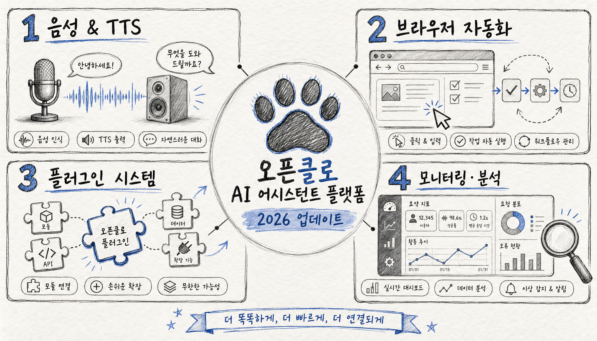

오픈클로(OpenClaw)가 4월 25일 업데이트를 올렸음.

한 줄 요약하면 — TTS 다 뜯어고쳤고, 플러그인 느리던 거 잡았고, 모니터링 강화했음.

---

1. **TTS 완전 개편**

TTS가 이번에 대규모로 바뀌었음.

기존엔 글로벌 설정 하나로만 운용됐는데, 이제 채팅 세션 단위, 에이전트 단위, 계정 단위로 각각 다른 TTS를 줄 수 있음.

`/tts latest` 명령이 새로 생겼고, `/tts chat on|off|default`로 현재 채팅방에만 auto-TTS를 켜고 끄는 게 가능해짐.

공급자도 확 늘었음. Azure Speech, Xiaomi, Local CLI, Inworld, Volcengine, ElevenLabs v3까지 추가. 기존 ElevenLabs 쓰던 사람은 v3로 마이그레이션 고려해봐도 됨.

2. **플러그인 시작 속도 개선**

플러그인 로딩이 느린 건 알려진 문제였음.

원인은 매 시작마다 전체 manifest를 재스캔했기 때문임. 이번에 "콜드 퍼시스티드 레지스트리"라는 구조로 바뀌었는데, 쉽게 말하면 스냅샷 캐시를 두는 방식임.

`openclaw plugins registry` 명령으로 현재 레지스트리 상태를 직접 볼 수 있고, `--refresh`로 강제 재빌드도 가능함.

플러그인 설치/비설치 후 스탈 엔트리가 남던 버그도 이번에 정리됨.

3. **브라우저 자동화 강화**

브라우저 스킬 쓰는 사람한테 실질적인 업데이트임.

iframe 내부 요소까지 role 스냅샷에 잡히게 됐고, CDP 연결 대기 타임아웃을 느린 기기(라즈베리파이 같은)에 맞게 조정 가능해짐.

`openclaw browser start --headless`로 설정 변경 없이 헤드리스 모드 원샷 실행도 됨. 브라우저 설정 파일 건드리지 않고 한 번만 헤드리스로 돌리고 싶을 때 쓸 수 있음.

`openclaw browser doctor --deep`도 추가됐는데, 느린 환경에서 CDP 연결 문제 진단할 때 쓰면 됨.

4. **OpenTelemetry 전면 확장**

모니터링 지표가 대폭 늘었음.

모델 호출, 토큰 사용, 툴 루프, 하네스 실행, exec 프로세스, 아웃바운드 전송, 컨텍스트 어셈블리, 메모리 압력까지 전부 OTEL 스팬으로 뽑힘.

Grafana 대시보드 쓰는 팀이면 에이전트별 토큰 사용량을 `openclaw.agent` 라벨로 그룹핑할 수 있게 됐음. 세션 ID나 프롬프트 내용은 포함 안 함 — 프라이버시 배려한 설계임.

Prometheus 플러그인도 번들로 추가됐음. 게이트웨이 scrape 엔드포인트 붙이면 기본 메트릭 바로 수집 가능.

5. **Control UI — PWA + Web Push**

오픈클로 웹 채팅 UI가 PWA(Progressive Web App)로 설치 가능해졌음.

Web Push 알림도 지원됨. 게이트웨이 채팅에서 알림 받으려면 Control UI 설정에서 활성화하면 됨.

TUI(터미널 UI) 기반 첫 실행 셋업 마법사도 생겼음. GUI 없이 서버에서 세팅할 때 유용함.

6. **설치/업데이트 안정성**

Windows, macOS, Linux, Docker 전부 설치 경로 개선이 들어갔음.

LaunchAgent 토큰 로테이션, 번들 플러그인 런타임 의존성 수리, 혼합 버전 게이트웨이 검증까지 챙겼음. 업데이트 중 게이트웨이가 내려가는 문제가 줄어들 것으로 보임.

---

**요약하면**

TTS 쓰는 사람 → `/tts latest` 써보고 신규 공급자 확인.

플러그인 느렸던 사람 → 업데이트 후 체감 확인.

브라우저 자동화하는 사람 → iframe 스냅샷 개선으로 스크래핑 커버리지 향상.

모니터링 붙인 팀 → OTEL 지표 새로 추가된 것들 Grafana 대시보드에 반영 고려.

---

*OpenClaw v2026.4.25 기준 정리. 전체 changelog: docs.openclaw.ai*
