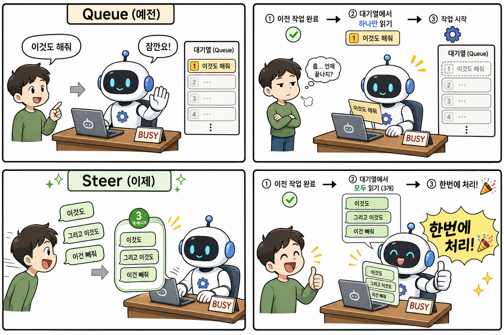

- **공식 웹사이트:** [openclaw.ai](https://openclaw.ai)
- **GitHub:** [github.com/openclaw/openclaw](https://github.com/openclaw/openclaw)
- **문서:** [docs.openclaw.ai](https://docs.openclaw.ai)
- **커뮤니티:** [Discord](https://discord.com/invite/clawd) / [X: @openclaw](https://x.com/openclaw)
- **릴리즈 노트:** [v2026.4.29 (GitHub)](https://github.com/openclaw/openclaw/releases/tag/v2026.4.29)

<!-- Hidden SEO Keywords: 오픈클로, openclaw, 오픈클로 설치, 오픈클로 사용법, 오픈클로 튜토리얼, 오픈클로 한글, openclaw korean, 오픈클로 한국어, 오픈클로 리뷰, openclaw review, 오픈클로 업데이트, openclaw update, 오픈클로 2026, openclaw 2026.4.29, steer mode, queue mode, NVIDIA provider, AI 에이전트, AI agent, 업무 자동화, ChatGPT 대체, openclaw alternative, 오픈클로 설정, openclaw setup, 오픈클로 플러그인, openclaw plugin, AI 비서, AI assistant, 코딩 에이전트, coding agent, 오픈클로 스킬, openclaw skills, 오픈클로 텔레그램, openclaw telegram, 오픈클로 초보, openclaw beginner, 오픈클로 가이드, openclaw guide, 코난쌤 -->

2026년 4월 29일, **OpenClaw(오픈클로)** 가 새 버전 **2026.4.29**를 릴리스했습니다. 이번 업데이트에서 가장 눈에 띄는 변화는 **AI가 작업 중일 때 메시지를 보내는 방식**이 완전히 바뀐 것입니다. 기존의 Queue(대기열) 방식 대신 **Steer(스티어) 모드**가 기본값이 되었고, NVIDIA 모델 지원, 사람 인식 메모리 등 굵직한 기능도 함께 추가됐습니다.

## 📌 이번 릴리스 핵심 요약

| 변화 | 내용 |
|------|------|
| 🎯 Steer 모드 기본 전환 | 에이전트 실행 중 추가 메시지를 한꺼번에 처리 |
| 🟢 NVIDIA 제공자 추가 | NVIDIA 호스팅 모델 API 키 연결 공식 지원 |
| 🧠 사람 인식 메모리 | 대화 속 인물 정보를 위키로 기억 |
| 🔒 모델 억제 | 오래된 설정이 잘못된 모델을 강제 로드하는 버그 차단 |
| 🌍 다국어 UI 추가 | 페르시아어, 네덜란드어, 베트남어 등 6개 언어 추가 |

---

## 🎯 가장 큰 변화: Queue → Steer 모드

### AI한테 말 걸기 방식이 바뀌었다

OpenClaw에서 AI 에이전트가 긴 작업을 하는 도중에 추가로 메시지를 보내면 어떻게 처리될까요? 이 동작 방식이 이번 업데이트에서 근본적으로 바뀌었습니다.



### 예전 방식 — Queue (대기열)

에이전트가 작업 중일 때 메시지를 보내면 **줄을 서서 하나씩** 처리했습니다.

```
작업1 끝 → "이것도 해줘" 처리 → 끝 → "이것도" 처리 → 끝 → "이건 빼줘" 처리
```

사용자가 여러 개의 수정 요청을 빠르게 보내도, 에이전트는 이전 작업이 완전히 끝나야 다음 메시지를 읽는 구조였습니다. 긴 작업 중에 방향을 바꾸고 싶어도 에이전트가 다 끝낼 때까지 지켜봐야 했죠.

### 새 방식 — Steer (기본값)

이제 에이전트가 **현재 작업을 끝내는 순간**, 그동안 쌓인 메시지를 **전부 한꺼번에** 읽고 처리합니다.

```
작업1 끝 → "이것도 해줘 + 이것도 + 이건 빼줘" 한 번에 처리
```

작업하는 동안 생각나는 요청을 그냥 막 보내도 됩니다. 에이전트가 끝나는 순간 다 읽고 한 번에 반영합니다.

### 500ms 디바운스란?

Steer 모드에는 **500ms 폴백 디바운스**가 함께 붙어 있습니다. 메시지가 도착하면 500ms 동안 기다렸다가, 그 사이 추가 메시지가 오면 묶어서 한 번에 처리합니다.

```
메시지 수신 → 500ms 대기
  └─ 추가 메시지 있으면 → 묶음 처리 (steer 1회)
  └─ 추가 없으면 → 단독 처리 (steer 1회)
```

500ms와 상관없이 **모든 메시지는 Steer로 처리**됩니다. 500ms는 단지 빠르게 연속으로 보낸 것들이 따닥따닥 두 번 처리되는 걸 방지하는 장치입니다.

### 레거시 Queue 모드로 돌아가려면?

```
/queue queue
```

채팅에서 이 커맨드 한 줄이면 이전 방식으로 전환됩니다. 원래대로 되돌리려면 `/queue default`.

설정 파일에서 전역으로 변경하려면:

```json
{
  "messages": {
    "queue": {
      "mode": "queue"
    }
  }
}
```

---

## 🟢 NVIDIA 제공자 공식 지원

OpenClaw에서 **NVIDIA가 호스팅하는 AI 모델**을 직접 연결할 수 있게 됐습니다.

추가된 내용:
- **API 키 온보딩** — NVIDIA API 키 등록 안내 절차 추가
- **정적 모델 카탈로그** — NVIDIA 제공 모델 목록이 코드에 내장되어 별도 API 조회 없이 확인 가능
- **모델 참조 피커** — `nvidia/llama-3.1-70b` 처럼 provider 접두사 형식이 선택 후에도 그대로 유지됨

Gemini, OpenAI 외에 **NVIDIA NIM API**(Llama, Mistral 등 NVIDIA 호스팅 모델)를 OpenClaw에 연결해서 쓸 수 있게 된 셈입니다.

---

## 🧠 사람 인식 메모리 (People-Aware Wiki)

메모리 시스템에 **사람 인식 위키** 기능이 추가됐습니다.

- 대화 속에서 등장하는 인물 정보를 자동으로 기억
- 출처 뷰(provenance view)로 어떤 대화에서 기억됐는지 추적 가능
- 대화별 `allowedChatIds` / `deniedChatIds` 필터로 특정 대화에서만 회상 활성화 가능
- 메모리 하위 에이전트가 타임아웃되면 부분 요약을 반환 (아무것도 없이 실패하지 않음)

---

## 🔒 모델 억제: 잘못된 설정이 버그를 만드는 문제 해결

### 무슨 문제였나?

`openclaw doctor --fix`가 예전에 설정 파일에 `openai-codex/gpt-5.4-mini` 항목을 자동으로 써넣는 경우가 있었습니다. 그런데 이 모델은 OpenClaw 매니페스트에서 차단된 모델이라, 차단됐는데 설정에 명시되어 있으면 → 차단을 우회해서 로드 시도 → **어시스턴트 응답이 반복 실패**하는 버그가 발생했습니다.

### 이번 수정

설정 파일에 해당 모델이 명시돼 있어도 **매니페스트 차단이 우선**하도록 억제 로직을 추가했습니다. 단, ChatGPT/Codex OAuth 인증이 실제로 완료된 경우에는 정상 복원됩니다.

---

## 🌍 다국어 UI 추가

제어 UI에 새 언어 6개가 추가됐습니다:

페르시아어(fa), 네덜란드어(nl), 베트남어(vi), 이탈리아어(it), 아랍어(ar), 태국어(th)

---

## 🔧 그 외 주요 변경/수정 사항

**변경:**
- `pnpm gateway:watch`가 기본으로 명명된 tmux 세션에서 실행됨
- SQLite 기반 플러그인 상태 저장소 추가 (`api.runtime.state.openKeyedStore`) — 재시작 후에도 상태 유지, TTL/eviction, 플러그인 격리 지원
- Tencent Yuanbao 봇 채널 추가
- `OPENCLAW_SKIP_ONBOARDING` 환경변수로 자동화 설치 시 온보딩 스킵 가능
- ACP, Pi, AWS SDK, TypeBox, pnpm 등 주요 의존성 업데이트

**수정:**
- 에이전트 실행 중 빈 사용자 프롬프트를 제공자 제출 전에 스킵
- 고아 세션 자동 복구 (복구 시도 영속화)
- 브라우저 `executablePath`/`headless`/`noSandbox` 설정 준수

---

## 🚀 OpenClaw 업데이트 방법

```bash
openclaw update
```

업데이트 후 버전 확인:

```bash
openclaw status
```

---

## 📚 더 배우고 싶다면 — 오픈클로 실전 도서

### 《이게 되네? 오픈클로 미친 활용법 50제》🔥 **신간**

> AI 에이전트, 자동화, 크롤링, 이메일, 캘린더, 카카오톡, PPT, 한글 문서, 옵시디언, 데이터 분석, SNS, 블로그, AI 전화까지 **코딩 없이 50가지 업무를 자동화**하는 스마트폰 속 나만의 AI 비서 실전 가이드

- 📖 304쪽 | 정가 24,000원 (할인가 21,600원)
- 📅 발행일: 2026년 5월 4일
- 🛒 [Yes24 구매 링크](https://www.yes24.com/product/goods/185166276)
- 🎁 출간 기념 저자 무료 특강 진행중

---

### 다른 도서

| 도서 | 대상 | 요약 |
|------|------|------|
| [《초등 기적의 AI 공부법》](https://www.yes24.com/product/goods/137148064) | 초등학생·교사·학부모 | 어려운 AI 개념을 쉽게 풀어쓴 교육 가이드북 |
| [《회사에서 몰래보는 일잘러의 AI 글쓰기》](https://www.yes24.com/product/goods/135720345) | 직장인 | 이메일·보고서·제안서 등 실무 글쓰기 AI 활용법 |
| [《선생님을 위한 8282 업무 자동화》](https://www.yes24.com/product/goods/143533211) | 교사·일반 대상 | AI+파이썬+노코드 업무 자동화 실전 가이드 |
| [《선생님의 시간을 지켜주는 생성형AI 활용법》](https://www.yes24.com/product/goods/181865567) | 교사 | 출근·수업·업무·퇴근 흐름에 따른 생성형 AI 활용 총정리 |

---

## 📌 결론

OpenClaw 2026.4.29는 **사용자의 실시간 개입 경험을 혁신한 업데이트**입니다. Steer 모드 기본 전환으로 AI와 더 자연스럽게 대화하며 작업을 조율할 수 있게 됐고, NVIDIA 모델 지원으로 선택지도 넓어졌습니다. 긴 작업 중에도 생각나는 요청을 막 보내세요 — 에이전트가 알아서 한꺼번에 처리합니다.
