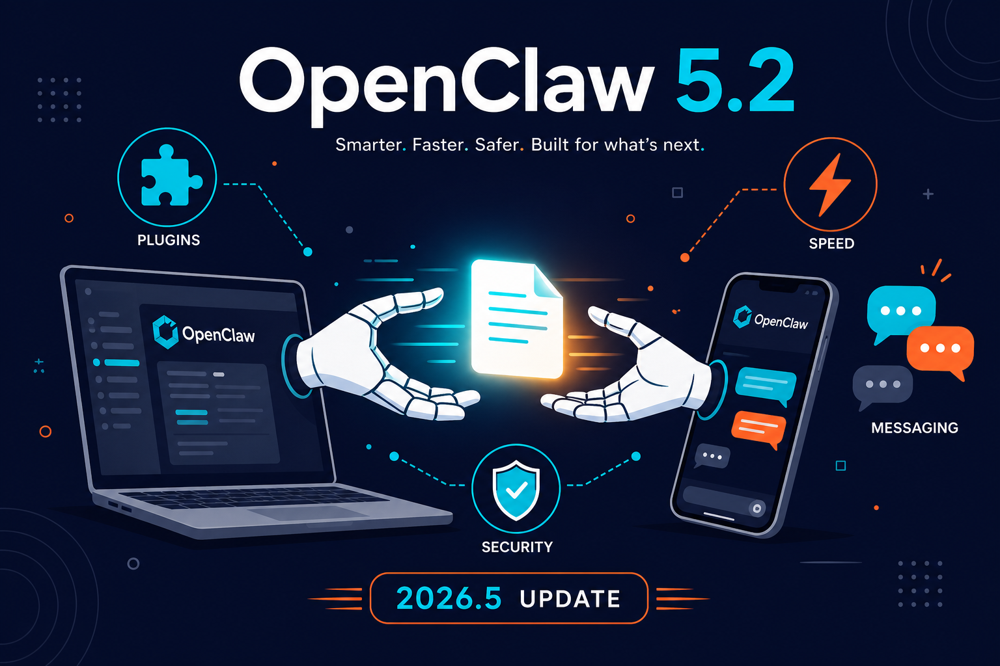

오픈클로(OpenClaw)가 5월 2일, 3일 연속 업데이트를 올렸음.

한 줄 요약 — 파일 전송 플러그인이 생겼고, 게이트웨이가 빨라졌고, 플러그인이 npm 패키지로 외부화됐고, 메시징 채널 버그를 싹 잡았음.

---

## 1. 파일 전송 플러그인 (5.3 신규)

이번 업데이트에서 제일 눈에 띄는 건 **file-transfer 플러그인**임.

페어링된 노드(스마트폰, 다른 컴퓨터)에서 파일을 직접 읽고 쓰고 가져올 수 있게 됐음. 도구 4개가 추가됨:

- `file_fetch` — 노드에서 파일 가져오기
- `dir_list` — 디렉토리 목록 보기
- `dir_fetch` — 디렉토리 통째로 가져오기
- `file_write` — 노드에 파일 쓰기

보안이 꽤 타이트함. 기본적으로 모든 경로가 거부(deny) 상태에서 시작하고, 노드별로 허용 경로를 직접 지정해야 함. 심볼릭 링크 순회도 기본 차단. 파일 크기 상한선은 16MB.

오픈클로 노드 폰에서 사진 하나 뽑거나, 반대로 노트를 폰에 저장하는 게 명령 하나로 가능해진 셈임.

## 2. 게이트웨이 시작 속도 개선

게이트웨이 켤 때 느리던 원인을 찾아냈음.

매번 플러그인/런타임/cron/스키마/세션/모델 메타데이터를 전부 초기화하면서 시작했기 때문임. 이번에 lazy-loading 구조로 바꿨는데, 필요한 것만 필요할 때 로드하는 방식임.

체감 차이가 꽤 날 거임. 특히 플러그인 많이 깔린 환경에서.

핫 패스도 정리함:
- 세션 목록 조회
- 작업 유지보수
- 프롬프트 준비
- 툴 디스크립터 계획
- 파일시스템 가드

## 3. 플러그인 npm 외부화

이게 구조적으로 제일 큰 변화임.

기존에 코어 패키지 안에 다 들어있던 플러그인들을 npm 패키지로 빼내는 작업이 본격적으로 진행됨.

Discord, WhatsApp, Telegram, Google Chat, LINE, Matrix, Microsoft Teams, BlueBubbles, Slack, Feishu, Twitch, Brave 웹검색, Codex, OpenTelemetry, Prometheus, Memory LanceDB, Voice Call, Google Meet 등 — 전부 `@openclaw/*` 패키지로 분리됨.

좋은 점:
- 코어 패키지가 가벼워짐
- 필요한 것만 설치 가능
- 개별 플러그인 업데이트 가능

ClawHub(오픈클로 플러그인 마켓)도 같이 정비됨. 버전 관리, 다이제스트 검증, npm 폴백까지 설치 경로가 다층적으로 안전해짐.

`openclaw plugins list --json`에 의존성 설치 상태가 포함되고, ClawHub에서 직접 설치도 가능.

## 4. 메시징 채널 전면 수정

거의 모든 채널에 수정이 들어갔음.

**WhatsApp** — Channel/Newsletter 타겟이 새로 추가됨. DM 말고 채널/뉴스레터로 메시지 보내기 가능.

**Telegram** — 같은 세션에서 오래된 응답이 최신 메시지 응답을 덮어쓰던 버그 수정. 폴링 시작 시 불필요한 API 호출도 줄임.

**Discord** — DM 수신 시 typing 표시를 즉시 보내도록 수정. 느린 응답에서 봇이 죽은 것처럼 보이던 문제 해결. 상태 리액션 추적도 개선. CJK(한중일) 명령어 설명 때문에 429 에러 나던 것도 잡음.

**Slack** — 스레드 추적이 게이트웨이 재시작 후에도 유지됨. App Home 탭도 기본 뷰가 표시됨.

**Signal** — 그룹/미디어 처리 수정.

**Feishu** — 하나의 메시지가 막히면 같은 채팅의 뒤에 오는 메시지도 다 막히던 문제 수정. 5분 타임아웃 후 차단 체인에서 제거됨.

**Microsoft Teams** — 재시작 후에도 메시지 마커가 유지됨.

## 5. 설치/업데이트 안정성

**macOS** — LaunchAgent가 업데이트 후 깨지던 문제를 복구 로직으로 잡음. 패키지 업데이트 후 게이트웨이가 안 올라오면 재시작/재설치/롤백 가이드를 출력함.

**전체** — TypeScript 소스만 있는 플러그인 패키지를 설치 단계에서 거부함. 컴파일된 런타임이 없는 패키지는 아예 설치가 안 됨.

**설정** — 잘못된 config가 게이트웨이 시작/핫리로드에서 자동 복원되던 걸 막음. 이제 잘못된 건 실패하고 `openclaw doctor --fix`가 마지막 정상 설정으로 복구함.

**온보딩** — 대화형 설정 마법사에서 API 키, 토큰, 비밀번호 입력 시 터미널에 노출되지 않게 마스킹됨. 스크린샷이나 로그에 비밀번호가 찍히던 문제 해결.

## 6. 그 외 눈에 띄는 것들

- **Grok 4.3** — xAI 기본 모델로 추가됨.
- **`/side` 명령** — `/btw`의 별칭. 사이드 질문 던질 때 사용.
- **exec 승인** — shell 명령어 설명기가 tree-sitter 기반으로 추가됨. 향후 승인 UI에서 명령어를 자연어로 보여줄 준비.
- **Google Meet** — 라이브 자막 상태 확인, 회의실 종료 명령 추가.
- **`$include` 설정** — 설정 파일에서 외부 파일 include 가능. `OPENCLAW_INCLUDE_ROOTS`로 허용 디렉토리 제한.
- **`openclaw proxy validate`** — 프록시 설정 검증 명령 신규 추가.
- **Memory 상태 분리** — sqlite-vec 스토어와 임베딩 공급자 상태를 분리해서 표시. 로컬 스토어가 깨졌는데 공급자 문제처럼 보이던 혼선 해결.

---

**요약하면**

파일 전송 쓰고 싶은 사람 → `file-transfer` 플러그인 활성화 후 노드별 허용 경로 설정.

게이트웨이 느렸던 사람 → 업데이트 후 시작 속도 체감 확인.

플러그인 구조 관심 있는 사람 → npm 외부화로 코어 가벼워짐. ClawHub 설치 경로 사용 가능.

메시징 채널 쓰는 사람 → Discord/Telegram/Slack/WhatsApp 전부 버그 수정. CJK 명령어 쓰는 Discord 서버는 특히 필수.

---

*OpenClaw v2026.5.2~5.3 기준 정리. 전체 changelog: <https://github.com/openclaw/openclaw/releases>*
