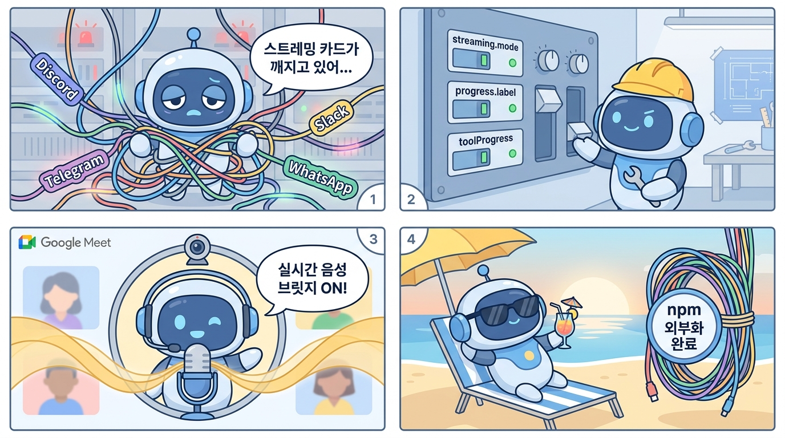

오픈클로(OpenClaw) 2026.5.4가 5월 5일 릴리즈됨.

한 줄 요약 — Google Meet에서 실시간 음성 브릿지가 제대로 돌아가고, 플러그인 npm 외부화가 대폭 확대됐고, 거의 모든 메시징 채널의 스트리밍 카드가 개편됨.

이번 업데이트는 변경사항이 **200개 이상**이라 리서치에만 시간이 꽤 걸림. 사용자에게 당장 체감되는 것 위주로 정리함.

---

## 1. Google Meet 실시간 음성 브릿지

이번에 제일 구조적으로 큰 변화.

기존엔 Google Meet에 참가하면 Twilio 다이얼인을 통한 음성 출력이 느리고 끊기는 느낌이었음. 이번에 Gemini 실시간 음성 브릿지를 통과하는 방식으로 전면 교체함.

핵심 변경점:
- **페이스드 오디오 스트리밍** — 오디오를 한 번에 쏘지 않고 속도 조절해서 흘려보냄
- **백프레셔 인식 버퍼링** — 네트워크가 느리면 자동으로 버퍼 조절
- **Barge-in 큐 클리어링** — 사용자가 말하면 AI가 즉시 멈춤
- **TwiML 폴백 제거** — 실시간 음성이 돌아가는 동안엔 구식 TTS 폴백 안 씀
- **`mode: "agent"` 기본값** — Chrome 탭에서 직접 말하는 에이전트 모드가 기본, 기존 양방향 모드는 `mode: "bidi"`로 유지

Meet 참가자 입장에선 AI 응답이 훨씬 즉각적이고 자연스럽게 들림.

## 2. 채널 스트리밍 전면 개편

Discord, Telegram, Slack, Matrix, Microsoft Teams, Mattermost, Feishu — 거의 모든 채널의 **스트리밍 프로그레스 카드**가 개편됨.

새로운 통합 설정:
- `streaming.mode: "progress"` — 통합 드래프트 프로그레스 모드
- `streaming.progress.label` — 자동 상태 라벨 (한 단어로 현재 상태 표시)
- `streaming.progress.toolProgress` — 도구 실행 상태 표시 on/off
- `streaming.progress.maxLines` — 프로그레스 라인 수 제한

채널별 주요 변경:
- **Discord** — typing 표시 즉시 전송, CJK 명령어 429 에러 수정, 프로그레스 경계 콜백 수정
- **Telegram** — 오래된 응답이 최신 응답 덮어쓰는 버그 수정, forum topic 답변 누락 수정, 미디어 그룹 버퍼링 시간 설정 가능
- **Slack** — Socket Mode 재연결 로그 정리, mention-gating 수정
- **Mattermost** — 스트리밍 설정 스키마 노출, 프로그레스 카드 지원
- **Feishu** — per-chat 큐잉 5분 타임아웃 추가 (하나 막히면 전체 막히던 문제 해결), `blockStreaming` 설정 지원
- **Microsoft Teams** — 재시작 후 메시지 마커 유지, 프로그레스 도구 라인 지원

## 3. 플러그인 npm 외부화 대폭 확대

5.3에서 시작된 외부화가 대폭 확대됨.

Discord, WhatsApp, Telegram, Codex 등 주요 플러그인이 `@openclaw/*` npm 패키지로 완전 분리됨.

개선점:
- 공식 카탈로그 메타데이터 병합 — WeCom, Yuanbao 등 외부 채널도 호환성 유지
- npm 설치 시 `latest`가 프리릴리즈를 가리키면 안정 버전으로 자동 폴백
- 플러그인 설치 시 다른 플러그인이 삭제되던 문제 수정
- TypeScript 소스만 있는 패키지 설치 차단 (컴파일된 런타임 없으면 설료 안 됨)
- ClawHub 아티팩트 다운로드 → npm 폴백 안내 개선

## 4. 세션·게이트웨이 성능 최적화

Control UI 폴링, 세션 목록, 사용량 조회가 느리던 문제를 광범위하게 수정함.

- **세션 목록 바운딩** — 무제한 row 생성 방지, 잘림 메타데이터 리포트
- **사용량 캐시** — `usage.cost`를 내구성 있는 트랜스크립트 집계 캐시에서 제공
- **모델 목록 정적 폴백** — `models.json`이 없어도 빌트인 모델 노출
- **플러그인 툴 디스크립터 캐시** — 대형 런타임 config에서 반복 해싱 방지
- **Control UI 세션 리로드 축소** — 채팅 턴 `sessions.changed`에서 전체 리로드 안 함

## 5. `/steer` 명령어 추가

`/steer <message>`가 새로 추가됨. 현재 세션의 활성 런을 큐에 넣지 않고 방향을 바꿀 수 있음. 세션이 유휴 상태일 때 새 턴을 시작하지 않고도 보정 가능.

기존 `/btw`의 별칭으로 `/side`도 추가됨.

## 6. Google Meet/Chrome 미디어 권한 수정

Meet 관련 변경이 많아서 따로 정리:

- Chrome 탭에 직접 미디어 권한 부여 (CDP가 안 되면 Playwright 컨텍스트로 폴백)
- 마이크가 뮤트 상태면 실시간 음성 차단
- 방금 연 탭이 아직 `not-in-call` 상태일 때 음성이 멈추는 문제 수정
- BlackHole 캡처 경로 자동 설정 (로컬 Chrome 실시간 참가 시)
- 에이전트 자기 목소리 에코 억제 — AI가 말한 걸 다시 입력으로 받아서 루프 도는 문제 해결
- CLI 세션 명령이 게이트웨이 런타임을 거치도록 변경 — CLI 종료해도 세션 유지

## 7. 크론·메모리·웹검색 수정

- **크론**: `delivery.mode: "none"` 작업이 제대로 표시됨, 핫리로드 레이스 컨디션 수정, 수동 실행 ID 히스토리 보존
- **메모리**: 회전/삭제된 세션 트랜스크립트(`.jsonl.reset`, `.jsonl.deleted`) 검색 가능, sqlite-vec과 임베딩 공급자 상태 분리
- **웹검색**: Surge/Clash/sing-box fake-IP DNS 환경에서 동작하도록 수정, `web_fetch`에 프록시 opt-in 추가
- **Active Memory**: 초기 리콜 타임아웃 연장, forum topic 세션에서 크래시 수정

## 8. 설치·업데이트 안정성

- **macOS**: LaunchAgent가 패키지 업데이트 후 깨지는 문제 → 업데이트 실패 시 재시작/재설치/롤백 가이드 출력
- **systemd**: 운영자가 추가한 시크릿 보존 — 재스테이징 시 `.env`에서 OpenClaw 관리 키만 갱신
- **config**: 잘못된 설정이 자동 복원되던 걸 막음 → 이제 실패하고 `doctor --fix`가 마지막 정상 설정 복구
- **`$include` 설정**: 설정 파일에서 외부 파일 include 가능
- **Plugin hooks 타임아웃**: `plugins.entries.<id>.hooks.timeoutMs`로 느린 훅 튜닝 가능

## 9. 그 외 눈에 띄는 것들

- **DeepSeek V4 Pro** — `xhigh`, `max` 씽킹 레벨 지원 (OpenRouter, `/think`)
- **Claude Opus 4.7** — `adaptive`, `xhigh`, `max` 씽킹 프로필 노출
- **Anthropic/Codex** — 씽킹 레벨 다운그레이드 수정
- **LM Studio** — Gemma 4 바이너리 reasoning 메타데이터 정규화
- **Arcee AI** — Trinity Large Thinking 툴 비호환 마킹
- **Ollama** — `num_ctx` 컨텍스트 윈도우 포워딩 복구
- **OpenAI** — `gpt-5.4-mini` + function tools 시 `reasoning_effort` 충돌 수정
- **Matrix** — 재시작 후 승인 리액션 타겟 유지
- **Control UI** — 스킬 상세 모달 열기 수정, 세션 체크포인트 컨트롤 링크 추가
- **OpenAI Realtime WebRTC (Talk)** — CORS 실패 수정 (서버 전용 헤더 제거)
- **하트비트** — active-hours-aware 스케줄링 (quiet hours에 타이머 안 감), 비 UTC 타임존 지원

---

**요약하면**

Google Meet 쓰는 사람 → 업데이트 후 실시간 음성 품질 체감 확실.

Discord/Telegram/Slack 쓰는 사람 → 스트리밍 카드가 훨씬 깔끔해짐. CJK 명령어 쓰는 Discord 서버는 필수.

플러그인 개발자 → npm 외부화 확대로 코어 가벼워짐. `@openclaw/*` 패키지로 개별 설치/업데이트 가능.

대규모 세션 운영자 → 세션 목록·사용량 조회 성능 개선. Control UI가 훨씬 빠름.

크론/메모리 사용자 → 회전 세션 검색, 크론 상태 표시, 메모리 상태 분리 등 디테일 수정.

---

*OpenClaw v2026.5.4 기준 정리. 전체 changelog: <https://github.com/openclaw/openclaw/releases>*

<https://www.yes24.com/product/goods/185166276>
