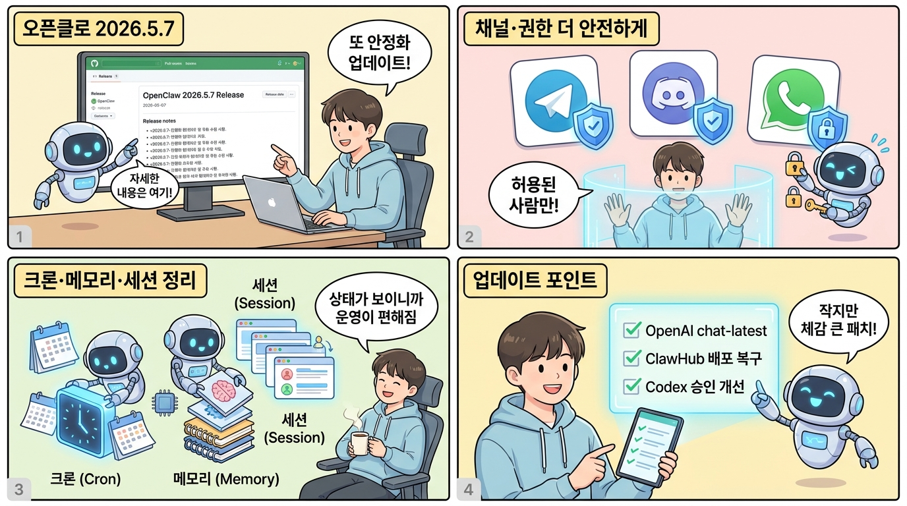
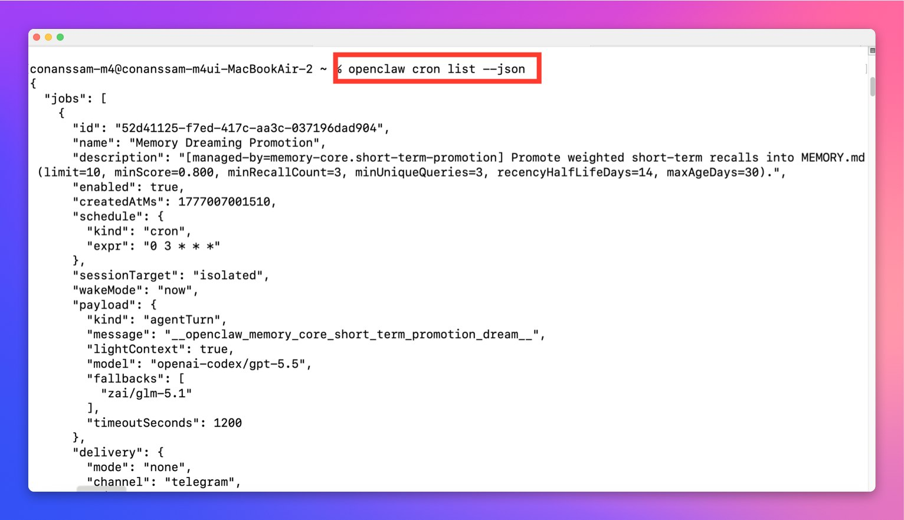

오픈클로(OpenClaw) **2026.5.7**이 릴리즈됨.

한 줄 요약 — 이번 버전은 큰 신기능보다 **운영 안정성 패치**에 가깝다. ClawHub 배포 실패 복구, 채널 권한 처리, 크론 상태 출력, Telegram/Discord/WhatsApp 메시징, Codex 승인 흐름처럼 실제로 오래 켜두고 쓰는 사람에게 중요한 부분이 정리됐다.

---

## 1. ClawHub 플러그인 배포가 더 안전해짐

이번 릴리즈 첫머리에 나온 변경은 **Release/plugin publishing** 쪽이다.

ClawHub CLI 의존성 설치가 일시적으로 실패해도 재시도하고, 일부 preview cell이 흔들려도 전체 플러그인 배포가 숨어서 실패하지 않도록 검증을 강화했다. 배포 후에는 예상한 ClawHub 패키지 버전이 실제로 올라갔는지도 확인한다.

플러그인 생태계를 쓰는 입장에서는 이런 패치가 꽤 중요하다. 설치는 됐다고 나오는데 특정 플러그인 버전만 빠져 있거나, 유지보수 릴리즈가 애매하게 꼬이는 상황을 줄여주기 때문.

## 2. `openai/chat-latest` 모델 옵션 추가

OpenAI 쪽에는 `openai/chat-latest`를 명시적으로 쓸 수 있는 모델 override가 추가됐다.

이건 안정 기본 모델을 바꾸지 않고도, 움직이는 ChatGPT Instant API alias를 테스트해보고 싶은 사람을 위한 옵션에 가깝다.

즉:

- 기본 모델은 그대로 둔다
- 특정 세션이나 설정에서만 `openai/chat-latest`를 실험한다
- alias가 바뀌어도 전체 운영 설정이 흔들리지 않는다

실험 좋아하는 사람한테는 괜찮은 탈출구.

## 3. 크론 CLI JSON에 상태가 들어감

크론 작업 목록을 JSON으로 확인하는 명령어는 아래와 같다.

```bash
openclaw cron list --json
```



`openclaw cron list --json`, `openclaw cron show --json` 출력에 계산된 `status`가 포함된다.

기존에는 외부 도구가 크론 작업을 읽어도 그 작업이 지금 disabled인지, running인지, ok/error/skipped/idle인지 직접 추론해야 했다. 이제 JSON에 상태가 같이 나오니 모니터링이나 대시보드 만들기가 훨씬 쉬워진다.

스크린샷처럼 `jobs` 배열 안에서 각 작업의 `id`, `name`, `description`, `enabled`, `schedule`, `sessionTarget`, `wakeMode`, `payload`, `delivery` 같은 정보를 한 번에 확인할 수 있다. 예를 들어 `schedule.kind`가 `cron`이고 `expr`이 `0 3 * * *`이면 매일 새벽 3시에 실행되는 작업이라는 뜻이다.

에이전트를 주기 작업으로 오래 돌리는 사람에게는 작은 듯 큰 개선이다.

## 4. 채널 CLI와 권한 처리가 정리됨

`openclaw channels list`는 이제 채널 중심으로 더 깔끔하게 동작한다. bundled/catalog 채널까지 보려면 `--all`을 쓰는 방식이고, 설치됨/설정됨/활성화됨 상태를 렌더링한다.

대신 모델 인증·사용량 정보는 다음 명령 쪽으로 이동했다.

- `openclaw models auth list`
- `openclaw status`
- `openclaw models list`

역할이 분리된 셈이다. 채널 목록은 채널만, 모델 인증은 모델 명령에서 보는 구조.

권한 쪽도 중요하다. native command handler에서 owner enforcement를 지키도록 수정됐고, Active Memory의 전역 토글은 admin scope를 요구하게 됐다. 자동응답에서 inline skill tool dispatch도 before-tool-call authorization hook을 통과하도록 막았다.

요약하면, **명령과 메모리, 툴 호출의 권한 경계가 더 단단해졌다.**

## 5. Telegram, Discord, WhatsApp 메시징 안정화

이번에도 채널 패치가 많다.

**Telegram**
- DM/group/native command/callback authorization에서 `accessGroup:*` allowlist를 먼저 존중
- `getUpdates` polling watchdog을 실제 inbound poller 생존성에 묶음
- 같은 Telegram 턴에서 `message` 도구로 같은 채팅에 이미 보냈다면 중복 fallback을 내지 않도록 수정
- `/models` 버튼에서 `hf.co`처럼 점이 들어간 provider id 파싱 수정

**Discord**
- `discord:channel:<id>` 같은 provider-prefixed target을 DM이 아니라 채널 전송으로 해석
- voice channel 권한 감사 강화
- 음성 캡처의 post-speech silence grace를 2.5초로 늘려 말이 덜 잘리게 개선

**WhatsApp**
- phone-number proactive send가 Baileys LID forward mapping을 통과하도록 수정
- captioned `MEDIA:` 자동응답이 빈 미디어 메시지 + 캡션 메시지로 두 번 나가지 않게 수정

메시징 채널을 실제 생활 자동화에 붙여 쓰는 사람에게는 이런 패치들이 체감된다. 특히 Telegram/Discord/WhatsApp은 OpenClaw에서 사용 빈도가 높은 채널이라 더 그렇다.

## 6. Codex 승인 흐름 개선

Codex approval 모드에서는 pre-guardian native `PermissionRequest` hook을 기본으로 설치하지 않도록 바뀌었다.

쉽게 말하면, Codex 쪽 reviewer가 안전한 명령을 먼저 승인할 수 있는데도 OpenClaw가 그 앞에서 또 승인 UI를 띄우는 중복·충돌 상황을 줄인 것이다.

또 동일한 Codex native PermissionRequest에 대한 `allow-always` 결정은 활성 세션 동안 기억하고, Telegram 같은 native approval UI가 오래된 선택지를 보여주지 않도록 실제 가능한 결정만 검증해서 렌더링한다.

승인 UI를 많이 쓰는 사람에게는 꽤 중요한 UX 패치.

## 7. 세션·메모리·컨텍스트 엔진 안정화

세션과 메모리 쪽도 잔잔하지만 핵심적인 수정이 들어갔다.

- `/new`나 `sessions.reset` 이후 오래된 skills snapshot 캐시를 비움
- source history가 줄거나 assembly가 실패했을 때 context view 캐시를 무효화
- compaction summary reserve token을 모델 출력 한도에 맞춰 clamp
- daily gateway-agent session rollover가 session id를 바꿀 때 새 transcript 파일을 안정적으로 저장
- completed session-mode subagent registry row가 retention 설정을 제대로 따름

이런 건 눈에 잘 안 띄지만, 장시간 켜둔 에이전트가 “왜 예전 상태를 기억하지?” 혹은 “왜 갑자기 max_tokens가 이상하지?” 같은 문제를 덜 만들게 해준다.

## 8. 2026.5.5~5.6에서 이어진 복구 포인트

이번 5.7은 바로 앞의 5.5, 5.6 안정화 흐름과 같이 보는 게 좋다.

5.5에서는 Feishu topic routing, Telegram/Codex progress draft, xAI Grok reasoning control, Control UI 세션 성능, iOS pairing, plugin diagnostics, TUI/doctor/session cleanup 같은 넓은 영역이 손봤다.

5.6에서는 특히 **Doctor/OpenAI Codex 복구**가 중요했다. 2026.5.5의 `doctor --fix`가 유효한 `openai-codex/*` ChatGPT/Codex OAuth route를 `openai/*`로 바꿔버릴 수 있던 문제를 되돌렸다. OAuth-only GPT-5.5 환경을 쓰는 사람은 이 부분 때문에 5.6 이상으로 가는 게 안전하다.

공식 복구 문서도 같이 올라와 있다:

<https://docs.openclaw.ai/providers/openai#check-and-recover-codex-oauth-routing>

---

## 업데이트해야 할 사람

**업데이트 추천:**

- Telegram, Discord, WhatsApp, Feishu, Slack 같은 채널을 실제로 연결해 쓰는 사람
- Codex approval / native approval UI를 자주 쓰는 사람
- cron 작업을 JSON으로 모니터링하거나 자동화하는 사람
- ClawHub 플러그인 설치·배포 안정성이 중요한 사람
- OpenAI Codex OAuth / GPT-5.5 라우팅을 쓰는 사람

**천천히 봐도 되는 사람:**

- 로컬에서 가끔만 실행하고 채널·크론·플러그인을 거의 안 쓰는 사람
- 현재 2026.5.4 이후 환경이 안정적으로 돌아가고 있고, 당장 위 항목에 해당하지 않는 사람

그래도 OpenClaw는 채널·플러그인·모델 제공자 연결이 많은 도구라, 이번처럼 권한과 운영 안정성 쪽 패치는 가능하면 따라가는 편이 낫다.

---

**요약하면**

5.7은 화려한 기능 릴리즈라기보다, 매일 켜두는 OpenClaw를 덜 삐걱거리게 만드는 정리판이다.

ClawHub 배포는 더 복구 가능해졌고, 크론 상태는 더 읽기 쉬워졌고, Telegram/Discord/WhatsApp 같은 채널은 덜 헷갈리게 동작하고, Codex 승인 흐름은 더 자연스러워졌다.

작지만 체감 큰 패치.

---

*OpenClaw v2026.5.7 기준 정리. 전체 changelog: <https://github.com/openclaw/openclaw/releases>*
