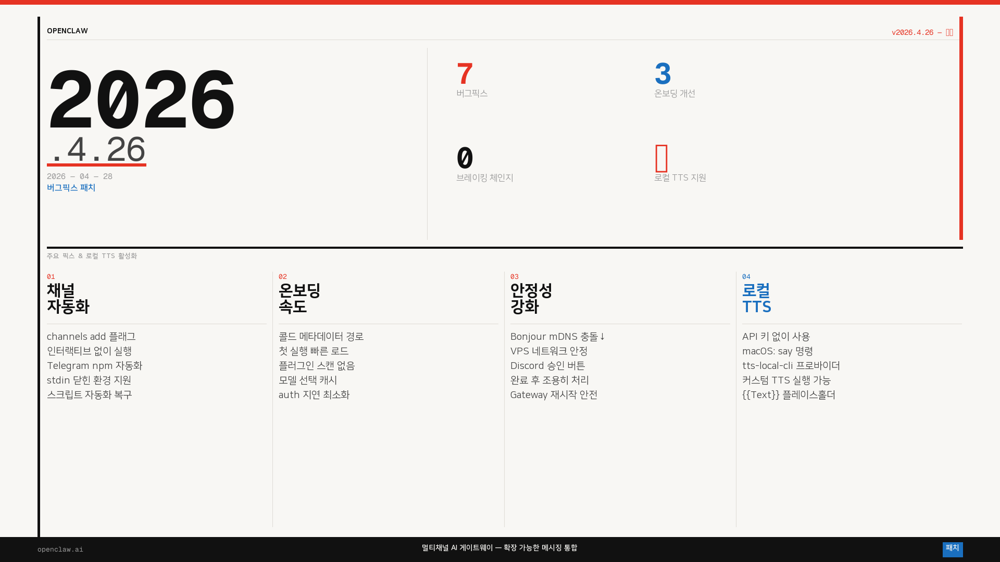

4.26은 기능 추가가 아니라 패치 릴리즈임. 근데 이번에 실용적으로 챙길 게 두 가지 있음. 하나는 채널 자동화 버그픽스, 하나는 4.25에서 들어온 **로컬 TTS** 활성화 방법.

---

## 4.26에서 바뀐 것

### 1. `channels add` 플래그 드리븐 실행

기존엔 `openclaw channels add`를 스크립트에서 실행하면 인터랙티브 프롬프트가 뜨면서 멈췄음. stdin이 닫힌 환경(npm 자동화, CI 등)에서는 아예 동작을 못 했음.

4.26부터 `--flag`를 쓰면 프롬프트 없이 바로 플러그인 설치까지 실행됨. Telegram 채널 셋업 자동화가 막혀 있던 사람들한테 직접적인 수정임.

```bash
# 이전엔 stdin 닫히면 멈췄음
openclaw channels add telegram

# 4.26: 플래그로 비대화형 실행 가능
openclaw channels add telegram --source <source>
```

### 2. 온보딩 속도 개선

첫 실행 시 플러그인 카탈로그를 전부 불러오던 동작이 콜드 메타데이터 경로로 바뀜. 플러그인이 많이 쌓인 환경에서 모델 선택 사이 지연이 사라졌음. auth 이후 다음 프롬프트가 뜨는 속도도 개선됨.

### 3. Gateway/Bonjour 안정성

mDNS 패킷이 잘못된 형태로 들어오거나 VPS 환경에서 네트워크 제한이 있을 때 게이트웨이가 크래시되던 문제가 수정됨. 이제 Bonjour를 비활성화하거나 재시작하는 방식으로 처리됨.

### 4. Discord 승인 버튼 중복 처리

elevated 모드가 자동으로 승인을 처리한 뒤 버튼을 다시 누르면 에러가 뜨던 문제. 이제 조용히 무시됨.

---

## 로컬 TTS 활성화 방법 (4.25~)

4.25에서 `tts-local-cli` 프로바이더가 추가됐음. API 키가 없어도 로컬 명령어를 TTS 엔진으로 쓸 수 있음.

### macOS: 기본 `say` 명령 사용

macOS에는 `say`가 기본 내장됨. 따로 설치 없이 바로 쓸 수 있음.

`~/.openclaw/openclaw.json`에 아래 설정 추가:

```json5
{
  messages: {
    tts: {
      auto: "always",
      provider: "tts-local-cli",
      providers: {
        "tts-local-cli": {
          command: "say",
          args: ["-o", "{{OutputPath}}", "{{Text}}"],
          outputFormat: "wav",
          timeoutMs: 120000,
        },
      },
    },
  },
}
```

설정 후 채팅에서 `/tts status`로 확인, `/tts audio 안녕하세요`로 테스트.

### 커스텀 TTS 명령 연결

`say` 말고 다른 로컬 TTS 도구(piper, edge-tts 등)도 연결할 수 있음. 플레이스홀더는 `{{Text}}`, `{{OutputPath}}`, `{{OutputDir}}`, `{{OutputBase}}` 네 가지 지원.

예시: piper 연결

```json5
{
  "tts-local-cli": {
    command: "piper",
    args: [
      "--model", "/path/to/model.onnx",
      "--output_file", "{{OutputPath}}",
      "--text", "{{Text}}"
    ],
    outputFormat: "wav",
    timeoutMs: 120000,
  }
}
```

### 자동 TTS 모드 옵션

| 값 | 동작 |
|---|---|
| `"always"` | 모든 응답에 음성 자동 첨부 |
| `"off"` | 비활성화 |
| `"tagged"` | `[[tts:...]]` 디렉티브가 있을 때만 |
| `"inbound"` | 음성 메시지에 대한 답장에만 |

한 채팅에서만 켜고 싶으면 `/tts chat on`, 끄려면 `/tts chat off`.

---

## 지원 TTS 프로바이더 전체 목록

4.25~4.26 기준 13개 프로바이더 지원:

| 프로바이더 | 인증 |
|---|---|
| Azure Speech | `AZURE_SPEECH_KEY` + `AZURE_SPEECH_REGION` |
| ElevenLabs | `ELEVENLABS_API_KEY` |
| Google Gemini | `GEMINI_API_KEY` |
| Inworld | `INWORLD_API_KEY` |
| **Local CLI** | **없음 — 로컬 명령 실행** |
| **Microsoft** | **없음 — Edge 뉴럴 TTS** |
| MiniMax | `MINIMAX_API_KEY` |
| OpenAI | `OPENAI_API_KEY` |
| OpenRouter | `OPENROUTER_API_KEY` |
| Volcengine | `VOLCENGINE_TTS_API_KEY` |
| Vydra | `VYDRA_API_KEY` |
| xAI | `XAI_API_KEY` |
| Xiaomi MiMo | `XIAOMI_API_KEY` |

API 키 없이 쓸 수 있는 건 **Local CLI**와 **Microsoft** 두 가지임. Microsoft는 Edge 뉴럴 TTS 서비스를 외부에서 쓰는 방식이라 SLA가 없음. 안정적으로 쓰려면 Local CLI가 낫고, macOS라면 `say`가 제일 간단함.

---

4.26은 작은 릴리즈임. 근데 채널 자동화 수정은 Telegram 셋업 스크립트 짜던 사람들한테 실질적인 해결이었음. 로컬 TTS는 4.25에서 들어온 거지만 API 키 없이 바로 써볼 수 있는 기능이라 같이 정리함.
