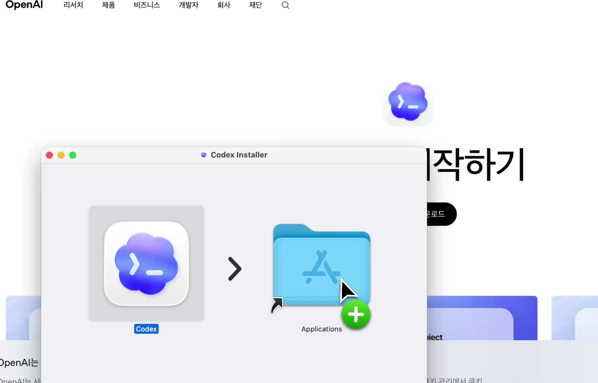
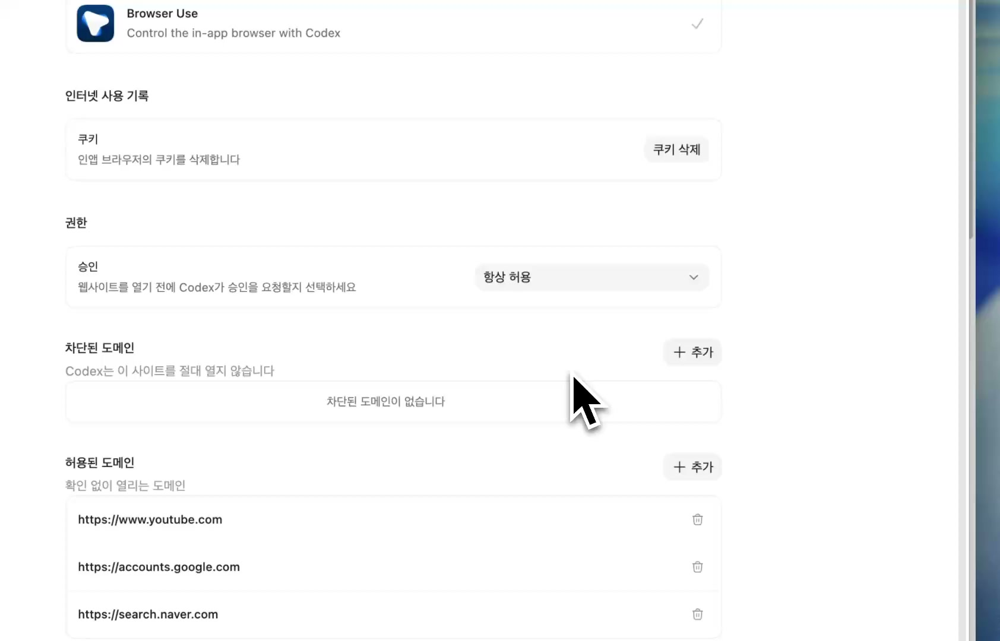
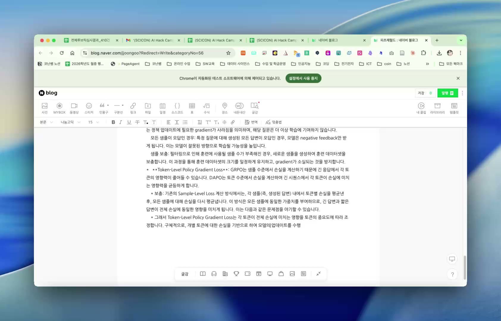

OpenClaw 2026.4.27 업데이트에서 눈에 띄는 변화가 하나 있음.

Codex-mode 에이전트가 **Codex Computer Use**를 사용할 수 있도록 setup 흐름이 들어갔다는 점임.

정확히 말하면 OpenClaw가 직접 데스크톱을 조작하는 구조는 아님. OpenClaw는 Codex app-server 쪽에 Computer Use 플러그인이 준비되어 있는지 확인하고, 필요하면 설치/재활성화/검증을 돕는 역할을 함. 실제 데스크톱 제어와 권한 처리는 Codex가 소유하는 방식임.

이 차이가 중요함. “OpenClaw가 몰래 브라우저를 조작한다”가 아니라, **Codex의 권한 모델 안에서 Computer Use를 OpenClaw 에이전트 흐름에 붙였다**에 가까움.



## 4.27에서 추가된 핵심

OpenClaw 2026.4.27 changelog에는 이렇게 정리되어 있음.

> Codex: add Computer Use setup for Codex-mode agents, including `/codex computer-use status/install`, marketplace discovery, optional auto-install, and fail-closed MCP server checks before Codex-mode turns start.

핵심은 네 가지임.

1. `/codex computer-use status`로 준비 상태를 확인할 수 있음.
2. `/codex computer-use install`로 Codex Computer Use 플러그인 설치/재활성화를 진행할 수 있음.
3. 설정에 따라 turn 시작 전에 자동 설치 또는 재활성화를 시도할 수 있음.
4. MCP 서버가 준비되지 않았으면 조용히 넘어가지 않고 실패 처리함. 즉 fail-closed 방식임.

자동화에서 이 fail-closed가 꽤 중요함. 브라우저 제어 권한이 없는 상태인데 있는 척하고 작업을 시작하면, 중간에 이상한 실패가 생김. 4.27은 그 전에 “Computer Use 준비 안 됨”을 명확히 잡아내는 쪽으로 설계된 것임.

## Browser Use 권한이 핵심임

영상에서 가장 중요한 장면은 Browser Use 설정 화면임.



화면에는 `Browser Use`가 보이고, 설명에는 “Control the in-app browser with Codex”라고 되어 있음.

이 말은 단순함.

Codex가 앱 안의 브라우저를 제어할 수 있다는 뜻임.

여기서 도메인 설정이 중요함. 영상 화면에는 허용된 도메인으로 유튜브, 구글 계정, 네이버 검색 등이 보임. 이런 식으로 자동화를 허용할 범위를 정해두면, 에이전트가 브라우저를 써야 하는 작업을 더 안정적으로 수행할 수 있음.

다만 이것도 아무 사이트나 다 열어두는 기능으로 보면 안 됨. Computer Use는 강력한 기능이라서 신뢰할 수 있는 도메인 위주로 제한하는 편이 맞음.

## 실제 사용 장면: 네이버 블로그 작성

영상 후반에는 Chrome 자동화 테스트 소프트웨어가 제어 중이라는 안내와 함께 네이버 블로그 편집기가 열려 있음.



이 장면이 보여주는 건 명확함.

이전의 에이전트 자동화가 파일 수정, 터미널 실행, API 호출 중심이었다면, Computer Use가 붙은 흐름에서는 브라우저 UI 자체가 작업 대상이 됨.

예를 들면 이런 작업들이 가능해짐.

- 브라우저에서 특정 서비스 접속
- 로그인된 세션을 이용한 페이지 이동
- 글쓰기 에디터 열기
- 제목과 본문 입력
- 이미지 삽입
- 발행 전 화면 확인

물론 실제 발행 버튼을 누르는 작업은 늘 조심해야 함. 자동화가 가능하다는 것과 아무 검증 없이 외부 게시를 맡긴다는 것은 다른 문제임.

## OpenClaw가 하는 일과 Codex가 하는 일

구조를 나누면 이해가 쉬움.

OpenClaw가 하는 일:

- Codex-mode 에이전트 실행 흐름 관리
- Computer Use 설정 확인
- `/codex computer-use status/install` 명령 제공
- marketplace discovery
- optional auto-install
- MCP server ready check

Codex가 하는 일:

- Computer Use 플러그인 실행
- 브라우저/데스크톱 제어 권한 처리
- native MCP tool call 수행
- 로컬 OS 권한 모델 준수

즉 OpenClaw는 “준비와 연결”을 맡고, Codex는 “실제 조작”을 맡는 구조임.

## 설정 관점에서 봐야 할 것

문서 기준으로는 `plugins.entries.codex.config.computerUse` 설정이 핵심임.

예시는 이런 형태임.

```json
{
  "plugins": {
    "entries": {
      "codex": {
        "enabled": true,
        "config": {
          "computerUse": {
            "autoInstall": true
          }
        }
      }
    }
  },
  "agents": {
    "defaults": {
      "agentRuntime": {
        "id": "codex",
        "fallback": "none"
      }
    }
  }
}
```

여기서 `autoInstall`을 켜면 Codex-mode turn이 시작되기 전에 Computer Use 준비 상태를 확인하고, 가능한 경우 설치 또는 재활성화를 시도함.

다만 기존 세션은 런타임과 Codex thread binding을 유지하므로, 설정을 바꾼 뒤에는 새 세션에서 테스트하는 편이 안전함.

## 왜 중요한가

이 업데이트는 “에이전트가 브라우저를 본다” 수준이 아님.

브라우저 기반 업무가 자동화 대상으로 들어온다는 뜻임.

특히 블로그 운영자에게는 의미가 큼.

- 자료 검색
- 영상 확인
- 스크린샷 기반 글 작성
- CMS 편집기 입력
- 발행 전 화면 검수
- 여러 플랫폼 동시 배포

이런 작업은 API만으로는 애매한 경우가 많음. 서비스마다 API가 없거나, 에디터 UI에서만 가능한 동작이 있기 때문임.

Computer Use가 붙으면 이런 “사람이 브라우저에서 하던 반복 작업”이 에이전트 작업 범위 안으로 들어옴.

## 그래도 조심할 점

강력한 자동화일수록 안전장치가 중요함.

1. 허용 도메인을 최소화해야 함.
2. 로그인된 계정으로 외부 게시를 할 때는 검수 단계를 두는 게 좋음.
3. 결제, 삭제, 공개 발행 같은 동작은 승인 흐름을 분리해야 함.
4. Computer Use가 준비되지 않은 상태에서는 억지로 진행하지 않는 게 맞음.

OpenClaw 4.27이 fail-closed check를 넣은 이유도 이 지점과 연결됨.

## 정리

OpenClaw 2026.4.27은 Codex Computer Use를 Codex-mode 에이전트 흐름에 연결하는 업데이트였음.

덕분에 에이전트는 터미널과 파일만 다루는 도구에서, 브라우저 기반 업무까지 넘볼 수 있는 형태로 확장되고 있음.

아직은 설정과 권한을 신중히 다뤄야 하는 기능임. 하지만 방향은 분명함.

앞으로 블로그 작성, 자료 조사, 웹서비스 운영, 반복 입력 업무 같은 영역에서 “AI가 브라우저를 직접 다루는 자동화”가 훨씬 자연스러워질 가능성이 큼.
