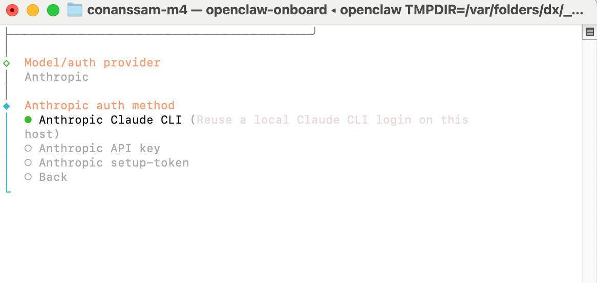

Claude Code CLI로 OpenClaw 연결은 됩니다.
실제로 붙습니다.
설정도 어렵지 않습니다.

근데 여기서 많이 헷갈립니다.
**된다**와 **안전하다**는 같은 말이 아닙니다.
이 주제는 그 차이를 정확히 나눠서 봐야 합니다.

결론부터 적으면 이렇습니다.

- **공식 Claude Code CLI 단독 사용**은 안전합니다.
- **OpenClaw가 Claude CLI를 호출하는 `--method cli` 위임 방식**은 현재 작동합니다. 근데 회색 지대입니다.
- **직접 OAuth 토큰 삽입, 구독 우회 프록시**는 피해야 합니다.

## OpenClaw에서 Claude CLI를 붙이는 방법

순서는 단순합니다.

### 1. Claude Code CLI에 먼저 로그인합니다

```bash
claude auth login
```

이 단계는 공식 경로입니다.
Anthropic이 제공한 Claude Code CLI를 본인 PC에서 직접 쓰는 방식입니다.
여기까지는 비교적 명확합니다.

### 2. OpenClaw에서 Claude CLI 재사용을 설정합니다

```bash
openclaw models auth login --provider anthropic --method cli --set-default
```

이 명령은 OpenClaw가 로컬 `claude` 바이너리를 호출해서 로그인 상태를 재사용하도록 잡는 방식입니다.
즉 OpenClaw가 OAuth 토큰 문자열을 직접 들고 가는 구조가 아닙니다.
공식 Claude CLI가 세션을 관리합니다.

### 3. 온보딩 화면에서 Claude CLI 방식을 고릅니다


*OpenClaw 온보딩 또는 인증 설정 화면에서 `Anthropic Claude CLI`를 고르면, 이 호스트의 로컬 Claude CLI 로그인 정보를 재사용하는 방식으로 연결됩니다.*

스크린샷 기준으로 보면 흐름은 명확합니다.

- Model/auth provider: `Anthropic`
- Anthropic auth method: `Anthropic Claude CLI`

설정 자체는 여기서 끝입니다.
진입 장벽은 낮습니다.
그래서 많이들 관심을 가집니다.

## 왜 이 방식이 매력적인가

이유는 단순합니다.

- API Key를 새로 발급하지 않아도 됩니다.
- 이미 Claude Code CLI 구독을 쓰고 있으면 바로 붙여볼 수 있습니다.
- OpenClaw가 OAuth 토큰을 직접 보관하지 않습니다.
- 개인 실험이나 로컬 테스트에선 확실히 편합니다.

즉 **편한 길**입니다.
여기까지는 맞습니다.

## 근데 왜 회색 지대인가

여기서부터 선이 갈립니다.

Anthropic 공식 Claude Code CLI를 **직접** 쓰는 건 허용된 경로입니다.
스크립트, 자동화 용도로 설계된 공식 제품이고, 2026-02-20 Consumer ToS 업데이트에서도 자동화 접근 금지 조항의 예외로 취급됩니다.

문제는 그 다음입니다.
OpenClaw 같은 **제3자 도구가** 그 CLI를 subprocess로 호출해서 구독 인증을 재사용하는 순간, 해석이 달라집니다.
지금은 됩니다.
문서도 현재는 안정 경로로 안내합니다.
근데 Anthropic이 앞으로도 이걸 계속 열어둘 거라고 장담하긴 어렵습니다.


*지금 되는 것과 앞으로도 안전한 것은 다릅니다. 이 방식이 회색 지대로 보이는 이유가 여기 있습니다.*

실제로 2026-04-04 이후 Anthropic은 **제3자 도구에서 Pro/Max OAuth 사용 금지**를 더 강하게 적용하는 쪽으로 움직이고 있습니다.
이슈 #63316에서도 CLI 위임 방식이 나중에 추가 차단될 수 있다고 적어둔 상태입니다.

즉 이건 이렇게 보는 게 맞습니다.

- **현재 작동함**
- **공식 문서가 당장은 안정 경로로 분류함**
- **근데 공급자 정책 변화에 가장 먼저 흔들릴 수 있음**

## 공식 CLI 단독 사용은 왜 안전하다고 보나

이건 오히려 간단합니다.
공식 제품이기 때문입니다.
Anthropic이 제공한 공식 CLI를 본인 환경에서 직접 실행하는 건 제품이 의도한 사용 방식입니다.

중요한 건 여기입니다.

- **Claude Code CLI 자체 사용**과
- **제3자 도구가 Claude Code CLI를 대신 호출하는 사용**은

같아 보이지만 정책상 같은 영역이 아닐 수 있습니다.
여길 섞으면 설명이 꼬입니다.

## 금지된 경로는 뭐가 있나

이건 더 선명합니다.

### 1. 직접 OAuth 토큰 삽입

Pro/Max OAuth 토큰을 직접 제3자 도구에 넣는 방식입니다.
이건 4월 4일 이후 서버 차단 대상입니다.

### 2. 구독 우회 프록시

`claude-max-api-proxy` 같은 커뮤니티 프록시가 여기에 들어갑니다.
기술적으로 될 수는 있습니다.
근데 Anthropic은 이런 흐름에 대해 사실상 경고를 유지하고 있습니다.


*편한 우회로처럼 보여도 오래 못 갑니다. 특히 토큰 직접 삽입이나 프록시는 여기로 흘러갑니다.*

짧게 편해 보일 수는 있습니다.
근데 길게 보면 가장 위험합니다.

## 권장

### 1. 정책적으로 100% 안전한 길

**API Key 인증**입니다.
Anthropic Console에서 키를 발급받아 연결하는 방식입니다.
이 경로가 가장 깔끔합니다.
모든 제3자 도구에서 설명이 쉽고, 정책 리스크도 가장 낮습니다.

### 2. 현재 OpenClaw에서 구독을 활용하는 길

**`--method cli` 위임 방식**입니다.
당분간은 작동합니다.
근데 언제든 차단 가능성은 모니터링해야 합니다.
이건 편한 길이지, 완전히 안전한 길은 아닙니다.

### 3. 피해야 할 것

- 직접 OAuth 토큰 삽입
- 구독 우회 프록시
- 비공식 세션 재사용 해킹

짧게 편한데, 길게 보면 제일 비쌉니다.

## 그래서 누구는 뭘 쓰면 되나

### 개인 사용자

로컬 테스트나 학습용이면 `--method cli`로 붙여볼 수 있습니다.
다만 이 경로에 작업 전체를 잠그는 건 추천하기 어렵습니다.
언제든 API Key로 옮길 수 있게 생각해두는 편이 낫습니다.

### 팀 또는 운영 환경

처음부터 API Key가 맞습니다.
정책 설명이 쉽고, 장애 원인도 단순하고, 유지보수도 편합니다.

### 블로그나 강의에서 소개하는 사람

문장을 이렇게 끊어서 설명해야 합니다.

- 공식 Claude Code CLI 자체는 안전합니다.
- OpenClaw가 그 CLI를 호출해 재사용하는 위임 방식은 현재 작동하지만 회색 지대입니다.
- OAuth 직접 삽입이나 프록시는 피해야 합니다.

이 선을 흐리면 독자가 잘못 받아들입니다.

## 마무리

이건 두 문장으로 끝납니다.

**Claude Code CLI를 직접 쓰는 건 안전합니다.**
**OpenClaw가 그 CLI를 대신 호출하는 위임 방식은 현재 가능하지만 회색 지대입니다.**

그래서 선택 기준도 단순합니다.

- 편하게 빨리 붙이고 싶으면 `--method cli`
- 오래 안정적으로 쓰고 싶으면 API Key
- 토큰 직접 삽입이나 프록시는 피하기

이 주제는 “된다”보다 “어디까지 안전한가”를 같이 적어야 합니다.
그게 제일 중요합니다.
