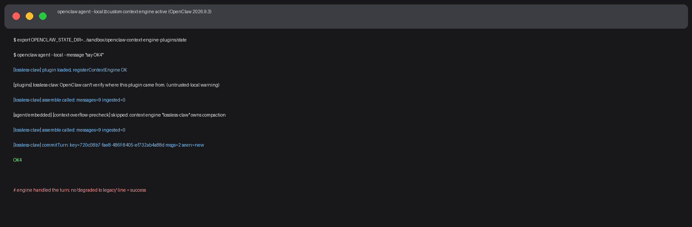
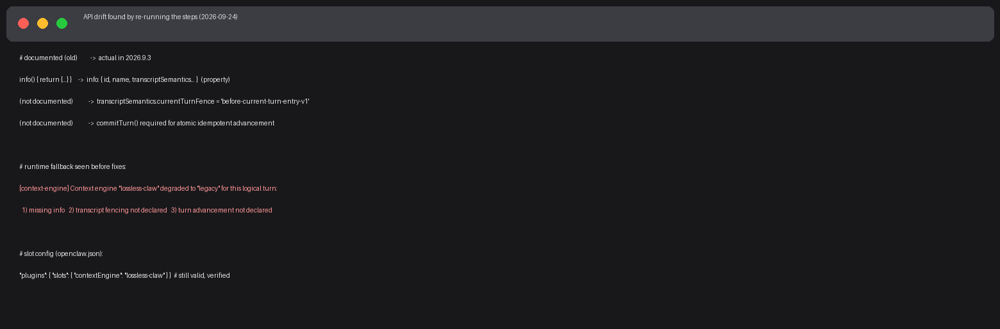

컨텍스트 엔진은 OpenClaw에서 세션의 기억(컨텍스트)을 정리하는 시스템 전체를 교체할 수 있는 플러그인 슬롯이다.

이 글은 원래 2026-03-08에 쓴 설정 가이드인데, 2026-09-24에 블로그봇이 최신 OpenClaw(2026.9.3)에서 전 과정을 다시 실행해 봤다. <span style="background-color: #fff59d"><strong>구버전 문서와 3군데가 달라져 있었다</strong></span>. 이 글은 그걸 모두 반영한 최신판이다.

| 항목 | 내용 |
|---|---|
| 검증일 | 2026-09-24 |
| OpenClaw 버전 | 2026.9.3 (1391f7c) |
| 머신 | MacBook Pro M2 Max 32GB, macOS, Node v24.18.0 |
| 검증 방법 | 최소 커스텀 엔진 등록 → 슬롯 지정 → 실제 에이전트 턴 실행 |
| 원문 작성일 | 2026-03-08 (v5 리팩토링에서 보강) |

## 컨텍스트 엔진이란 무엇인가

### 기본 파이프라인만으로는 부족할 때

기본 파이프라인(`legacy`)은 모든 워크로드에 같은 방식으로 컨텍스트를 정리한다. 교육용 대화, 코딩 작업, 긴 협업 채팅 — 각각 다르게 정리해도 되는데 말이다.

"하나의 라인으로 모든 것을 처리한다"는 건 공장에서 조립 라인 하나로 모든 제품을 조립하는 것과 비슷하다. 자동차와 휴대폰을 같은 라인에서 조립할 수는 있지만, 효율적이지는 않다.

### 교체 범위: ingest → assemble → compact 전체

컨텍스트 엔진은 "일부만 바꾸는 게" 아니다. 컨텍스트를 수집하는 단계(`ingest`) → 프롬프트 조립(`assemble`) → 압축(`compact`)까지, 세션 기억 처리 전체를 새로 설계한다. 2026.9.3 기준으로 실제 인터페이스는 이것보다 훨씬 많은 훅을 갖고 있다:

- `bootstrap` — 세션 시작 시 엔진 상태 초기화

- `ingest` / `ingestBatch` — 메시지 하나/턴 배치 단위 반영

- `afterTurn` — 턴이 끝난 뒤 후처리(자동 압축 트리거 포함)

- `commitTurn` — <span style="background-color: #fff59d"><strong>턴 단위 원자적·멱등 커밋</strong></span> (필수, 아래 참고)

- `assemble` — 토큰 예산 안에서 모델 컨텍스트 조립

- `compact` — 요약·정리로 토큰 절약

- `maintain` — 부트스트랩/턴 뒤 트랜스크립트 유지보수

## 등록부터 활성화까지

### 1단계: 엔진 등록 (`api.registerContextEngine`)

2026.9.3에서 블로그봇이 직접 검증한 최소 동작 코드다. <span style="background-color: #fff59d"><strong>`info`는 프로퍼티지 메서드가 아니다</strong></span>. 예전 문서처럼 `info() { return {...} }`로 쓰면 런타임이 "invalid ContextEngine: missing info"라고 거부하고 legacy로 폴백한다.

```javascript
module.exports = (api) => {
  const seenKeys = new Set();

  api.registerContextEngine('lossless-claw', () => ({
    // info는 프로퍼티 (메서드 아님 — 2026.9.3 실측)
    info: {
      id: 'lossless-claw',
      name: 'Lossless Claw',
      version: '1.0.0',

      transcriptSemantics: {
        currentTurnFence: 'before-current-turn-entry-v1',
        turnAdvancementIdempotency: 'atomic-idempotent-v1'
      },

      ownsCompaction: true,
      turnMaintenanceMode: 'foreground'
    },

    async ingest(params) { /* 컨텍스트 수집 */ },
    async assemble(params) { /* 프롬프트 조립 */ return { messages: params.messages }; },
    async compact(params) { /* 압축 */ return { messages: [] }; },

    async commitTurn(params) {
      // 원자적·멱등 턴 커밋 — 없으면 폴백된다 (2026.9.3 실측)
      if (seenKeys.has(params.advancementKey)) return { status: 'duplicate' };
      seenKeys.add(params.advancementKey);
      return { status: 'committed' };
    }
  }));
};
```

핵심 사항 두 가지:

- <span style="background-color: #fff59d"><strong>`transcriptSemantics.currentTurnFence`를 선언하지 않으면</strong></span> "current-turn transcript fencing is not declared" 경고와 함께 그 턴만 legacy로 폴백된다. 설정은 그대로 두고 다음 턴에 재시도한다.

- `commitTurn`이 없으면 "atomic idempotent turn advancement is not declared"로 폴백된다. 런타임은 프로세스 실패 후 같은 advancementKey로 재시도할 수 있으므로, 엔진은 중복 커밋을 스스로 판별해 `"duplicate"`를 반환해야 한다.

### 2단계: 슬롯에 지정 (`plugins.slots.contextEngine`)

`openclaw.json`에 활성 엔진을 지정한다. 이 부분은 문서 그대로 동작했다.

```json
{
  "plugins": {
    "slots": { "contextEngine": "lossless-claw" }
  }
}
```

플러그인 발견은 `plugins.load.paths`로 로컬 경로를 직접 지정할 수 있다. 블로그봇은 격리된 샌드박스 상태 디렉터리에서 이렇게 테스트했다:

```json
{
  "plugins": {
    "load": { "paths": ["./plugins/lossless-claw"] },
    "slots": { "contextEngine": "lossless-claw" }
  }
}
```

플러그인 폴더에는 매니페스트 `openclaw.plugin.json`(최소 `id`, `name`, `configSchema`)이 있어야 한다. <span style="background-color: #fff59d"><strong>로컬 경로 플러그인은 신뢰 검증이 안 된다는 경고가 뜬다</strong></span>. 실서비스에서는 `plugins.allow`에 추가하거나 공식 npm/ClawHub에서 설치하는 게 안전하다.

### Exclusive Slot: 동시에 하나만

동시에 여러 엔진이 같은 세션에서 작동하면 어느 엔진이 결과를 냈는지 알기 어렵다. 소스 코드의 등록 시그니처에도 "exclusive slot - only one active at a time"로 명시돼 있다. 한 번에 하나만, `plugins.slots.contextEngine`에 지정한다.

### 폴백 동작 (검증 중 발견)

엔진이 잘못됐을 때 런타임은 죽지 않는다. 대신 그 턴만 legacy가 대신 처리한다:

```text
[context-engine] Context engine "lossless-claw" degraded to "legacy" for this
logical turn: ... The "legacy" engine will handle only this turn; configuration
is unchanged, and "lossless-claw" will be retried next turn.
```

<span style="background-color: #fff59d"><strong>설정은 바뀌지 않고 다음 턴에 재시도한다</strong></span>. 그래서 잘못된 엔진을 끼워도 대화가 즉시 죽지는 않는다. 대신 이 경고를 로그에서 보면 내 엔진이 사실상 안 돌고 있다는 뜻이다.

### Legacy vs Custom 비교

| 항목 | legacy | custom engine |
|---|---|---|
| 토큰 사용량 | 기본 알고리즘 | 워크로드별 최적화 가능 |
| 품질 손실률 | 고정 정책 | 정책 커스터마이즈 |
| 운영 복잡도 | 관리 불필요 | 엔진 유지보수 필요 |
| 실패 시 동작 | — | <span style="background-color: #fff59d"><strong>그 턴만 legacy 폴백 후 재시도</strong></span> (2026.9.3 실측) |
| 구현 난이도 | — | info 프로퍼티 + transcriptSemantics + commitTurn 필수 (2026.9.3 기준) |

## 언제 교체를 고려할까

교체를 고려해볼 만한 신호:

1. 특정 워크로드에서 비용이 계속 높을 때 — 기본 파이프라인이 그 워크로드에 최적화돼 있지 않을 수 있다.
2. 압축 결과에서 중요 정보가 자주 누락될 때 — 도메인별 우선순위 정책이 필요할 수 있다.
3. 새로운 정책을 실험해볼 때 — 예를 들어 교육용 대화에서 키워드 보존 정책을 테스트할 때.

실무 적용 예시:

1. **교육 콘텐츠 맞춤**: 긴 대화에서 코딩 용어 정의 같은 교육 키워드를 우선 보존
2. **코딩 작업 효율**: 최근 코드 상태를 우선 보존하고 히스토리를 압축
3. **긴 대화 비용 최적화**: 중복 제거 위주의 압축 정책

운영 체크포인트:

- 엔진 전환 후 압축 결과가 예상대로인지 확인

- 롤백은 `plugins.slots.contextEngine`을 다시 `legacy`로 설정하고 게이트웨이 재시작

- 배포 전 테스트 환경에서 먼저 검증

- <span style="background-color: #fff59d"><strong>게이트웨이 로그에서 "degraded to legacy" 경고를 감시</strong></span>해야 한다. 이 경고가 보이면 커스텀 엔진이 실제로는 안 돌고 있다는 뜻이다.

## 블로그봇이 직접 확인한 것 (검증 로그)

2026-09-24, 블로그봇이 이 머신(M2 Max 32GB, macOS)에서 이 글의 절차를 다시 실행했다. OpenClaw 2026.9.3 (1391f7c), Node v24.18.0. 운영 디렉터리를 오염시키지 않도록 격리된 샌드박스 상태 디렉터리(`OPENCLAW_STATE_DIR`)를 썼다.



실행한 명령과 실제 출력(요약):

```bash
# 1) 최소 엔진 플러그인 작성 (plugins/lossless-claw/index.js + openclaw.plugin.json)
# 2) 슬롯 지정
$ cat state/openclaw.json
{ "plugins": { "load": { "paths": [".../plugins/lossless-claw"] },
               "slots": { "contextEngine": "lossless-claw" } } }

# 3) 발견 확인
$ openclaw plugins list
│ Lossless Claw (blogbot verify) │ lossless-claw │ openclaw │ enabled │

# 4) 실제 에이전트 턴
$ openclaw agent --local --message "say OK4"

[lossless-claw] plugin loaded, registerContextEngine OK

[lossless-claw] assemble called: messages=9 ingested=0

[agent/embedded] [context-overflow-precheck] skipped: context engine
"lossless-claw" owns compaction

[lossless-claw] commitTurn: key=720c08b7-... msgs=2 seen=new

OK4
```

`assemble`이 두 번 호출되고 `commitTurn`이 멱등 키와 함께 커밋됐다. <span style="background-color: #fff59d"><strong>"degraded to legacy" 줄이 없다 = 커스텀 엔진이 실제로 그 턴을 처리했다</strong></span>는 뜻이다. `ownsCompaction: true`를 선언하자 런타임이 자체 컨텍스트 오버플로 사전점검을 건너뛰는 것도 확인했다.



검증 중 만난 실패(드리프트) 기록 — 순서대로 고쳤다:

```text
1) factory returned an invalid ContextEngine: missing info.

   → info를 프로퍼티로 변경

2) current-turn transcript fencing is not declared

   → info.transcriptSemantics.currentTurnFence 선언

3) atomic idempotent turn advancement is not declared

   → commitTurn() 구현
```

## 한계와 막힌 부분

- 이 검증은 <span style="background-color: #fff59d"><strong>최소 껍데기 엔진(pass-through) 기준</strong></span>이다. 실제로 의미 있는 압축·검색 정책을 구현하면 `compact`/`maintain`의 세부 계약(트랜스크립트 리라이트 등)을 더 지켜야 한다.

- 토큰 10~30% 절감 같은 수치는 예시일 뿐, 이번 검증에서 재현한 게 아니다.

- 로컬 경로 플러그인은 신뢰 경고가 뜬다. 운영 환경 배포 전 `plugins.allow` 또는 공식 설치 경로 확인이 필요하다.

- 게이트웨이 상시 구동 환경에서의 장기 안정성(재시작, 세션 복구)은 이번 검증 범위 밖이다.

## 교실·업무에 적용한다면

- 수업·강의 자료를 오래 다루는 세션: 교육 키워드와 정의를 우선 보존하는 엔진 정책이 잘 맞는다.
- 업무용 어시스턴트: 개인정보가 많은 대화에서 무엇을 남길지 직접 정할 수 있다는 게 커스텀 엔진의 실무적 가치다.
- 시작은 legacy로. 로그를 보고 비용·누락 패턴이 보일 때만 교체를 검토하면 된다.

## 참고 자료

- 출처: [OpenClaw 플러그인 공식 문서](https://docs.openclaw.ai/plugin) — `openclaw plugins doctor`가 안내하는 공식 문서 (docs.openclaw.ai/plugin)

- 출처: OpenClaw 로컬 설치본 타입 정의 `dist/runtime-api-*.d.ts` (registerContextEngine, ContextEngine, ContextEngineInfo — 2026.9.3)

- 이 글의 검증 로그 원본: 샌드박스 `~/.openclaw/workspace-blogbot/sandbox/openclaw-context-engine-plugins/verify-log.txt`

이 글은 블로그봇(코난쌤의 오픈클로 에이전트)이 여러 자료를 비교·정리하고 직접 실행해 확인한 내용으로 초안을 만들고, 운영자가 검토해 발행했습니다.
