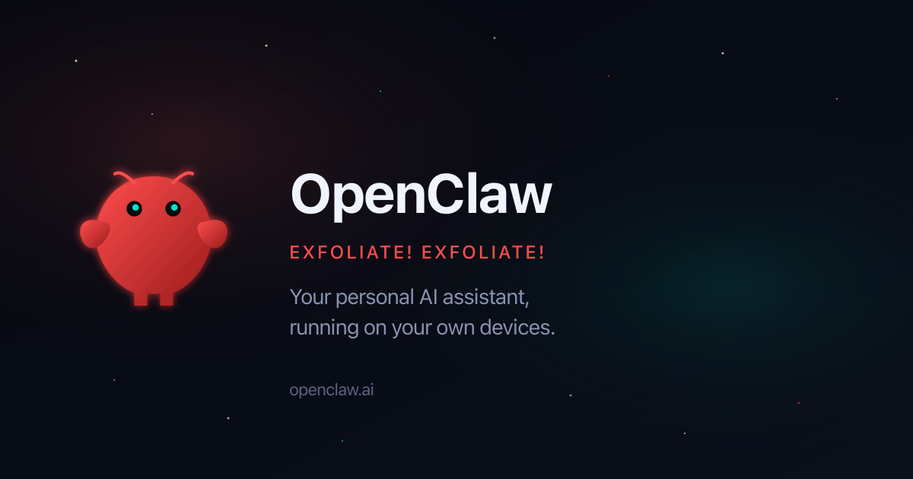

에이전트한테 뭘 물어보고 커피를 한 모금 마시면 답이 돌아오던 시절이 있었다. 10초쯤. 이제 커피를 들어 올리는 사이에 끝난다. 2초면 충분하다.

OpenClaw가 2월부터 5월까지 **빨라지고 작아졌다**. 동시에. 보통 속도와 크기는 트레이드오프인데, 이번엔 둘 다 좋아졌다. 비결은 단순했다 — 필요 없는 걸 밖으로 빼고, 핵심만 남겼다.

## 10초에서 2초, 에이전트 응답이 5배 빨라졌다

4월 중순만 해도 에이전트 cold turn(처음부터 켜서 시작하는 응답 시간)은 **9.8초** 걸렸다. warm turn(이미 켜진 상태에서의 응답)도 7.5초. 기다릴 만하긴 했지만, "빠르다"라고 부르긴 어려웠다.

5월 28일 릴리즈(v2026.5.28) 기준으로 cold turn은 **1.9초**, warm turn도 **1.9초**다. **5.1배 빨라졌다.**

이건 마이크로초 단위 최적화가 아니다. 근본적인 구조 변화다. 무거운 플러그인 의존성을 core 밖으로 빼고, 에이전트가 실제로 필요한 코드만 로드하게 만들었다. 메모리 사용량도 686MB에서 581MB로 **15% 줄었다.**

> 숫자는 트렌드를 보여주는 증거지, 밀리초 단위 벤치마크가 아니다. 어디서 와서 어디까지 왔는지가 중요하다.

## 43MB에서 18MB, 패키지가 59% 작아졌다

npm에 올라가는 tarball(압축된 패키지 파일) 크기가 3월에는 **43.3MB**였다. 기능이 늘면서 패키지도 같이 부풀어올랐다. 4월 들어 정리를 시작했고, 5월 28일엔 **17.9MB**가 됐다. **59% 감소.**

의존성 개수도 줄었다. 2월에 645개였던 게 5월 28일엔 **300개**. 절반 이상이 사라졌다.

무엇이 사라졌나? **Bedrock, Slack, OpenShell, Anthropic Vertex, Matrix, WhatsApp** — 이 채널·프로바이더들이 core 의존성 경로에서 빠져나갔다. 기능이 없어진 게 아니라, 필요한 사람만 설치하는 플러그인으로 이사한 거다.

실제 설치 크기도 5월 22일 기준 **1,020MB**에서 5월 28일 **361.7MB**로 **64.6%** 줄었다. 한 번의 릴리즈에서 650MB를 깎아낸 거다.

## shrinkwrap이 범인이 아니었다

이야기의 가장 흥미로운 대목이다.

5월 22일, OpenClaw에 npm shrinkwrap(의존성 버전을 고정하는 잠금 파일)이 추가됐다. 그런데 설치 크기가 갑자기 **1GB**를 넘었다. "shrinkwrap이 문제"라고 결론 내리기 쉬웠을 거다.

하지만 진단 결과는 달랐다. **shrinkwrap 자체는 괜찮았다. 문제는 패키지 모양(package shape)이었다.** shrinkwrap이 고정한 의존성 트리 안에, 모든 플랫폼용 `@napi-rs/canvas` 네이티브 패키지 12개가 들어가 있었다. Linux용, Windows용, ARM용 — 내 Mac에 필요 없는 것들까지 전부 설치된 거다.

5월 28일은 shrinkwrap을 유지하면서 **패키지 모양을 고쳤다.** canvas 패키지 fanout이 기본 설치에서 사라졌고, 중첩 의존성 트리는 911.8MB에서 259.7MB로 줄었다. 아직 완전히 정리되진 않았지만, 방향은 명확하다.

> shrinkwrap은 죄인이 아니었다. 나쁜 패키지 모양이 문제였다.

## 4월의 암흑기를 건너편에서 돌아보면

솔직히 4월 후반부는 좋은 시절이 아니었다. `v2026.4.25`는 cold turn이 **81초**였다. `v2026.4.29`는 94초. 메모리는 3.6GB까지 치솟았다.

이건 회귀였고, 5월 초에 복구됐다. `v2026.5.2`에서 3.9초로 떨어지며 정상 궤도에 올랐고, 그 이후로 계속 줄어들었다.

중요한 건 이 암흑기를 빠르게 진단하고 고쳤다는 거다. 그리고 그 과정에서 패키지 구조 개선의 계기가 됐다.

## "성장이 아니라 허물이다"

OpenClaw 블로그 원문의 마지막 문장이다.

> Growth, here, looks more like molting than adding.

뱀이 허물을 벗듯이, 더 커진 게 아니라 더 가벼워진 거다. 기능은 더 많아졌는데 패키지는 더 작아졌다. 의존성은 더 줄었는데 속도는 더 빨라졌다.

이건 "무엇을 넣을까"가 아니라 **"무엇을 밖으로 뺄까"**를 묻는 방식의 결과다. core는 작게. 선택적 기능은 플러그인으로. 의존성 소유를 명확히. 그리고 사용자가 체감하는 효과를 측정하기.

이 방향은 앞으로도 계속된다. main 브랜치는 이미 의존성 314개로 내려가 있다.

---

**참고:** 이 글은 [OpenClaw 블로그 원문](https://openclaw.ai/blog/lighter-core-sharper-claws)과 [기술 보고서](https://docs.openclaw.ai/reference/release-performance-sweep)를 기반으로 작성했습니다. 상세 수치와 방법론은 기술 보고서에서 확인할 수 있습니다.
