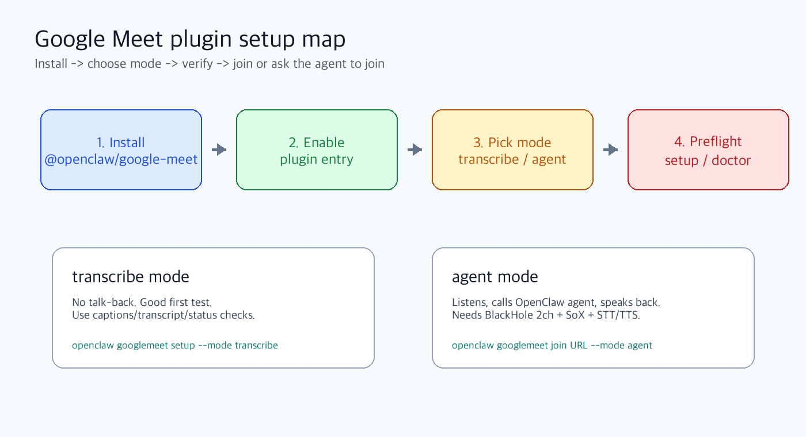

OpenClaw에서 Google Meet을 쓰려면 `@openclaw/google-meet` 플러그인을 설치하고, 목적에 맞게 `transcribe`, `agent`, `chrome-node`, `twilio` 중 하나를 고르면 된다.



## 0. 먼저 확인

```bash
openclaw --version
node --version
openclaw plugins search google-meet
```

OpenClaw 2026.5.26 기준으로 Google Meet은 기본 번들이 아니라 ClawHub 공식 플러그인이다.

## 1. 설치

```bash
openclaw plugins install clawhub:@openclaw/google-meet
openclaw plugins enable google-meet
openclaw gateway restart
```

확인:

```bash
openclaw plugins list | grep -E 'google-meet|Google Meet'
openclaw googlemeet setup --json
```

## 2. 최소 설정

`~/.openclaw/openclaw.json`에 플러그인 entry가 필요하다.

```json5
{
  plugins: {
    entries: {
      "google-meet": {
        enabled: true,
        config: {}
      }
    }
  }
}
```

설정 검증:

```bash
openclaw config validate
openclaw googlemeet setup
```

## 3. 가장 쉬운 모드: transcribe

회의에 들어가서 자막/상태를 확인하는 용도다. 에이전트가 말하지 않는다.

```bash
openclaw googlemeet setup --mode transcribe
openclaw googlemeet join https://meet.google.com/abc-defg-hij --mode transcribe
```

듣기 검증:

```bash
openclaw googlemeet test-listen https://meet.google.com/abc-defg-hij \
  --mode transcribe \
  --timeout-ms 30000
```

에이전트에게 시킬 때:

```text
이 Google Meet에 transcribe 모드로 들어가서 captions/transcript가 움직이는지 확인해줘.
URL: https://meet.google.com/abc-defg-hij
말하지 말고 listen 검증만 해.
```

도구 호출 형태:

```json
{
  "action": "test_listen",
  "url": "https://meet.google.com/abc-defg-hij",
  "transport": "chrome",
  "timeoutMs": 30000
}
```

## 4. 말하게 하기: agent 모드

`agent` 모드는 회의 음성을 듣고, OpenClaw agent에게 넘기고, TTS로 회의에 말한다.

macOS 로컬 Chrome 기준 준비:

```bash
brew install blackhole-2ch sox
```

BlackHole 설치 후 macOS 재부팅:

```bash
sudo reboot
```

재부팅 후 확인:

```bash
system_profiler SPAudioDataType | grep -i BlackHole
command -v sox
```

OpenAI realtime transcription을 쓸 경우:

```bash
export OPENAI_API_KEY=sk-...
```

설정 점검:

```bash
openclaw googlemeet setup --transport chrome --mode agent
```

참여:

```bash
openclaw googlemeet join https://meet.google.com/abc-defg-hij \
  --transport chrome \
  --mode agent
```

말하기 테스트:

```bash
openclaw googlemeet test-speech https://meet.google.com/abc-defg-hij \
  --transport chrome \
  --mode agent
```

에이전트에게 시킬 때:

```text
이 Google Meet에 agent 모드로 들어가줘.
URL: https://meet.google.com/abc-defg-hij
짧게 자기소개만 하고, 이후에는 질문이 있을 때만 답해.
문제가 생기면 manualActionRequired, browserUrl, browserTitle을 그대로 보고해.
```

## 5. 추천 운영 방식: chrome-node

본체 Gateway와 Chrome 실행 환경을 분리하고 싶으면 `chrome-node`를 쓴다. 예: Gateway는 메인 맥, Chrome은 Parallels macOS VM.

VM 또는 Chrome 전용 맥에서:

```bash
brew install blackhole-2ch sox
openclaw plugins enable google-meet
openclaw plugins enable browser
```

노드 실행:

```bash
openclaw node run \
  --host <gateway-host> \
  --port 18789 \
  --display-name parallels-macos
```

LAN IP로 평문 WebSocket을 쓸 때:

```bash
OPENCLAW_ALLOW_INSECURE_PRIVATE_WS=1 \
openclaw node run \
  --host <gateway-lan-ip> \
  --port 18789 \
  --display-name parallels-macos
```

Gateway host에서 승인:

```bash
openclaw devices list
openclaw devices approve <requestId>
openclaw nodes status
```

Gateway 설정:

```json5
{
  gateway: {
    nodes: {
      allowCommands: ["googlemeet.chrome", "browser.proxy"]
    }
  },
  plugins: {
    entries: {
      "google-meet": {
        enabled: true,
        config: {
          defaultTransport: "chrome-node",
          chrome: {
            guestName: "OpenClaw Agent",
            autoJoin: true,
            reuseExistingTab: true
          },
          chromeNode: {
            node: "parallels-macos"
          }
        }
      }
    }
  }
}
```

점검:

```bash
openclaw config validate
openclaw googlemeet setup --transport chrome-node --mode transcribe
openclaw googlemeet setup --transport chrome-node --mode agent
```

참여:

```bash
openclaw googlemeet join https://meet.google.com/abc-defg-hij \
  --transport chrome-node \
  --mode agent
```

## 6. 새 Meet 만들기

OAuth 없이도 브라우저 fallback으로 만들 수 있다. 단, Chrome profile이 Google에 로그인되어 있어야 한다.

```bash
openclaw googlemeet create --no-join
openclaw googlemeet create --transport chrome-node --mode agent
```

에이전트 프롬프트:

```text
새 Google Meet을 만들고, agent 모드로 직접 들어간 뒤 링크를 알려줘.
transport는 chrome-node를 사용해.
입장에 실패하면 manualActionRequired 내용을 그대로 보고해.
```

API로 방을 만들려면 Google Meet OAuth를 설정한다.

## 7. Google OAuth 설정

OAuth가 필요한 경우:

- Google Meet API로 회의 생성
- Meet space resolve
- attendance/artifacts/export
- Calendar에서 Meet 링크 찾기

Google Cloud Console에서:

1. Google Cloud project 생성 또는 선택
2. Google Meet REST API 활성화
3. OAuth consent screen 설정
4. OAuth client ID 생성
5. Redirect URI 추가

```text
http://localhost:8085/oauth2callback
```

필요 scope:

```text
https://www.googleapis.com/auth/meetings.space.created
https://www.googleapis.com/auth/meetings.space.readonly
https://www.googleapis.com/auth/meetings.space.settings
https://www.googleapis.com/auth/meetings.conference.media.readonly
```

로그인:

```bash
OPENCLAW_GOOGLE_MEET_CLIENT_ID="your-client-id" \
OPENCLAW_GOOGLE_MEET_CLIENT_SECRET="your-client-secret" \
openclaw googlemeet auth login --json
```

수동 callback이 필요할 때:

```bash
OPENCLAW_GOOGLE_MEET_CLIENT_ID="your-client-id" \
OPENCLAW_GOOGLE_MEET_CLIENT_SECRET="your-client-secret" \
openclaw googlemeet auth login --json --manual
```

출력된 `oauth` 블록을 config에 넣는다.

```json5
{
  plugins: {
    entries: {
      "google-meet": {
        enabled: true,
        config: {
          oauth: {
            clientId: "your-client-id",
            clientSecret: "your-client-secret",
            refreshToken: "refresh-token"
          }
        }
      }
    }
  }
}
```

검증:

```bash
openclaw googlemeet doctor --oauth --json
openclaw googlemeet doctor --oauth --create-space --json
openclaw googlemeet create --no-join --json
```

## 8. 회의 자료 가져오기

회의가 끝난 뒤 Google이 conference records를 만든 경우:

```bash
openclaw googlemeet latest --meeting https://meet.google.com/abc-defg-hij
openclaw googlemeet artifacts --meeting https://meet.google.com/abc-defg-hij
openclaw googlemeet attendance --meeting https://meet.google.com/abc-defg-hij
```

Markdown/CSV 저장:

```bash
openclaw googlemeet artifacts \
  --meeting https://meet.google.com/abc-defg-hij \
  --format markdown \
  --output meet-artifacts.md

openclaw googlemeet attendance \
  --meeting https://meet.google.com/abc-defg-hij \
  --format csv \
  --output attendance.csv
```

전체 export:

```bash
openclaw googlemeet export \
  --meeting https://meet.google.com/abc-defg-hij \
  --include-doc-bodies \
  --zip \
  --output meet-export
```

## 9. 문제 해결

### `No ClawHub plugins found`

검색어가 다를 수 있다.

```bash
openclaw plugins search google-meet
openclaw plugins search meet
```

### `BlackHole 2ch audio device not found`

```bash
brew install blackhole-2ch
sudo reboot
system_profiler SPAudioDataType | grep -i BlackHole
```

### Chrome이 로그인 화면에서 멈춤

Chrome profile에 Google 로그인이 필요하다. `manualActionRequired`가 나오면 새 탭을 계속 열지 말고, 보고된 `browserUrl`에서 수동 로그인 후 재시도한다.

### 회의에 들어갔지만 소리가 안 남

```bash
openclaw googlemeet status --json
openclaw googlemeet setup --transport chrome --mode agent
```

확인할 것:

- Meet microphone/speaker가 BlackHole 경로를 쓰는지
- SoX가 설치됐는지
- STT/TTS provider key가 있는지
- `mode`가 `transcribe`가 아니라 `agent`인지

## 10. 최소 성공 루트

처음에는 이것만 한다.

```bash
openclaw plugins install clawhub:@openclaw/google-meet
openclaw plugins enable google-meet
openclaw gateway restart
openclaw googlemeet setup --mode transcribe
openclaw googlemeet test-listen https://meet.google.com/abc-defg-hij --mode transcribe
```

이후 말하기가 필요할 때만 `agent` 모드와 BlackHole/SoX 구성을 붙인다.

---

참고: [OpenClaw Google Meet plugin docs](https://github.com/openclaw/openclaw/blob/main/docs/plugins/google-meet.md)
