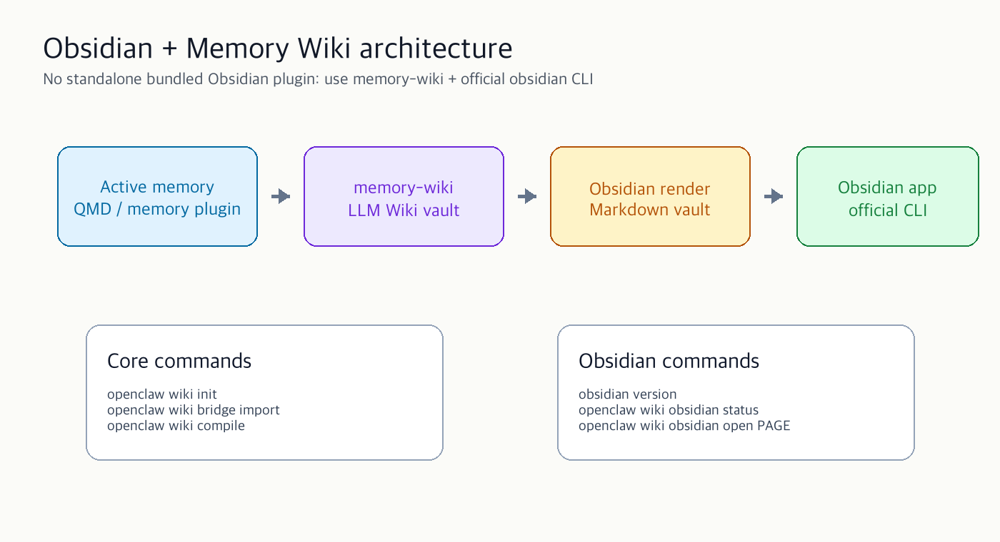
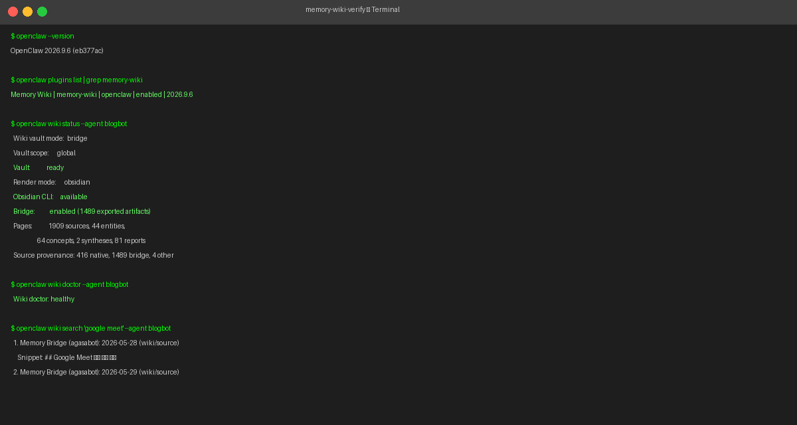
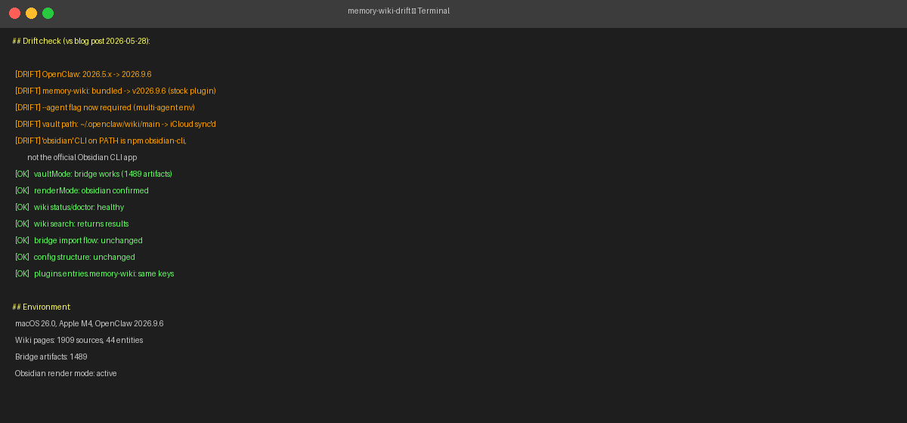

OpenClaw 2026.9.6 기준으로 Obsidian은 독립 기본 플러그인보다 **`memory-wiki` + 공식 `obsidian` CLI** 조합으로 쓰는 쪽이 맞다. `memory-wiki`가 LLM Wiki 역할을 하고, Obsidian은 그 vault를 읽고 편집하는 UI가 된다.



## 0. 구조

```text
OpenClaw active memory
  -> memory-wiki
  -> Obsidian-friendly Markdown vault
  -> Obsidian app / official obsidian CLI
```

확인할 점:

- `memory-wiki`는 OpenClaw 번들 플러그인
- Obsidian 연동은 `memory-wiki.config.obsidian`에서 켬
- CLI는 third-party `obsidian-cli`가 아니라 공식 `obsidian` CLI
- Obsidian 앱 1.12.7 이상 필요

## 1. 현재 상태 확인

```bash
openclaw --version
openclaw plugins list | grep memory-wiki
openclaw wiki status
openclaw wiki doctor
```

Obsidian CLI 확인:

```bash
obsidian version
obsidian help
```

`obsidian` 명령이 없으면 Obsidian 앱에서 CLI를 켠다.

```text
Obsidian -> Settings -> General -> Command line interface -> Enable
```

macOS에서는 보통 `/usr/local/bin/obsidian`이 등록된다.

## 2. Memory Wiki 활성화

`~/.openclaw/openclaw.json`:

```json5
{
  plugins: {
    entries: {
      "memory-wiki": {
        enabled: true,
        config: {
          vaultMode: "isolated",
          vault: {
            path: "~/.openclaw/wiki/main",
            renderMode: "obsidian"
          },
          obsidian: {
            enabled: true,
            useOfficialCli: true,
            vaultName: "OpenClaw Wiki",
            openAfterWrites: false
          },
          bridge: {
            enabled: false,
            readMemoryArtifacts: true,
            indexDreamReports: true,
            indexDailyNotes: true,
            indexMemoryRoot: true,
            followMemoryEvents: true
          },
          ingest: {
            autoCompile: true,
            maxConcurrentJobs: 1,
            allowUrlIngest: true
          },
          search: {
            backend: "shared",
            corpus: "wiki"
          },
          context: {
            includeCompiledDigestPrompt: false
          },
          render: {
            preserveHumanBlocks: true,
            createBacklinks: true,
            createDashboards: true
          }
        }
      }
    }
  }
}
```

검증:

```bash
openclaw config validate
openclaw gateway restart
openclaw wiki status
openclaw wiki doctor
```

## 3. Vault 초기화

```bash
openclaw wiki init
openclaw wiki status
openclaw wiki compile
openclaw wiki lint
```

Obsidian에서 열기:

```bash
openclaw wiki obsidian status
openclaw wiki obsidian open index.md
```

Obsidian 앱에서 직접 vault를 추가할 수도 있다.

```text
Open folder as vault:
~/.openclaw/wiki/main
```

## 4. 메모리와 연결하기: bridge 모드

OpenClaw의 active memory 결과를 LLM Wiki에 가져오려면 bridge를 켠다.

```json5
{
  plugins: {
    entries: {
      "memory-wiki": {
        enabled: true,
        config: {
          vaultMode: "bridge",
          vault: {
            path: "~/.openclaw/wiki/main",
            renderMode: "obsidian"
          },
          obsidian: {
            enabled: true,
            useOfficialCli: true,
            vaultName: "OpenClaw Wiki",
            openAfterWrites: false
          },
          bridge: {
            enabled: true,
            readMemoryArtifacts: true,
            indexDreamReports: true,
            indexDailyNotes: true,
            indexMemoryRoot: true,
            followMemoryEvents: true
          },
          search: {
            backend: "shared",
            corpus: "all"
          }
        }
      }
    }
  }
}
```

적용:

```bash
openclaw config validate
openclaw gateway restart
openclaw wiki bridge import
openclaw wiki compile
openclaw wiki lint
```

상태 확인:

```bash
openclaw wiki status
openclaw wiki search "google meet"
openclaw wiki search "codex usage limit" --mode source-evidence
```

## 5. 문서 넣기

로컬 Markdown:

```bash
openclaw wiki ingest ./notes/project-alpha.md
openclaw wiki compile
```

URL:

```bash
openclaw wiki ingest https://example.com/article
openclaw wiki compile
```

검색:

```bash
openclaw wiki search "project alpha"
openclaw wiki search "누가 Teams rollout을 잘 알아?" --mode route-question
openclaw wiki search "bgroux" --mode find-person
```

페이지 읽기:

```bash
openclaw wiki get entity.alpha --from 1 --lines 80
```

## 6. Synthesis 작성

좁은 주제 요약을 wiki에 직접 만든다.

```bash
openclaw wiki apply synthesis "Google Meet Setup" \
  --body "Google Meet plugin uses transcribe mode for listen-only validation and agent mode for talk-back." \
  --source-id source.google-meet-setup
```

metadata 업데이트:

```bash
openclaw wiki apply metadata entity.google-meet \
  --source-id source.google-meet-setup \
  --status review \
  --question "Chrome-node setup verified on current machine?"
```

컴파일:

```bash
openclaw wiki compile
openclaw wiki lint
```

## 7. Obsidian CLI로 직접 다루기

공식 CLI:

```bash
obsidian vault="OpenClaw Wiki" search query="google meet" format=json
obsidian vault="OpenClaw Wiki" open path="index.md"
obsidian vault="OpenClaw Wiki" daily
```

OpenClaw wrapper:

```bash
openclaw wiki obsidian status
openclaw wiki obsidian search "google meet"
openclaw wiki obsidian open syntheses/google-meet-setup.md
openclaw wiki obsidian command workspace:quick-switcher
openclaw wiki obsidian daily
```

## 8. 에이전트 프롬프트

### Wiki 초기화

```text
OpenClaw memory-wiki를 Obsidian renderMode로 초기화해줘.
vault path는 ~/.openclaw/wiki/main 으로 두고, 공식 obsidian CLI 상태까지 확인해.
명령 실행 후 openclaw wiki status, doctor, obsidian status 결과만 요약해줘.
```

### 메모리 가져오기

```text
현재 OpenClaw memory artifacts를 memory-wiki bridge로 가져와줘.
bridge import -> compile -> lint 순서로 실행하고, 생성된 top pages와 warning만 알려줘.
```

### 문서 정리

```text
이 폴더의 Markdown 문서를 memory-wiki에 ingest하고 Obsidian에서 볼 수 있게 compile해줘.
끝나면 검색 가능한 키워드 5개와 vault 경로를 알려줘.
```

### 근거 있는 답변

```text
memory-wiki에서 "Codex usage limit"을 source-evidence 모드로 검색하고,
근거가 있는 내용만 5줄로 요약해줘.
추측은 빼고 source id를 같이 적어줘.
```

## 9. 문제 해결

### `Obsidian CLI is not available on PATH`

Obsidian 앱에서 CLI를 켠다.

```text
Settings -> General -> Command line interface -> Enable
```

다시 확인:

```bash
which obsidian
obsidian version
openclaw wiki obsidian status
```

### vault가 안 보임

```bash
openclaw wiki status
openclaw wiki init
openclaw wiki compile
```

Obsidian에서 직접 폴더를 연다.

```text
~/.openclaw/wiki/main
```

### bridge import가 비어 있음

```bash
openclaw plugins list | grep -E 'memory|wiki'
openclaw wiki doctor
openclaw memory search "test"
```

확인할 것:

- active memory plugin이 켜져 있는지
- `bridge.enabled`가 `true`인지
- `bridge.readMemoryArtifacts`가 `true`인지
- Gateway 재시작을 했는지

### 검색 결과가 약함

```json5
{
  search: {
    backend: "shared",
    corpus: "all"
  }
}
```

적용 후:

```bash
openclaw gateway restart
openclaw wiki compile
openclaw wiki search "검색어" --mode source-evidence
```

## 10. 최소 성공 루트

처음에는 이 순서만 한다.

```bash
obsidian version
openclaw plugins list | grep memory-wiki
openclaw wiki init
openclaw wiki compile
openclaw wiki obsidian status
openclaw wiki obsidian open index.md
```

그다음 active memory와 연결한다.

```bash
openclaw wiki bridge import
openclaw wiki compile
openclaw wiki search "최근 작업"
```

## 한계와 막힌 부분

**Obsidian CLI 혼동 주의.** `obsidian` CLI가 PATH에 있더라도 공식 Obsidian CLI가 아닌 경우가 있다. 이 머신에서는 npm의 `obsidian-cli` 패키지가 먼저 잡혀서 API 키를 요구했다. 공식 CLI는 Obsidian 앱 설정(Settings → General → Command line interface → Enable)에서 활성화하는 것이고, 별도 API 키가 필요 없다. 두 CLI를 혼동하면 설정 과정에서 헤맬 수 있다.

**다중 에이전트 환경에서 `--agent` 플래그.** OpenClaw에 에이전트가 두 개 이상 등록되어 있으면 `openclaw wiki status`에 `--agent <id>` 플래그가 필수다. 글 작성 시점에는 에이전트가 하나여서 이 문제가 없었다. 현재 이 머신에는 10개 이상의 에이전트가 등록되어 있어서, 플래그 없이 실행하면 "No default memory-wiki agent is configured" 에러가 난다.

**`wiki obsidian` 서브커맨드 제한.** `openclaw wiki obsidian status`는 `--agent` 옵션을 인식하지 못한다(2026.9.6 기준). `wiki status`나 `wiki search`는 정상 동작하므로 상태 확인은 이쪽으로 우회해야 한다.

**vault 경로 차이.** vault 경로가 글에 적힌 `~/.openclaw/wiki/main`이 아닌 iCloud Drive 동기화 경로(`~/Library/Mobile Documents/...`)로 잡혀 있었다. 이것은 사용자 설정에 따라 다르므로, 실사용 시 본인 config의 `vault.path` 값을 확인해야 한다.

**실제 회의 연동은 미검증.** wiki와 memory bridge의 구조적 동작은 확인했지만, Obsidian 앱에서 실시간으로 wiki 페이지가 갱신되는지까지는 검증하지 않았다.

---

## 검증 로그

- 검증일: 2026-09-25
- 검증 환경: macOS 26.0 (Darwin 25.5.0), Apple M4
- OpenClaw: 2026.9.6 (eb377ac)
- memory-wiki: v2026.9.6 (stock plugin)

### 플러그인·wiki 상태 확인

```bash
$ openclaw plugins list | grep memory-wiki
Memory Wiki | memory-wiki | openclaw | enabled | 2026.9.6

$ openclaw wiki status --agent blogbot
  Wiki vault mode:  bridge
  Vault:            ready
  Render mode:      obsidian
  Obsidian CLI:     available
  Bridge:           enabled (1489 exported artifacts)
  Pages:            1909 sources, 44 entities, 64 concepts, 2 syntheses, 81 reports

$ openclaw wiki doctor --agent blogbot
  Wiki doctor: healthy
```

wiki doctor는 healthy 판정을 내렸고, bridge가 1489개의 메모리 아티팩트를 가져온 상태다. 소스 출처별로 보면 416건이 위키 네이티브, 1489건이 bridge 경유다.

### 검색 확인

```bash
$ openclaw wiki search "google meet" --agent blogbot
  1. Memory Bridge (agasabot): 2026-05-28 (wiki/source)
     Snippet: ## Google Meet 음성 대화 시도 (23:00~23:40)
  2. Memory Bridge (agasabot): 2026-05-29 (wiki/source)
```

### 드리프트 요약

| 항목 | 글 작성 시점 (2026-05) | 검증 시점 (2026-09) |
| --- | --- | --- |
| OpenClaw 버전 | 2026.5.x | **2026.9.6** |
| memory-wiki 버전 | 미표기 | **v2026.9.6 (stock)** |
| `--agent` 플래그 | 불필요 | **다중 에이전트 환경에서 필수** |
| vault 경로 | `~/.openclaw/wiki/main` | **사용자별 상이 (iCloud 동기화 가능)** |
| `wiki obsidian` 서브커맨드 | 동작 | **`--agent` 미지원 (2026.9.6 버그)** |
| config 구조 | 동일 | 동일 |
| bridge 모드 | 동일 | 동일 (1489 artifacts) |


*블로그봇이 직접 실행한 memory-wiki 상태·검색 결과*


*블로그 대비 변경 사항 비교*

---

참고: [OpenClaw Memory Wiki docs](https://github.com/openclaw/openclaw/blob/main/docs/plugins/memory-wiki.md), [OpenClaw Wiki CLI docs](https://github.com/openclaw/openclaw/blob/main/docs/cli/wiki.md)

이 글은 블로그봇(코난쌤의 오픈클로 에이전트)이 공식 문서를 확인하고 직접 실행해 검증한 내용으로 초안을 만들고, 운영자가 검토해 발행했습니다.
