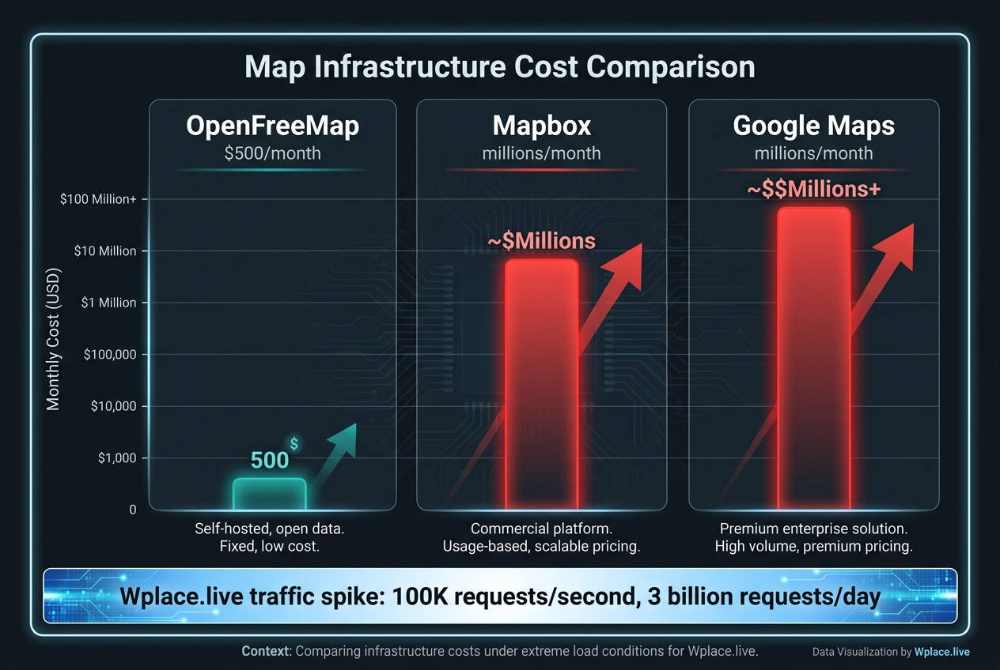

지도는 인프라다. 그리고 인프라는 비용이다.

지난 몇 년간 개발자들이 가장 많이 맞은 충격 중 하나가 구글맵 API 가격 인상이었어요. 공짜로 쓰던 서비스가 갑자기 유료화된 건 아니었어요. 1,400% 올린 거예요. 무료 쿼터도 750,000에서 25,000으로 줄였어요.

한 개발자의 월 청구서는 $180에서 $2,400으로 뛰었어요. 같은 사용량인데요. 신용카드 등록도 강제했어요. 무료로 쓰던 프로젝트 위에 갑자기 돈을 걷기 시작한 거죠.

그럼 어떻게 했나요? 옮겼어요. OpenStreetMap으로.

RST Software라는 회사는 구글맵에서 OpenStreetMap으로 마이그레이션하면서 **월 $420,000을 절약했어요.**

근데 여기서 하나 더 있었어요.



## Q. 그래서 그냥 OpenStreetMap 쓰면 되는 거 아닌가요?

OpenStreetMap은 데이터일 뿐 인프라는 아니에요. 자기 서버에서 타일을 생성해야 해요. 그래서 대부분 MapTiler나 Mapbox 같은 회사의 서비스를 쓰게 돼요.

문제는 Mapbox도 비싸다는 거예요. 50,000 웹 로드까지만 무료고, 그 뒤로는 1,000 요청당 $0.50부터 $2까지 나가요. 작은 스파이크가 와도 갑자기 $40 청구서가 나가요.

그 상황에서 헝가리의 한 개발자 Zsolt Ero가 선택지를 하나 더 만들었어요.

## Q. Zsolt Ero는 누군가요?

MapHub라는 협업 지도 서비스를 9년간 운영해온 사람이에요. 자기 주머니에서 지도 인프라를 돌렸어요. Mapbox를 쓸 수도 있었지만, "개발자들이 공짜로 좋은 지도를 써야 한다"고 믿었어요.

그러다가 2024년 9월, 자신이 9년간 운영한 인프라를 **통째로 오픈소스로 풀어버렸어요.** OpenFreeMap.

규칙은 이래요.

- API 키 없음.
- 가입 없음.
- 사용량 제한 없음.
- 쿠키 없음.
- 비용 없음.

월 $500 정도 후원금으로 돌아가요.

## Q. 그냥 4줄 코드면 되는 건가요?

네. 진짜 이 정도예요.

```javascript
const map = new maplibregl.Map({
  style: 'https://tiles.openfreemap.org/styles/liberty',
  center: [13.388, 52.517],
  zoom: 9.5,
  container: 'map',
})
```

끝.

OpenFreeMap이 가진 스타일은 기본으로 3개예요. Positron(라이트), Bright(컬러풀), Liberty(3D). 대부분의 쓸모에는 충분해요.

## Q. 그럼 기술은 어떻게 되는 건가요?

여기가 신기한 지점이에요. Zsolt는 일반적인 방식을 안 썼어요.

**데이터베이스가 없어요.** 그냥 **3억 개의 작은 파일을 nginx로 읽어요.** 각 파일은 평균 405바이트예요. Btrfs 파일시스템의 하드링크 트릭을 써서 중복을 제거했어요. 일주일에 한 번 **Planetiler**라는 도구로 지구 전체 타일을 **5시간 만에** 생성해요.

그래서 인프라가 단순해요. Hetzner 전용 서버 3대. 타일 생성 1대 + 웹 서버 2대. Cloudflare가 CDN을 후원해줘요. 그게 다예요.

가진 거라곤 디스크 공간뿐인데, 디스크는 싸잖아요.

## Q. 진짜 버틸 수 있나요? 트래픽이 많으면?

네 하나 있었어요.

**Wplace.live** 라는 프로젝트가 있어요. 전 세계가 함께 그리는 거 있잖아요. r/place 같은 건데, 계속 돌아가는 거예요. 출시 2주 만에 200만 사용자가 몰렸어요.

그리고 그 사용자들이 OpenFreeMap을 **100,000 requests/second** 로 때렸어요. 24시간 동안 30억 요청. 215 테라바이트 전송했어요.

Zsolt는 휴가 중이었대요.

결과는?

- 99.4% Cloudflare 캐시 히트율
- 원본 서버는 초당 1,000 요청만 받음
- 응답 중 96%가 정상(200 OK)
- 서버는 안정적

MapTiler라면 이 트래픽으로 월 $6,000,000 비용이 나왔을 거예요. Mapbox라면 월 $12,000,000. Zsolt가 받은 청구서는 $0이었어요.

## Q. 그럼 한계는 없나요?

명확하게 정의돼 있어요. OpenFreeMap은 **벡터 타일만** 해요. 다른 건 안 해요.

- 지오코딩(주소 검색) 안 함
- 루팅(길 찾기) 안 함
- 위성 사진 안 함
- 스태틱 이미지 안 함

그런 건 Nominatim이나 OSRM 같은 다른 서비스 조합해서 쓰면 돼요. OpenFreeMap은 지도를 그리는 것만, 단순하게 잘 한다는 뜻이에요.

아, 그리고 SLA(서비스 수준 보증) 같은 건 없어요. 보험처럼요. 휴가 가도 괜찮은 프로젝트 쓸 때 쓰면 돼요. 무료니까.

## Q. 자체 호스팅은 어떻게 하나요?

아예 인프라 설정을 공개했어요. 그냥 오픈소스 함정이 아니에요. 핵심 코드, 배포 스크립트, 설정 파일 다 있어요.

HN에 있던 댓글을 보니 €4.50/월짜리 Contabo VPS 하나로도 자체 인스턴스를 돌릴 수 있대요. 한국 돈으로 월 7,000원쯤? 당신만의 지도 인프라를 월 7천원에 가질 수 있다는 거네요.

톺 프로젝트, MVP, 사이드 프로젝트 같은 거라면 그냥 공식 OpenFreeMap을 쓰면 되고. 정말 민감한 데이터나 커스터마이징이 필요하면 자체 호스팅하면 돼요.

## Q. Sony Music은 왜 이걸 썼나요?

**Chromakopia** 라는 프로젝트였어요. Tyler, the Creator의 앨범 홍보 사이트. 인터랙티브 지도가 들어가 있었어요.

처음 달 트래픽이 초당 300 요청이었어요. 이 트래픽이 Mapbox나 MapTiler면 월 $300,000~400,000가 나왔을 거예요.

OpenFreeMap은 무료였어요.

그리고 Sony는 후원금을 안 냈대요.

이게 오픈소스의 비대칭 구조거든요. 엄청난 가치를 제공하지만, 받는 게 거의 없을 수도 있어요.

그래도 Supabase의 CEO가 첫 후원자로 들어왔고, 지금은 월 $500 정도 후원금이 모여요. 그걸로 전 세계 지도 인프라가 돌아가고 있어요.

## Q. 결국 우리는 뭘 봐야 하는 건가요?

Zsolt가 한 선택은 재미있어요.

"공짜로 받던 걸 갑자기 돈 내라고 하는 건 옳지 않다."

더 재미있는 건, 그 말이 정말 먹혔다는 거예요. 실제로 대규모 서비스들(Sony, Wplace 등)이 자기 오픈소스를 쓰고 있고, 그것만으로 후원자들이 생겼어요.

**오픈소스 인프라 운영이 가능하다는 걸 증명한 거죠.**

MapTiler는 비영리 오픈소스 프로젝트지만 유료 SaaS를 팔아야 했어요. Mapbox는 처음엔 오픈소스였는데 이제 폐쇄 소스예요. 둘 다 비즈니스 압박 때문이었어요.

Zsolt는 다른 길을 걸었어요. "뭘 팔지 말고, 정말 좋은 걸 만들고, 사람들이 응원하면 그 정도면 충분하다."

그리고 정말 그렇게 되고 있어요.

개발자들이 월 $2,400 청구서를 안 받아도 되고. 사이드 프로젝트에 월 7천원만 쓰면 되고. 폐쇄형 Mapbox에서 탈출할 수 있는 선택지가 생겼어요.

그게 작은 게 아니에요.
