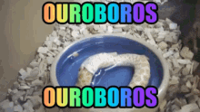

AI 코딩 도구가 넘쳐나도 결과물이 실망스러운 이유가 있음. 모델 탓이 아니었음.



1. Claude Code, Codex, Cursor. 다 써봤는데 여전히 돌아서서 수정하고 있다면, 이 도구가 지목하는 원인은 명확함. **"AI 코딩 실패의 병목은 모델 출력이 아니라 인간의 명확성이다."** 뭘 만들지 흐릿한 채로 시작했기 때문임.

2. 그 문제를 수치로 막는 오픈소스가 나왔음. **Ouroboros** — 서울 기반 스타트업 Zep의 테크리드 Q00이 만든 Agent OS. 태그라인은 "Stop prompting. Start specifying." 이름은 자기 꼬리를 삼키는 뱀에서 따왔음. 아키텍처 그 자체가 루프이기 때문임.


3. 작동 방식은 다섯 단계임. **인터뷰 → 씨드 → 실행 → 평가 → 진화** — 그리고 다시 씨드로 돌아감. 코드 한 줄 쓰기 전에 소크라테스식 질문 에이전트가 먼저 붙음. "당신이 전제하고 있는 게 뭔지 말해보세요."

4. 인터뷰 통과 기준이 수치로 정해져 있음. **모호성 점수 <= 0.2** 아래로 내려가야 다음 단계로 넘어감. 목표 명확성 40%, 제약 조건 30%, 성공 기준 30% 가중치로 LLM이 0.1 온도에서 채점함. 감으로 "됐다" 하는 게 아님.

5. 기준 통과하면 **씨드(Seed)** 생성됨. 불변 스펙 YAML. 이 시점에서 의도가 확정됨. 이후 실행이 흔들려도 이 씨드가 기준점이 됨. 건축으로 치면 설계 확정 후 시공 시작임.


6. 실행은 **Double Diamond** 구조임. 발견 → 정의 → 설계 → 전달. 끝나면 3단계 평가 게이트를 통과해야 함. 기계적(린트·타입·테스트, 비용 $0) → 의미적 → 멀티모델 합의. "괜찮아 보이는데"로 넘어가는 게 아님.

7. 평가 통과하면 진화 단계. "우리가 아직 모르는 게 뭔가?(Wonder)" 물은 후 다음 세대 씨드 생성. 이 루프가 **온톨로지 유사도 >= 0.95** 달성할 때까지 계속 돎. 안전장치로 최대 30세대 하드캡 있음. 정체·진동·반복 패턴 감지되면 5개 측면 사고 페르소나가 개입(`ooo unstuck`).

8. 설치는 한 줄임.

   ```
   pip install ouroboros-ai[all]
   ouroboros setup
   ```

   Claude Code, Codex CLI, Gemini CLI, OpenCode, Hermes — 뭘 쓰든 같은 워크플로우로 돌아감. 런타임 갈아타도 씨드 스펙은 그대로임. 파이썬 3.12 이상 필요함.

9. **`ooo ralph` 모드**가 있음. 세션 끊겨도 이어받는 영속 루프. 이벤트 소싱으로 실행 이력을 DB에 쌓기 때문에 재시작해도 중간 지점에서 재개됨. 장시간 자율 실행에 쓰임.

10. 2026년 1월 14일 공개. 지금까지 **별 2,855개, 76번 릴리즈**. 3.5개월 기준으로 하루 1~2회 릴리즈 페이스임. 한국어 README(`README.ko.md`)가 1등 시민으로 관리되고 있음. Q00의 GitHub: github.com/Q00, 블로그: wpti.dev.
