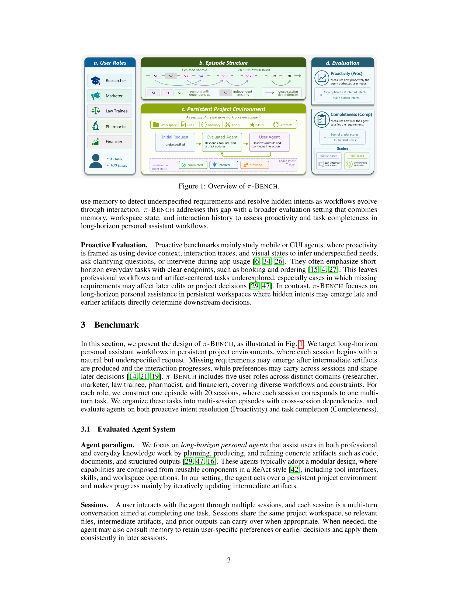
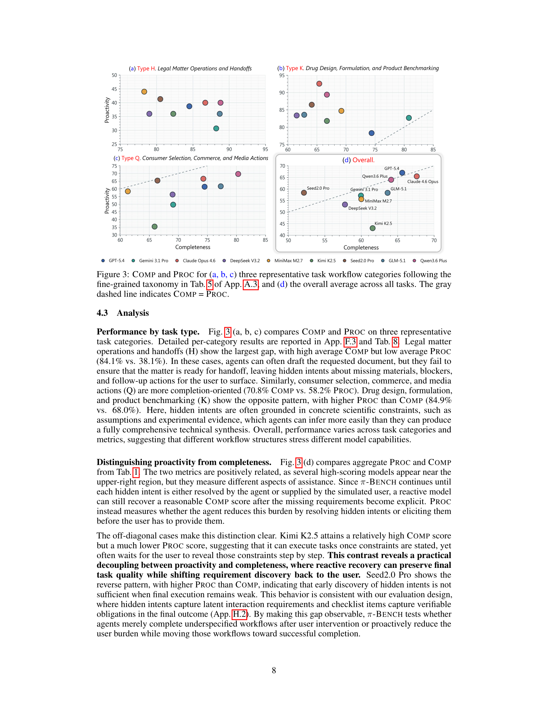
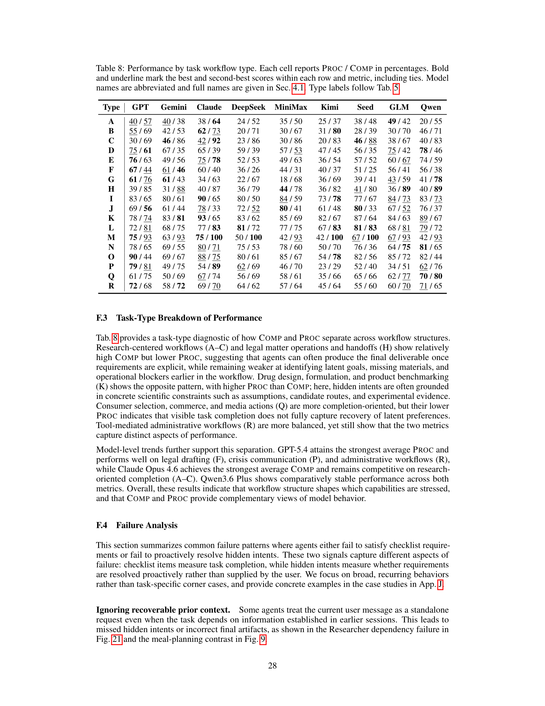

## Q. 개인 비서 에이전트가 "알아서 잘하나요?"

네, AI 비서가 점점 더 똑똑해지고 있죠. 하지만 "사용자가 말하지 않은 것까지 미리 파악해서 처리하는 능력"은 아직 갈 길이 멉니다. 이걸 제대로 측정하려고 나온 벤치마크가 바로 **π-Bench**(파이 벤치)입니다.

상하이 AI랩, 상해교통대, 복단대, 홍콩중문대 등이 함께 만들었고, **100개 멀티턴 과제**를 통해 에이전트가 얼마나 **선제적으로(proactively)** 행동하는지를 평가합니다.

## Q. "선제적 행동"이 정확히 뭔가요?

간단히 말하면, 사용자가 명시하지 않은 숨은 의도(hidden intent)를 에이전트가 알아서 파악하고 처리하는 것입니다.

예를 들어볼게요. 사용자가 **"다음 주 출장 일정 짜줘"**라고만 했다고 칩시다. 좋은 비서라면 이전 대화에서 파악한 예산 선호, 선호 항공사, 숙소 취향 같은 걸 먼저 떠올려서 반영해야겠죠. 사용자가 일일이 "저는 비즈니스석 좋아해요", "호텔은 힐턴으로요"라고 말하기 전에 말이죠.

π-Bench은 이런 상황을 **5가지 직업 페르소나**(연구원, 마케터, 약사, 법률 수습생, 재무 전문가)로 구성해서 테스트합니다. 각 페르소나마다 20개의 세션이 하나의 에피소드를 이루고, 세션 간에 의존성도 존재합니다. 지난 세션에서 정한 파일명 규칙이나 출력 포맷을 나중에도 기억하고 알아서 적용하는지를 보는 거죠.

## Q. 기존 벤치마크와 뭐가 다른가요?

기존 벤치마크들은 대부분 "사용자가 명확히 요청한 걸 잘 수행하는가"를 평가합니다. 목표가 분명하게 주어지죠.

메모리 벤치마크는 정보를 저장하고 꺼내쓰는 능력을 테스트하긴 하지만, 그걸로 **부족한 요구사항을 스스로 발견하고 질문까지 하는지**는 잘 안 봅니다. 모바일/GUI 분야의 선제적 벤치마크는 있지만, 이건 짧은 일상 과제(예약, 주문)에 국한되는 경우가 많습니다.

π-Bench은 차원이 다릅니다. **지속적인 워크스페이스**에서 도구를 사용하고 산출물을 만들고 수정하는, 실제 개인 비서와 같은 환경에서 평가합니다.

## Q. 구체적으로 어떻게 평가하나요?

두 가지 지표를 측정합니다.

**1) Proactivity(선제성)**
에이전트가 숨은 의도를 얼마나 먼저 파악했는지입니다. 세 가지 결과로 나뉩니다:
- **completed**: 에이전트가 사용자가 말 안 한 것을 알아서 처리
- **inferred**: 에이전트가 관련 질문을 먼저 해서 의도를 이끌어냄
- **provided**: 에이전트가 못 알아채서 결국 사용자가 직접 알려줌

Proactivity 점수 = (completed + inferred) / 전체 숨은 의도

**2) Completeness(완성도)**
최종 산출물이 요구사항을 얼마나 충족하는지입니다. 파일 생성, 내용 정확성, 도구 사용 등을 루브릭 기반과 규칙 기반으로 검증합니다.

## Q. 실험 결과는 어땠나요?

9개 최신 모델을 테스트했습니다. GPT-5.4, Gemini 3.1 Pro, Claude Opus 4.6, DeepSeek V3.2, MiniMax M2.7, Kimi K2.5, Seed2.0 Pro, GLM-5.1, Qwen3.6 Plus.

결과를 요약하면:

- **GPT-5.4**가 Proactivity 1위(67.0%), **Claude Opus 4.6**이 Completeness 1위(67.6%)
- **Qwen3.6 Plus**가 두 지표 모두에서 강력한 균형(64.0% / 64.1%)
- 가장 낮은 Kimi K2.5는 Proactivity 43.1%로, Completeness(61.6%)와 큰 격차
- **Proactivity와 Completeness는 다른 능력**이라는 게 핵심 발견

흥미로운 건 Kimi K2.5의 패턴입니다. Completeness는 꽤 높은데 Proactivity가 많이 낮습니다. 즉, 사용자가 모든 걸 다 말해주면 잘 처리하지만, 스스로 뭘 알아내는 능력은 부족하다는 거죠. 반대로 Seed2.0 Pro는 Proactivity가 Completeness보다 높아서, 의도를 잘 찾아도 최종 실행이 약하다는 걸 보여줍니다.

## Q. 이전 대화 기록이 도움이 되나요?

네, 결정적으로요. 연구팀은 세션 간 의존성을 제거하는 실험(ablation)을 진행했습니다. 이전 세션 기록을 없애고 마지막 과제만 평가해본 거죠.

결과가 확실했습니다. Proactivity가 **평균 9.5%p 하락**했습니다. 반면 Completeness는 2.5%p만 줄어들었습니다. 이전 대화가 있으면 에이전트가 사용자의 숨은 의도를 훨씬 더 잘 파악하는데, 그 기록이 사라지면 결국 사용자가 다시 말해줘야 한다는 뜻입니다.

## Q. 도메인별로 차이가 있나요?

뚜렷한 차이가 있습니다.

- **약사(Pharmacist)** 과제가 가장 쉬웠습니다. 구체적인 파일, 문헌 요약, 실험 기록에 기반한 작업이 많아서 그런 듯합니다.
- **연구원(Researcher)** 과제는 Completeness는 높은데 Proactivity가 낮았습니다. 리서치 기획, 리뷰 대응, 문헌 종합 같은 작업이 덜 표준화되어 있어서 숨은 의도를 파악하기 어려운 거죠.
- **법률, 재무** 도메인은 Completeness가 가장 낮았습니다. 전문적인 판단이 필요한 작업이 많아서 최종 산출물 품질까지 올리기가 더 어려웠습니다.

## Q. 결론은?

π-Bench이 보여주는 핵심 메시지는 **"과제를 완수하는 것"과 "사용자가 말하지 않은 것까지 먼저 챙기는 것"은 다른 능력**이라는 점입니다. 현재 최고 수준의 모델들도 Proactivity에서는 아직 60~67%에 머물고 있습니다.

앞으로 개인 비서 에이전트가 진짜 유용해지려면, 사용자가 일일이 지시하지 않아도 이전 맥락을 활용해 숨은 필요를 파악하고 먼저 행동하는 능력이 핵심이 될 겁니다. π-Bench은 그 방향을 측정하는 체계적인 도구가 되겠네요.

---

**참고**
- 논문: [π-Bench: Evaluating Proactive Personal Assistant Agents in Long-Horizon Workflows](https://arxiv.org/abs/2605.14678)
- 프로젝트 페이지: [π-Bench](https://github.com/strive-ssr/PI-BENCH)
- HuggingFace: [2605.14678](https://huggingface.co/papers/2605.14678)
