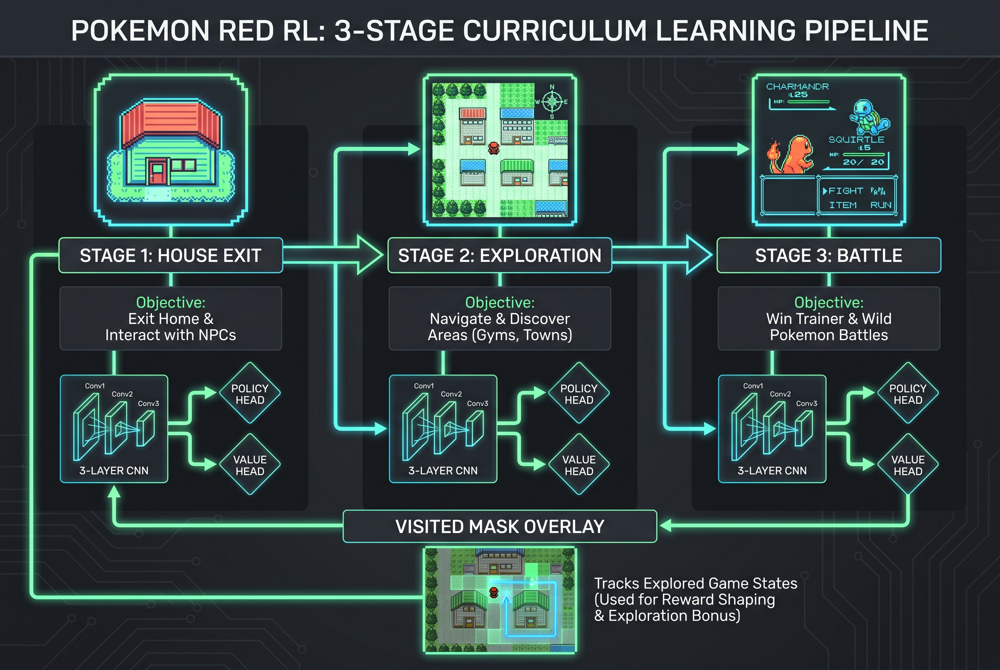

## 포켓몬 레드 — 강화학습의 궁극 벤치마크

포켓몬스터 레드(1996)는 단순한 게임이 아니다. 25시간 이상의 플레이타임, 희소한 보상, 부분 관측성(partial observability), 비선형 월드맵, 전투/탐험/메뉴 내비게이션이 뒤섞인 멀티태스킹. RL 관점에서 보면 Atari 게임보다 훨씬 어려운 벤치마크다.

2025년 David Rubinstein팀이 **<10M 파라미터 정책**으로 포켓몬 레드를 클리어하면서 이 분야가 주목받기 시작했고, 2026년 4월 Dheeraj Reddy Mudireddy가 발표한 **PokeRL** 논문(arXiv:2604.10812)은 초반 태스크에 초점을 맞춘 모듈형 시스템으로 진입 장벽을 크게 낮췄다.

이 글에서는 PokeRL의 아키텍처를 분석하고, 실제로 어떻게 돌리는지 레드버전 기준으로 정리한다.

---

## 핵심 프로젝트 비교

포켓몬 레드 RL 생태계에는 세 가지 주요 프로젝트가 있다.

| 프로젝트 | GitHub | 목표 | 파라미터 | 특징 |
|---------|--------|------|---------|------|
| **PokeRL** (본문) | [reddheeraj/PokemonRL](https://github.com/reddheeraj/PokemonRL) | 초반 3태스크 | ~1M | 커리큘럼 러닝, 안티루프 |
| **PokemonRedExperiments** | [PWhiddy/PokemonRedExperiments](https://github.com/PWhiddy/PokemonRedExperiments) | 체육관 2개 클리어 | ~1.5M | 실시간 맵 시각화, V2 스크립트 |
| **PokeRL (Rubinstein)** | [drubinstein/pokemonred_puffer](https://github.com/drubinstein/pokemonred_puffer) | 게임 전체 클리어 | <10M | 최소 간소화, PufferLib 기반 |

### PokeRL 논문 (arXiv:2604.10812)

> **"PokeRL: Reinforcement Learning for Pokemon Red"**
> Dheeraj Reddy Mudireddy, 2026년 4월

포켓몬 레드의 초반 게임(집 나가기 → 태초마을 탐험 → 라이벌전 승리)을 세 단계 커리큘럼으로 나누어 학습하는 모듈형 시스템.

---

## 아키텍처: 어떻게 돌아가는가

### 커리큘럼 러닝 — 3단계 분해

PokeRL의 핵심 아이디어는 **게임 전체를 한 번에 학습하지 않는 것**이다. 대신 세 개의 독립적인 시퀀스로 분해한다.

```
Sequence 1: House Exit    → 집에서 탈출
Sequence 2: Exploration   → 태초마을 탐험, 풀숲 도달
Sequence 3: Battle        → 라이벌(그린) 전투 승리
```

각 시퀀스는 자체 보상 함수, 세이브 상태, 학습 설정을 가진다. 이전 시퀀스의 성공이 다음 시퀀스의 시작점이 되는 구조다.

### 관측 공간 (Observation Space)

```
입력: 72×80×8 (4개 스택 프레임 × 2채널: 그레이스케일 + 방문 마스크)
 ↓
Conv2d(8→32, 8×8, stride=4) → ReLU
 ↓
Conv2d(32→64, 4×4, stride=2) → ReLU
 ↓
Conv2d(64→64, 3×3, stride=1) → ReLU
 ↓
Flatten → Linear(1920→512) → ReLU
 ↓
┌───────────┴───────────┐
정책 헤드    가치 헤드
(7개 액션)    (상태 가치)

총 파라미터: ~1M
```

**핵심 포인트**: 관측에 **visited mask** (방문 마스크)가 포함된다. 에이전트가 이미 방문한 맵 타일을 시각적으로 구분할 수 있게 해주는 채널로, 탐험 효율성을 크게 높인다.

### 액션 공간 (Action Space)

7개의 이산 액션: `No-op, Up, Down, Left, Right, A, B`

프레임 스킵은 4프레임. 즉 한 액션당 4프레임이 진행된다.

### 안티루프 메커니즘

RL 에이전트가 포켓몬에서 가장 많이 겪는 실패 모드:

- **루프**: 같은 위치를 왔다갔다
- **메뉴 스팸**: A/B 버튼 반복 입력
- **배회**: 목적 없이 돌아다님

PokeRL은 이를 **다층 안티루프 시스템**으로 해결한다:
1. 위치 기반 루프 감지 (같은 좌표 반복 시 패널티)
2. 액션 패턴 분석 (반복 액션 시퀀스 감지)
3. 시간 기반 페널티 (일정 스텝마다 탐험 보상 감소)

### 계층적 보상 설계

**Sequence 1 — House Exit**:
```
이동 보상:    +0.5
맵 전환:     +10.0  (목표: 집 탈출)
새 위치:     +0.3
루프 패널티:  -0.5
```

**Sequence 2 — Exploration**:
```
이동 보상:    +1.0
풀 도달:     +20.0  (목표: 풀숲)
커리큘럼 탐험: +5.0
루프 패널티:  -2.0
```

**Sequence 3 — Battle**:
```
공격 사용:   +5.0
적 기절:     +20.0
전투 승리:   +50.0  (목표: 라이벌전 승리)
전투 패배:   -10.0
```

---

## 실전 실행 가이드 (레드버전 기준)

### 1. 환경 설정

```bash
# 리포 클론
git clone https://github.com/reddheeraj/PokemonRL.git
cd PokemonRL

# conda 환경 생성
conda create -n pokemonred python=3.10
conda activate pokemonred

# 의존성 설치
pip install -r requirements.txt
```

**필수 의존성**:
- `gymnasium` — 환경 인터페이스
- `stable-baselines3` — PPO 구현
- `torch` — 신경망
- `pyboy` — 게임보이 에뮬레이터
- `opencv-python` — 프레임 처리
- `numpy`, `tensorboard`

### 2. ROM 준비

합법적으로 구한 포켓몬 레드 ROM을 준비한다. SHA1 체크섬으로 검증:

```bash
shasum PokemonRed.gb
# ea9bcae617fdf159b045185467ae58b2e4a48b9a
```

ROM 파일은 `roms/PokemonRed.gb`에 배치. `roms.zip`을 풀면 시퀀스별 세이브 상태도 포함되어 있다.

### 3. 환경 테스트

```bash
python scripts/test_env.py
```

게임 창이 열리면서 랜덤 액션이 실행되면 성공.

### 4. 학습 실행

```bash
# Sequence 1: 집 탈출 (약 1시간, 성공률 70%)
python scripts/train_sequence1_house_exit.py --timesteps 500000 --envs 4

# Sequence 2: 탐험 (약 2시간, 성공률 60%)
python scripts/train_sequence2_exploration.py --timesteps 1000000 --envs 4

# Sequence 3: 전투 (약 2시간, 성공률 50%)
python scripts/train_sequence3_battle.py --timesteps 1000000 --envs 4
```

**주요 플래그**:
- `--timesteps N` — 총 학습 스텝 수
- `--envs N` — 병렬 환경 수 (메모리 부족 시 2로 감소)
- `--headless` — 디스플레이 없이 실행 (빠른 학습)
- `--no-video` — 비디오 녹화 비활성화

### 5. 학습된 모델 실행

```bash
# Sequence 1 감상
python scripts/play.py \
  --model final_models/house_exit_20251204_112405/house_exit_20251204_112405_final.zip \
  --sequence 1 --fps 60

# Sequence 2 감상
python scripts/play.py \
  --model final_models/exploration_20251204_114057/exploration_20251204_114057_final.zip \
  --sequence 2 --fps 60

# Sequence 3 감상
python scripts/play.py \
  --model final_models/battle_20251204_120117/battle_20251204_120117_final.zip \
  --sequence 3 --fps 60
```

### 6. 수동 조작 (디버깅용)

```bash
python scripts/manual_control.py --sequence 1

# 방문 마스크 확대 보기
python scripts/manual_control.py --sequence 2 --zoom
```

**조작키**: 방향키(이동), A(A버튼), Space(B버튼), Enter(Start), Z(마스크 줌), Q/ESC(종료)

### 7. 학습 모니터링

```bash
tensorboard --logdir=logs
# 브라우저에서 http://localhost:6006 열기
```




---

## 학습 결과

| 시퀀스 | 학습 시간 | 성공률 | 비고 |
|--------|---------|--------|------|
| House Exit | ~1시간 | 70% | 가장 안정적 |
| Exploration | ~2시간 | 60% | 맵 마스킹이 핵심 |
| Battle | ~2시간 | 50% | 가장 불안정, 수동 트리거 필요할 수 있음 |

모델이 완벽하지 않으므로, 대화 장면에서 수동으로 버튼을 눌러줘야 할 수 있다.

---

## 더 나아가기: 게임 전체 클리어

PokeRL은 초반 3개 태스크에 국한된다. 게임 전체를 클리어하려면 **Rubinstein팀의 PokeRL 프레임워크**([drubinstein/pokemonred_puffer](https://github.com/drubinstein/pokemonred_puffer))를 참고해야 한다.

이 팀은 2020년부터 2025년까지 5년간 연구한 끝에, **<10M 파라미터** 정책으로 포켓몬 리그 챔피언까지 클리어했다. DeepSeekV3 대비 **60,500배 작은** 모델이다.

핵심 기술:
- **PufferLib** 기반 고성능 환경 래퍼
- 메모리 주소 기반 상태 추출 (RAM reading)
- 복잡한 보상 쉐이핑 (24시간 분량의 게임플레이)
- 탐색 보상으로 KNN 대신 좌표 기반 접근

Peter Whidden의 [PokemonRedExperiments](https://github.com/PWhiddy/PokemonRedExperiments)도 체육관 2개까지 클리어 가능한 또 다른 좋은 출발점이다. 실시간 맵 시각화 기능이 특히 인상적이다.

---

## 프로젝트 디렉토리 구조

```
PokemonRL/
├── pokemon_env.py              # 핵심 Gymnasium 환경
├── memory_reader.py            # 게임 RAM 읽기 유틸리티
├── config/
│   ├── config.py               # 기본 설정
│   ├── config_sequence1_house_exit.py
│   ├── config_sequence2_exploration.py
│   └── config_sequence3_battle.py
├── scripts/
│   ├── play.py                 # 학습된 에이전트 감상
│   ├── train_sequence*.py      # 시퀀스별 학습 스크립트
│   ├── manual_control.py       # 수동 조작
│   └── test_env.py             # 환경 테스트
├── final_models/               # 사전 학습된 모델
└── roms/                       # ROM + 세이브 상태
```

---

## 왜 포켓몬인가

JRPG는 RL 관점에서 극도로 어려운 문제다:

1. **긴 호라이즌**: 한 판이 25시간
2. **희소 보상**: 체육관 리더를 이겨야 meaningful reward
3. **부분 관측**: 맵이 화면에 다 안 보임
4. **멀티태스킹**: 탐험, 전투, 아이템 관리, 대화
5. **비선형 구조**: 여러 경로가 가능

이런 특성은 현실 세계의 에이전트 문제와 닮아 있다. 포켓몬 레드는 **AGI 벤치마크의 좋은 프록시** 역할을 할 수 있다.

---

## 참고 자료

- **PokeRL 논문**: [arXiv:2604.10812](https://arxiv.org/abs/2604.10812)
- **PokeRL GitHub**: [reddheeraj/PokemonRL](https://github.com/reddheeraj/PokemonRL)
- **Rubinstein팀 프로젝트**: [drubinstein/pokemonred_puffer](https://github.com/drubinstein/pokemonred_puffer)
- **Whidden의 실험**: [PWhiddy/PokemonRedExperiments](https://github.com/PWhiddy/PokemonRedExperiments)
- **Pokemon Red via RL (논문)**: [arXiv:2502.19920](https://arxiv.org/abs/2502.19920)
- **PyBoy 에뮬레이터**: [Baekalfen/PyBoy](https://github.com/Baekalfen/PyBoy)
- **PokeRL 공식 사이트**: [drubinstein.github.io/pokerl](https://drubinstein.github.io/pokerl)
