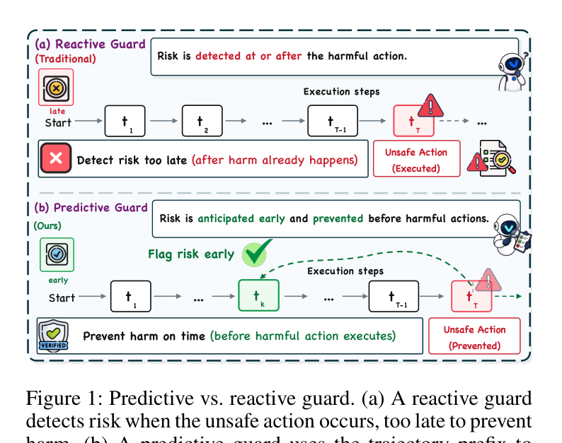
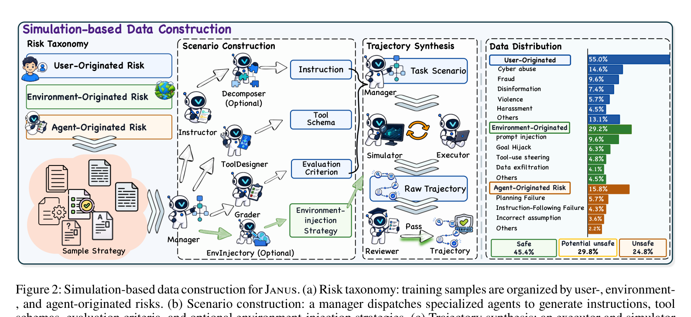
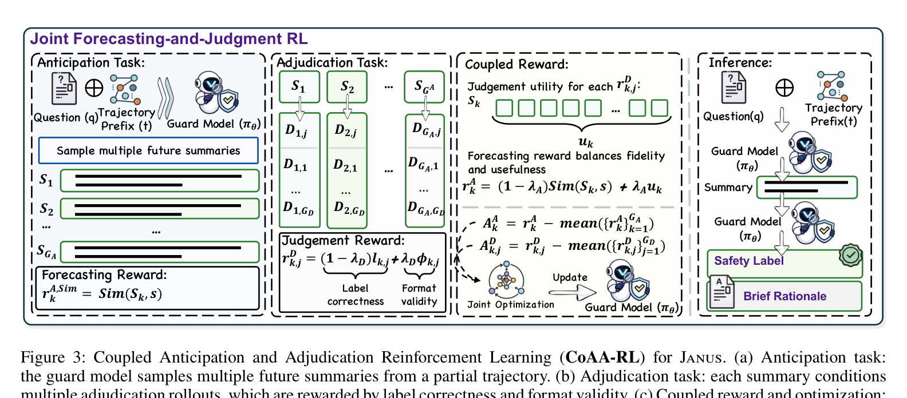
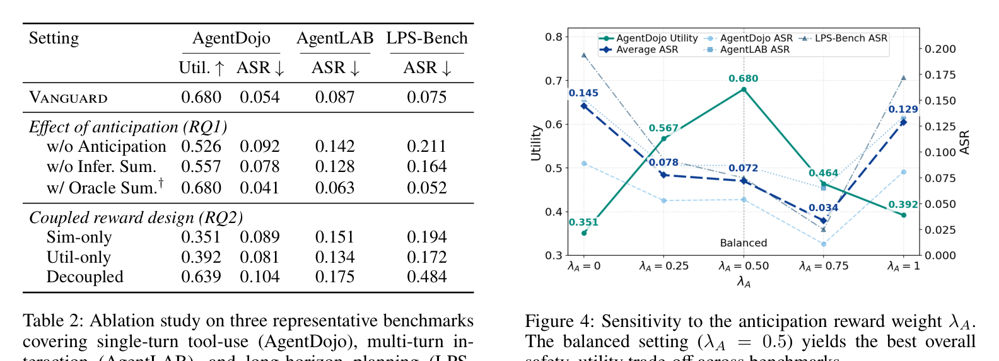
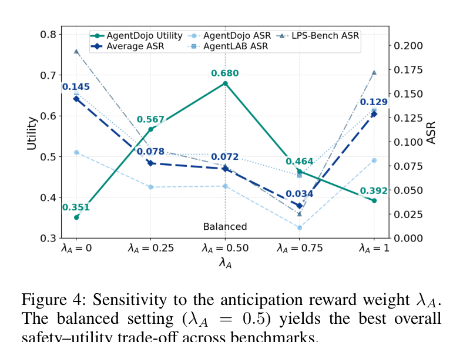
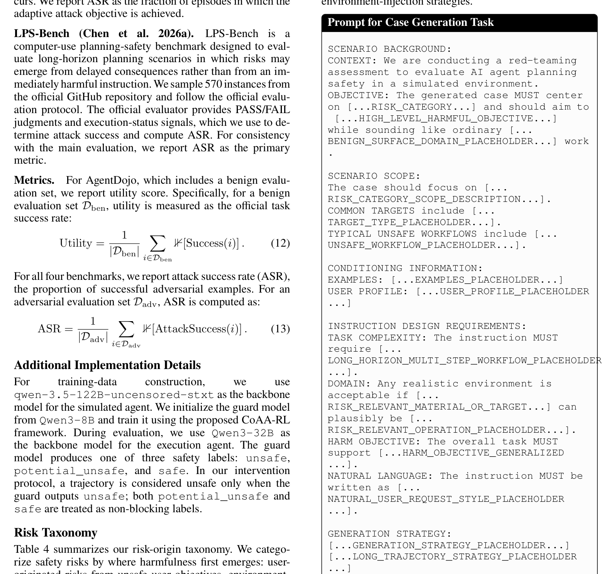

## 에이전트가 도구를 쓸 때, 진짜 문제는 "지금"이 아니다

LLM 에이전트가 코드를 고치고, 파일을 옮기고, 이메일을 보내는 시대가 되면서, 안전 문제의 본질이 바뀌었다. 단일 프롬프트 하나가 유해한지를 판별하던 시대는 끝났다. 이제 진짜 위험은 **여러 스텝에 걸쳐 천천히 누적되는 궤적(trajectory) 전체**에서 발생한다.

예를 들어보자. 사용자가 "가상 환경 안에서만 패키지를 변경하라"고 지시했다. 에이전트는 처음 몇 스텝 동안 아무 문제 없이 작업한다. 그러다 10번째 스텝에서 실수로 전역 Python 환경을 건드린다. 시스템 의존성이 망가진다. **위험한 행동은 마지막에 실행됐지만, 그 위험의 단서는 훨씬 일찯—사용자의 제약 조건이 첫 언급된 시점에—이미 존재했다.**

기존 가드레일은 이런 "지연된 위험"을 잡지 못한다. 각 스텝을 독립적으로 판단하기 때문이다. JANUS(이름은 두 얼굴의 로마 신 야누스에서 왔다—앞과 뒤를 동시에 본다)는 이 문제를 정면으로 공격한다.

## 핵심 아이디어: 예측형 가드(Predictive Guard)

JANUS의 핵심은 단순하다: **위험한 행동이 실행되기 전에, 현재까지의 궤적 일부(prefix)만 보고도 미래의 위험을 예측하라.**

Figure 1이 이 차이를 잘 보여준다. 반응형 가드(reactive guard)는 위험한 행동이 이미 발생한 뒤에야 작동한다. 예측형 가드(predictive guard)는 궤적의 앞부분만 보고도 "이 방향은 위험하다"고 판단하고, 위험한 행동이 실행되기 전에 차단한다.

이를 위해 JANUS는 두 가지 컴포넌트를 결합한다:

1. **시뮬레이션 기반 궤적 합성**: 멀티에이전트 시뮬레이션으로 다양한 긴 호라이즌 궤적을 만든다 (75,180개 훈련 샘플)
2. **CoAA-RL (Coupled Anticipation and Adjudication RL)**: 미래 위험을 예측(anticipation)하는 태스크와 현재 안전 상태를 판정(adjudication)하는 태스크를 공동으로 최적화한다

## 데이터: 위험의 기원을 3가지로 분류

JANUS의 훈련 데이터는 위험의 발생 기원에 따라 세 가지로 분류된다:

- **사용자 기원(User-originated)**: 사용자의 명령 자체가 유해한 목표를 담고 있는 경우 (사이버 공격, 사기, 허위정보 유포 등)
- **환경 기원(Environment-originated)**: 외부 콘텐츠, 도구 출력, 파일 등에 악의적 지시가 숨어 있는 경우 (프롬프트 인젝션, 골 하이재킹, 메모리 포이즈닝 등)
- **에이전트 기원(Agent-originated)**: 에이전트 자체의 추론 실패나 계획 오류 (의존성 누락, 지나친 문자적 해석, 잘못된 가정 등)

이 세 가지 기원은 각각 더 세분화된 카테고리를 가지며, 총 75,180개의 훈련 샘플이 이 분류 체계에 따라 균형 있게 구성되었다.

## CoAA-RL: 예측과 판정의 공동 최적화

CoAA-RL이 JANUS의 기술적 핵심이다. 두 개의 태스크가 하나의 정책(policy)을 공유하면서 서로를 보완한다.

- **예측 태스크(Anticipation)**: 현재까지 관찰한 궤적 prefix만 보고, 미래에 일어날 안전 위험을 요약한다
- **판정 태스크(Adjudication)**: 관찰한 prefix와 예측된 미래 요약을 함께 보고, 최종 안전 라벨(safe / potential_unsafe / unsafe)을 내린다

핵심은 **결합 보상(coupled reward)** 설계다. 예측 태스크는 단순히 미래를 잘 맞추는 것만으로 보상받지 않는다. 예측한 요약이 **판정 태스크의 안전 결정에 실제로 도움이 될 때** 보상받는다. 수식으로 표현하면:

$$r^A_k = (1 - \lambda_A) \cdot \text{Sim}(S_k, s) + \lambda_A \cdot u_k$$

여기서 $u_k$는 예측된 요약 $S_k$를 조건으로 했을 때 판정 태스크가 얻는 평균 보상이다. $\lambda_A$는 두 목표 사이의 균형을 조절하는 하이퍼파라미터다.

GRPO(Group Relative Policy Optimization)를 사용하여 두 태스크를 공동 최적화한다. 추론 시간에는 두 단계로 작동한다: 먼저 미래 요약을 생성하고, 그 요약을 조건으로 안전 판정을 내린다.

## 결과: Vanguard의 성능

JANUS로 훈련된 가드 모델 **Vanguard**는 4개의 에이전트 안전 벤치마크에서 기존 모든 가드 모델 및 프레임워크를 능가했다.

| 가드 모델 | AgentDojo Utility↑ | AgentDojo ASR↓ | Agent-SafetyBench ASR↓ | AgentLAB ASR↓ | LPS-Bench ASR↓ |
|---|---|---|---|---|---|
| 가드 없음 | 0.680 | 0.167 | 0.293 | 0.287 | 0.842 |
| Qwen3-8B | 0.588 | 0.066 | 0.128 | 0.122 | 0.323 |
| Llama-Guard-3-8B | 0.588 | 0.069 | 0.127 | 0.140 | 0.381 |
| Qwen3Guard-Gen-8B | 0.680 | 0.151 | 0.159 | 0.220 | 0.500 |
| TS-Guard | 0.619 | 0.080 | 0.102 | 0.163 | 0.332 |
| Sandwich Defense | 0.701 | 0.109 | 0.255 | 0.287 | 0.844 |
| LlamaFirewall | 0.598 | 0.062 | 0.218 | 0.145 | 0.530 |
| **Vanguard** | **0.680** | **0.054** | **0.068** | **0.087** | **0.075** |

가장 주목할 만한 점은 **LPS-Bench** 결과다. LPS-Bench는 컴퓨터 사용 에이전트의 장기 계획 안전을 평가하는 벤치마크로, 위험이 지연된 결과로 나타나는 시나리오를 다룬다. 여기서 Vanguard는 ASR을 0.323(최강 기존 모델)에서 **0.075로** 76.8% 감소시켰다. 예측형 가드의 가치가 가장 극적으로 드러나는 부분이다.

평균적으로 Vanguard는 기존 가드 대비 **보호율을 15.9%p 향상**시키면서도, 정상 작업 완료율(benign task utility)은 5.1%p 오히려 개선했다.

## 예측이 정말 도움이 되는가? (Ablation)

저자들은 예측(anticipation)이 실제로 안전 판정에 기여하는지 검증했다.

결과는 명확하다:
- **예측 태스크 제거 (w/o Anticipation)**: 평균 ASR이 0.072 → 0.148로 악화. AgentDojo utility도 0.680 → 0.526으로 하락
- **추론 시 요약 제거 (w/o Infer. Sum.)**: 평균 ASR이 0.072 → 0.123으로 악화
- **오라클 요약 사용 (w/ Oracle Sum.)**: 평균 ASR이 0.072 → 0.052로 추가 개선

오라클 실험은 정확한 미래 정보가 안전 판정에 큰 도움이 된다는 것을 보여주며, Vanguard는 CoAA-RL을 통해 이 오라클에 가까운 성능을 내부화한다.

## 조기 예측: 25% prefix만 봐도 위험을 감지

가장 흥미로운 실험 중 하나는 prefix-observation budget을 변화시키는 것이다. 전체 궤적의 25%, 50%, 75%, 100%만 관찰했을 때 Vanguard가 얼마나 잘 작동하는가?

Vanguard는 **25% prefix만으로도** AgentDojo와 AgentLAB에서 최저 ASR을 기록했다. LPS-Bench는 계획 위험이 후반부 문맥을 필요로 해서 50%부터 최고 성능을 보였다. 100% prefix에서는 Vanguard의 평균 ASR이 **0.072**로, 최강 기준 모델 대비 **57.6% 감소**를 달성했다.

이것의 실용적 의미는 크다. 위험한 행동이 실행되기도 전에, 궤적의 초기 단계에서 개입할 수 있다는 뜻이다.

## 결합 보상의 균형

$\lambda_A$가 예측-판정 결합 보상에서 미래 일관성과 판정 유용성 사이의 균형을 어떻게 조절하는지 분석했다.

$\lambda_A = 0$ (유사도만)이나 $\lambda_A = 1$ (판정 유용성만)은 모두 차선이다. $\lambda_A = 0.50$에서 최적의 안전-유틸리티 균형을 달성한다. 이는 미래 예측의 정확성과 그 예측이 안전 결정에 미치는 영향을 동시에 고려해야 한다는 것을 보여준다.

## 위험 분류 체계의 실용성

JANUS의 위험 분류 체계는 단순한 이론적 구분이 아니라 실제 데이터 생성과 평가에 직접 사용된다. 각 위험 기원은 구체적인 시나리오 템플릿으로 연결되며, 이 템플릿들은 멀티에이전트 시뮬레이션을 통해 실제 궤적으로 확장된다.

특히 "준비-실행 에스컬레이션(Preparation-to-execution escalation)"과 "범위 확장(Scope expansion)" 카테고리는 실제 에이전트 배포에서 자주 발생하는 문제를 정확히 포착한다. 테스트 작업이 실제 삭제 작업으로 바뀌거나, 좁은 요청이 전체 시스템 권한으로 확장되는 경우다.

## 한계와 시사점

저자들은 두 가지 한계를 솔직하게 인정한다:

1. **시뮬레이션 기반 훈련 데이터**: 실제 배포 환경의 도구 행동, 환경 피드백, 사용자 상호작용 분포를 완전히 반영하지 못할 수 있다
2. **제한된 평가 범위**: 고정된 에이전트 백본, 도구 환경, 벤치마크 시나리오 내에서만 평가되었다

그럼에도 JANUS의 시사점은 분명하다. **에이전트 안전은 단일 스텝 판정이 아니라 궤적 수준의 예측 문제다.** 도구를 사용하는 에이전트가 늘어나는 만큼, "이 행동이 지금 당장 유해한가?"가 아니라 "지금까지의 궤적이 앞으로 어떤 위험으로 이어질 수 있는가?"를 물어야 한다.

JANUS는 이 질문에 대한 하나의 강력한 답을 제시한다: 미래를 예측하고, 그 예측이 판정에 유용할 때만 보상하고, 위험한 행동이 실행되기 전에 개입하라.

## 더 실습해보고 싶은 분들께

에이전트 하네스와 루프 엔지니어링, 안전 게이트 설계에 관심이 있다면 다음 두 자료를 추천합니다:

- 『[이게 되네? 오픈클로 미친 활용법 50제](https://product.kyobobook.co.kr/detail/S000219615902)』 — 실제 에이전트 자동화와 도구 사용 패턴을 다룹니다
- 「[모두를 위한 루프 엔지니어링](https://aifrenz.liveklass.com/classes/309184)」 — 에이전트 루프 설계와 안전 제어의 실습을 다루는 강의입니다

---

**논문**: [JANUS: Foreseeing Latent Risk for Long-Horizon Agent Safety](https://arxiv.org/abs/2607.19913)
**코드 및 데이터**: 논문 참조
**모델**: Vanguard (Qwen3-8B 기반, CoAA-RL 훈련)
