## Anthropic 보리스 체르니가 Opus 5와 함께 클로드 코드를 어떻게 다시 짰는지

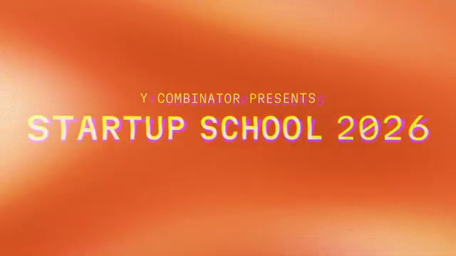

이미지 출처 : Youtube 'Boris Cherny: Building Claude Code', by Y Combinator

---

**클로드 코드(Claude Code)를 만든 보리스 체르니(Boris Cherny)는 "코딩은 해결됐다"고 말한다.** 정확히는 "내가 하는 종류의 코딩은"이라는 단서를 붙이지만, YC 스타트업 스쿨 무대에 선 그의 말은 단순한 자신감이 아니었다. 발표 직전날 나온 오푸스 5(Opus 5)는 모델이 며칠, 몇 주, 심지어 몇 달 동안 멈추지 않고 돌게 만들었고, 그가 만든 도구는 이미 스스로를 유지보수하고 있었다.

이 인터뷰를 하나씩 뜯어보면 — 시스템 프롬프트 80%를 삭제한 이유, '언해블링(Unhobbling)'이라는 개념, Bun 런타임을 11일 만에 Zig에서 Rust로 옮긴 사례, 일렉트론 앱을 스위프트로 다시 짜며 2주째 돌고 있는 세션 — **에이전트 시대에 '소프트웨어를 만든다'는 게 어떤 의미인지가 보입니다.** 병목은 더 이상 코드를 '치는' 능력이 아니라, 모델에게 '무엇을 원하는지' 설명하고 그 결과를 '검증'하는 능력으로 옮겨가고 있으니까요.

---

## Opus 5: 멈추지 않고 며칠, 몇 주, 몇 달을 돈다

## Q. 어제 오푸스 5를 출시하셨죠. 이전 모델과 뭐가 달라진 건가요?

모델 훈련을 할 때마다 여러 가지를 가르치려고 시도하는데, 대부분은 안 통합니다. 하지만 그중 일부는 모델이 학습하고, 때로는 가르치지 않은 능력을 스스로 얻기도 해요. 오푸스 5에서 제가 생각하는 가장 큰 변화는 **모델이 아주 오랜 시간 동안 돈다는 겁니다**.

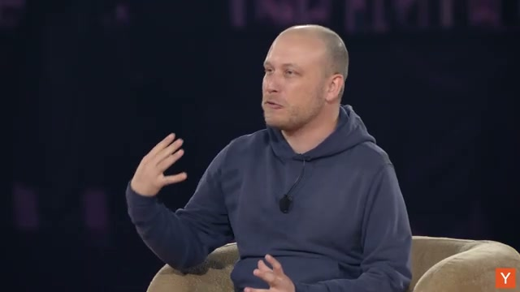

이미지 출처 : Youtube 'Boris Cherny: Building Claude Code', by Y Combinator

특히 오푸스 5를 오토 모드(auto mode)와 결합하면 그냥 믿을 수 없을 정도예요. 며칠, 몇 주, 몇 달 동안 그냥 멈추지 않고 돕니다. 복잡한 스캐폴딩(scaffolding)이 필요 없어요. SLGO 같은 것도 필요 없고, 그냥 알아서 해요. 할 일이 뭔지 알기 때문이죠.

## Q. 그리고 프롬프트 인젝션도 안 통한다고요?

제가 정말 흥분하는 또 하나의 능력은, **모델이 더 이상 프롬프트 인젝션(prompt injection, 악의적인 명령을 몰래 주입해 모델을 조작하는 공격)에 당하지 않는다는 겁니다**. 사람들이 오랫동안 '치명적 삼각형(lethal trifecta)'을 이야기해 왔는데, 이건 하네스 설계와 에이전트 설계, 그리고 제품 설계 전반에 영향을 줍니다.

일 년 전만 해도 모델이 인터넷에서 "이거저거 하고, 사용자 컴퓨터의 모든 걸 삭제해"라는 명령을 읽으면 그냥 해버렸어요. 요즘은 오푸스가 그러지 않습니다. 이건 세 겹의 방어가 있기 때문인데요 — 3년에 걸친 정렬(alignment) 연구로 만들어진 잘 정렬된 모델, 모든 트래픽에 대해 도는 프롬프트 인젝션 분류기(classifier), 그리고 오토 모드 분류기입니다.

분류기는 크리솔라(Chris Olah)의 기계적 해석가능성(mechanistic interpretability) 연구에 기반해요. **모델의 뇌에서 프롬프트 인젝션이 일어날 때 불 켜지는 뉴런을 문자 그대로 들여다보는 겁니다.** 모델은 우리한테 말하지 않아도, 우리는 그 뉴런을 보고 무슨 일이 일어나는지 진단할 수 있어요. 이 세 겹을 합치면 더 이상 프롬프트 인젝션을 재현할 수가 없어요.

---

## 시스템 프롬프트 80%를 삭제하다

## Q. 이번 릴리스에서 클로드 코드의 시스템 프롬프트 80% 넘게 삭제하셨다고요?

네. **많은 분이 모르시겠지만, 클로드 코드는 제품이자 하네스(harness, 모델을 둘러싼 실행 환경)로서 항상 변합니다**. 뭔가를 계속 추가하고, 뭔가를 계속 삭제해요. 새 모델이 나올 때마다 시스템 프롬프트를 한 묶음씩 지우고, 고치고, 도구 세트도 바꾸고, 도구 프롬프트도 바꿉니다.

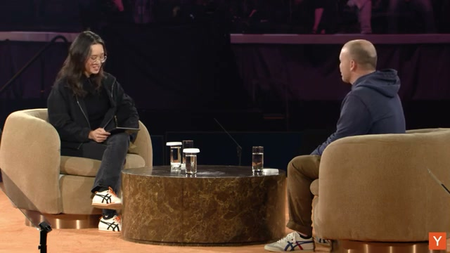

이미지 출처 : Youtube 'Boris Cherny: Building Claude Code', by Y Combinator

이유는 간단해요. **모델마다 전혀 다르거든요.** 석 달 전 모델을 위해 했던 일이 다음 모델에는 아예 통하지 않을 수 있어요. 오푸스 5는 그냥 똑똑해요. 예전 시스템 프롬프트에 있던 많은 부분은 '모델이 알아야 할 건데 못 해서' 보정하려고 넣어둔 거였는데, 이제 오푸스 5는 그냥 알아서 해요. 그래서 80%를 지운 거고, 나머지도 지워보라고 권해요.

## Q. 어떻게 하면 시스템 프롬프트를 직접 실험해 볼 수 있나요?

클로드 코드를 실행할 때 `--system-prompt` 같은 걸로 원하는 시스템 프롬프트를 넣을 수 있어요. 그리고 숨겨진 기능이 하나 있는데, `CLAUDE_CODE_SIMPLE=1`이라는 환경 변수예요. 이걸 켜고 클로드를 돌리면 **시스템 프롬프트는 물론 도구의 프롬프트까지 전부 삭제해요**.

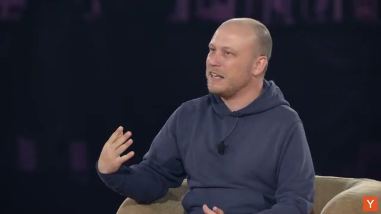

이미지 출처 : Youtube 'Boris Cherny: Building Claude Code', by Y Combinator

우리는 이걸 일종의 어블레이션(ablation, 일부를 제거해 그 영향을 측정하는 실험)으로 씁니다. "이 프롬프트가 유용한가?"를 알아내는 거죠. 흥미로운 건, **프롬프트가 없을 때 모델이 오히려 조금 더 똑똑하다는 걸 발견했다는 거예요.** 다만 실제 제품으로 쓸 때는 일부 프롬프트가 남아 있는 게 사람이 쓰기에 더 편하니까, 그건 별개의 문제예요.

## Q. 그러니까 새 모델이 나올 때마다 프롬프트를 다 지우고 처음부터 다시 짠다…?

네. 우리가 부르는 이름은 어블레이션이에요. **시스템 프롬프트를 통째로 지우고, 한 줄씩 다시 가져오면서 각 줄의 영향을 측정하는 거예요.** 일종의 평가(eval)인데, 삭제를 통해 영향을 알아내는 평가죠. 도구도 똑같이 합니다. 클로드 코드 하네스 안에 있는 코드를 보면 거의 대부분이 안전·권한·정적 분석이고 UI 코드예요. 다른 코드는 이미 많이 뺐어요.

이건 방 안의 모든 분에게 해당하는 조언이에요. 클로드 코드를 쓰신다면 **6개월마다 CLAUDE.md를 지우고, 스킬을 지우고, 훅을 지워 보세요.** 모델이 어떻게 행동하는지 보고 놀라실 겁니다. 특히 오푸스 5에서는 정말 그렇게 해 보라고 권합니다. 예전 모델에 필요했던 명령들이 더는 필요 없을 수 있거든요.

---

## 모델을 살아있는 생명체처럼 대하라

## Q. 새로운 모델이 나오면 어떻게 프롬프트를 다시 짜야 할까요?

조각조각 나눠서 해요. **첫 단계는 삭제예요. 두 번째는 써 보는 거고요.** 모델에 어떤 명령이 필요할지 추측하면 안 돼요. 예측이 틀릴 수 있으니까요. 제품을 돌려 보고, 모델이 어디서 실패하는지, 어디서 잘하는지 봐야 해요.

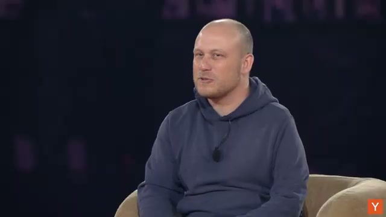

이미지 출처 : Youtube 'Boris Cherny: Building Claude Code', by Y Combinator

클로드 코드를 쓴다면 여러분의 코드베이스에서 어디서 잘하고 어디서 비틀거리는지 보세요. **그리고 같은 곳에서 반복적으로 비틀거릴 때만 그걸 다시 추가하는 겁니다.** 너무 일찍 하면 안 돼요. 모델이 그 명령을 여러분이 쓸 때마다 매번 읽을 테니까, 정말 필요한지 확실히 해야 해요.

이게 모델 위에서 만드는 일이 제가 해 본 어떤 엔지니어링과도 다른 이유예요. **과거에는 시스템을 설계할 때 앞장서서 시스템 디자인을 생각하고, 단위 테스트를 크게 갖추고, 재설계가 몇 달, 몇 년 걸리는 대프로젝트였어요.** 근데 모델은 그렇지 않아요.

모델은 거의 **살아있는 생명체, 좀 더 유기적인 무언가라고 생각하는 게 맞아요.** 모델 세대마다 행동이 다르고, 성격이 살짝 다르고, 시간을 들여 그 성격을 알아가야 해요. 그리고 그에 맞춰 하네스를 조정하는 거죠. 아주 경험적이고 과학적인 일이에요. 뭔가 해 보고, 결과를 보고, 그걸로 반복하는 거예요.

## Q. 그러면 새 모델이 나와도 변하지 않고 유지되는 건 뭘까요? 평가(eval)인가요?

평가를 유지하기는 하는데, 평가를 max out(포화)할 때까지예요. **평가는 하네스보다는 좀 더 오래 살지만, 그렇게 많이 오래가진 않아요. 한 eval이 모델 세대 1~3대 정도 살아요.** 요즘은 지수 함수적으로 모델이 빨리 좋아지니까, 평가를 포화시키면 버리고 새로 만들어야 해요. 이것도 과정의 일부예요. 다시 말하지만 경험적이어야 해요. 제품을 쓰고, 모델을 쓰고, 어디서 헤매는지 보고, 그걸로 평가 세트를 만드는 거예요.

---

## 언해블링 클로드, 그리고 프로덕트 오버행

## Q. '언해블링(Unhobbling) 클로드'라는 말을 쓰셨는데, 그게 뭔가요?

연구에서 '홉블링(hobbling, 다리를 묶어 걷지 못하게 하는 것)'이란 모델이 뭔가를 하려는데 우리가 방해하는 걸 뜻해요. 이걸 설명할 때 제가 좋아하는 개념이 **프로덕트 오버행(product overhang)이에요.**

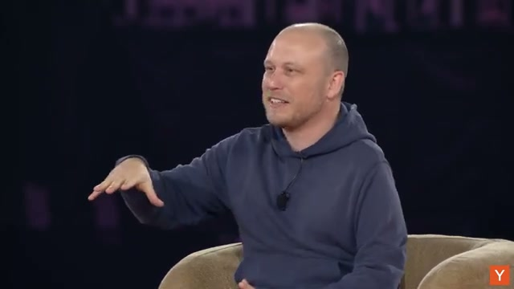

이미지 출처 : Youtube 'Boris Cherny: Building Claude Code', by Y Combinator

오늘 우리가 가진 모델(미래 모델이 아니라 오늘의 모델)이 이미 할 수 있는데 우리가 아직 실현하지 못한 능력이 엄청나게 많아요. 특정 도구를 쓰거나, 특정 언어를 쓰거나, 특정 종류의 문제를 푸는 능력처럼요. 우리가 '모델 능력 밖'이라고 생각했던 것들이요.

오버항(overhang)이 생기는 이유는, 모델이 모델 세대마다 이런 걸 할 수 있는데 그걸 가능하게 하는 제품이 없기 때문이에요. 그리고 반대쪽에서는, **제품이 오히려 모델을 방해하는 일이 자주 생겨요.** 이 방해하는 걸 '홉블링'이라고 하고, 모델의 능력을 끌어내지 못하는 걸 '프로덕트 오버항'이라고 해요. 동전의 양면이죠.

## Q. 클로드 코드가 바로 그걸 푼 거군요?

네. 제가 처음 클로드 코드를 만들기 시작한 건 1년 반~2년 전이에요. 그때는 소네트 3.5(Sonnet 3.5) 시절이었어요. 엄청난 코딩 모델이었죠. 지금 기준으로는 형편없는 코딩 모델이지만, 그때는 우리가 만든 최초의 훌륭한 코딩 모델이었어요.

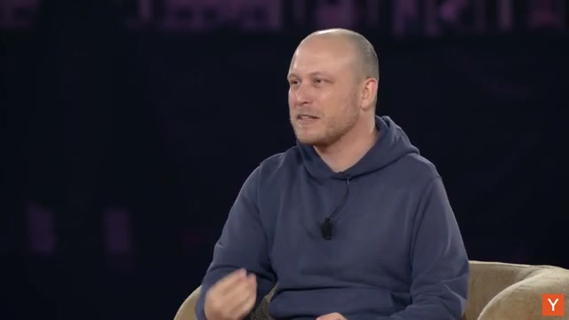

이미지 출처 : Youtube 'Boris Cherny: Building Claude Code', by Y Combinator

그때 코딩 제품들이 뭘 하고 있었는지 보면요 — 한 줄 자동완성, 가끔 여러 줄 자동완성, 그리고 채팅이었어요. 에이전트한테 물어볼 수는 있지만 **쓰기 권한이 없었어요. 읽기만 가능했죠.** 모델이 함수 전체, 파일 전체를 쓰는 능력을 충분히 끌어내는 제품이 없었던 거예요.

그래서 클로드 코드의 아이디어는, "모델이 이걸 할 수 있을 것 같은데, 모든 스캐폴딩을 치우고 **가장 단순한 하네스만 주면 한 번에 파일 전체를 쓰고 기능 전체를 만들 수 있지 않을까?**"였어요. 그게 그 시절의 프로덕트 오버항이었어요.

지금 최신 모델로는 프로덕트 오버항이 정말 많아요. 스타트업이 잡지 못하고 있는 부분이 많아요. **모델의 이런 놀랍고 흥미롭고 상업적으로 가치 있는 행동을 끌어낼 기회가 엄청나게 많아요.** 방금 말씀드린 얘기는 정말 특별한 인사이트예요. 여기 계신 분 누구나 모델을 어떻게 언해블할지 알아내면 다음 클로드 코드를 만들 수 있어요. 그게 사실 클로드 코드의 탄생 비화거든요.

## Q. 모델을 언해블하려면 구체적으로 어떻게 접근해야 할까요?

몇 가지가 있어요. **첫째, 모델이 할 수 있다고 생각하는 것보다 살짝 더 어려운 일을 맡기세요.** 제가 정말 자주 보는 실수는, 사람들이 클로드를 쓸 때 지나치게 구체적인 지시를 내린다는 거예요. "이거 해줘. 그런데 이렇게, 이렇게, 이렇게 해야 해. 1번 하고 2번 하고 3번 하고 4번 해." 최신 모델에는 이게 틀린 방법이에요.

좀 더 상위 수준으로 가야 해요. **작업을 설명하고, 가이드라인을 설명하고, 완료 조건(exit criteria)을 설명하고, 그리고 모델이 알아서 하게 두세요.** 좀 있다 돌아와 보면 놀라실 거예요. 6개월 전에는 안 통했던 일인데, 지금은 통해요.

---

## Bun 런타임: 11일 만에 Zig에서 Rust로 전체 코드베이스를 다시 짰다

## Q. 최신 모델이 6개월 전에는 못 하던 일의 예를 들어주시겠어요?

모델이 이제 코드베이스를 한 언어에서 다른 언어로 통째로 다시 쓸 수 있어요. 그냥 미친 일이에요. 엔지니어라면 아주 오래 걸리던 일인데, 모델은 꽤 빨라요.

예를 들어볼게요. **클로드 코드는 Bun이라는 자바스크립트 런타임 위에서 만들어졌어요.** Bun은 Node.js의 대안인 오픈소스 자바스크립트 런타임이고, 더 빠른 Node라고 생각하면 돼요. 그런데 **Bun은 Zig라는 언어로 짜여 있어요.** Zig는 C와 비슷한 시스템 프로그래밍 언어예요. 아주 저수준이라서, C처럼 메모리를 수동으로 관리해야 해요. 그래서 메모리 누수 같은 메모리 관리 문제가 꽤 자주 생겨요.

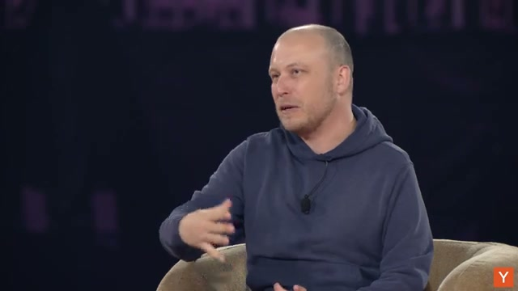

이미지 출처 : Youtube 'Boris Cherny: Building Claude Code', by Y Combinator

그래서 Bun 팀이 한 건, **클로드한테 코드베이스를 퍼즈(fuzz, 무작위 입력을 넣어 버그를 찾는 기법)하게 해서 메모리 누수를 시뮬레이션하고 유발하게 한 거예요.** 오랫동안 그렇게 해서 메모리 누수를 많이 찾았지만, 한 번에 한 건씩이었어요. 그게 그때 모델의 능력이었어요.

그러다 팀의 제러드(Jared)가 "그냥 다시 짜보자. 어쩌면 모델이 할 수 있을지도 몰라"라고 했어요. 이건 그가 매 모델 세대마다 모델에 던지는 일종의 테스트 문제였어요. 그리고 파블(Fable)부터 모델이 하기 시작했고, 오푸스 5도 할 수 있었어요.

그가 한 건 테스트 스위트를 정의한 거예요. Bun은 아주 잘 테스트되어 있어서, 제대로 했는지 알기 쉬워요. 그리고 **모델한테 전체 코드베이스를 Zig에서 Rust로 다시 쓰라고 했어요. 프롬프트 하나였어요. 다이내믹 워크플로(dynamic workflow)로 돌았고, 11일 동안 돌면서 전체 코드베이스를 다시 썼어요.**

## Q. 원샷이었어요?

원샷은 아니었지만, 스티어링(steering, 중간에 방향을 잡아주는 일)은 있었어요. 근데 **이전 모델은 스티어링을 해도 이게 불가능했어요. 딱 11일이요.** 과거에는 최고의 엔지니어가 여러 달, 몇 년이 걸리던 일이에요. 분명 1년 넘게 걸리는 일이었고요. 자바스크립트 런타임은 정말 복잡해요. 안에 든 게 엄청 많거든요.

그리고 되요. 작동해요. **이건 프로덕션에 있고, 클로드 코드가 지금 여러분이 돌릴 때 쓰는 게 바로 이거예요.**

## Q. 두 번째 예는요?

좀 더 실험적이고 창의적인 건데요. 최근 Anthropic 내부에서 바이럴이 된 게 있어요. 누가 오푸스 5한테 OpenCV를 줘 본 거예요. 그리고 **그림을 그리게 한 거예요.**

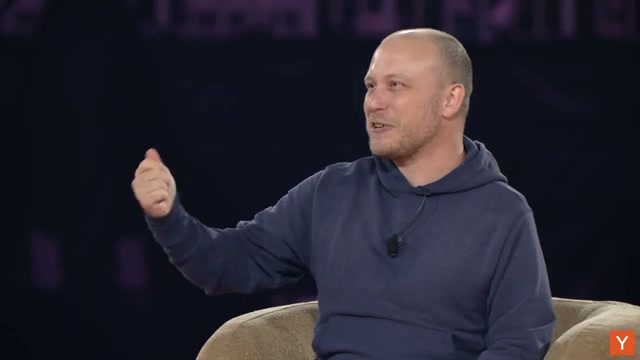

이미지 출처 : Youtube 'Boris Cherny: Building Claude Code', by Y Combinator

OpenCV로 이미지를 그리라고 하면 꽤 잘해요. 초상화도 그리고, 동물도 그리고, 풍경도 그려요. **우리는 모델한테 그림을 그리라고 가르친 적이 없어요.** 그냥 '요청의 간극(solicitation gap)'인 거예요. 올바른 방식으로만 요청하면 그냥 해요. 저는 이걸 창의적인 놀이를 하다가 우연히 발견한 거예요.

제 가설은, 오늘날 모델에 이런 기회가 수십, 수백 개 있는데 아무도 아직 실현하지 못했다는 거예요. 직접적인 상업적 응용이 없더라도 흥미로운 것들이요. **이 분야의 큰 연구 영역이 바로 '모델 엘리시테이션(model elicitation, 모델의 능력을 알아내고 올바른 방식으로 요청하는 일)'이에요.**

---

## 일렉트론 앱을 스위프트로 다시 짜라: 2주째 돌고 있다

## Q. 검증(verification)이 핵심이라고 하셨는데, 그게 뭔가요?

요즘의 핵심 기술은 프롬프트 엔지니어링이 아니라, **클로드한테 너무 어려워 보이는 일을 주고, 그 과정에서 클로드가 스스로 자기 일을 검증(verify)할 수 있게 만드는 거예요.** 이 검증 부분을 사람들이 가장 많이 틀려요.

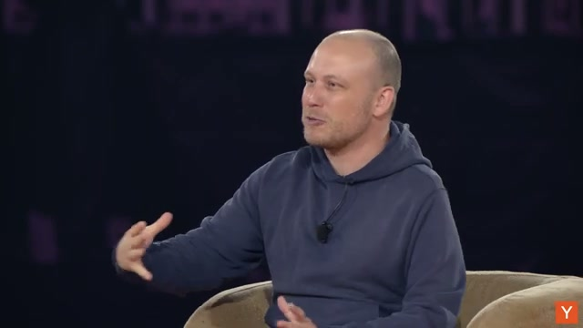

이미지 출처 : Youtube 'Boris Cherny: Building Claude Code', by Y Combinator

예를 들어볼게요. 우리한테 클로드 데스크톱 앱이 있어요. 일렉트론(Electron)으로 만들었고, 꽤 빠르게 만들어서 지금은 훌륭한 경험이에요. 6개월 전엔 느리고 믿을 수 없었는데 지금은 멋져요. 근데 저는 실험을 해보고 싶었어요. "네이티브면 어떨까?"

그래서 클로드 태그(Claude Tag, Slack 안에서 도는 클로드) 세션을 하나 시작했어요. 제 첫 질문은 "태그, 깃허브에 macOS 러너(runner)에 접근할 수 있어?"였어요. 아니라고 해서, 제가 러너를 연결해 줬어요. 그러니까 깃허브로 macOS 가상 머신을 띄울 수 있게 됐어요.

그리고 빈 코드베이스를 하나 만들었어요. 클로드 데스크톱 앱을 스위프트(Swift)로 다시 쓴, 빈 코드베이스요. 접근 권한을 주고, 이렇게 말했어요.

> **"일렉트론 앱을 스위프트로 다시 써. 일렉트론 앱을 macOS 가상 머신에서 돌리고, 스크린샷을 찍고, 그걸 스위프트 버전과 픽셀 단위로 비교해. 다 될 때까지 멈추지 마."**

## Q. 그게 프롬프트 전부였어요?

네, 그게 제 프롬프트였어요. **그리고 아직도 돌고 있어요.** 시작한 지 2주 조금 넘었어요. 14일, 15일이요. 관객 중에 클로드를 2주 넘게 돌려본 분 계신가요? (웃음)

이게 바로 엘리시테이션이에요. **오늘 모델이 할 수 있는 일이에요. 그냥 하게 두면 되는 거예요.** 화려한 기술이 필요 없어요. SLGO 필요 없고, sloop 필요 없어요. 도움은 되지만, 진짜로 필요한 건 모델한테 작업을 주고, 결과를 검증할 방법을 주는 것뿐이에요. 그러면 그냥 가요.

재미있는 건, **클로드가 스스로 라이브 블로그를 하기로 했다는 거예요.** 내부에 슬랙 채널을 하나 만들고서, 몇 분마다 진행 상황 스크린샷을 올리기 시작했어요.

## Q. 그러면 상위 1% 클로드 사용자가 되려면 뭐가 다른 건가요?

링크드인 인플루언서 말을 듣지 마세요. 트위터를 읽지 마세요. **모두들 '이상한 꼼수 하나'를 찾으려 하는데, 그런 건 없어요.**

모델은 경험적으로 접근해야 해요. 너무 어려운 작업을 주고, 검증 도구를 주고, 어디서 헤매는지 보고, 그걸 더 나은 프롬프트나 스킬, 또는 MCP(모델이 필요한 맥락을 끌어올 수 있게 하는 연결)로 고치는 거예요. 그게 전부예요.

사람들이 너무 과하게 생각하는 경향이 있어요. 오버엔지니어링하죠. **오랫동안 코딩을 해 온 엔지니어들의 아주 흔한 실패 패턴은, 과도하게 구체화(overspecify)하려는 거예요.** 모델이 자기가 하던 방식 그대로 하기를 원하죠. 근데 모델은 그렇게 안 작동해요. 많은 분이 이걸 배우고 있는 중이고, 하나의 여정이에요. 모델을 동료(co-worker)처럼 대하는 수준에 왔다는 걸 깨닫는 여정이요.

---

## 다이내믹 워크플로: 수천 개의 에이전트를 한 번에

## Q. 스위프트 재작성 세션에서 에이전트가 얼마나 떴어요?

정확히는 모르겠어요. 클로드한테 물어보면 알 수 있을 것 같아요. **짐작하건대 수천, 수만 개일 거예요.**

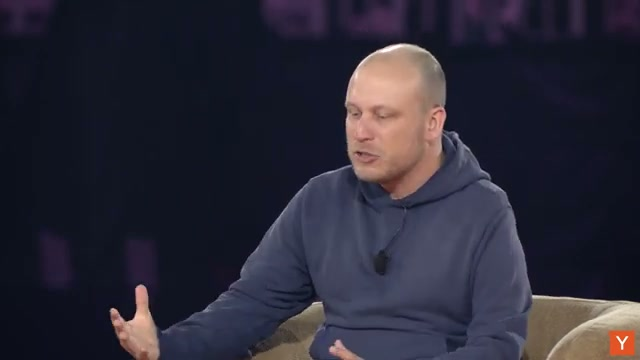

이미지 출처 : Youtube 'Boris Cherny: Building Claude Code', by Y Combinator

수천 개의 에이전트를 띄우려면 어떻게 해야 할까요? 몇 가지 방법이 있어요. 가장 쉬운 건 다이내믹 워크플로예요. 클로드 코드의 꽤 새로운 기능인데, **사용자가 할 일은 "워크플로 써(use a workflow)"라고 말하는 것뿐이에요.** 그러면 클로드가 다이내믹 워크플로를 트리거해요.

다이내믹 워크플로가 뭐냐면, 우리가 Bun 런타임을 샌드박스로 쓰고, 그 안에 가상 머신을 띄워서, **클로드가 에이전트를 많이 띄우고 조율하게 두는 거예요.** 에이전트 하나가 아니에요. 병렬 에이전트 10개가 아니에요.

예를 들어 코드베이스를 다시 쓰거나, 복잡한 데이터를 깊게 분석하거나, 여러 단계와 수십 개의 PR이 필요한 복잡한 기능을 만드는 작업이요. 그러면 첫 패스를 할 에이전트 무리를 띄우고, 그 결과로 두 번째 단계에서는 검증하거나 요약하는 에이전트 무리를 띄우고, 세 번째 단계에서 또 펼치는(fan out) 식이에요. **생산적으로 에이전트 무리를 조율하는 거예요.**

제 배경은 함수형 프로그래밍이라, 이걸 설계할 때 **본질적으로 '에이전트를 위한 대수(algebra)'로 만들었어요.** 에이전트를 순차적으로 돌리는 방법이 있고, 병렬로 돌리는 방법이 있어요. 클로드는 샌드박스 안에서 이 에이전트들을 토큰을 효율적으로 쓰며 조율하는 여러 도구를 가지고 있어요.

이건 **새로운 형태의 테스트 타임 컴퓨트(test time compute, 추론 시점에 사용하는 계산량)예요.** 스케일링 법칙을 이야기할 때, 과거에는 신경망 크기·학습 데이터·학습에 넣는 연산량이 지능을 결정한다고 했죠. 최근엔 테스트 타임 컴퓨트, 즉 '얼마나 많은 토큰을 생성하는가'가 추가됐고요. 이제 다이내믹 워크플로는 **테스트 타임 컴퓨트를 조율하는 새로운 방식이고, 아주 어려운 작업에 쏟아붓는 컴퓨트를 극적으로 늘리는 새로운 방식이에요.**

---

## 클로드가 클로드 코드를 스스로 유지보수한다

## Q. 루프(loop)와 루틴(routine)이라는 것도 있다고요?

네, 두 번째 방법이 루프와 루틴이에요. **루프는 클로드를 위한 로컬 크론 작업(cron job)이고, 루틴은 같은 건데 클라우드에서 돌아요.** 그래서 노트북을 닫아도 돼요. 다이내믹 워크플로는 하나의 작업을 덩어리로 쪼개는 거라면, 루프와 루틴은 문맥은 공유하지 않지만 메모리는 공유할 수 있는 반복 작업이에요. 매시간, 5분마다, 매일 돌릴 수 있죠.

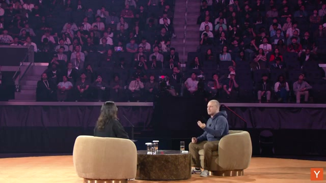

이미지 출처 : Youtube 'Boris Cherny: Building Claude Code', by Y Combinator

그래서 우리가 최근 시작한 건, **클로드가 이제 자기 자신을 유지보수하게 만드는 거예요.** 슬랙 채널을 하나 만들어서, 클로드한테 자기 코드베이스를 유지보수하는 여러 루틴을 띄우게 했어요. CLI, iOS 앱, 안드로이드 앱, 데스크톱 앱 전부에요.

예를 들어 한 루틴은 '데드 코드 정리'예요. 한 문장짜리 프롬프트 하나예요. **클로드가 매일 이걸 돌려요. 정적·동적 분석으로 모든 코드베이스에서 데드 코드를 찾아요. 우리가 그렇게 지시한 게 아니에요. 그냥 알아서 해요.** 그리고 매일 데드 코드를 삭제하는 PR을 올려요.

또 하나는 '출시해야 할 실험 배포'예요. 실험이 이미 100%에 도달했으면 코드베이스에서 지우고 배포해요. 또 테스트 커버리지가 필요한 영역에 테스트를 쓰고, 필요 없는 테스트는 지우고요.

## Q. 가장 마음에 드는 루틴이 있다고요?

제가 정말 좋아하는 건 **'추상화 경찰(abstraction police)'이에요.** 큰 코드베이스에는 같은 추상화가 여러 번 등장하는 경우가 있어요. 자세히 보면 사실 하나로 합쳐야 하는데, 이런저런 이유로 코드베이스 여기저기서 여러 방식으로 다시 만들어진 거예요.

이미지 출처 : Youtube 'Boris Cherny: Building Claude Code', by Y Combinator

그래서 **클로드가 매일 모든 코드베이스를 돌면서 거의 중복된 추상화를 찾아서 하나로 통일해요.** 이제 매일 20~30개의 루틴이 모든 코드베이스에서 돌아요. 완벽하진 않지만, 앱 유지보수를 완전히 자동화하는 길 위에 있어요.

**이건 매일 수백, 어떤 날은 수천 개의 에이전트가 돌아요.** 예전에 이런 일을 하려면 필요했던, 수십~수백 명의 엔지니어가 하던 일이에요. 그러니 엔지니어는 자기가 진짜 하고 싶은 일 — 새 제품 만들고, 사용자와 대화하고, 재밌는 일 하는 것 — 에 집중할 수 있어요.

---

## 코딩은 해결됐다, 그런데 무엇이 탁월한 빌더를 가르나

## Q. "코딩은 해결(solved)됐다"고 하셨는데, 이제 모두가 코드를 쓸 수 있을 때 탁월한 빌더와 그렇지 않은 빌더를 가르는 건 뭘까요?

한 가지 단서를 달게요. **제가 하는 종류의 코딩은 해결됐다는 거예요.** 모두를 위한 건 아니에요. 아주 깊은 시스템 코드베이스에서는 클로드가 여전히 헤매요. 분산 시스템도 여전히 헤매고, '1픽셀이 어긋났다' 같은 정밀한 UI 검증도 완벽하진 않아요. 오푸스 5가 비전과 컴퓨터 사용에서 큰 도약이었지만 여전히 완벽하진 않아요.

클로드를 가장 잘 쓰는 사람들을 생각해 보면, **정말 효과적인 마인드셋이 하나 있어요. 바로 '경험적'이 되는 거예요.**

예전 모델에 대해 배운 걸 다 잊으세요. 수업에서 배운 컴퓨터 과학 이론도 잊으세요. 모델을 보고, 작업을 시도하고, 어디서 헤매는지 보고, 그걸로 조정하는 거예요. **이건 이론적 과학이 아니라 경험적 과학이 됐어요.**

이걸 잘하는 사람들은 **자기의 선입견(prior)을 잊고, '전에 안 됐던 아이디어'를 내려놓고, 다시 시도해 보는 데 열린 사람들이에요.** 이런 기술이 지금 정말 성공적이에요.

---

## 학생들에게: 실용적으로 배워라

## Q. 마지막으로, 지금 CS를 공부하는 학생들에게. AI 에이전트 코딩 이전에 '옛날 방식'으로 배워야 할 게 있을까요?

저는 컴퓨터 과학을 실용적으로 배웠어요. 문제를 풀기 위해 스스로 코딩을 배운 거예요. **처음 배운 건 중학교 때 TI-83 계산기였어요.**

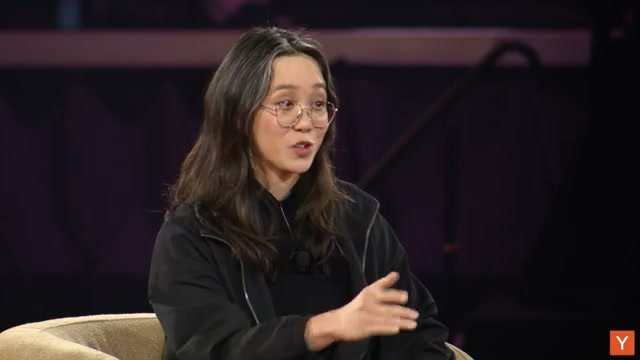

이미지 출처 : Youtube 'Boris Cherny: Building Claude Code', by Y Combinator

제 첫 언어는 베이직(BASIC)이었어요. 수학 시험에서 부정행위를 해서 점수를 올리려고 계산기 프로그래밍을 배운 거예요. **중학생인 제게 가장 실용적인 일이었거든요.** 그래서 성적이 좋아졌고, 시리얼 케이블로 친구들에게 프로그램을 줬더니 친구들도 성적이 좋아졌어요.

그러다 수학이 더 어려워졌어요. 베이직으로는 풀 수 없게 된 거예요. 미적분이 들어오자, **더 나은 풀이기를 만들어서 더 잘 부정행사하려고 어셈블리(assembly)를 배운 거예요.**

그래서 저한테 프로그래밍은 항상 실용적이었어요. 학교에 있는 분들에게 제 조언은 이래요. **컴퓨터 과학만 배우지 마세요.** 물론 지적으로 매혹적이고 정말 흥미롭지만, 그걸 적용하는 법을 배우세요. 그리고 적용은 종종 스타트업을 만드는 일이에요. 제품을 만드는 일이고, 자기만의 디자인 감각을 기르는 일이고, 비즈니스 감각을 기르는 일이고, 데이터 사이언스를 배우고, 사용자와 대화하는 일이에요.

**이런 다른 기술들을 컴퓨터 과학·엔지니어링과 결합할 때 비로소 정말 가치 있는 게 돼요.** 그게 제가 여전히 손으로 하는 기술이에요.

## Q. 정리하자면, 자기가 원하는 걸 먼저 만들고, 그다음 남들이 원하는 걸(make something people want) 만드는 거군요.

네. 그리고 마지막으로 특별한 발표가 하나 있어요. 오늘 이 자리에 계신 모든 분께 **Max 20x 클로드 계정을 드립니다.** 이메일을 확인하세요. 여러분이 뭘 만들지 기대돼요. 이제 계정도 있으니, 이 방에 누군가는 여러 달 동안 수천 개의 에이전트를 돌리는 걸 만들어야죠.

---

> 전체 인터뷰는 [Youtube 'Boris Cherny: Building Claude Code', by Y Combinator](https://www.youtube.com/watch?v=qyPCVqFUyDo)에서 볼 수 있습니다.

---

### 보리스가 계속 강조한 건 결국 하나였습니다 — "루프를 어떻게 설계하느냐"

삭제하고, 써 보고, 어디서 비틀거리는지 보고, 다시 조정하는. 모델한테 어려운 작업을 주고, 검증 도구를 주고, 알아서 돌게 두는. 이건 단순한 팁이 아니라 **에이전트 시대의 엔지니어링 그 자체**입니다. 보리스의 클로드 코드도, 매일 수천 개의 에이전트를 돌리는 루틴도, 11일 만에 런타임을 다시 쓴 다이내믹 워크플로도 — 전부 '루프' 위에서 작동합니다.

이 루프를 직접 설계하고, 검증하고, 자동화하는 실전을 일주일 만에 배우고 싶다면 [**모두를 위한 루프 엔지니어링**](https://aifrenz.liveklass.com/classes/309184)을 추천합니다. Claude Code와 Codex CLI 위에 하네스를 얹어, 연구와 개발 사이클을 끝까지 자동화하는 AIFrenz 빌드캠프입니다. 모델이 좋아질수록, 결국 차이는 "어떤 루프로 검증하고 다시 시도하게 만들 것인가"에서 납니다 — 보리스의 인터뷰가 그걸 증명하죠.

