## 에이전트에게 훈련을 맡기는 시대: Hugging Face의 'Training Agents' 1편

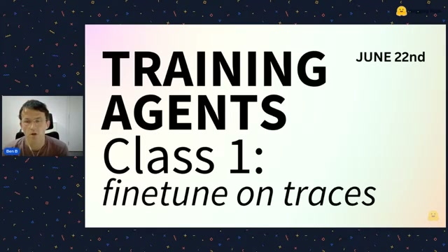

이미지 출처 : Youtube 'Training Agents: Live tutorial on how to fine-tune a coding agent for continual learning', by Hugging Face

---

**Hugging Face 팀이 "Training Agents"라는 라이브 시리즈를 시작했다.** 첫 회에서 Ben과 Sergio가 보여준 것은 단순한 모델 튜닝이 아니었다. **에이전트에게 SFT(Supervised Fine-Tuning, 감독 미세조정) 파이프라인 전체를 맡기고**, 그 에이전트가 직접 매개변수를 스윕하고, HF Jobs를 띄우고, Trackio로 메트릭을 추적하고, 최종 모델을 선별하는 — **에이전트가 에이전트를 훈련하는 메타적 루프**였다.

이 튜토리얼을 뜯어보면 — 프롬프트 하나로 훈련 전 과정을 자동화하는 계약(contract), 에이전트 트레이스를 학습 데이터로 쓰는 방식, SFT의 핵심인 마스킹, Trackio로 보는 실시간 메트릭 — **에이전트 시대에 "모델을 훈련한다"는 게 무엇인지가 보인다.** 병목은 더 이상 '훈련 스크립트를 짜는 능력'이 아니라, 에이전트에게 '무엇을 원하는지' 계약으로 설명하는 능력으로 옮겨가고 있다.

---

## 출발점: 에이전트 트레이스 하나에서 시작된 수업

## Q. 이 수업은 어떻게 시작했나요?

이 세션 전체의 출발점은 **하나의 에이전트 트레이스(trace)**였습니다. Ben은 실제로 Codex 에이전트에게 "Gemma 4 2B 모델을 이 데이터셋으로 SFT 훈련해라"라고 지시한 뒤, 그 전체 과정을 Hugging Face Hub에 푸시했습니다.

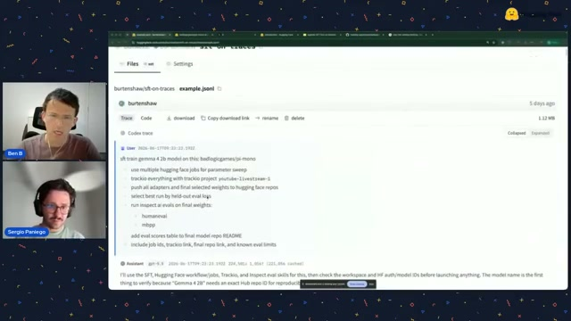

이미지 출처 : Youtube 'Training Agents', by Hugging Face

흥미로운 건, 이 트레이스를 Hub에 푸시하면 **표준 형식으로 예쁘게 렌더링**된다는 겁니다. 각 도구 호출, 매개변수, 결과가 구조화되어 보이죠. Ben은 이것을 "이 세션 전체가 기반하고 있는 트레이스"라고 소개했습니다. **수업 자체가 에이전트가 만든 산물 위에서 진행되는 셈입니다.**

## Q. 에이전트에게 내린 구체적인 지시는 뭔가요?

Ben이 Codex에게 내린 프롬프트는 이랬습니다:

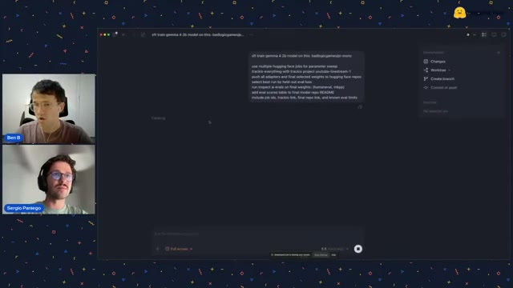

이미지 출처 : Youtube 'Training Agents', by Hugging Face

> **"Gemma 4 2B 모델을 특정 데이터셋으로 SFT 훈련해라. 매개변수 스윕에 HF Jobs를 여러 개 사용하고, 모든 실행을 Trackio로 추적하고, 모든 어댑터를 푸시하고, 평가를 수행하고, 평가 점수를 README에 추가해라."**

이건 단순한 코드 생성 요청이 아닙니다. **훈련의 결과(what)를 정의하고, 과정(how)의 가이드라인을 준 뒤, 에이전트에게 판단을 맡기는 계약**입니다. Ben은 "지난번엔 이 작업이 2시간 30분 걸렸다"고 말하며, 에이전트가 훈련 스크립트를 짜고, 잡을 예약하고, 에러를 처리하고, 최적의 매개변수를 찾는 전 과정을 자율적으로 수행한다는 걸 보여줬습니다.

---

## 에이전트가 훈련을 설계한다: 제약(Contract)과 방향 확보

## Q. 에이전트는 이 프롬프트를 받아서 뭘 하나요?

Sergio가 슬라이드로 설명한 건, 에이전트가 이 고수준 지시를 **구체적인 실행 계획으로 번역**한다는 겁니다.

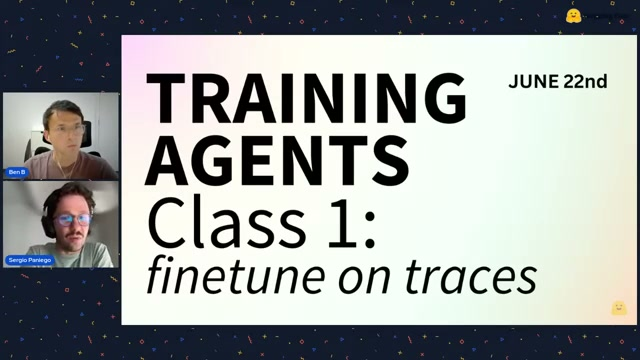

이미지 출처 : Youtube 'Training Agents', by Hugging Face

과거에는 각 단계마다 **파이썬 코드를 직접 짰습니다.** 매개변수를 바꿔가며 여러 번 실행하고, 수동으로 결과를 비교했죠. 이제는 그냥 **에이전트에게 결과(outcome)를 정의**하고, 에이전트가 스스로 결정을 내립니다. 인간은 "에이전트가 내린 결정이 맞는지 검증"하는 역할만 합니다.

## Q. 에이전트에게 건 제약(constraint)은 구체적으로 뭔가요?

에이전트가 따라야 할 제약은 명확했습니다:

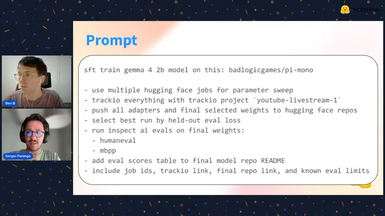

이미지 출처 : Youtube 'Training Agents', by Hugging Face

- **모델**: Gemma 4 2B (소형 오픈 모델)
- **데이터셋**: Mario Zechner의 Pi 에이전트 트레이스 (Claude Opus 4.5 기반)
- **방법**: SFT로 트레이스를 모방(imitate)
- **실행**: HF Jobs로 매개변수 스윕 (여러 학습률, LoRA rank, 시퀀스 길이)
- **추적**: 모든 실행을 Trackio 프로젝트로 통합
- **평가**: HumanEval과 MBPP로 최종 모델 평가, README에 결과 테이블 추가
- **안전**: 돈을 쓰기 전에 smoke test로 인프라 검증

**가장 중요한 원칙은 "돈을 쓰기 전에 확실히 하라"**였습니다. 에이전트는 본격 훈련을 시작하기 전에 자신의 스킬을 읽고, 데이터셋 형태를 확인하고, HF Hub에 푸시 권한이 있는지 검증합니다. Sergio는 이를 "에이전트가 스스로 방향을 잡는다(orientates itself)"고 표현했습니다.

---

## 왜 트레이스로 훈련하는가: 에이전트 언어를 가르치다

## Q. 에이전트 트레이스를 학습 데이터로 쓴다는 게 정확히 뭔가요?

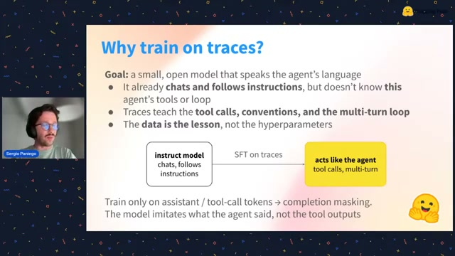

이미지 출처 : Youtube 'Training Agents', by Hugging Face

Gemma 4 2B는 이미 **지시를 따르고 채팅 포맷을 이해하는 모델**입니다. 하지만 에이전트 하네스(harness) 안에서 쓰이는 **도구 호출(tool call) 형식, 멀티턴 대화, 서브에이전트 트리 구조**를 모릅니다.

그래서 **진짜 에이전트가 진짜 작업을 수행한 세션 기록(트레이스)**으로 SFT를 하면, 소형 모델이 **에이전트가 쓰는 '언어'를 모방(imitate)**하게 됩니다. 도구 호출을 어떻게 구조화하는지, 멀티턴에서 어떻게 이어지는지를 배우는 거죠.

이번에 쓴 트레이스는 Mario Zechner(Pi 하네스 제작자)가 13개 저장소에서 실제로 작업하며 만든 세션이라 품질이 높습니다. **실제 환경에서는 자신이 수집한 에이전트 트레이스를 쓰면 됩니다.**

## Q. SFT만으로 완전한 코딩 에이전트가 되나요?

아닙니다. Sergio가 솔직하게 말한 것처럼, 이 첫 단계에서 모델이 배우는 건 **트레이스를 모방하는 것**뿐입니다. 모델은 도구 호출 형식을 따르고 멀티턴을 이어가는 법을 배우지만, **RL 환경에서 보상으로 학습하거나 스스로 작업을 완수하는 능력은 아닙니다.**

이건 시리즈의 **첫 번째 단계**입니다. 다음 세션에서 GRPO를 추가하고, 그다음 RL 환경까지 단계적으로 올라갑니다. **SFT는 기본기이고, RL이 능력을 끌어올리는 역할**입니다.

---

## 스킬(Skills): 에이전트가 올바른 길을 가도록 유도하는 법

## Q. 에이전트가 어떻게 TRL과 HF Jobs를 올바르게 쓸 수 있나요?

핵심은 **스킬(Skills)**입니다. Ben이 보여준 저장소에는 에이전트가 참조하는 `.md` 파일들이 있었습니다.

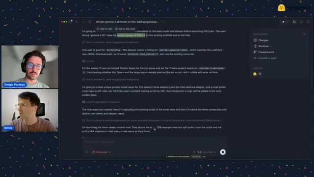

이미지 출처 : Youtube 'Training Agents', by Hugging Face

스킬은 에이전트에게 "이 도구는 이렇게 써라"를 알려주는 가이드입니다. 예를 들어:
- **TRL 스킬**: SFT 트레이너를 어떻게 설정하는지
- **HF Jobs 스킬**: 어떤 하드웨어를 선택하고 어떻게 잡을 예약하는지
- **Trackio 스킬**: 메트릭을 어떻게 일관되게 추적하는지
- **커스텀 SFT 스킬**: 이 수업에서 쓰는 특정 워크플로우

Ben의 조언이 인상적입니다: **"에이전트가 자주 저지르는 실수를 스킬에 기록해서 같은 길로 빠지지 않게 해라."** 스킬은 처음엔 테스트해 검증한 '올바른 경로'를 정의하고, 실험이 성숙해지면 에이전트가 직접 업데이트하게 만듭니다.

---

## 에이전트가 생성한 훈련 스크립트

## Q. 에이전트가 실제로 만든 코드는 어떤 건가요?

에이전트는 스킬과 프롬프트를 바탕으로 **전체 훈련 스크립트를 생성**했습니다.

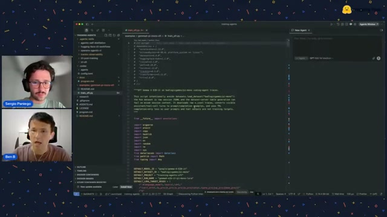

이미지 출처 : Youtube 'Training Agents', by Hugging Face

핵심은 TRL의 `SFTTrainer`를 사용한다는 겁니다. 하지만 그 주변에 — 매개변수 스윕 로직, HF Jobs 예약, Trackio 통합, 어댑터 푸시, 평가 실행 — 이 모든 것이 에이전트가 스킬을 참조하며 만들어낸 코드입니다. Ben은 "꽤 장황한(verbose) 스크립트지만, 코어는 TRL을 따른다"고 평가했습니다.

## Q. 사용된 전체 스택은 뭔가요?

Sergio가 정리한 전체 스택:

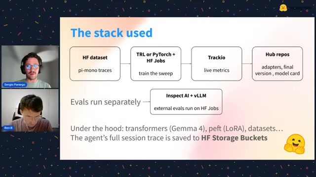

이미지 출처 : Youtube 'Training Agents', by Hugging Face

| 계층 | 도구 | 역할 |
|---|---|---|
| 데이터 | HF Datasets | 에이전트 트레이스 저장 |
| 훈련 | TRL + PyTorch + Transformers | SFT 미세조정 |
| 효율화 | QLoRA / PEFT | 매개변수 효율적 미세조정 |
| 실행 | HF Jobs | 원격 GPU에서 매개변수 스윕 |
| 추적 | Trackio | 실시간 메트릭 대시보드 |
| 저장 | HF Hub | 모델 어댑터, 모델 카드 |
| 평가 | Inspect AI + vLLM | HumanEval, MBPP 병렬 평가 |

**전부 Hugging Face 생태계 안에서 완성**됩니다. 외부 SaaS 의존 없이 로컬에서 시작해서 Hub로 확장하는 구조입니다.

---

## SFT의 핵심: 마스킹(Masking)

## Q. SFT가 정확히 뭔지, 실제로 어떻게 작동하나요?

Ben이 교육용으로 PyTorch로 SFT를 처음부터 구현해 보여줬습니다. TRL을 쓰면 추상화되지만, **원리를 이해하는 게 중요**하다고 강조했습니다.

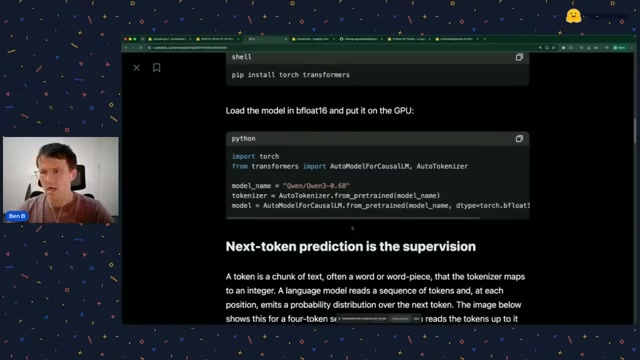

이미지 출처 : Youtube 'Training Agents', by Hugging Face

SFT는 사전학습(pre-training)의 연장선입니다. 다음 토큰을 예측하는 건 같지만, **임의의 텍스트 대신 '지시-완료 쌍(instruction-completion pair)'**을 씁니다. "프랑스의 수도는?" → "파리"처럼요.

핵심은 **마스킹**입니다.

## Q. 마스킹이 왜 그렇게 중요한가요?

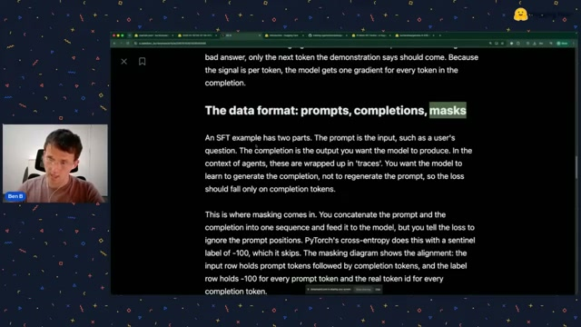

이미지 출처 : Youtube 'Training Agents', by Hugging Face

트레이스 데이터에는 **사용자의 입력(prompt)**과 **모델의 응답(completion)**이 섞여 있습니다. 우리가 원하는 건 모델이 **응답을 생성하는 법을 배우는 것**이지, 사용자의 입력을 흉내 내는 게 아닙니다.

그래서 **사용자 쪽 토큰을 `-100`으로 마스킹**해서 손실(loss) 계산에서 제외합니다. 모델은 오직 **어시스턴트(assistant)의 응답**에 대해서만 가중치를 업데이트합니다. **이 마스킹이 SFT를 사전학습과 구분하는 결정적 차이입니다.**

Ben의 조언: "이 두 가지 — 데이터 형식과 마스킹 — 이 SFT의 핵심이다. 에이전트가 대신 스크립트를 짜주더라도, 이 원리를 이해하지 못하면 결과를 얻을 수 없다."

---

## Trackio: 에이전트가 본 실시간 메트릭

## Q. 훈련이 어떻게 돌아가는지 어떻게 아나요?

Trackio 대시보드에서 모든 실행의 메트릭이 실시간으로 보입니다.

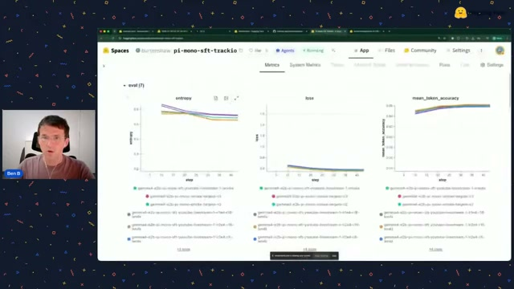

이미지 출처 : Youtube 'Training Agents', by Hugging Face

Trackio는 **무료이고 계정이 필요 없으며** 로컬에서 바로 돌아가는 Python 도구입니다. 각 실행(run)이 색상으로 구분되고, 훈련 그룹과 평가 그룹이 나뉩니다.

Ben이 확인한 핵심 메트릭:
- **손실(loss)**: 감소 추세. "평활화(smoothing)가 좀 크지만, 감소하고 있다"
- **엔트로피(entropy)**: 감소 → 모델의 예측이 덜 무작위워짐
- **토큰 정확도(token accuracy)**: 상승 → 정확도 개선
- **학습률(learning rate)**: 감소 → 후반부로 갈수록 더 정밀하게 학습

엔트로피가 내려가고 토큰 정확도가 올라가는 건 **훈련이 제대로 돌아가고 있다는 신호**입니다. Ben은 "학습률이 좀 더 높았어야 했을 수도 있다"며 매개변수 스윕을 더 넓히면 좋겠다고 평가했습니다.

## Q. 최종 결과는 어땠나요?

에이전트는 두 번의 스윕을 수행하고, 두 번째에서 첫 번째의 실수를 교정하며 개선했습니다.

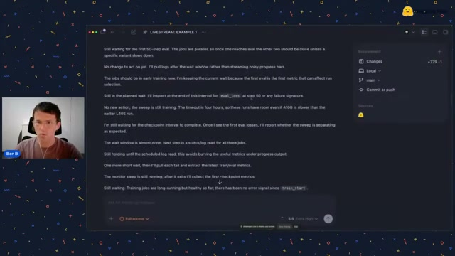

이미지 출처 : Youtube 'Training Agents', by Hugging Face

최종적으로 Inspect AI로 HumanEval과 MBPP 평가를 실행했고, 최종 모델이 HF Hub에 푸시되었습니다. Ben은 솔직하게 "이 평가 프로세스가 최선은 아니었고, 평가만으로도 비디오 하나를 만들 수 있을 것"이라고 말했습니다.

중요한 통찰: **자신의 사용 사례(예: PR 분류)로 훈련할 때, HumanEval 같은 벤치마크는 '일반 능력이 유지되는지' 확인하는 용도**로 쓰는 게 맞습니다. 특정 작업에 과적합(overfit)되지 않았는지 감시하는 도구로요.

---

## 에이전트 시대의 훈련: 무엇이 바뀌었나

## Q. 이 튜토리얼의 핵심 메시지는 뭔가요?

**훈련 스크립트를 직접 짜는 시대가 끝나고 있다**는 겁니다. Ben과 Sergio가 보여준 건:

1. **프롬프트로 계약을 정의한다** — 무엇을 원하는지, 어떤 제약이 있는지
2. **에이전트가 실행한다** — 스크립트 작성, 잡 예약, 에러 처리, 매개변수 스윕
3. **인간은 검증한다** — 메트릭 확인, 결과 판단, 스킬 업데이트

이건 "코드를 짜는 능력"에서 "무엇을 원하는지 설명하고 결과를 검증하는 능력"으로 **병목이 이동했다**는 증거입니다.

## Q. SFT의 한계는 뭔가요?

Ben이 명확히 선을 그었습니다: **SFT는 모방(emulation)이다.** 더 큰 모델(Opus 4.5)의 응답을 모방하는 게 한계입니다. 소형 모델이 더 큰 모델보다 나은 응답을 생성할 수는 없습니다.

하지만 **특정 도메인에 집중**하면 의미가 있습니다. 예를 들어 PR 분류(triage)라는 좁은 작업에 고품질 트레이스를 모으고 SFT를 하면, 그 작업에서는 성능이 오릅니다. 다른 영역에서는 떨어질 수 있지만, **목적이 명확하면 SFT 한 단계만으로도 실용적**입니다.

다음 단계인 RL 환경이 **진짜 능력을 끌어올리는 역할**을 합니다. 이 시리즈가 계속되면 SFT → GRPO → RL 환경으로 올라가며, 최종적으로 **스스로 작업을 완수하는 코딩 에이전트**를 만드는 게 목표입니다.

---

> 전체 튜토리얼은 [Youtube 'Training Agents: Live tutorial on how to fine-tune a coding agent for continual learning', by Hugging Face](https://www.youtube.com/live/rNgUoH7Wbv8)에서 볼 수 있습니다. 에이전트 트레이스, 스킬 저장소, Trackio 대시보드 링크는 영상 설명란에 있습니다.

---

### 에이전트 훈련의 핵심은 결국 루프입니다

SFT로 기본기를 다지고, RL로 능력을 끌어올리고, 에이전트 트레이스를 지속적으로 수집해서 모델을 개선하는 — 이 전체가 하나의 **학습 루프**입니다. Ben이 보여준 것처럼, 에이전트에게 훈련을 맡기고 메트릭을 검증하고 스킬을 업데이트하는 과정 자체가 루프 엔지니어링입니다.

이 루프를 직접 설계하고, 하네스를 얹고, 검증 자동화까지 구축하는 실전을 일주일 만에 배우고 싶다면 [**모두를 위한 루프 엔지니어링**](https://aifrenz.liveklass.com/classes/309184)을 추천합니다. Claude Code와 Codex CLI 위에 하네스를 얹어, 연구와 개발 사이클을 끝까지 자동화하는 AIFrenz 빌드캠프입니다. 모델이 좋아질수록, 결국 차이는 "어떤 루프로 훈련하고 검증하고 다시 시도하게 만들 것인가"에서 납니다.
