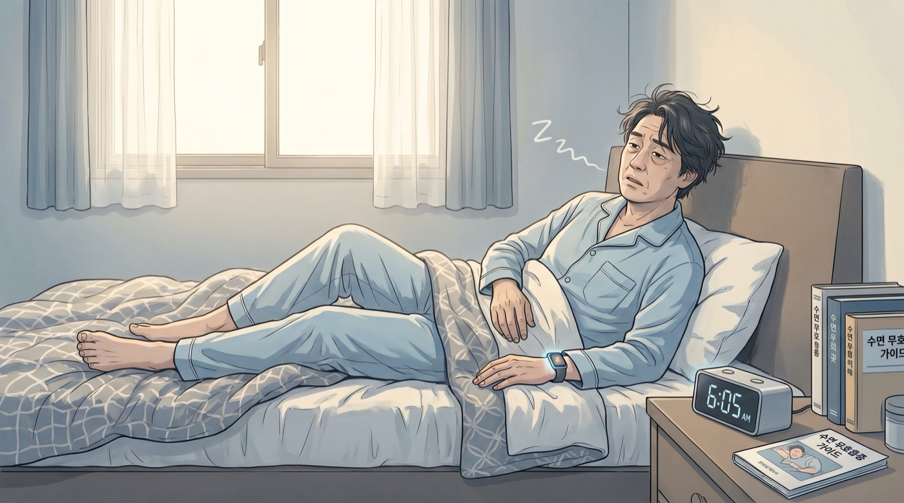

# 40대 코골이, 잠버릇으로 넘기면 안 되는 이유

40대 코골이는 생각보다 자주 "피곤해서 그런 날"로 끝나지 않았음. 옆사람이 못 견딜 정도로 크지 않아도, 자는 동안 숨길이 좁아졌다가 풀리는 신호일 수 있었음. 그래서 코골이는 소리보다 패턴을 봐야 했음.

이번 글은 40대가 코골이를 어디까지 가볍게 봐도 되는지, 어디서부터 확인이 필요한지 정리했음. 밤에 나는 소리 하나를 낮의 컨디션과 같이 보는 글이었음.

## 코골이가 단순한 소음이 아닌 이유

코골이는 공기가 지나가는 길이 좁아졌다는 뜻이었음. 숨길이 흔들리면 잠이 얕아지고, 뇌가 자꾸 미세하게 깼음. 본인은 잔 것 같아도 몸은 쉬지 못했음.

40대는 이걸 더 쉽게 놓쳤음. 야근, 회식, 수면 부족, 체중 변화, 술이 한꺼번에 붙어 있었기 때문임. 코골이가 갑자기 커졌다면 생활 습관만이 아니라 몸 상태도 같이 봐야 했음.

### 같이 오면 더 의심했음

- 아침에 입이 마르고 머리가 무거웠음
- 낮에 졸려서 커피를 자꾸 찾았음
- 자다가 숨이 멎는다는 말을 들었음
- 술 마신 날 코골이가 더 심해졌음
- 옆으로 누우면 덜하고 바로 누우면 심했음

이런 조합이면 그냥 잠버릇으로 넘기기 어려웠음. 특히 낮 졸림이 있으면 운전이나 회의 집중도까지 흔들렸음.

## 40대에서 더 잘 보이는 신호

### 1. 아침 두통

자고 일어났는데 머리가 묵직하면 단순한 숙취만은 아니었음. 밤새 숨이 얕아지면 산소 흐름이 불안정해지고, 아침이 더 무거워졌음.

### 2. 낮 졸림

밤에 잤는데도 낮에 졸리면 수면의 양보다 질을 봐야 했음. 커피로 버티는 날이 늘면 이미 패턴이 이어지고 있을 가능성이 컸음.

### 3. 목둘레와 허리둘레

체중이 많이 안 늘어도 목둘레가 굵어지면 기도가 좁아지기 쉬웠음. 허리둘레가 늘면 수면무호흡과 혈압 문제도 같이 따라붙는 경우가 많았음.

### 4. 술과 수면제

술은 잠드는 속도는 앞당겨도, 잠의 질은 자주 망가뜨렸음. 수면제도 혼자 판단해서 늘리면 안 됐음. 코골이를 덮는 방식으로는 해결이 안 됐음.

## 집에서 먼저 볼 체크

1. 최근 2주 동안 아침 컨디션을 적었음  
2. 코골이가 술, 피곤한 날, 바로 누웠을 때 심해지는지 봤음  
3. 낮 졸림이나 운전 중 멍함이 있는지 확인했음  
4. 혈압이 같이 높아지는지 같이 봤음  
5. 가족이나 배우자가 숨 멈춤을 봤는지 물었음

이 다섯 개만 봐도 대충 감이 왔음. 코골이는 소리의 문제가 아니라 몸이 쉬고 있는지의 문제였음.

## 병원에서 확인해야 하는 기준

아래에 하나라도 걸리면 수면검사를 생각하는 쪽이 맞았음.

- 숨 멈춤이 관찰됐음
- 낮 졸림이 생활을 방해했음
- 아침 두통이 자주 있었음
- 고혈압이 있거나 의심됐음
- 체중 증가와 함께 코골이가 커졌음

수면무호흡은 그냥 "좀 피곤함"으로만 보기에는 손해가 컸음. 치료가 필요한 경우도 있었고, 검사로 확인해야 방향이 잡혔음.

## 결론

40대 코골이는 잠버릇으로 끝나지 않을 수 있었음. 아침 두통, 낮 졸림, 숨 멈춤, 혈압, 체중이 같이 보이면 더 그랬음.

핵심은 단순했음.

- 코골이는 소리보다 패턴이었음
- 낮 졸림이 있으면 이미 몸이 신호를 보냈을 수 있었음
- 반복되면 수면검사로 확인하는 게 맞았음

## FAQ

### Q. 코골이만 있고 낮에 괜찮으면 괜찮은가?

항상 그렇진 않았음. 낮 증상이 없더라도 숨 멈춤이나 아침 두통이 있으면 확인이 필요했음.

### Q. 살 빼면 좋아지나?

도움이 되는 경우가 많았음. 다만 체중만의 문제로 단정하면 놓칠 수 있었음. 자세, 술, 비염, 턱 구조도 같이 봐야 했음.

### Q. 수면검사는 언제 받는 게 맞나?

코골이가 커졌고 낮 졸림이나 숨 멈춤이 같이 있으면 일찍 보는 편이 맞았음. 운전이나 업무 안전에도 영향이 있었기 때문임.
