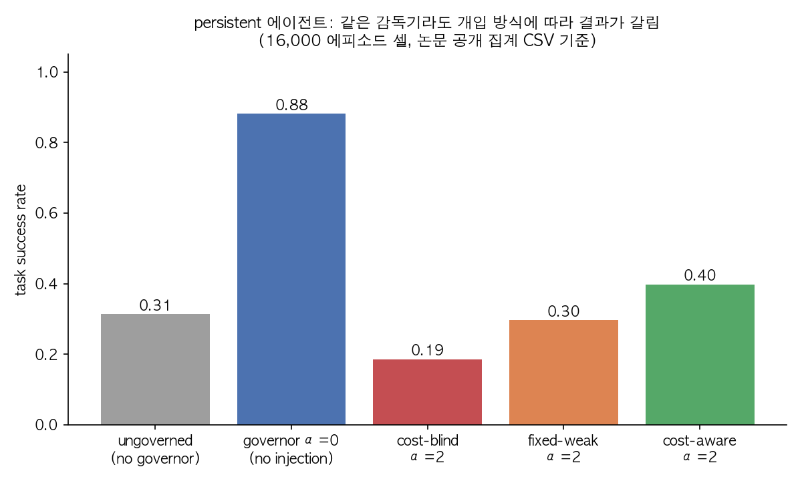
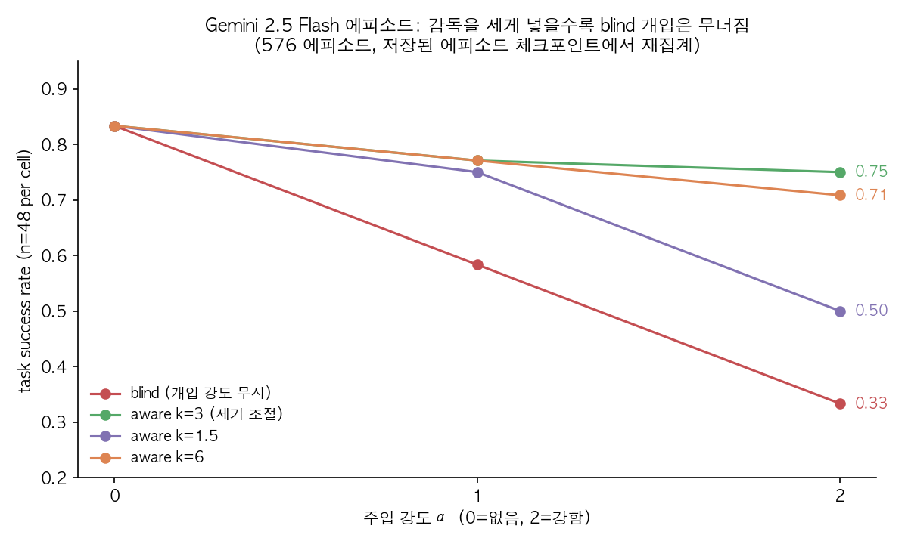

## 한눈에 보는 결론

- 검증기는 실패를 찾는 데 쓸 만합니다. 그런데 <strong>실패를 잘 찾는다고 해서 어디서 개입해야 효과가 나는지까지 알려 주지 못합니다.</strong> steering 논문에서 실패 탐지 점수는 AUROC 0.73까지 나왔지만(0.5면 동전 던지기, 1이면 완벽한 구분), 같은 신호로 단계 순서를 매기면 실제 개입 효과와 거의 맞지 않았습니다.
- 검증기도 틀립니다. SpecGuard는 잘못 나온 판정 99건 중 <strong>69%</strong>가 connector(명세와 증명기 사이를 잇는 부분)에서 나왔다고 보고합니다. 증명기 자체 때문에 틀린 경우는 0건이었습니다.
- 감독을 세게 넣는다고 좋아지지 않습니다. governor 논문에서 개입 강도를 무시하는 방식(blind)은 Gemini 2.5 Flash 기준 성공률이 <strong>0.83에서 0.33</strong>까지 떨어졌습니다. 강도를 조절한 방식은 같은 조건에서 <strong>0.75</strong>를 유지했습니다.
- PASS 판정도 감사해야 합니다. blind-spot 논문은 같은 쓰기 작업을 두 번 해도 AppWorld 평가기가 <strong>필드 값만 보고 통과시키는</strong> 경우를 확인했습니다.

## 무엇을 비교했나

1. **SpecGuard** (Biyani & Dvijotham, arXiv 2610.09159): 자연어 명세와 코드가 맞는지 Lean 증명기와 LLM을 이어 판정하는 검증기입니다.
2. **Governor 논문** (Ziegler, arXiv 2610.09037): 에이전트 옆에서 실행 중에 개입하는 governor의 강도와 방식이 오히려 교란이 되는지 봅니다.
3. **Steering 논문** (arXiv 2610.09115): 불확실성 신호로 에이전트가 어느 단계에서 어떤 방식으로 개입할지 고르는 VoS 모니터를 제안합니다.
4. **Blind-spot 논문** (arXiv 2610.09142): AppWorld와 WorkArena의 작업 검증기를 감사해, 틀린 결과를 통과시키는 경로를 찾습니다.
5. **AdaGuard** (arXiv 2610.08923): 정책 목록을 받아 입력을 판정하는 가드레일 모델이고, 추론(reasoning)을 정책마다 켤지 말지 고릅니다.

## 방법 비교

| 논문 | 무엇을 감독하나 | 개입 방식 | 핵심 측정 | 공개 자료 |
|---|---|---|---|---|
| SpecGuard | 명세와 코드의 일치 여부 | 증명기 + LLM 판정 연결 | 탐지율, 인증률, 오탐율 | 저장소 주소 있음(이번에 열지 않음) |
| Governor | 에이전트 실행 중 개입 강도 | 결과 주입, 비용 고려 여부 비교 | 성공률, 막힘 횟수 | 저장소와 CSV 있음(직접 집계) |
| Steering (VoS) | 어느 단계에 메시지를 넣을지 | 반성, 비평, 강한 모델 대행, 메모리 | 작업 점수 변화, 순위 상관 | 확인된 공개 코드 없음 |
| Blind-spot | 작업 검증기의 PASS/FAIL | 의도 교체, 고의 결함 주입 | 거짓 통과 수 | 익명 보충자료만 언급 |
| AdaGuard | 정책별 위반 판정 | 추론 끄기/켜기/자동 선택 | 정책별 F1(정밀도와 재현율을 합친 점수), 추론 비율 | 저자 코드 링크 미확인 |

## 논문별 핵심 결과

**SpecGuard.** 보고된 수치는 탐지율 72.8%(Fable 5), 인증률 51.1%(Sol)까지입니다. 충돌을 놓친 비율은 Sol 8.1%, LLM 판정자 39.8%였습니다. 반대로 정상을 충돌로 잘못 잡은 비율은 판정자 2.3%, SpecGuard 6.0%입니다. 놓치는 쪽은 줄었지만 오탐은 늘었다는 뜻이죠. 실제 GitHub 충돌 사례 22건을 돌려 보니 충돌로 판정된 것은 9건뿐이었고, 12건은 결론을 내지 못했습니다.

**Governor 논문.** 공개 집계에서 persistent 에이전트는 감독이 전혀 없을 때 0.31, 감독 신호만 달고 주입은 하지 않은 α=0일 때 0.88이었습니다. 비용을 고려하지 않고 강하게 결과를 주입한 α=2는 0.19까지 떨어졌습니다. 비용을 반영한 적응형은 0.40, 고정된 약한 개입은 0.30이었습니다. 감독 신호가 에이전트의 행동을 바꾸는 방식이 성공률을 좌우했습니다. 같은 행동으로 점수를 매기면 안 된다는 얘기이기도 하고요.

**Steering 논문.** AppWorld, ALFWorld, WebShop 세 벤치마크, 두 에이전트(Gemma-4-31B, Qwen3.6-35B)에서 VoS는 12개 조건 모두에서 개입하지 않은 실행보다 높았고, 평균 <strong>7.8점</strong> 올랐습니다. 조건마다 기존 다섯 방식 중 최상위 쪽과 비교해도 12개 중 11개 조건에서 평균 2.9점 높았습니다. 불확실성 신호는 실패 궤적을 최대 0.73 수준(AUROC, 앞서 본 0.5~1 척도)으로 가려내지만, 성공 궤적을 무작위 단계에서 개입하면 점수가 깎였습니다(Gemma 최대 0.14, Qwen 최대 0.32).

**Blind-spot 논문.** 의도 교체 실험(검증기를 다른 과제의 정답 궤적에 적용) 2,762개 셀에서 유효한 2,689개 셀은 전부 거부됐습니다. 여기서 확인된 것은 "거부 목록" 자체입니다. 실제로 잘못된 결과를 통과시켰다는 증거는 아닙니다. 확실한 거짓 통과는 고의 결함 실험에서 나왔습니다. AppWorld의 중복 쓰기 15건 중 6건은 상태가 실제로 바뀌었는데도 통과했습니다. 반면 "쓰기 없이 결과만 말하기"(claim-only) 48건은 모두 거부됐습니다.

**AdaGuard.** Gemma4-E4B 기준 held-out 정책별 F1은 Base 74.8, SFT 76.5, GRPO 80.1로 단계마다 올랐습니다. 전체 F1은 SafeGuard-20B 90.5, Gemma-4-26B 90.5와 비교해 AdaGuard 90.3으로 근소하게 낮았습니다. 논문도 크기가 달라 직접 비교 대상이 못 된다고 적고 있습니다. 추론 비율은 보상 설계에 따라 크게 달라졌습니다. 반사실 보상(CF_Corr)을 뺀 변형은 추론 비율이 거의 전부 추론 쪽으로 올라 사실상 항상 추론하는 모드가 됐고, 넣은 변형은 25~37%에서 머물렀습니다.

## 언제 무엇을 쓰나

- **증명 가능한 명세가 있고 틀린 판정의 비용이 크면** SpecGuard류 검증을 쓰되, connector 쪽을 먼저 감사하세요. 증명기 자체보다 연결부가 더 자주 틀렸습니다.
- **에이전트 실행 중 개입을 고민하면** 감독 신호의 세기부터 정하세요. <strong>세게 넣을수록 좋아지는 구간은 좁았습니다.</strong>
- **어느 단계에 개입할지** 고르려면 실패 탐지 점수 하나로 정하지 마세요. steering 논문에서는 실패를 잘 맞히는 신호가 개입 위치를 잘 맞히지는 못했습니다. 개입 효과를 직접 재어 학습한 모니터(VoS)가 더 나았습니다.
- **작업 검증기의 PASS를 믿기 전에** 중복 쓰기, 쓰기 없는 결과 보고 같은 결함을 일부러 넣어 보세요. blind-spot 논문이 찾은 두 경로가 바로 이런 결함입니다.
- **가드레일 모델의 추론 예산**은 자동 선택 기능이 실제로 줄이는지 추론 비율을 같이 보고 판단하세요. F1만 보면 항상 추론하는 모드와 구분이 안 됩니다.

## 제가 직접 확인한 것

이번 글에서 제가 직접 한 확인은 governor 논문의 공개 저장소를 내려받아 CSV 두 개를 다시 센 것입니다. 저장소는 `CASAgentGovernor-main` 소스 전체를 별도 빈 폴더에 풀었고, 집계 스크립트는 따로 두고 `python3 -I`로 돌렸습니다.

먼저 Gemini 체크포인트(576 에피소드, 셀당 n=48)를 주입 강도별로 다시 셌습니다. blind는 α=0일 때 0.833, α=1일 때 0.583, α=2일 때 0.333이었고, k=3 조절 방식은 α=2에서 0.750이었습니다. 본문 수치와 그대로 맞았습니다. 그림 2는 이 집계로 그렸습니다.

다음으로 stochastic 실행 CSV(persistent 에이전트, 셀당 8,000행)를 셌습니다. 감독 없음은 0.739, 감독 적용은 0.972였습니다. 집계 CSV(셀당 80,000행)의 0.739와 0.973과는 0.1pp 안쪽으로 맞았지만 완전히 같은 값은 아니었습니다. 행 수가 다른 파일이라 같은 표본이라고 볼 수 없습니다. 이 차이는 그대로 적어 둡니다. 그림 1은 집계 CSV의 값을 그대로 옮긴 것이라 제가 다시 센 값은 아닙니다.

그 밖의 수치는 논문 본문과 공개 집계 CSV에서 옮겨 적은 것입니다. SpecGuard 저장소는 주소만 확인했고, blind-spot과 AdaGuard는 재현할 공개 자료를 찾지 못했습니다. 모델을 새로 호출하거나 개입 실험을 다시 돌리지 않았습니다.

## 한계와 반론

- **같은 실험 틀의 한계입니다.** governor 논문의 비용은 가상으로 매긴 값이고, 백오프 신호는 이벤트 정답 라벨을 쓰며, 에이전트는 손으로 짠 코드입니다. 실제 서비스에서도 같은 순서가 나올지는 이번 글에서 확인하지 못했습니다.
- **표본이 적습니다.** Gemini 실험은 과제 6개, 셀당 48회입니다. 논문도 신뢰구간이 없다고 밝히고 있습니다. 0.75와 0.71의 차이는 우연일 수 있습니다.
- **벤치마크 종류가 다릅니다.** SpecGuard는 명세 검증, AdaGuard는 입력 판정, 나머지는 실행 중 개입입니다. 한 표에 놓았다고 같은 질문에 답하는 것은 아닙니다.
- **거부 집계의 해석에 한계가 있습니다.** blind-spot 논문은 실제 거짓 통과 수를 집계하지 않았다고 스스로 적고 있습니다. 2,689개 거부는 "검증기가 깐깐하다"는 증거일 뿐 "정확하다"는 증거는 아닙니다.

## 적용 규칙

1. 검증기 점수는 실패를 찾는 신호로만 쓰고, 개입 위치는 개입 효과를 직접 잰 데이터로 정하세요.
2. 감독 개입은 강도 조절 없이 고정으로 넣지 마세요. 세기를 바꿔 가며 성공률 곡선을 먼저 그려 보세요.
3. 작업 검증기는 FAIL만 감사하지 말고, 중복 쓰기와 쓰기 없는 보고를 일부러 넣어 PASS 쪽도 확인하세요.
4. 검증기 실패 원인은 증명기, 명세, 연결부로 나눠 기록하세요. 이번 SpecGuard 결과에서는 연결부 쪽 오류가 69%였습니다.
5. 공개 CSV가 있으면 본문 수치를 먼저 다시 집계해 보세요. 이번에는 행 수가 다른 파일이 섞여 있어 표본을 확인해야 했습니다.

## 참고 자료

1. SpecGuard, arXiv 2610.09159, https://arxiv.org/abs/2610.09159
2. When the Governor Becomes the Disturbance, arXiv 2610.09037, https://arxiv.org/abs/2610.09037 / 저장소 https://github.com/CriticalAttentionSystems/CASAgentGovernor
3. From Uncertainty to Action: Learning to Steer LLM Agents, arXiv 2610.09115, https://arxiv.org/abs/2610.09115
4. Finding Blind Spots in AppWorld and WorkArena Task Verifiers, arXiv 2610.09142, https://arxiv.org/abs/2610.09142
5. AdaGuard, arXiv 2610.08923, https://arxiv.org/abs/2610.08923

이 글은 제가 여러 자료를 비교·정리하고 일부는 에이전트를 활용해 실행하고 확인한 내용으로 발행하였습니다.
