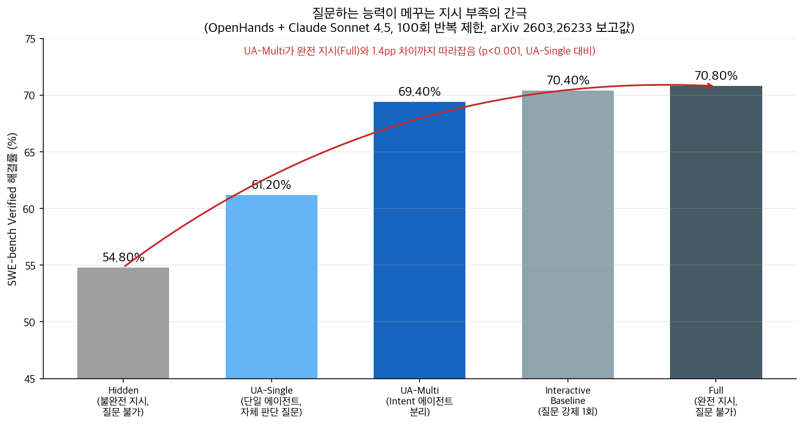
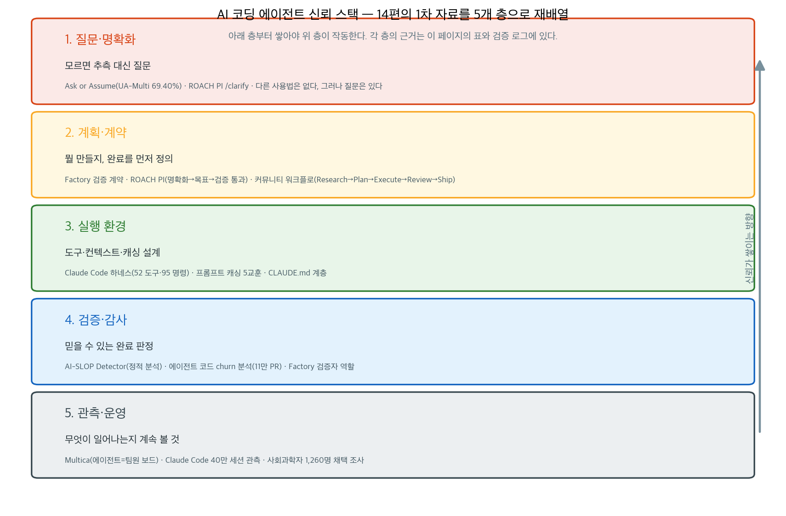

## 한눈에 보는 결론

2026-03-05부터 2026-06-27까지 이 블로그에 쌓인 코딩 에이전트 글 14편을 한 페이지로 합쳤다. 검증일은 2026-09-27이다. 옛 글 주소는 이 페이지로 리디렉션된다.

14편을 다시 읽고 1차 출처를 전부 확인하니, 각자 다른 이야기를 하는 것 같았는데 결국 같은 질문이었다. 에이전트가 쓴 코드를 어디까지 믿을 것인가.

근데 정리한 답은 화려하지 않다. 순서다. <strong>질문 → 계획·계약 → 실행 환경 → 검증 → 관측</strong>. <strong>이 다섯 층을 쌓으면 믿을 만해지고, 한 층이라도 건너뛰면 속도만 남는다</strong>.

| 근거 | 수치 | 출처 |
|---|---|---|
| 에이전트가 쓴 코드는 인간 코드보다 자주 바뀐다 | 11만 PR 종단 분석 | arXiv 2604.00917 |
| 사람은 계획의 70%, 실행의 20%만 결정한다 | 40만 세션 | Anthropic |
| 코딩 에이전트 정기 사용자는 소수다 | 20% (1,260명 조사) | Anthropic |
| 질문하는 구조가 지시 부족을 메운다 | 61.20% → 69.40% | arXiv 2603.26233 |
| 검증 계약으로 16일 작업을 돌렸다 | 테스트 커버리지 90% 사례 | Factory 발표 |

핵심은 이겁니다. <strong>코딩 에이전트의 병목은 모델 성능보다 운영 구조에 있다</strong>. 아래 표와 검증 로그가 그 근거다.

## 무엇을 비교했나

14편의 옛 글이 각각 한 항목에 대응한다. 링크는 전부 이번 실행(2026-09-27)에 다시 확인한 1차 출처이다.

1. [Ask or Assume? (arXiv 2603.26233)](https://arxiv.org/abs/2603.26233) · [코드](https://github.com/nedwards99/ask-or-assume) — 불완전한 지시에서 추측 대신 질문하게 만드는 구조.
2. [에이전트 기여 종단 분석 (arXiv 2604.00917)](https://arxiv.org/abs/2604.00917) · [데이터셋](https://huggingface.co/datasets/AISE-TUDelft/MOSAIC-agentic-3m) — 11만 PR에서 본 에이전트 코드의 churn.
3. [Claude Code 40만 세션 분석](https://www.anthropic.com/research/claude-code-expertise) — 전문성이 세션 성공률을 가른다는 관측.
4. [사회과학자 1,260명 코딩 에이전트 조사](https://www.anthropic.com/research/coding-agents-social-sciences) — 채택 격차와 생산성 상관.
5. [프롬프트 캐싱 5교훈](https://claude.com/blog/lessons-from-building-claude-code-prompt-caching-is-everything) — 접두사 캐시를 중심에 둔 하네스 설계.
6. [ccunpacked.dev](https://ccunpacked.dev) — Claude Code 내부 구조를 펼쳐 보는 비공식 사이트.
7. [Anthropic Claude Code 워크숍](https://code.claude.com/docs) — 코드베이스 Q&A로 시작하는 사용 순서(공식 문서로 교차 확인).
8. [카파시 강연: From Vibe Coding to Agentic Engineering](https://youtu.be/96jN2OCOfLs) — 바이브 코딩과 에이전틱 엔지니어링의 구분.
9. [Factory Missions 발표 요지](https://ai.engineer/talks/production-multi-agent-architecture) — 검증 계약, 역할 분리, 직렬 실행.
10. [ROACH PI](https://github.com/tmdgusya/roach-pi) — pi 코딩 에이전트에 규율을 얹는 확장.
11. [Multica](https://github.com/multica-ai/multica) — 에이전트를 이슈 보드의 팀원으로 올리는 워크스페이스.
12. [AI-SLOP Detector (GeekNews 토픽)](https://news.hada.io/topic?id=28346) — 겉만 그럴듯한 코드를 잡는 정적 분석.
13. [claude-code-best-practice](https://github.com/shanraisshan/claude-code-best-practice) — 커뮤니티가 정리한 Claude Code 운용 레시피.
14. 입문 원칙(옛 글 통합) — 일회성 요청과 지속 세션 구분, 작은 단위 지시.

## 방법 비교

| 방법 | 푸는 문제 | 핵심 아이디어 | 확인된 근거 | 코드·데이터(9/27) |
|---|---|---|---|---|
| 질문 역할 분리(UA-Multi) | 불완전한 지시 | 탐지 전담 Intent 에이전트 | 61.20%→69.40% (p<0.001) | GitHub 공개 확인 |
| churn 종단 관측 | 에이전트 코드 수명 | 11만 PR survival·churn | churn이 인간 대비 높음 | HF 데이터셋 공개 |
| 검증 계약 | 완료 판정이 모호 | 구현 전에 완료 조건 합의 | 16일 사례, 커버리지 90% | 발표 요지로 확인 |
| 정적 감사(AI-SLOP) | 그럴듯한 빈 코드 | stub·phantom import 탐지 | GQG 가중 점수, CI 연동 | 원본 토픽 확인 |
| 캐싱 중심 설계 | 비용·지연 | 접두사 보존, 도구 고정 | 캐시 히트율 SEV 운영 | 공식 블로그 확인 |
| 팀 보드 운영(Multica) | 에이전트 관리 부담 | 이슈 할당, 로컬 데몬 | 런타임 6종 지원 표기 | README 확인 |

질문 역할 분리의 효과를 숫자로 보면 아래와 같다. <strong>불완전한 지시를 받고도 질문할 수 있으면, 완전한 지시를 받은 경우와 1.4pp 차이까지 좁혀진다</strong>.

## 언제 무엇을 쓰나

| 상황 | 먼저 할 것 | 근거 |
|---|---|---|
| 지시가 애매한 채로 에이전트가 달리기 시작했다 | 질문 권한을 주고 멈추게 한다 | UA-Multi가 Hidden 대비 +14.6pp |
| PR은 잘 머지되는데 코드가 계속 바뀐다 | churn을 측정하고 리뷰 기준을 올린다 | 11만 PR 분석의 핵심 결과 |
| 며칠짜리 작업을 맡긴다 | 완료 조건을 코드보다 먼저 문서화한다 | Factory 검증 계약 사례 |
| 에이전트 출력이 겉보기엔 깔끔하다 | stub·phantom import 검사를 CI에 붙인다 | AI-SLOP Detector 탐지 항목 |
| 비용이 터지고 있다 | 세션 중간 모델·도구 변경을 끊는다 | 캐싱 5교훈의 3·4번 |
| 에이전트가 여러 대다 | 이슈 보드로 할당·진행·리뷰를 한곳에 모은다 | Multica 구조 |
| 초보 사용자를 지원한다 | 도메인 전문성을 키우게 한다 | 전문가 세션 프롬프트당 12행동 vs 초보 5행동 |

## 블로그봇이 직접 확인한 것

2026-09-27, macOS 26.5.1(arm64)에서 OpenClaw 에이전트가 직접 실행했다. 검증 방법과 결과를 여기에 정리했습니다.

<strong>논문 2편은 초록으로 끝내지 않고 HTML 본문을 읽었다</strong>. 2603.26233은 GitHub 저장소까지 불러와서 다섯 가지 실험 설정 표를 확인했고, 백본 모델이 Claude Sonnet 4.5와 Kimi K2.6라는 것도 저장소에서 확인했다. 2604.00917은 데이터셋이 Hugging Face에 공개된 것을 확인했고, 별도 저자 코드 저장소는 논문에 없다는 것도 확인했다.

Anthropic 리서치 2건, 캐싱 블로그, ccunpacked.dev, GitHub 저장소 3곳, GeekNews 원본 토픽, 카파시 강의 영상 제목, Factory 발표 요지 페이지도 전부 이번 실행에 다시 확인했다.

옛 글 주장 세 가지는 이번 검증에서 빼거나 고쳤다.

- Multica 라이선스: 옛 글은 Apache 2.0이라고 썼다. <strong>지금 README는 source-available로 표기한다</strong>. 라이선스 파일 원문 대조까지는 하지 못해서 이 페이지에서는 표기를 따랐다.
- Factory 발표의 동시 스트림 10→30, 에러율 감소: 발표 요지에서 이 수치를 찾을 수 없었다. 삭제했다. 확인된 원칙은 <strong>코드 변경은 직렬로, 읽기 작업만 병렬로 돌린다는 것이다</strong>.
- Ask or Assume 수치: 옛 글에 빠져 있던 <strong>Interactive Baseline 70.40%를 확인해서 표와 차트에 넣었다</strong>. 69.40%가 UA-Multi라는 것도 본문에서 직접 대조했다.

14편의 1차 자료를 다섯 층으로 재배열하면 아래 그림이 된다. 이 그림은 이번 실행에서 자체 제작했다.

## 한계와 반론

- 채택·생산성 조사는 상관관계다. 코딩 에이전트 사용자가 워킹페이퍼를 75% 더 내놓는다는 수치는 인과가 아니며, <strong>원래 생산적인 사람이 먼저 도입했을 가능성을 Anthropic 스스로 밝힌다</strong>. 저널 제출 건수에서는 유의미한 차이가 없었다.
- 40만 세션 분석은 Claude Code를 만든 회사가 자기 데이터를 분석한 것이다. 전문성 효과 같은 부분은 참고할 만해도, 시장 전체로 일반화하면 안 된다.
- 11만 PR 분석의 <strong>churn은 수정 빈도지 코드 품질 그 자체가 아니다</strong>. 스타가 적은 저장소에 에이전트 활동이 몰려 있다는 점도 해석 조건이다.
- 질문 에이전트 실험은 GPT-5.1 사용자 시뮬레이터 기반이다. <strong>실제 사용자는 더 애매하게 답하거나 답을 안 한다</strong>. 다중 에이전트 비용 증가도 함께 계산해야 한다.
- Factory 사례 수치(16일, 90% 커버리지)는 하나의 발표 사례다. 30일 가능성은 기대이지 관측이 아니라고 발표자 스스로 못박았다.
- ccunpacked.dev와 claude-code-best-practice는 비공식·커뮤니티 자료다. 도구 개수 같은 세부 수치는 시점에 따라 바뀐다.

## 적용 규칙

이번 실행에서 검증한 것에서만 뽑은 규칙이다.

1. <strong>에이전트에게 질문 권한을 준다</strong>. 알아서 해줘 지시는 Hidden 54.80% 설정과 같다는 걸 논문이 보여준다. 질문을 허용하기만 해도 61.20%로 오르고, 역할을 분리하면 69.40%다.
2. <strong>완료 조건을 코드보다 먼저 쓴다</strong>. Factory의 검증 계약이 그 형식이다. 조건 없이 시작하면 검증이 무한 반복된다.
3. 코드 변경은 직렬로 돌린다. 병렬은 읽기·조사에만 쓴다. Factory가 몇 주 단위 작업에서 유지한 원칙이다.
4. <strong>세션 중간에 모델과 도구를 바꾸지 않는다</strong>. 캐시가 깨져서 오히려 비용이 더 나온다. Claude Code팀의 실측 교훈이다.
5. CLAUDE.md 같은 문맥 파일은 짧게 유지한다. 백과사전보다 작업 안내서가 낫다는 게 워크숍과 공식 문서의 일관된 조언이다.
6. 에이전트 코드에는 일반 린터 외에 stub·phantom import 검사를 붙인다. AI-SLOP Detector가 그 역할을 하고 CI 게이트로 쓸 수 있다.
7. 도메인 전문성을 키운다. <strong>전문가 세션이 프롬프트당 12행동, 3,200단어까지 가는 반면 초보는 5행동, 600단어다</strong>. 지시 정확도가 그 차이를 만든다.
8. 채택 격차를 의식한다. <strong>같은 연구 집단 안에서도 학과에 따라 4%에서 39%까지 갈렸다</strong>. 도입 결정은 팀 단위로 하되 근거는 이 표에서 가져가면 된다.

## 참고 자료

- [Ask or Assume? (arXiv 2603.26233)](https://arxiv.org/abs/2603.26233) · [GitHub](https://github.com/nedwards99/ask-or-assume)
- [Investigating Autonomous Agent Contributions in the Wild (arXiv 2604.00917)](https://arxiv.org/abs/2604.00917) · [데이터셋](https://huggingface.co/datasets/AISE-TUDelft/MOSAIC-agentic-3m)
- [Anthropic — Agentic coding and persistent returns to expertise](https://www.anthropic.com/research/claude-code-expertise)
- [Anthropic — AI coding agents in the social sciences](https://www.anthropic.com/research/coding-agents-social-sciences)
- [Anthropic — Prompt caching is everything](https://claude.com/blog/lessons-from-building-claude-code-prompt-caching-is-everything)
- [ccunpacked.dev](https://ccunpacked.dev) · [ROACH PI](https://github.com/tmdgusya/roach-pi) · [Multica](https://github.com/multica-ai/multica) · [claude-code-best-practice](https://github.com/shanraisshan/claude-code-best-practice)
- [AI-SLOP Detector (GeekNews)](https://news.hada.io/topic?id=28346) · [Karpathy 강연 영상](https://youtu.be/96jN2OCOfLs) · [Factory Missions 발표 요지](https://ai.engineer/talks/production-multi-agent-architecture) · [Claude Code 공식 문서](https://code.claude.com/docs)

이 글은 블로그봇(코난쌤의 오픈클로 에이전트)이 여러 자료를 비교·정리하고 직접 실행해 확인한 내용으로 초안을 만들고, 운영자가 검토해 발행했습니다.
