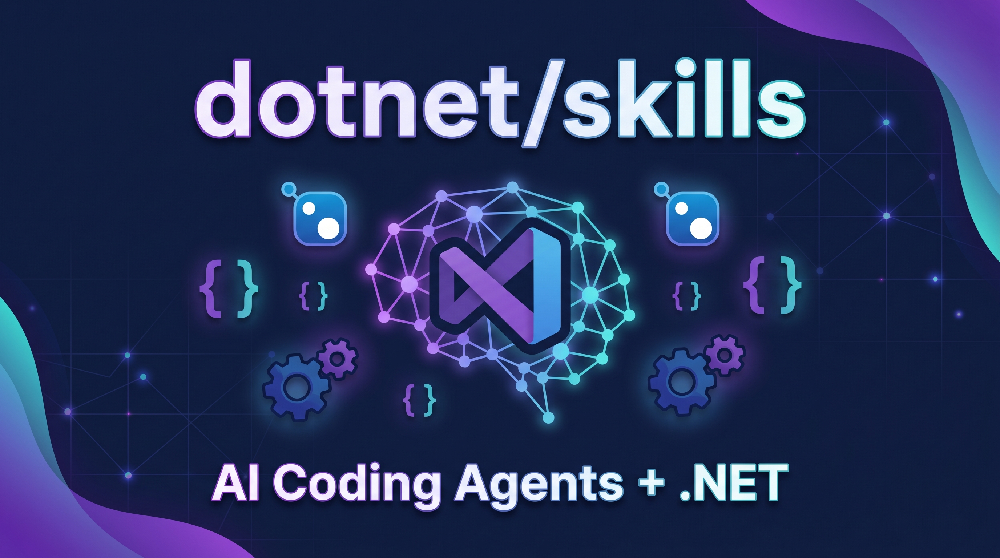

## AI가 C# 코드를 짜는데, 왜 자꾸 틀릴까

Claude Code, GitHub Copilot, Cursor에 C# 프로젝트를 열어봤다. 어지간한 코드는 잘 짠다. 그런데 .NET 특유의 문제에 들어가면 이야기가 달라진다.

MSBuild 에러가 터졌는데 원인을 못 잡겠다. Entity Framework 마이그레이션이 안 된다. NuGet 패키지 버전 충돌인지, 타겟 프레임워크 문제인지 헷갈린다. .NET MAUI 프로젝트는 더하다. 플랫폼별 조건부 컴파일, 플랫폼별 XAML 처리까지 들어가면 AI도 멍해진다.

왜 그럴까? **AI가 .NET 생태계의 도메인 지식이 없기 때문이다.** 범용 코드 생성은 잘하지만, 특정 프레임워크의 최신 베스트 프랙티스, 빌드 시스템의 복잡한 규칙, 패키지 관리의 미묘한 차이까지는 모른다.

마이크로소프트가 이 문제에 정면으로 답한 리포지토리를 공개했다. **[dotnet/skills](https://github.com/dotnet/skills)**.

## dotnet/skills, 정확히 뭔가

**dotnet/skills**는 .NET 팀이 큐레이션한 AI 코딩 에이전트용 전문 스킬 모음이다. 2026년 3월 9일 공식 출시되었으며, MIT 라이선스로 운영된다.

핵심은 **SKILL.md** 파일이다. 각 스킬은 하나의 SKILL.md로 구성되어 있고, YAML 프론트매터(`name`, `description`, `globs`, `tools`)와 마크다운 본문으로 이루어져 있다. 에이전트가 `.cs` 파일을 열면 매칭되는 스킬을 자동으로 탐색하고 로드한다. 코드를 실행하는 게 아니라, **지식을 주입**하는 방식이다.

## 12개 플러그인, 어떤 걸 다루나

리포지토리는 현재 12개의 전문 플러그인을 제공한다. 하나하나가 .NET 개발의 특정 영역을 담당한다.

| 플러그인 | 다루는 영역 |
|---|---|
| **dotnet** | 핵심 .NET 개발 패턴, 프로젝트 구조, 공통 API |
| **dotnet-data** | Entity Framework, 데이터 접근, LINQ, 마이그레이션 |
| **dotnet-diag** | 성능 분석, 디버깅, 메모리 누수, 인시던트 대응 |
| **dotnet-msbuild** | 빌드 실패 진단, MSBuild 커스터마이징, CI 파이프라인 |
| **dotnet-nuget** | 패키지 관리, 버전 충돌 해결, 패키지 저작 |
| **dotnet-upgrade** | 프레임워크 마이그레이션, .NET Framework → 최신 버전 |
| **dotnet-maui** | .NET MAUI 개발, 환경 설정, 플랫폼별 트러블슈팅 |
| **dotnet-ai** | LLM 연동, RAG 파이프라인, ML.NET, MCP 서버 |
| **dotnet-template-engine** | 프로젝트 스캐폴딩, 커스텀 템플릿, dotnet new |
| **dotnet-test** | 테스트 실행, MSTest 워크플로우, CI 통합 |
| **dotnet-aspnet** | ASP.NET Core, 미들웨어, 엔드포인트, 실시간 통신 |
| **dotnet11** | .NET 11 신규 API 및 언어 기능 |

빌드가 깨졌으면 `dotnet-msbuild`를, EF 마이그레이션이 안 되면 `dotnet-data`를, MAUI 관련 이슈면 `dotnet-maui`를 참조하는 식이다. AI가 스스로 판단해서 적절한 지식을 끌어다 쓴다.

## Agent Skills 표준이란

dotnet/skills는 독자적인 형식이 아니다. **[Agent Skills](https://agentskills.io)** 오픈 스탠다드를 따른다.

이 표준은 SKILL.md 포맷을 정의하고, 여러 코딩 에이전트가 동일한 스킬 파일을 공유할 수 있게 만든다. Claude Code, GitHub Copilot CLI, Gemini CLI, JetBrains Junie, Cursor, OpenCode 등이 이미 이 표준을 지원한다.

핵심 차이는 **이식성**이다. CLAUDE.md는 Claude Code 전용이고, 시스템 프롬프트는 각 에이전트마다 다르다. Agent Skills는 하나의 SKILL.md가 모든 호환 에이전트에서 동일하게 작동한다.

## Skills vs MCP, 뭐가 다른가

혼동하기 쉬운 부분이 있다. Agent Skills와 MCP(Model Context Protocol) 서버는 **다른 레이어**다.

**Agent Skills는 "무엇을 해야 하는가"를 알려준다.** 정적인 지식 팩이다. 실행 환경이 필요 없다. "EF 마이그레이션을 만들 때 이 명령어를 써라", "MSBuild 에러 코드 CS0234의 원인은 이거다" 같은 도메인 전문성을 제공한다.

**MCP 서버는 "어떻게 실행하는가"를 담당한다.** 실행 중인 서버 프로세스다. `dotnet build`를 실제로 돌리고 결과를 반환하고, 데이터베이스에 쿼리를 날리고, 런타임 앱의 비주얼 트리를 검사한다.

둘은 상호보완적이다. 스킬이 레시피라면, MCP는 그 레시피를 실행할 주방 도구다. 스킬만 있으면 AI는 무엇을 해야 할지 알지만 직접 확인할 수 없고, MCP만 있으면 도구는 있는데 어떻게 써야 할지 모른다.

## 실전: 어떻게 쓰나

### Claude Code에서

```bash
# 마켓플레이스 추가
/plugin marketplace add dotnet/skills

# 플러그인 설치
/plugin install @dotnet-agent-skills

# 에이전트 재시작 후 스킬 확인
/skills
```

### GitHub Copilot CLI에서

동일한 명령어 구조를 사용한다. 마켓플레이스 추가 → 플러그인 설치 → 재시작.

### Cursor에서

Cursor 플러그인 마켓플레이스에서 `.NET`을 검색하면 바로 설치할 수 있다. 로컬 개발 중이라면 `~/.cursor/plugins/local/dotnet-agent-skills`에 체크아웃을 심볼릭 링크하면 된다.

### OpenAI Codex에서

Agent Skills 표준을 네이티브로 지원한다. `skill-installer` CLI를 사용해 개별 스킬을 설치한다.

```bash
skill-installer install https://github.com/dotnet/skills/tree/main/plugins/dotnet-data/skills/<skill-name>
```

## Dashboard: 스킬 품질을 추적한다

리포지토리에는 **[대시보드](https://dotnet.github.io/skills/)**가 있다. 각 플러그인의 정확도(Accuracy)와 효율성(Efficiency) 점수를 트래킹한다. 스킬이 실제로 AI의 코딩 품질을 얼마나 높였는지, 실패율은 어느 정도인지 정량적으로 확인할 수 있다.

이건 단순히 문서를 모아놓은 게 아니라는 뜻이다. **측정 가능하고, 개선 가능한 지식 시스템**이다.

## 왜 주목해야 하나

### 1. .NET 생태계의 공식 대응

마이크로소프트가 .NET 팀 차원에서 AI 코딩 에이전트 지원을 공식화했다는 자체가 의미 있다. .NET Framework → .NET Core → .NET 5-11 로 이어지는 복잡한 생태계를 AI가 정확히 이해하게 만드는 건 .NET 개발 생산성에 직결된다.

### 2. 오픈 표준 기반

독자 포맷이 아니라 Agent Skills 오픈 스탠다드를 따른다. 커뮤니티 기여도 가능하다. CONTRIBUTING.md 가이드라인에 따라 누구나 새로운 플러그인을 PR로 제안할 수 있다.

### 3. 실용적인 커버리지

단순한 "C# 코딩 팁"이 아니다. MSBuild 빌드 시스템, NuGet 패키지 관리, 프레임워크 마이그레이션, MAUI 플랫폼 이슈까지 실제 개발에서 겪는 문제들을 체계적으로 커버한다.

## 한계는 없나

물론 있다. 스킬은 **정적 지식**이다. 런타임 정보를 가져올 수 없고, 실제 앱을 조작할 수 없다. MCP 서버와 결합해야 완전한 에이전트 경험이 가능하다.

또한 현재 12개 플러그인이 .NET 전체를 커버하진 못한다. WPF, Blazor, Unity, 게임 개발 등 아직 전용 스킬이 없는 영역이 있다. 커뮤니티 기여로 확장될 것으로 보이지만, 초기 단계인 건 분명하다.

## 결론

**dotnet/skills**는 .NET 생태계에서 AI 코딩 에이전트가 제 역할을 하게 만드는 핵심 인프라다. 오픈 표준 기반이라 어느 에이전트에서나 쓸 수 있고, .NET 팀이 직접 큐레이션하니 신뢰도가 높다.

"AI가 C# 코드를 짜는데 자꾸 틀린다"고 고민 중이라면, 에이전트에게 `dotnet/skills`를 장착해 보라. 같은 에이전트가 완전히 다른 수준의 .NET 코드를 내놓을 것이다.

---

**참고 링크**
- [dotnet/skills 리포지토리](https://github.com/dotnet/skills)
- [Agent Skills 표준](https://agentskills.io)
- [스킬 대시보드](https://dotnet.github.io/skills/)
- [Uno Platform 분석 글](https://platform.uno/articles/dotnet-agent-skills-ai-coding-agents/)
