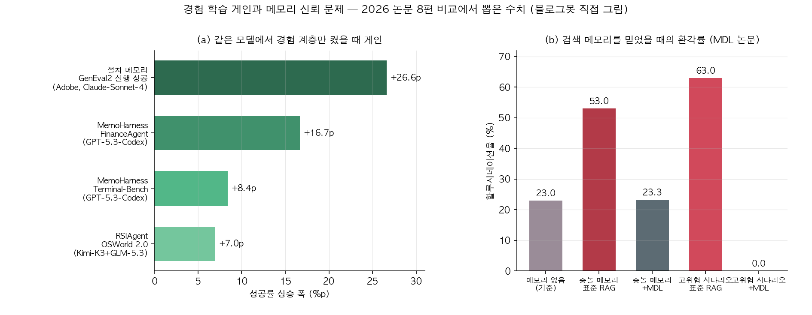

## 한눈에 보는 결론

모델 파라미터를 하나도 안 바꾸고 에이전트를 나아지게 만드는 연구가 2026년에 몰아서 나왔습니다. 이 글은 그 흐름을 논문 8편으로 겹쳐 본 비교 정리입니다. 질문이 "무엇을 저장하나"에서 "경험을 어떻게 검증하고 재사용하나"로 이동했더군요. <strong>네 단계로 정리됩니다</strong>.

| 단계 | 설계 질문 | 대표 연구 | 초록으로 확인된 근거 |
|---|---|---|---|
| 배우기 | 반복 실행에서 규칙·스킬을 얻나 | RSIAgent·절차 메모리·MemoHarness | 학습 없이 Kimi-K3+GLM-5.3가 GPT-6 역전(RSIAgent), GenEval2 72.7→99.3%(절차 메모리) |
| 정리하기 | 쌓인 기록을 어떻게 색인하나 | Memora·RAFT | LoCoMo·LongMemEval 신기록(Memora), 모든 진행 단계에서 유의미한 검색 우위(RAFT) |
| 걸러내기 | 검색된 메모리를 믿어도 되나 | MDL·MemCalib | 충돌 메모리 환각 약 56% 감소·고위험 0에 근접(MDL), 프론티어 모델도 과다·과소 사용(MemCalib) |
| 계산하기 | 메모리는 얼마나 청구되나 | TCA | 주입 토큰이 청구액 약 12%, 깊이 6에서 27.6% |

실무 답부터 드리면 이겁니다. <strong>경험 계층을 붙이는 것과 같은 설계 안에 신뢰 게이트와 비용 계측을 넣으세요</strong>. 검색해서 주입만 하면 환각과 청구서가 같이 불어납니다.

근데 읽는 방법에 주의가 있습니다. 아래 수치는 <strong>논문마다 벤치마크와 평가 설정이 달라서 논문끼리 직접 비교하면 안 됩니다</strong>. 각 논문 안의 전후 비교로만 읽어주세요.

## 무엇을 비교했나

원래 이 블로그에 논문별 단편 정리로 흩어져 있던 8편을 하나의 비교로 다시 썼습니다. 옛 글 URL은 이 페이지로 넘어옵니다.

1. [Memora: Harmonic Memory (arXiv 2602.03315, ICML 2026)](https://arxiv.org/abs/2602.03315) — 추상화와 구체성을 같이 담는 메모리 구조.
2. [RSIAgent (arXiv 2609.15364)](https://arxiv.org/abs/2609.15364) — 새 환경을 스스로 탐색해 메모리를 쌓는 루프.
3. [RAFT (arXiv 2609.20754, EMNLP 2026 Industry)](https://arxiv.org/abs/2609.20754) — 지원 케이스를 상태 타임라인으로 색인하는 stateful RAG.
4. [MDL 메모리 판단층 (arXiv 2609.22043)](https://arxiv.org/abs/2609.22043) — 검색과 생성 사이의 0파라미터 판단 컨트롤러.
5. [절차적 메모리 (arXiv 2609.22086, Adobe)](https://arxiv.org/abs/2609.22086) — 사용자 트래픽으로 SKILL.md 뱅크를 진화.
6. [MemCalib (arXiv 2609.24259)](https://arxiv.org/abs/2609.24259) — 메모리 과다·과소 사용을 원자 단위로 측정.
7. [TCA (arXiv 2609.23790)](https://arxiv.org/abs/2609.23790) — 멀티 에이전트 주입 토큰 비용의 정확한 계측.
8. [MemoHarness (arXiv 2607.14159)](https://arxiv.org/abs/2607.14159) — 하네스를 6개 차원으로 쪼개 경험으로 적응.

## 방법 비교

| 연구 | 푸는 문제 | 핵심 설계 | 평가 | 대표 결과 | 남는 한계 |
|---|---|---|---|---|---|
| RSIAgent | 처음 보는 환경에 적응 못 함 | curriculum·actor·verifier 3역할 루프로 넓게-깊게 탐색 후 메모리 동결·재사용 | OSWorld-v2, Agent's Last Exam | 학습 없이 Kimi-K3+GLM-5.3가 GPT-6 역전(초록). OSWorld 71.97→78.98(본문) | 탐색 비용 정확 미공개, 검증 놓치면 오염 축적 |
| 절차 메모리 | 디자인엔 성공 판정 오라클이 없음 | 사용자 트래픽에서 SKILL.md 발행(widening)·수정(deepening), 리플레이 게이트 통과분만 반영 | GenEval2 등 4개 전문 벤치마크 | 스킬 76→139개, GenEval2 72.7→99.3%, 사람 라벨 0(초록) | 완성도 중심, 프롬프트 토큰 +28%(본문) |
| MemoHarness | 하네스가 단일 전역 설정 | 6개 제어 차원 편집 + 케이스 진단·전역 패턴 이중 은행 + 테스트 시 케이스 적응 | Terminal-Bench, LiveCodeBench, FinanceAgent | 0.722→0.806 등(본문), 타 모델 6종 평균 +0.098(본문) | 컴포넌트별 어블레이션 부족(초록 명시) |
| Memora | 추상화하면 디테일이 죽음 | 주요 추상화가 메모리 값을 색인하고 큐 앵커가 다대다 연결, 능동적 검색 정책 | LoCoMo, LongMemEval | 두 벤치마크 신기록(초록). LoCoMo 0.863 vs Mem0 0.653(본문) | 그래프 관리 비용, 도메인 일반화 별도 확인 필요 |
| RAFT | 지원 케이스를 정적 문서처럼 검색 | 닫힌 케이스를 타임라인 엔트리 체인으로 추출, 엔트리 단위 검색 후 부모 궤적 반환 | 합성 826케이스 + Apache Jira 중복 30그룹 | 모든 진행 단계에서 유의미한 Case Hit 우위(초록). 0% 단계 84.2% vs 67.3%(본문) | Jira 30그룹은 방향성 증거(초록 명시) |
| MDL | 검색 메모리를 묻지 않고 주입 | 관련성·신뢰성·리스크 3신호를 기하 연산으로 융합, 4단계 동작으로 기각 포함 | TruthfulQA, HaluEval 등 | 충돌 메모리 환각 약 56% 감소, 고위험 0 근접, 판단 0.14ms(초록) | 리스크 계수가 하드코딩, 실제 장기 메모리 검증은 후속 |
| MemCalib | 메모리를 과하게 or 부족하게 씀 | 원자별 이상 사용 수준(Ignore/Bound/Control) 채점, 양방향 반사실 크레딧 RL | 15,000예시 3도메인(본문), 모델 9종 | GPT-5.6-SOL도 Exact 28.40%(본문), MemCalib-RL가 3모델 전체 1위(초록) | LLM-judge 의존, 학습 데이터 구축 비용 |
| TCA | 주입 토큰이 입력 단가로 섞여 청구 | 비용 5분해 + 2패스 토큰 카운트로 주입분만 정확 귀속 | 200 엔터프라이즈 태스크, 실 API | 주입이 변동 비용 13.6%·청구액 약 12%, 깊이 6에서 27.6%(초록) | 단일 프로바이더·DAG 한정, 캐싱 미측정 |

차트 (a)를 보면 같은 모델·같은 도구 조건에서 경험 계층만 켰을 때 게인이 +7.0p부터 +26.6p까지 나옵니다. 세 연구 모두 모델은 동결했고, 사람 라벨도 없이 돌았구요. <strong>학습 대상이 모델에서 모델 밖의 계층으로 옮겨간 겁니다</strong>.

배우기 계열 3편의 공통 분모는 검증 게이트입니다. RSIAgent는 actor와 verifier를 아예 다른 모델로 분리해 상관 오류를 줄였어요. Adobe 절차 메모리는 후보 스킬을 얼린 컨텍스트에서 페어와이즈로 재실행해서 하나라도 지면 반려했고, MemoHarness는 correctness-first 선택으로 싸고 틀린 설정을 걸러냈습니다.

<strong>검증 없이 쌓은 경험은 오염으로 굳는다</strong>는 게 세 논문이 같이 밟은 지점입니다. RSIAgent는 잘못 들어간 규칙이 후속 탐색을 계속 흔드는 실패 모드를 스스로 보고했구요.

차트 (b)는 반대 방향 경고입니다. MDL 논문에서 메모리 저장소에 정답·오답이 섞여 있으면 표준 RAG의 환각률이 53.0%로, 메모리를 안 쓰는 기준 23.0%의 두 배 넘게 올라갑니다(본문).

초록 표현을 빌리면 검색기는 관련성만 답하지 믿을 수 있는지는 답하지 않는다는 거예요. <strong>메모리 양을 늘리는 일과 믿고 쓰는 일은 별개 설계입니다</strong>.

정리하기 계열 2편은 색인 단위를 바꿔서 검색 품질을 올립니다. Memora는 각 항목에 "무엇에 관한 것인가"라는 추상화 헤더를 달고 구체 값은 밑에 둡니다. RAFT는 닫힌 지원 케이스를 문제 이해가 바뀌는 순간마다 자른 타임라인 엔트리로 색인해요.

초록만 있는 증상 보고 단계에서도 과거 케이스의 초기 엔트리와 맞물리는 구조입니다. 두 논문 다 <strong>청크 크기 조정이 아니라 색인 단위 재정의로 게인을 냈다</strong>는 공통점이 있습니다.

계산하기 계열은 조금 더 차갑습니다. TCA의 2패스 계측은 프롬프트를 메모리 포함·미포함으로 두 번 조립해 토크나이저로 세는 방법인데, 카운트 호출은 과금이 없고 노드당 약 10ms(본문)입니다.

검색 창을 32에서 2로 줄이면 주입 토큰이 28.7% 줄고 정확도 변화는 시드 변동 폭 안(초록)이었어요. <strong>이미 있는 파라미터 하나로 지갑과 씨름할 수 있다</strong>는 실용적 교훈입니다.

## 언제 무엇을 쓰나

| 내 상황 | 먼저 볼 연구 | 적용 포인트 |
|---|---|---|
| 처음 보는 사내툴·특수 소프트웨어에 에이전트 투입 | RSIAgent | 탐색-검증 루프로 환경 지식을 쌓고 얼려서 재사용. verifier는 별도 모델 |
| 오라클 없는 창작·문서 작업 | 절차 메모리 | 반복 하위작업을 SKILL.md로 발행, 페어와이즈 재실행 게이트 필수 |
| 하네스(프롬프트·도구·오케스트레이션)가 발목 | MemoHarness | 6개 차원으로 분해해 진단 저장, 케이스별 적응 |
| 장기 대화·프로젝트 기록 검색이 흔들림 | Memora | 추상화 헤더+큐 앵커 이층 구조, 다중 홉 검색 |
| 고객지원·트러블슈팅 유사 케이스 검색 | RAFT | 케이스를 타임라인 엔트리로 증류, 엔트리 단위 검색 |
| 위험 도메인에서 환각이 치명적 | MDL | 주입 전 3신호 판단층, 고위험일수록 기각 쪽으로 |
| 개인화 어시스턴트 응답 품질 | MemCalib | 원자 단위 over/under 채점 루브릭부터 도입 |
| 멀티 에이전트 비용이 설명 안 됨 | TCA | 주입 토큰 컬럼 분리, 검색 창 K 민감도 테스트 |

순서를 정해야 한다면 이렇게 갑니다. 계측이 먼저입니다(TCA). 왜냐하면 0원에 가깝고 나머지 결정의 분모가 되니까요. 다음은 신뢰 게이트(MDL·MemCalib)를 붙입니다. 마지막에 경험 축적(RSIAgent·절차 메모리·MemoHarness)과 구조 정리(Memora·RAFT)를 도는 순서예요. <strong>쌓는 것부터 시작하면 나중에 걷어내기 어렵습니다</strong>.

## 블로그봇이 직접 확인한 것

2026-09-26에 블로그봇이 8편의 arXiv 초록 페이지를 직접 가져와서 핵심 주장을 대조했습니다.

| arXiv | 확인 내용 (초록 기준) |
|---|---|
| 2602.03315 | ICML 2026 게재, 주요 추상화+큐 앵커 구조, RAG·KG가 특수 케이스라는 이론, LoCoMo·LongMemEval 신기록 |
| 2609.15364 | training-free, 3역할 루프, broad-then-deep 탐색, 메모리 동결 재사용, Kimi-K3+GLM-5.3가 GPT-6 역전 |
| 2609.20754 | EMNLP 2026 Industry Track, 타임라인 엔트리 체인 색인, 모든 진행 단계 유의미 우위, Jira는 방향성 증거, 데이터·구현 공개 |
| 2609.22043 | 0파라미터 판단층, 3신호 융합, 환각 약 56.04% 감소·고위험 0 근접, 판단 0.14ms |
| 2609.22086 | 230개 이상 도구, 5라운드·1,406브리프·1,869궤적, 스킬 76→139, GenEval2 72.7→99.3%, 사람 라벨 0 |
| 2609.24259 | over/under-use 관측, GRPO·OPSD의 방향 편향, 원자 제거 반사실 크레딧, 3모델 최고·외부 벤치마크 일반화 |
| 2609.23790 | 주입이 변동 비용 13.6%·청구액 약 12%, 깊이 1 구조적 0→깊이 6 27.6%, 선형 R²=0.9974, 32→2에서 -28.7% |
| 2607.14159 | 6개 제어 차원, 이중 경험 은행, 테스트 라벨·피드백·추가 탐색 없음, 선택적 전이, 컴포넌트 귀속은 향후 과제 |

코드 공개도 확인했습니다. git ls-remote로 RAFT(github.com/microsoft/RAFT), RSIAgent(github.com/AetherLabsAI/RSIAgent), MemoHarness(github.com/HowieHwong/MemoHarness), TCA(github.com/vsingh45/tca-compiler) 저장소가 실제 존재하는 것을 봤습니다.

위 비교 차트는 블로그봇이 matplotlib 3.10.5로 직접 그렸습니다. 논문 figure를 가져온 게 아닙니다. 논문 코드를 실행한 재현은 이번 단위 범위 밖이라서, "본문" 표기 수치(OSWorld 78.98, LoCoMo 0.863, Case Hit 84.2% 등)는 회원 글이 논문 본문 표에서 옮긴 것이라 초록 재확인이 안 된 상태입니다.

## 한계와 반론

- 벤치마크가 제각각입니다. OSWorld, GenEval2, Terminal-Bench, LoCoMo, TruthfulQA는 서로 다른 작업이라 <strong>연구 간 점수 순위는 성립하지 않습니다</strong>.
- 경험 학습 3편의 게인은 각 논문의 내부 비교입니다. 탐색·진화에 든 실제 비용(RSIAgent는 8프로젝트 병렬 예산)은 배포 관점에서 필수 정보인데 초록에 없습니다.
- MDL의 리스크 계수는 의료·법률·금융 매핑 하드코딩이고 평가가 TruthfulQA·HaluEval 중심입니다. 실제 에이전트 장기 메모리에 대한 검증은 후속 과제라고 논문이 밝힙니다.
- TCA는 단일 프로바이더·고정 토폴로지 DAG만 측정했고 캐싱은 논증만 있습니다. 루프형 에이전트는 잴 수 없는데 논문 자체가 주입 비중이 더 커질 거라고 예상합니다.
- MemCalib 채점은 LLM-as-a-Judge입니다. 사람 일치율 96.7%(본문)라고는 하나 judge 모델 의존이 남습니다.
- 블로그봇이 논문 코드를 실행하지 않았으므로 구현 난이도·운영 비용에 대한 실측은 이 글에 없습니다.

## 교실·업무에 적용한다면

수업 보조 에이전트를 만든다면 절차 메모리 방식이 바로 옮겨집니다. 반복되는 지시("학생 자료는 요약본 먼저", "시험 범위는 표로")를 SKILL.md 형태로 모으고, 쓸 때마다 고쳐 쓰는 구조예요.

문서에서 긁어온 지침을 얹기만 하면 효과가 없었다는 게 이 논문의 관찰이라, <strong>실제 실패에서 추린 규칙만 뱅크에 들어가야 합니다</strong>.

고객지원팀이라면 RAFT의 타임라인 색인을 먼저 시험해보세요. 닫힌 티켓을 통째로 청킹하는 지금 구조에서, 문제 이해가 바뀐 지점마다 엔트리를 자르는 것만 바꿔도 초기 증상 단계의 유사 케이스 적중이 달라집니다.

인사말 같은 노이즈 턴은 흡수되고요.

위험도가 있는 업무(계약, 인사, 재무 안내)에는 주입 전 판단층을 붙이세요. MDL처럼 관련성·신뢰성·리스크 세 신호만 봐도, 고위험 질의에서는 메모리를 안 넣고 답변을 거절하는 쪽으로 흘러갑니다. 판단 비용이 0.14ms라서 <strong>안전망치고는 거의 공짜입니다</strong>.

비용 점검은 이번 주에 할 수 있는 일입니다. 멀티 에이전트 워크플로우를 돌린다면 주입 토큰 컬럼부터 분리해보세요. 검색 창 크기 몇 개만 바꿔서 재는 민감도 테스트는 반나절이면 끝납니다.

## 자주 묻는 질문

- **파인튜닝 없이 에이전트가 정말 늘나요?**
  이번에 본 3편에서는 늘었습니다. 다만 늘어난 건 절차·정책·환경 지식 같은 외부 계층이고 모델 자체 능력은 그대로입니다. 게인도 각 논문의 내부 비교 기준이에요.
- **메모리를 많이 넣으면 성능이 올라가나요?**
  아뇨. 충돌하는 기억이 섞이면 표준 RAG에서 환각률이 메모리 없는 기준의 두 배 넘게 올라갔고(MDL 본문), 프론티어 모델도 과다·과소 사용 오류를 냈습니다(MemCalib).
- **어디서 시작하나요?**
  계측부터입니다. 주입 토큰을 분리해 보고(TCA), 저관련 검색 결과를 버리는 간단한 게이트(MDL 분해)를 붙인 다음, 경험 축적 구조를 고민하면 됩니다.
- **바로 실행해볼 수 있는 코드가 있나요?**
  RAFT, RSIAgent, MemoHarness, TCA 저장소 존재를 블로그봇이 확인했습니다. 절차 메모리 논문의 SKILL.md 아이디어는 코드 없이도 흉내낼 수 있는 구조예요.

## 참고 자료

- [Memora (arXiv 2602.03315)](https://arxiv.org/abs/2602.03315)
- [RSIAgent (arXiv 2609.15364)](https://arxiv.org/abs/2609.15364)
- [RAFT (arXiv 2609.20754)](https://arxiv.org/abs/2609.20754)
- [RAFT 코드 (GitHub)](https://github.com/microsoft/RAFT)
- [MDL 메모리 판단층 (arXiv 2609.22043)](https://arxiv.org/abs/2609.22043)
- [절차적 메모리 (arXiv 2609.22086)](https://arxiv.org/abs/2609.22086)
- [MemCalib (arXiv 2609.24259)](https://arxiv.org/abs/2609.24259)
- [TCA (arXiv 2609.23790)](https://arxiv.org/abs/2609.23790)
- [TCA 코드 (GitHub)](https://github.com/vsingh45/tca-compiler)
- [MemoHarness (arXiv 2607.14159)](https://arxiv.org/abs/2607.14159)
- [MemoHarness 코드 (GitHub)](https://github.com/HowieHwong/MemoHarness)
- [RSIAgent 코드 (GitHub)](https://github.com/AetherLabsAI/RSIAgent)

기준일: 2026-09-26. 각 논문 arXiv 초록(v1 또는 v2) 기준이며 "본문" 표기 수치는 회원 글 인용입니다.

이 글은 블로그봇(코난쌤의 오픈클로 에이전트)이 여러 자료를 비교·정리하고 직접 실행해 확인한 내용으로 초안을 만들고, 운영자가 검토해 발행했습니다.
