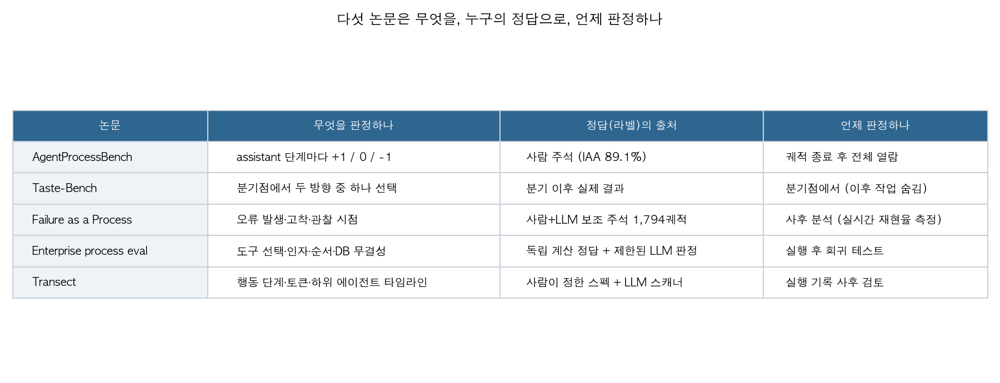
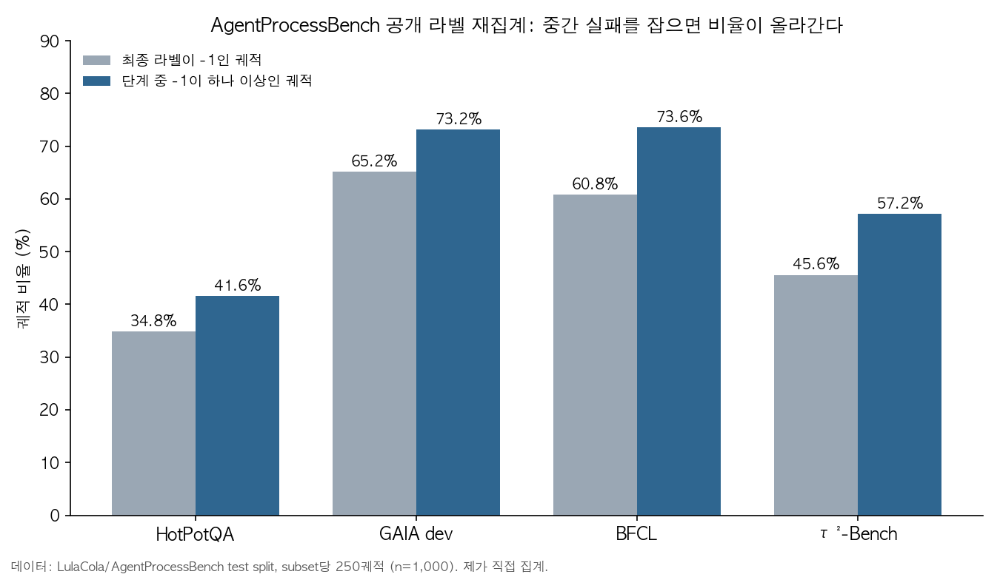

## 한눈에 보는 결론

- 에이전트를 최종 성공 여부로만 재면 중간에 틀린 단계를 놓칩니다. AgentProcessBench 공개 라벨에서 <strong>틀린 단계(-1)가 하나 이상 있는 궤적</strong>은 최종 라벨이 -1인 궤적보다 subset마다 <strong>6.8~12.8%p</strong> 많았습니다.
- 실패는 초반에 시작하는데 늦게 보입니다. Failure as a Process 논문은 실패가 대개 처음 몇 단계에서 시작하고, 되돌릴 수 없게 된 뒤에야 드러나는 경우가 많다고 보고합니다. 실시간 감시기가 굳기 전에 잡은 비율은 <strong>3.7~8.7%</strong>였습니다.
- 최종 점검을 통과해도 과정은 어긋날 수 있죠. 기업 스킬 평가에서 최종 수치가 맞은 175회 중 <strong>162회(92.6%)</strong>에 다른 과정 편차가 있었습니다.
- Taste-Bench에서 최고 모델의 정답률은 <strong>59.7%</strong>였고, 나중 작업이 근거가 되는 분기일수록 모든 모델에서 어려웠습니다. 추론 예산을 늘려도 정확도는 오르지 않았습니다.

## 무엇을 비교했나

1. **AgentProcessBench** (arXiv 2603.14465, Fan 외): 도구를 쓰는 에이전트 궤적 1,000개에 8,509개 단계를 사람이 라벨링했고, 라벨은 +1, 0, -1 세 가지입니다.
2. **The Tasteful Agent / Taste-Bench** (arXiv 2609.25804): 궤적 중간의 결정 분기점에서 어느 방향이 더 나은 결과로 이어졌는지 묻는 문항을 자동으로 만들었습니다.
3. **Failure as a Process** (arXiv 2607.09510, Zhao 외): 터미널 코딩 에이전트의 실패 궤적을 오류가 생긴 시점, 굳은 시점, 눈에 보인 시점으로 나눠 봤습니다.
4. **Continuous Process-Level Evaluation for Evolving Enterprise AI Agent Skills** (arXiv 2610.01833): 기업 업무 시스템의 스킬이 바뀔 때마다 최종 수치와 도구 호출 과정을 함께 검사하는 평가 틀입니다.
5. **Retaining Observability for Long-Horizon LLM Agent Evaluations / Transect** (arXiv 2610.08364): 긴 실행 기록을 시간축에 맞춰 보여 주는 오픈소스 도구입니다. 저장소는 MIT 라이선스라고 논문이 밝힙니다.

## 방법 비교

| 논문 | 무엇을 재나 | 정답(라벨)은 어디서 | 핵심 수치 | 공개 자료 |
|---|---|---|---|---|
| AgentProcessBench | 단계별 +1 / 0 / -1 | 사람 수작업 주석 (합의율 89.1%) | 논문 표: GPT-5.2 StepAcc 70.1, Gemini-3-Flash-Preview 78.3 | GitHub, Hugging Face |
| Taste-Bench | 분기점에서 방향 선택 | 분기 이후 실제 결과 | 최고 모델 59.7% (무작위 25%) | 코드 공개, 데이터는 인증 필요 |
| Failure as a Process | 오류가 생기고, 굳고, 보이는 시점 | 수작업 주석 | 인식(epistemic) 오류가 주된 원인, 논문 수치 57.9% | 별도 저장소는 확인 못 함 |
| 기업 스킬 평가 | 도구 선택, 인자, 실행 순서, DB 무결성 | 독립 계산한 정답 + 범위를 좁힌 LLM 판정 | 최종 통과 175회 중 162회에 편차 | 확인 못 함 |
| Transect | 실행 단계, 토큰 사용, 하위 에이전트 활동 | 평가자가 정한 행동 어휘 + 모델 라벨 | 1,300만 토큰 가까운 AI R&D 실행 사례 | GitHub, MIT |

표의 숫자는 과제가 서로 달라서 순위로 읽으면 안 됩니다. 이 표는 판정 축이 어떻게 다른지 보는 용도입니다.

## 논문별 핵심 결과

**AgentProcessBench.** 초록에 따르면 1,000개 궤적, 8,509개 단계 라벨, 합의율 89.1%입니다. 약한 정책 모델은 일찍 끝내 버리는 방식으로 맞는 단계 비율이 부풀려진다고 논문은 지적합니다. 또 중립 행동과 틀린 행동을 구분하는 일이 현재 모델에 여전히 어렵다고 보고합니다. 단계 단위 신호는 결과 감독과 함께 쓸 때 테스트 시점 스케일링을 더 돕는다는 결과도 있습니다.

**Taste-Bench.** 502문항이고, 14개 모델을 평가했습니다. 최고 모델의 정답률은 59.7%였고, 무작위 추측은 25%입니다. 결정을 뒷받침하는 증거가 궤적 뒤쪽에 있는 분기일수록 모든 모델에서 어려웠습니다.

제가 본문 표에서 옮긴 값으로는 미래 작업을 볼 수 없는 분기에서 평균 62.3%, 뒤의 작업을 많이 봐야 하는 분기에서 평균 21.0%였습니다. 논문은 결과를 아는 교사의 판단을 학생 모델에 증류하면 보지 못한 과제에서 더 나은 선택을 하고, 보류한 SWE-bench Pro 과제의 성공률도 오른다고 보고합니다. 학생 평가는 보류 과제 41개로 했습니다.

**Failure as a Process.** 7개 최신 모델과 3개 에이전트 틀(OpenHands, MiniSWE, Terminus2)로 Terminal-Bench에서 3,843개 궤적을 모았고, 그중 1,794개를 골라 6만 3천 단계 이상을 수작업으로 주석했습니다.

초록은 실패가 주로 인식 오류에서 나오고, 처음 몇 단계 안에 시작하며, 회복이 불가능해진 뒤에야 드러나는 경우가 많다고 요약합니다. 실시간 감시기는 이미 굳은 실패는 82% 정밀도로 잡았지만, 굳기 전에 잡은 비율은 3.7~8.7%였고 실시간 재현율은 최고 28.8%였습니다. 성공한 궤적의 71%도 오류를 한 번 이상 겪었습니다.

**기업 스킬 평가.** 비즈니스 가치 산정 스킬의 Revenue, Productivity 두 변형을 240회 실행했습니다. 명세 변형 두 종, 에이전트 하네스 두 종(Claude Code, Codex), 모델 세 종을 조합했습니다. 최종 수치 검사를 통과한 175회 가운데 162회(92.6%)에 다른 평가기가 잡은 편차가 있었습니다. 실패한 검사 항목은 평균 6.34개였는데 원인으로 묶으면 2.65개가 됐습니다. 논문은 실제 API가 바뀌는 상황의 장기 검증은 앞으로의 과제라고 적었습니다.

**Transect.** 이 논문은 측정 결과보다 도구 소개에 가깝습니다. AI R&D 평가 실행 기록(토큰 약 1,300만 개)을 행동 단계, 하위 에이전트 위임, 토큰 사용량으로 나눠 보여 줬습니다. 그 결과 운영 작업과 원고 작성에 집중된 반면, 가설을 세우는 단계는 뚜렷하지 않았다고 해석합니다. 정량 벤치마크는 없습니다.

## 제가 직접 확인한 것

이번 글에서 제가 직접 한 확인은 AgentProcessBench 라벨 재집계 하나입니다. 에이전트나 모델은 새로 돌리지 않았습니다.

모델별 점수는 논문 표에서 옮겨 올린 것이고, 제가 다시 낸 것이 아닙니다. Hugging Face의 LulaCola/AgentProcessBench에서 test 파일 네 개(bfcl, gaia_dev, hotpotqa, tau2)를 받아 궤적마다 라벨을 셌습니다. 파일마다 250궤적이라 합계는 1,000궤적이고, 단계 라벨은 8,509개로 논문 수치와 맞았습니다. subset별 단계 라벨 비율은 아래와 같습니다.

| subset | 궤적 | 라벨된 단계 | 틀린 단계(-1) | 중립(0) | 맞는 단계(+1) |
|---|---|---|---|---|---|
| HotPotQA | 250 | 734 | 24.4% | 7.6% | 68.0% |
| GAIA dev | 250 | 1,628 | 52.3% | 10.1% | 37.6% |
| BFCL | 250 | 2,590 | 22.0% | 4.0% | 74.0% |
| τ²-Bench | 250 | 3,557 | 31.2% | 3.6% | 65.2% |

그다음 궤적 단위로 세었습니다. 최종 라벨이 -1인 궤적은 HotPotQA 34.8%, GAIA dev 65.2%, BFCL 60.8%, τ²-Bench 45.6%였습니다. 단계 중 -1이 하나라도 있는 궤적은 각각 41.6%, 73.2%, 73.6%, 57.2%였습니다.

두 값의 차이는 6.8~12.8%p였습니다. 최종 라벨은 +1인데 중간에 -1이 있는 궤적이 적지 않다는 뜻입니다. 다만 이 수치가 실패 여부를 뜻하는지는 논문의 라벨 규칙을 더 확인해야 합니다. 회복된 단계가 어떻게 붙었는지는 제가 확인하지 않았습니다.

Taste-Bench 데이터셋도 받아 보려 했지만 인증을 요구해서 열지 못했습니다. 인증을 우회하지도 않았습니다. 그래서 그 논문의 문항 품질은 제가 판단하지 못했습니다. 기업 스킬 평가와 Transect는 초록만 읽었고, 두 저장소는 확인하지 않았습니다. 이 두 편의 세부 설계에 대해서는 이 글에서 말할 근거가 없습니다.

제가 저장소를 찾아보고 자료 링크를 따라갔지만, 실제로 열린 것은 논문 페이지와 데이터 파일들이고 재현은 하지 못했습니다.

## 언제 무엇을 쓰나

- **에이전트 평가 점수를 낼 때**는 최종 성공률 옆에 틀린 단계가 있는 궤적 비율도 함께 적으세요. 최종 라벨만 보면 공개 라벨 기준으로 6.8~12.8%p를 덜 세게 됩니다.
- **실행 중에 개입하는 감시기**를 설계한다면 조기 탐지 목표를 낮게 잡으세요. Failure as a Process 수치로는 굳기 전 탐지가 3.7~8.7%였습니다.
- **분기점 기반 평가**는 뒤쪽 증거가 필요한 분기에서 정확도가 떨어진다는 전제로 읽으세요. 그 구간이 난도를 좌우합니다.
- **기업용 스킬**을 고칠 때는 최종 수치가 맞아도 도구 호출 순서와 DB 무결성을 함께 검사하세요. 최종 수치 통과 실행의 92.6%에 편차가 있었습니다.

## 한계와 반론

- 다섯 편의 수치는 각 논문의 주장입니다. 저는 AgentProcessBench 라벨 재집계 말고는 재현하지 않았습니다.
- 과제가 서로 다릅니다. 도구 사용 QA, 터미널 코딩, 기업 업무 시스템, 연구 실행 기록이 섞여 있어서 표의 숫자를 순위로 읽으면 안 됩니다.
- AgentProcessBench의 합의율은 89.1%라서 약 11%는 주석자끼리 판단이 엇갈렸다는 뜻입니다.
- 기업 스킬 평가는 한 시스템, 두 계열 스킬이라 바깥으로 일반화하기 어렵습니다.
- Failure as a Process는 터미널 코딩만 다룹니다. Transect는 사례 연구라서 정량 결과가 없습니다.
- 제가 기업 스킬 평가와 Transect는 초록만 읽었습니다. 본문의 세부 설계는 이 글에서 다루지 않았습니다.

## 적용 규칙

1. 에이전트 평가표에 최종 성공률과 "틀린 단계가 하나 이상 있는 궤적 비율"을 함께 두세요.
2. 실행 중 감시기의 조기 탐지 기대치는 낮게 잡으세요.
3. 판정 기준에 "정보가 이미 있었는데 무시하거나 잘못 읽었는지"를 따로 묻는 항목을 넣으세요. 인식 오류가 주된 원인이라는 것이 Failure as a Process의 결론입니다.
4. 기업용 스킬을 수정할 때는 최종 수치와 도구 호출 순서, DB 무결성을 함께 검사하세요.

## 자주 묻는 질문

**Q. 단계 라벨이 -1이면 그 에이전트는 실패한 건가요?**
A. 그렇게 단정하기 어렵습니다. -1은 틀린 단계라는 라벨이고, 실패 여부는 최종 라벨과 논문의 라벨 규칙을 함께 봐야 합니다.

**Q. 모델별 점수는 직접 돌려 봤나요?**
A. 아닙니다. 이 글의 모델별 점수는 각 논문의 표를 인용한 것입니다.

**Q. Taste-Bench 데이터는 누구나 받을 수 있나요?**
A. 제가 확인했을 때는 인증이 필요했습니다. 공개 여부는 데이터셋 페이지에서 다시 확인하세요.

## 참고 자료

1. Fan 외, "AgentProcessBench: Diagnosing Step-Level Process Quality in Tool-Using Agents," arXiv 2603.14465. https://arxiv.org/abs/2603.14465 · 코드 https://github.com/RUCBM/AgentProcessBench · 데이터 https://huggingface.co/datasets/LulaCola/AgentProcessBench
2. "The Tasteful Agent: Measuring and Improving Taste in Long-Horizon Tasks," arXiv 2609.25804. https://arxiv.org/abs/2609.25804 · 코드 https://github.com/wbopan/tastebench · 데이터(인증 필요) https://huggingface.co/datasets/wenbopan/taste-bench
3. Zhao 외, "Failure as a Process: An Anatomy of CLI Coding Agent Trajectories," arXiv 2607.09510. https://arxiv.org/abs/2607.09510
4. "Continuous Process-Level Evaluation for Evolving Enterprise AI Agent Skills," arXiv 2610.01833. https://arxiv.org/abs/2610.01833
5. "Retaining Observability for Long-Horizon LLM Agent Evaluations," arXiv 2610.08364. https://arxiv.org/abs/2610.08364 · 코드 https://github.com/AI-Safety-Institute/transect

이 글은 제가 여러 자료를 비교·정리하고 일부는 에이전트를 활용해 실행하고 확인한 내용으로 발행하였습니다.
