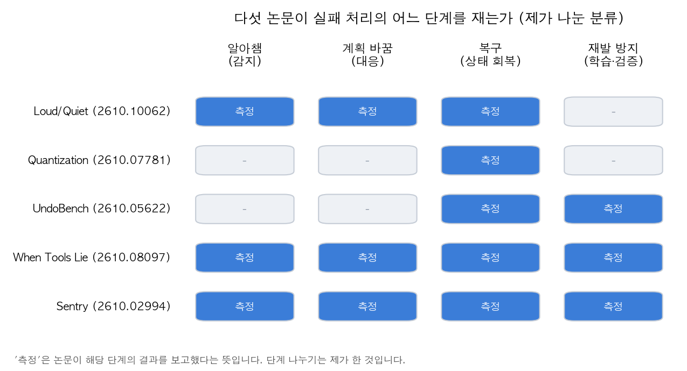
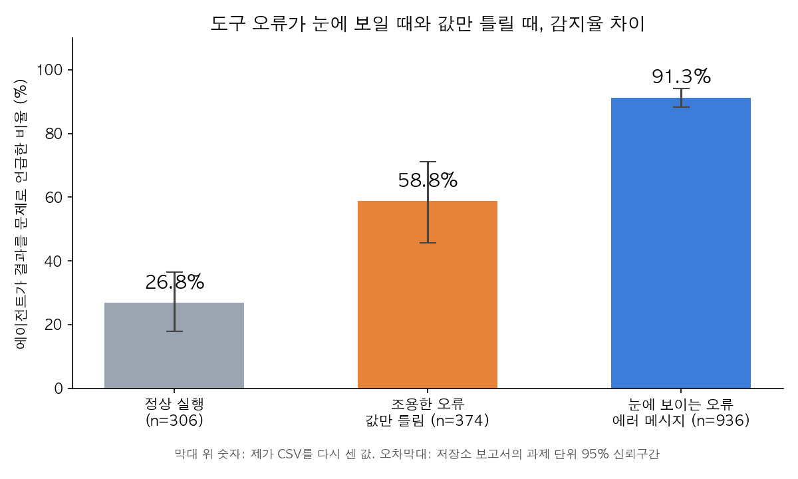

## 한눈에 보는 결론

- 에이전트가 도구 오류를 알아채는지는 <strong>오류가 어떻게 보이느냐</strong>에 크게 달렸습니다. 에러 메시지가 나온 경우에는 <strong>91.3%</strong>가 문제로 언급했지만, 그럴듯한 틀린 값이 나온 경우에는 <strong>58.8%</strong>로 떨어졌습니다.
- 오류가 없는 정상 실행에서도 문제라고 말한 비율은 <strong>26.8%</strong>였습니다. 알아채는 힘과 과잉 경보는 따로 봐야 합니다.
- 감지한 뒤 재시도는 위험할 수 있습니다. UndoBench에서 단순 재시도는 실험의 <strong>53.33%</strong>에서 외부 쓰기를 중복으로 일으켰습니다.
- 검증을 선택 사항으로 두면 잘 쓰지 않았습니다. When Tools Lie에서 검증이 없으면 정답률이 Haiku <strong>72.4%</strong>, Sonnet <strong>81.5%</strong>로 떨어졌고, 매번 다시 확인하게 강제하자 <strong>100%</strong>로 돌아왔습니다.

## 무엇을 비교했나

1. **Loud Failures, Quiet Failures** (Kraishan, arXiv 2610.10062): 함수 호출 벤치마크 BFCL 계열의 다턴 환경에 오류를 주입했습니다. 시간 초과, 도구 삭제, 파라미터 이름 변경, 값 오염을 나눠서 재고, 저장소의 실험 기록 1,920행을 공개했습니다.
2. **Quantization Effects on Tool-Failure Recovery** (arXiv 2610.07781): 모델 가중치의 정밀도(8비트와 4비트)를 바꿔 일시적 도구 실패에서 얼마나 회복하는지 봤습니다. 프롬프트 다섯 종류(P0~P4)로 나눠 채점 방식에 따른 결과 차이를 함께 보여 줍니다.
3. **UndoBench** (Sah 외, arXiv 2610.05622): 기업 소프트웨어 워크플로에 "응답은 못 받았지만 쓰기는 됐을 수 있는" 실패를 넣고, 재시도, 멱등성 키(같은 요청을 여러 번 보내도 한 번만 반영되게 하는 값), 실행 기록 저널링을 비교했습니다.
4. **When Tools Lie** (Univ. of Moratuwa, arXiv 2610.08097): 수학 문제 31개에서 계산 도구의 결과를 틀리게 바꾼 뒤, 검증 방식별 정답률을 비교했습니다.
5. **Sentry** (arXiv 2610.02994): 에이전트가 실패했을 때만 복구 교훈을 꺼내 주는 층입니다. WebShop, AppWorld, SWE-bench Lite, Mind2Web Replay에서 평가했습니다.

## 방법 비교

| 논문 | 실패를 어디에 넣나 | 무엇을 재나 | 대표 결과 | 공개 자료 |
|---|---|---|---|---|
| Loud/Quiet | 도구 호출 중 주입, 여러 종류 | 알아챔, 계획 변경, 복구 | 감지 91.3% vs 58.8% | 저장소 있음, 제가 재계산 |
| Quantization | 정해진 경로의 일시 실패 | 8비트·4비트 복구율, 채점 방식별 차이 | 부호가 과제·프롬프트·채점에 따라 바뀜 | 본문에 저장소 링크 없음 |
| UndoBench | 쓰기 전후 응답 유실 등 | 정답률, 중복 쓰기 비율 | 단순 재시도 중복 53.33% | 저장소 응답 200 |
| When Tools Lie | 계산 도구 결과 교체 | 정답률, 검증 방식별 비교 | 강제 검증 100%, 검증 없음 72.4% | 본문에 저장소 링크 없음 |
| Sentry | 에이전트가 실패할 때 | 평가 점수 | WebShop 0.170→0.468 | 본문에 저장소 링크 없음 |

다섯 편을 실패 처리의 단계별로 나눠 보면 각 논문이 무엇을 재는지 한눈에 들어옵니다. 단계 나누기는 제가 한 것입니다.

## 논문별 핵심 결과

**Loud/Quiet 논문.** 오류가 눈에 보이는 경우의 감지율은 91.3%였고, 값만 틀린 경우는 58.8%였습니다. 도구가 아예 사라진 경우에는 복구율이 39.9%로 떨어졌습니다. 추론 모델은 짝인 모델보다 문제를 덜 알아챘지만(−9.3점) 계획은 더 바꿨습니다(+10.4점). 복구율 차이는 통계적으로 확인되지 않았습니다(p=.512).

**Quantization 논문.** 결과는 과제와 프롬프트, 채점 방식에 따라 크게 흔들립니다. Llama는 한 프롬프트에서 짝이 맞는 과제만 놓고 보면 8비트가 +20.2점 앞섰습니다.

Qwen은 프롬프트에 따라 −50점에서 +35점까지 차이가 났습니다. 전체 파이프라인 성공률에서는 8비트 Llama가 27.5~28.3점 앞섰지만, 엄격한 채점으로 바꾸면 P4 프롬프트에서 +28.3점이 −15.0점으로 뒤집혔습니다. 그래서 이 논문의 핵심은 정밀도의 우열보다 "채점 방식을 먼저 정하라"는 주장에 가깝습니다.

**UndoBench.** 눈에 띄는 숫자는 53.33%입니다. 단순 재시도는 이 비율의 실험에서 외부 쓰기를 중복으로 만들었습니다. 과제 수행 정답률은 83.54%였지만, 실패에서 복구한 비율(RSR)은 39.03%, 보정된 복구율(CRSR)은 46.72%에 그쳤습니다. 멱등성 키의 효과는 +10.72점으로 나왔지만 신뢰구간이 0.00~+24.23이고 보정 후 p=1.00이라 확실한 효과라고 말하기 어렵습니다.

**When Tools Lie.** 계산 도구 결과가 틀린 상황에서 검증이 없으면 Haiku는 100%에서 72.4%로, Sonnet은 100%에서 81.5%로 떨어졌습니다. 매 단계마다 다시 검토하도록 강제한 방식(B1)은 100%에 도달했습니다. 대신 정상 결과를 틀렸다고 판단한 비율(false distrust)이 3.2%였습니다. 값이 틀어지는 시점은 첫 번째 도구 호출인 경우가 96.4%였습니다.

**Sentry.** 실패가 감지됐을 때만 교훈을 꺼내 쓰는 방식이 점수를 크게 올렸습니다. WebShop에서 기본 에이전트는 0.170, 가장 강한 기준선(Wink)은 0.264였고, Sentry는 0.468이었습니다. 반대로 교훈을 항상 맥락에 넣으면 WebShop 점수가 0.364에서 0.296으로 내려갔습니다. 점수는 모두 논문이 보고한 값입니다.

그림 1의 막대 값은 제가 brittle-agents 저장소의 원본 CSV에서 다시 센 값이고, 오차막대는 저장소 보고서의 95% 신뢰구간입니다.

## 언제 무엇을 쓰나

- **도구가 에러를 내는 구조라면** 에이전트의 감지에 기대도 됩니다. 값만 틀릴 수 있는 도구, 예를 들어 계산이나 조회나 집계라면 감지에 기대지 말고 결과를 다른 방식으로 확인하는 단계를 넣으세요.
- **쓰기 작업이 섞여 있으면** 재시도 정책부터 손보세요. 중복 쓰기를 막는 키나 서버 쪽 확인이 없으면 재시도 자체가 위험합니다.
- **검증 단계는 선택 사항으로 두지 마세요.** 필요할 때만 부르게 하면 검증을 건너뛰는 경우가 많았습니다.
- **모델을 비교할 때는** 채점 방식과 과제 선정 방식을 같이 적으세요. 같은 로그도 채점 방식에 따라 결론이 뒤집혔습니다.

## 제가 직접 확인한 것

이번 글에서 제가 직접 한 작업은 Loud/Quiet 논문 저장소의 확인과 재계산입니다.

저장소 brittle-agents(MIT 라이선스)를 샌드박스 폴더에 클론했고, 저장소가 제공하는 master_trials.csv에서 감지율을 다시 셌습니다. 처음 시도한 계산은 주입이 발동하지 않은 행까지 포함해서 n이 논문과 맞지 않았습니다. 그래서 저장소 분석 스크립트의 필터를 찾아 읽었고, 주입이 실제로 발동한 행만 남기고 감지 값이 있는 행만 세자 논문과 같은 값이 나왔습니다. 이 과정에서 필터 조건을 글에 적지 않으면 같은 CSV에서도 n이 달라진다는 것을 확인했습니다. 원자료를 열어 보지 않은 UndoBench와 나머지 세 편은 이 과정에 넣지 못했습니다.

- 정상 실행: n=306, 감지 82 → 26.8%
- 눈에 보이는 오류: n=936, 감지 855 → 91.3%
- 값만 틀린 오류: n=374, 감지 220 → 58.8%

UndoBench 저장소는 응답 200만 확인했고, 재계산은 하지 않았습니다. 나머지 세 편은 본문에서 공개 저장소 링크를 찾지 못해 원자료를 확인할 수 없었습니다. 그래서 이 글의 나머지 수치는 모두 각 논문이 보고한 값입니다. 모델이나 에이전트는 새로 실행하지 않았습니다.

## 한계와 반론

- **표본이 작습니다.** When Tools Lie는 문제 31개로 실험했습니다. 정답률이 천장에 닿은 상황이라 강제 검증이 최적인지는 이 자료만으로 알 수 없습니다.
- **재시도가 검증 효과를 대신했을 수 있습니다.** 값이 틀어진 경우 다시 호출하면 맞는 값을 받을 수도 있습니다. 검증 효과와 재호출 효과를 분리했는지는 본문에서 충분히 드러나지 않았습니다.
- **오류 주입이 실제 장애와 다를 수 있습니다.** 주입은 실험실에서 만든 것이라 실제 장애의 모양과 다를 수 있습니다.
- **UndoBench의 멱등성 효과는 통계적으로 확실하지 않습니다.** 신뢰구간이 0을 걸치고 보정 후 p값도 1.00입니다.
- **Sentry 결과는 실제 서비스에서 확인되지 않았습니다.** 네 개의 벤치마크 결과이고, 실제 서비스에서의 효과는 이 논문만으로 알 수 없습니다.
- **양자화 결과는 채점 방식에 따라 부호가 바뀝니다.** 저자들도 한 가지 결론보다는 평가 설계를 먼저 고치라고 말합니다.

## 적용 규칙

1. 도구 결과에 오류 신호가 없으면 에이전트가 알아챌 것이라고 가정하지 말고, 결과 값을 확인하는 단계(범위 검사, 재계산, 교차 조회)를 설계에 넣으세요.
2. 쓰기 작업을 재시도하기 전에 같은 작업이 이미 실행됐는지 확인하는 키나 서버 쪽 중복 검사가 있는지 보세요. 없으면 재시도를 끄는 쪽이 낫습니다.
3. 검증은 정해진 단계로 넣으세요. 강제 검증은 정답률을 되돌렸지만 정상 결과를 틀렸다고 보는 비용도 같이 나왔습니다.
4. 모델을 비교할 때는 과제 선정, 평가 대상, 채점 방식을 함께 기록하세요. 채점 방식 하나 때문에 부호가 뒤집혔습니다.
5. 공개된 원자료가 있으면 본문 수치를 먼저 다시 세어 보세요. 이번에는 저장소의 원본 CSV로 감지율 세 값을 그대로 재현할 수 있었습니다.

## 참고 자료

1. Loud Failures, Quiet Failures: Fault Detection and Recovery in Tool-Using Language Model Agents, arXiv 2610.10062, https://arxiv.org/abs/2610.10062 / 저장소 https://github.com/obadaKraishan/brittle-agents
2. Quantization Effects on Tool-Failure Recovery, arXiv 2610.07781, https://arxiv.org/abs/2610.07781
3. UndoBench, arXiv 2610.05622, https://arxiv.org/abs/2610.05622 / 저장소 https://github.com/tradertanmay/undobench
4. When Tools Lie, arXiv 2610.08097, https://arxiv.org/abs/2610.08097
5. Sentry, arXiv 2610.02994, https://arxiv.org/abs/2610.02994

이 글은 제가 여러 자료를 비교·정리하고 일부는 에이전트를 활용해 실행하고 확인한 내용으로 발행하였습니다.
