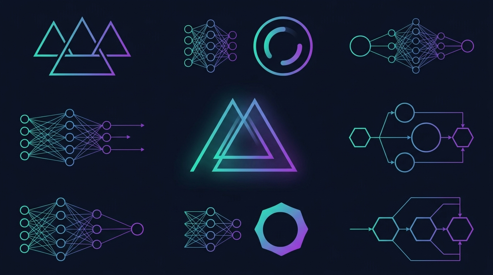

프레젠테이션을 만들 때면 늘 같은 고민이 반복된다. Gamma나 Beautiful AI 같은 서비스는 편하지만, 내 데이터가 어디로 가는지 모르겠고, 구독료는 매월 빠져나간다. 템플릿은 예쁜데 회사 브랜드에 맞추려면 한계가 금방 보인다.

**Presenton**은 이 문제에 대해 꽤 직접적인 대답을 준다. 완전한 오픈소스이고, 로컬에서 돌아가며, API 키만 있으면 어떤 AI 모델이든 쓸 수 있다. Apache 2.0 라이선스로 302개의 스타를 받고 있는 이 프로젝트를 인터뷰 형식으로 정리해봤다.

---

## Q1. Presenton은 정확히 뭔가요?

**A1.** 한마디로 **셀프호스팅 가능한 AI 프레젠테이션 제너레이터**다. 텍스트 프롬프트나 주제만 입력하면 AI가 슬라이드를 생성하고, 그 결과물을 PPTX나 PDF로 내보낼 수 있다. Gamma, Beautiful AI, Decktopus의 오픈소스 대안을 표방하고 있다.

가장 큰 차이점은 **인터넷 연결 없이도 완전히 로컬에서 실행**된다는 점이다. Docker 한 줄이면 서버에 띄울 수 있고, Electron 데스크탑 앱도 있어서 Mac, Windows, Linux 모두 지원한다.

---

## Q2. 기존 SaaS 서비스와 뭐가 다른가요?

**A2.** 세 가지 핵심 차이가 있다.

**첫째, 데이터와 구독의 자유.** SaaS 프레젠테이션 도구는 대부분 클라우드에서만 동작하고, 내 프레젠테이션 데이터가 서버에 저장된다. 구독을 끊으면 접근이 제한되는 경우도 많다. Presenton은 로컬에서 돌아가니 데이터가 내 컴퓨터나 내 서버에만 있다.

**둘째, BYOK(Bring Your Own Key).** 특정 AI 업체에 종속되지 않는다. OpenAI, Gemini, Anthropic, Azure, Vertex AI, Bedrock은 물론, Ollama나 LM Studio 같은 로컬 모델까지 연결할 수 있다. 커스텀 엔드포인트도 지원하니 사내 AI 인프라가 있다면 그것도 가능하다.

**셋째, 템플릿의 소유권.** 기존 PPTX 파일에서 템플릿을 추출할 수 있다. 회사 브랜드 가이드가 담긴 기존 프레젠테이션을 넣으면, 그 스타일 그대로 새 슬라이드를 만들어준다.

---

## Q3. BYOK가 왜 중요한가요?

**A3.** 실무에서는 의외로 큰 차이를 만든다.

예를 들어보자. 회사에서 Azure OpenAI 서비스를 쓰고 있다면, Presenton에 Azure 엔드포인트와 키만 설정하면 된다. 별도 구독이 필요 없다. 보안이 민감한 조직이라면 Ollama로 로컬에 LLM을 띄우고, DALL-E 대신 로컬 이미지 생성 모델을 쓰면 인터넷으로는 아무것도 나가지 않는다.

비용 측면에서도 유리하다. 월 구독료를 내는 대신, 사용한 토큰만큼만 API 비용을 지불하면 된다. 자주 쓰지 않는다면 훨씬 저렴하다.

지원하는 제공자를 정리하면:

| **클라우드** | **로컬/셀프호스팅** |
|---|---|
| OpenAI, Gemini, Anthropic | Ollama, LM Studio |
| Azure, Vertex AI, Bedrock | 커스텀 엔드포인트 |
| Fireworks, Together | — |

이미지 생성도 마찬가지다. DALL-E 3, Gemini Flash는 물론 Pexels와 Pixabay에서 무료 이미지를 가져올 수도 있다.

---

## Q4. MCP 서버가 내장되어 있다는 게 무슨 의미인가요?

**A4.** 이게 아마 Presenton의 가장 흥미로운 기능이다.

**MCP(Model Context Protocol)** 는 AI 모델이 외부 도구와 상호작용하는 표준 프로토콜이다. Presenton이 MCP 서버를 내장하고 있다는 건, **Cursor, Claude Desktop, Windsurf 같은 코딩 에이전트에서 직접 프레젠테이션을 생성할 수 있다**는 뜻이다.

실제 시나리오를 생각해보자. Cursor에서 코드를 작성하면서 "이 프로젝트 소개 프레젠테이션 만들어줘"라고 요청하면, Presenton MCP 서버가 그 요청을 받아 슬라이드를 생성한다. 개발 워크플로우를 벗어나지 않고 프레젠테이션을 만들 수 있는 셈이다.

이건 단순히 "편리하다"를 넘어서, 프레젠테이션 생성을 **개발 파이프라인의 일부**로 만들 수 있다는 의미다. CI/CD 파이프라인에서 자동으로 리포트 슬라이드를 생성하는 것도 가능하다.

---

## Q5. 템플릿은 어떻게 커스텀하나요?

**A5.** HTML + Tailwind CSS 기반이다.

마케터나 디자이너에게는 익숙하지 않을 수 있지만, 개발자라면 오히려 자연스럽다. 코드로 템플릿을 작성하니 버전 관리도 되고, PR로 리뷰도 할 수 있다.

더 실용적인 방법도 있다. **AI 템플릿 생성 기능**으로 기존 PPTX를 업로드하면, Presenton이 그 파일에서 템플릿을 추출한다. 회사 프레젠테이션 템플릿이 이미 있다면, 그걸 그대로 가져와서 AI가 새 콘텐츠를 채워넣는 방식이다.

---

## Q6. 실제로 어떻게 시작하나요?

**A6.** 두 가지 방법이 있다.

**Docker로 실행 (1줄):**

```bash
docker run -d -p 8000:8000 presenton/presenton
```

브라우저에서 `http://localhost:8000`을 열면 바로 시작할 수 있다. ChatGPT 계정으로 로그인도 가능하다.

**데스크탑 앱:**

GitHub Releases에서 Mac, Windows, Linux용 설치 파일을 다운로드하면 된다. Docker 없이도 실행 가능하다.

첫 실행 후 설정에서 AI 제공자를 선택하고 API 키를 입력하면 끝이다. Ollama를 쓴다면 API 키 없이 로컬 모델만 설정하면 된다.

---

## Q7. 어떤 사람에게 추천하나요?

**A7.** 이런 사람들에게 특히 의미 있다:

- **개발자와 기술 팀** — MCP 연동으로 개발 워크플로우 안에서 프레젠테이션 생성
- **보안이 중요한 조직** — 로컬 실행으로 데이터 유출 제로
- **SaaS 구독에 지친 사람** — API 키만 있으면 되니 사용량 기반 과금
- **브랜드 커스텀이 필요한 팀** — 기존 PPTX에서 템플릿 추출 가능
- **온프레미스를 선호하는 조직** — Docker 1커맨드 배포, 클라우드 의존 없음

Railway나 DigitalOcean 원클릭 배포도 지원하니, 팀용으로 서버에 올려놓고 공유하는 것도 쉽다.

---

## 정리

Presenton은 "AI 프레젠테이션 도구"라는 카테고리에서 **소유권과 제어권**을 전면에 내세운 프로젝트다. 기능 자체는 Gamma나 Beautiful AI와 비슷하지만, 내 데이터가 내 손에 있고, 내가 선택한 AI 모델을 쓰고, 내가 만든 템플릿을 소유한다는 점이 근본적으로 다르다.

프레젠테이션을 자주 만들면서 SaaS에 대한 아쉬움이 있었다면, 한 번 로컬에 띄워서 써볼 만하다.

**GitHub:** [github.com/presenton/presenton](https://github.com/presenton/presenton)
**웹사이트:** [presenton.ai](https://presenton.ai)
