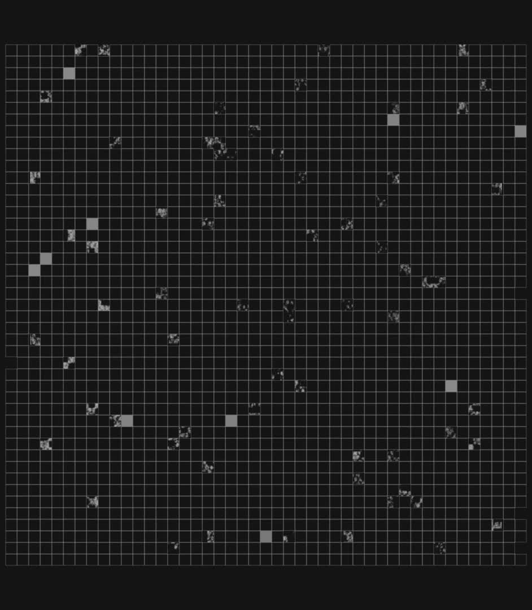
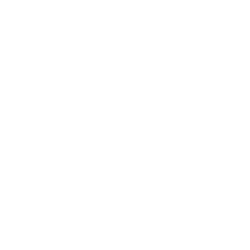
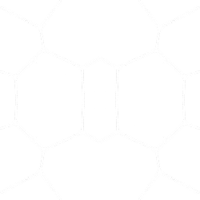
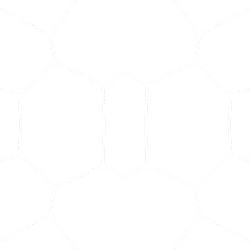

> 원문: [Project Glasswing: Securing critical software for the AI era](https://www.anthropic.com/glasswing)

Anthropic의 **Project Glasswing** 발표는 새 모델 소개가 핵심이 아닙니다. 핵심은 이제 최상위 AI 모델이 **취약점 탐지와 익스플로잇 개발에서 상위권 인간 보안 연구자에 근접하거나 일부 구간에서는 넘어서는 수준**에 들어왔고, 이 능력을 공격자가 먼저 쓰기 전에 방어 측에 배치해야 한다는 선언입니다.

이 글은 원문을 바탕으로 다음 네 가지를 빠르게 파악할 수 있게 정리했습니다.

- 왜 Anthropic이 Glasswing을 별도 프로젝트로 분리했는가
- Claude Mythos Preview가 어떤 보안 역량을 보여줬는가
- 참여 기업과 오픈소스 생태계에 어떤 의미가 있는가
- 실제 현업 보안팀이 지금 준비해야 할 것은 무엇인가

## 한눈에 보는 핵심

- Anthropic은 **Project Glasswing**을 통해 AWS, Apple, Broadcom, Cisco, CrowdStrike, Google, JPMorganChase, Linux Foundation, Microsoft, NVIDIA, Palo Alto Networks와 협력한다.
- 공개되지 않은 프런티어 모델 **Claude Mythos Preview**가 핵심 엔진이다.
- Anthropic 설명대로라면 이 모델은 **모든 주요 운영체제와 주요 브라우저에서 수천 건의 고위험 취약점**을 찾았고, 일부는 자율적으로 익스플로잇까지 연결했다.
- Anthropic은 프로젝트 참여 기관과 추가 40여 개 조직에 **최대 1억 달러 규모 사용 크레딧**을 제공하고, 오픈소스 보안 단체에도 **직접 기부 400만 달러**를 집행한다.
- 이 발표의 메시지는 단순하다. **AI가 공격을 더 쉽게 만들기 전에, 방어 자동화를 먼저 산업 표준으로 만들어야 한다**는 것이다.

## 왜 Glasswing이 지금 나왔나

Anthropic이 전제하는 현실은 분명합니다.

소프트웨어는 이미 거대한 공격 표면을 가지고 있고, 기존에는 소수의 숙련된 연구자만 찾아낼 수 있었던 취약점이 많았습니다. 그런데 최근 프런티어 모델은 코드 독해, 취약점 위치 파악, 재현, 익스플로잇 설계까지 한 번에 수행하는 방향으로 빠르게 진화하고 있습니다.

원문은 특히 다음 위험을 강조합니다.

1. **취약점 탐지 비용 하락**
   - 과거에는 시간이 오래 걸리던 코드 감사와 취약점 재현이 모델 추론 비용으로 치환된다.
2. **공격 전문성의 하향 평준화**
   - 최상위 보안 연구자가 아니어도 모델을 통해 고급 공격 워크플로를 밟을 수 있다.
3. **방어 시간의 붕괴**
   - 발견에서 악용까지 걸리는 시간이 짧아지면 패치와 공개 프로세스가 기존 속도로는 버티기 어렵다.
4. **핵심 인프라 집중 리스크**
   - 운영체제, 브라우저, 미디어 라이브러리, 커널, 금융·의료·에너지 인프라가 동시에 위험해진다.

Anthropic은 이 상황을 "몇 달 안에 더 악화될 수 있는 문제"로 보고, 일반 공개보다 먼저 **통제된 방어 협력망**을 만든 셈입니다.

## Mythos Preview가 보여준 보안 역량

Anthropic이 공개한 사례는 꽤 공격적입니다.

### 1) 오래된 취약점도 다시 찾아낸다

원문에 따르면 Mythos Preview는 다음과 같은 사례를 보여줬습니다.

- **OpenBSD 27년 된 취약점** 발견
- **FFmpeg 16년 된 취약점** 발견
- **Linux kernel 취약점 체인**을 묶어 일반 권한에서 시스템 장악까지 이어지는 경로 탐색

여기서 중요한 점은 단순 정적 분석이 아니라, **사람이 오랫동안 놓쳤던 취약점**을 다시 건드렸다는 점입니다. 기존 테스트가 수백만 번 코드 경로를 지나갔어도 논리적 취약점을 못 잡을 수 있다는 뜻입니다.

### 2) 인간 조향 없이도 익스플로잇 단계로 간다

Anthropic은 일부 취약점에서 Mythos Preview가 **거의 자율적으로 취약점 확인과 관련 익스플로잇 개발**까지 진행했다고 설명합니다. 이건 단순 코드 리뷰 보조가 아닙니다.

즉, 앞으로의 보안 경쟁력은 "취약점 스캐너를 잘 돌리는가"보다 아래 역량으로 이동합니다.

- 코드베이스 전체를 읽고 우선순위를 세우는 능력
- 재현 가능한 공격 경로를 조합하는 능력
- 패치 후보를 만들고 회귀 영향을 판단하는 능력
- 공개 전 조용히 대량 triage를 처리하는 능력

### 3) 벤치마크에서도 Opus 4.6 대비 큰 차이를 냈다

원문에 실린 대표 수치는 다음과 같습니다.

- **Cybersecurity Vulnerability Reproduction**
  - Mythos Preview: **83.1%**
  - Opus 4.6: **66.6%**
- **BrowseComp**
  - Mythos Preview가 Opus 4.6보다 높게 점수 획득
  - 동시에 **토큰 사용량은 4.9배 적음**

추가로 SWE-bench 계열, Terminal-Bench 2.0, Humanity's Last Exam 등 다수 지표에서도 높은 수치를 제시합니다. Anthropic의 메시지는 일관됩니다. **강한 코딩 에이전트 성능이 강한 사이버 성능으로 이어진다**는 것입니다.

## 이 발표에서 특히 중요한 세 가지 해석

## 1) "보안 모델"이 아니라 "범용 모델의 보안 임계 돌파"

Glasswing이 의미 있는 이유는, 별도의 특수 목적 모델이 아니라 **범용 프런티어 모델이 보안에서 임계점을 넘었다**는 데 있습니다.

이건 곧 다음을 뜻합니다.

- 코딩 모델 경쟁이 보안 경쟁으로 직결된다.
- 에이전트 성능 향상은 곧 취약점 탐지 자동화 고도화로 연결된다.
- 모델 공개 범위와 안전장치 설계가 국가 안보 이슈와 맞물린다.

## 2) 보안팀의 병목은 "전문가 수"에서 "워크플로 설계"로 옮겨간다

모델이 강해질수록 부족한 것은 취약점 후보 자체가 아니라 **검증, 우선순위, 수정, 배포, 공개 프로세스**가 됩니다.

결국 기업은 아래를 갖춰야 합니다.

- AI가 찾은 취약점의 신뢰도 평가 체계
- 패치 자동 생성 및 테스트 파이프라인
- 오픈소스 유지보수자와의 비공개 공개 절차
- 공격 악용 가능성을 고려한 내부 접근 통제

## 3) 오픈소스 보안이 핵심 전장이 된다

Anthropic이 Linux Foundation, Apache Software Foundation, OpenSSF, Alpha-Omega까지 연결한 이유가 여기에 있습니다.

대부분의 현대 시스템은 오픈소스 위에 쌓여 있고, AI 에이전트 역시 그 오픈소스를 사용해 새 소프트웨어를 만듭니다. 즉 **오픈소스 취약점은 공급망 전체의 취약점**입니다.

관련해서 공급망 방어 관점은 [[PyPI 공급망 공격 이후 — 오픈소스 보안의 새로운 전략과 현실적인 방어법]]도 함께 보면 맥락이 잘 이어집니다.

## 참여 기업과 협업 구조

원문 서두에 명시된 공식 파트너는 다음과 같습니다.

  
  
  
  
  
  
  
  
  
  
  
  

이 구성이 시사하는 바도 분명합니다.

- **클라우드 사업자**: AWS, Google, Microsoft
- **플랫폼 및 하드웨어**: Apple, Broadcom, NVIDIA
- **보안 전문 기업**: Cisco, CrowdStrike, Palo Alto Networks
- **금융권 대형 사용자**: JPMorganChase
- **오픈소스 거버넌스**: Linux Foundation

즉 모델 제공사 혼자 실험하는 것이 아니라, 실제 핵심 인프라를 운영하거나 보호하는 조직을 묶어서 **실제 방어 워크플로**를 검증하려는 구조입니다.

## 페이지에 포함된 미디어 정리

원문 페이지에는 정적인 텍스트만 있는 것이 아니라, 보안·AI·협업 이미지를 함께 사용합니다. Quartz 이관 시 누락을 막기 위해 본문에 포함된 미디어를 모두 로컬 자산으로 저장했습니다.

### 히어로 비디오

<video controls playsinline muted loop style="width:100%;border-radius:12px;" src="./images/project-glasswing-securing-critical-software-ai-era/hero-video.webm"></video>

### 본문 아이콘 1, AI 시대의 사이버 보안

### 본문 아이콘 2, 취약점 탐지와 익스플로잇 맥락

### 본문 아이콘 3, 평가 및 측정 맥락

### 추가 비디오

<video controls playsinline muted loop style="width:100%;border-radius:12px;" src="./images/project-glasswing-securing-critical-software-ai-era/secondary-video.webm"></video>

## Anthropic이 약속한 운영 계획

Glasswing은 발표성 프로그램으로 끝나지 않게 설계되어 있습니다.

원문 기준으로 Anthropic은 다음을 약속합니다.

- 프로젝트 참여 조직에 **Claude Mythos Preview 접근권** 제공
- 연구 프리뷰 기간 동안 **대규모 사용 크레딧 지원**
- 이후에는 입력/출력 토큰당 요금으로 계속 사용 가능
- **90일 이내** 학습 내용과 공개 가능한 수정 결과를 대외 보고
- AI 시대 보안 실무 권고안을 보안 기관과 공동 작성

원문이 예고한 권고안 영역은 다음과 같습니다.

- 취약점 공개 절차
- 소프트웨어 업데이트 프로세스
- 오픈소스 및 공급망 보안
- secure-by-design 개발 수명주기
- 규제 산업용 기준
- triage 자동화
- 패치 자동화

이건 사실상 "AI 시대 보안 운영 체계 초안"에 가깝습니다.

## 실무자가 지금 가져가야 할 체크리스트

### 기업 보안팀

- 취약점 스캔 결과보다 **검증 파이프라인**을 먼저 자동화할 것
- AI가 만든 PoC를 안전한 격리 환경에서 재현할 것
- 패치 우선순위 기준을 공격 가능성 중심으로 재설계할 것
- 공개 전 비공개 보고 체계를 법무, PR, 개발팀과 함께 준비할 것

### 플랫폼·인프라 팀

- 운영체제, 브라우저, 미디어 라이브러리, 커널 등 **기반 계층 의존성**을 우선 점검할 것
- AI 기반 코드 감사 결과를 CI와 릴리스 절차에 연결할 것
- 서드파티 코드와 내부 코드의 triage 창구를 분리할 것

### 오픈소스 유지보수자

- 보안 보고 채널과 비공개 공개 절차를 문서화할 것
- AI 지원 패치 제안을 수용할 테스트 체계를 갖출 것
- 공급망 보안 도구와 서명, provenance 검증을 기본값으로 둘 것

## 남는 의문과 한계

이 발표는 강력하지만, 그대로 믿고 끝낼 단계는 아닙니다.

1. **세부 재현 데이터는 제한적**
   - 실제로 어느 조건에서 얼마나 자율적으로 성공했는지 공개 범위가 제한되어 있습니다.
2. **벤치마크와 실전 사이 간극**
   - 높은 점수가 곧 대규모 운영 보안 성과로 바로 이어지지는 않습니다.
3. **방어 우선 접근의 지속 가능성**
   - 지금은 통제된 파트너십이지만, 유사 역량은 결국 더 넓게 확산될 가능성이 큽니다.
4. **안전장치 경쟁이 동시에 필요**
   - 모델 성능만 높이면 해결되지 않고, 악성 요청 차단과 감사 가능성까지 같이 가야 합니다.

## 마무리

Project Glasswing은 "AI로 보안을 강화하자" 수준의 추상적 발표가 아닙니다. **최상위 범용 모델이 이미 고급 취약점 탐지와 익스플로잇 설계에 실질적으로 쓸 만한 수준에 접근했고, 그래서 방어 조직이 지금부터 운영 체계를 바꿔야 한다**는 신호에 가깝습니다.

핵심은 모델 자체보다 운영입니다.

- 누가 접근할 수 있는가
- 어떤 코드베이스에 먼저 적용할 것인가
- 어떻게 검증하고 패치할 것인가
- 오픈소스와 공급망에 어떻게 환류할 것인가

이 질문에 답하지 못하면 강한 모델은 그냥 더 큰 리스크가 됩니다. 반대로 답할 수 있다면, Glasswing은 AI 시대 보안 자동화의 출발점이 될 수 있습니다.
