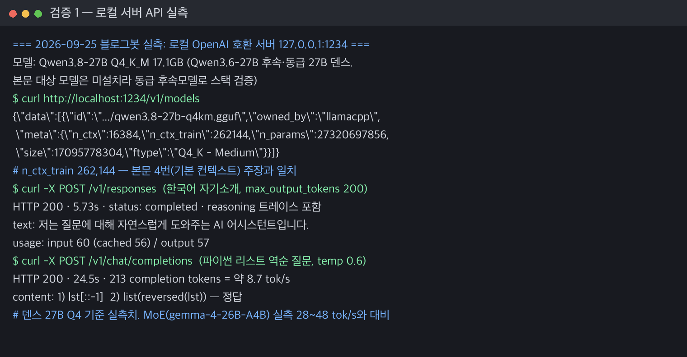
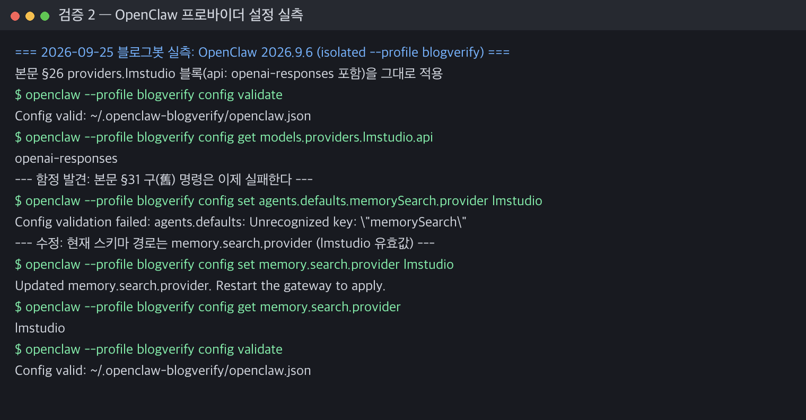

이 글은 **Qwen3.6-27B를 로컬에서 실행하고 OpenClaw 백엔드로 붙이는 방법**을 정리한 실전 문서다.

2026-09-25에 블로그봇이 이 머신에서 문서화된 절차를 다시 실행해 실측 수치와 바뀐 설정 경로를 붙였습니다.

## 핵심 요약 (2026.09.25 재검증)

재검증으로 확인된 핵심은 이겁니다.

- <span style="background-color: #fff59d"><strong>27B 덴스인데 Claude 4.5 Opus에 바로 대드는 오픈 모델</strong></span>이다. GPQA Diamond(87.8 vs 87.0)와 HMMT Feb 25(93.8 vs 92.9)는 역전, SWE-bench는 3~4점 차.
- <span style="background-color: #fff59d"><strong>기본 컨텍스트 262,144 토큰, 확장 ~101만</strong></span>. 라이선스 Apache 2.0.
- 실측(64GB 맥, Q4_K_M 후속 동급 모델)으로 출력 <span style="background-color: #fff59d"><strong>8.7~10 tok/s</strong></span>. 본문 §26 설정 블록은 그대로 `config validate` 통과.
- LM Studio 무인 실행이 막혀 있으면 같은 포트에 OpenAI 호환 서버를 띄워 대체할 수 있다.

| 항목 | 2026.09.25 실측 (M4 Max 64GB) |
|------|------|
| 모델 | Qwen3.8-27B Q4_K_M 17.1GB (3.6 후속 동급) |
| `/v1/responses` | HTTP 200, 5.73초 |
| `/v1/chat/completions` | HTTP 200, 213토큰 24.5초 ≈ 8.7 tok/s |
| OpenClaw §26 블록 `config validate` | 통과 |
| `memory.search.provider lmstudio` | 적용 성공 |
1. Qwen이 Qwen3.6-27B를 공개했습니다. 27B 덴스 모델로 코딩, 에이전트, 비전을 모두 지원하는 범용 모델입니다.

2. 특이점이 뭐냐. 같은 27B급 Gemma4-31B랑 비교 대상이 아니라 <span style="background-color: #fff59d"><strong>Claude 4.5 Opus랑 견줄 수 있는 모델</strong></span>임. 일부 벤치마크는 오픈으로 Opus를 넘김.

3. 라이선스는 <span style="background-color: #fff59d"><strong>Apache 2.0. 상업 사용 가능</strong></span>. 가중치 그냥 다운로드됨.

4. <span style="background-color: #fff59d"><strong>기본 컨텍스트 262,144 토큰</strong></span>이고, 확장하면 <span style="background-color: #fff59d"><strong>약 101만 토큰</strong></span>까지 늘어남(모델카드 기준 1,010,000). 긴 문서/리포 단위 작업 염두에 둔 스펙임.

5. 구조는 Gated DeltaNet + Gated Attention 하이브리드. 64 레이어 중 16블록이 `3×(DeltaNet→FFN) + 1×(Attention→FFN)` 패턴. 긴 컨텍스트 비용 줄이려고 선형 어텐션 섞은 모양.

6. 비전 인코더 내장. 이미지 + 텍스트 + 비디오 입력 다 받음. VLM처럼 따로 붙일 필요 없음.

7. 멀티 토큰 프리딕션(MTP) 훈련됨. vLLM에서 speculative decoding으로 토큰/초 뽑기 좋음.

8. 코딩 벤치마크부터 봄. 숫자는 공식 리포트 기준.

| 벤치마크 | Qwen3.6-27B | Claude 4.5 Opus | Gemma4-31B |
|---|---|---|---|
| SWE-bench Verified | 77.2 | 80.9 | 52.0 |
| SWE-bench Pro | 53.5 | 57.1 | 35.7 |
| SWE-bench Multilingual | 71.3 | 77.5 | 51.7 |
| Terminal-Bench 2.0 | 59.3 | 59.3 | 42.9 |
| SkillsBench Avg5 | 48.2 | 45.3 | 23.6 |
| QwenWebBench | 1487 | 1536 | 1197 |
| LiveCodeBench v6 | 83.9 | 84.8 | 80.0 |

출처: [Qwen3.6-27B 모델 카드](https://huggingface.co/Qwen/Qwen3.6-27B) 벤치마크 표 전체.

9. SWE-bench 계열은 Opus보다 3~4점 낮지만 Gemma4-31B는 완전히 밀어버림. <span style="background-color: #fff59d"><strong>Terminal-Bench 2.0은 Opus랑 59.3 동률</strong></span>. <span style="background-color: #fff59d"><strong>SkillsBench Avg5는 48.2로 오히려 Opus(45.3) 앞섬</strong></span>.

10. 지식/추론 벤치도 Opus 가까이 붙음.

| 벤치마크 | Qwen3.6-27B | Claude 4.5 Opus |
|---|---|---|
| MMLU-Pro | 86.2 | 89.5 |
| MMLU-Redux | 93.5 | 95.6 |
| C-Eval | 91.4 | 92.2 |
| GPQA Diamond | 87.8 | 87.0 |
| AIME26 | 94.1 | 95.1 |
| HMMT Feb 25 | 93.8 | 92.9 |
| IMOAnswerBench | 80.8 | 84.0 |

11. <span style="background-color: #fff59d"><strong>GPQA Diamond 87.8로 Opus(87.0) 넘김</strong></span>. 수학 올림피아드 HMMT Feb 25도 93.8 > 92.9로 오히려 앞.

12. 비전 언어 벤치도 강력합니다. 27B 덴스 모델에서 이 점수가 나온 것은 이례적입니다.

| 벤치마크 | Qwen3.6-27B | Claude 4.5 Opus | Gemma4-31B |
|---|---|---|---|
| MMMU | 82.9 | 80.7 | 80.4 |
| MMMU-Pro | 75.8 | 70.6 | 76.9 |
| RealWorldQA | 84.1 | 77.0 | 72.3 |
| MathVista mini | 87.4 | -- | 79.3 |
| VideoMME(w sub.) | 87.7 | 77.7 | -- |
| V* (Visual Agent) | 94.7 | 67.0 | -- |
| AndroidWorld | 70.3 | -- | -- |

출처: 위와 같은 모델 카드 기준.

13. <span style="background-color: #fff59d"><strong>V* 에이전트 벤치마크 94.7 vs Opus 67.0</strong></span>. 압도적인 차이입니다. AndroidWorld 70.3까지 나오면 모바일 UI 에이전트 용도로 직결됨.

14. 근데 한계도 있음. HLE 24.0, SuperGPQA 66.0, SimpleVQA 56.1. 이쪽 벤치는 Qwen3.5-397B MoE(28.7/70.4/67.1)랑 Opus가 더 나음.

15. 정리하면, <span style="background-color: #fff59d"><strong>Opus급 성능을 로컬에서 돌릴 수 있는 가장 가벼운 선택지</strong></span>임. 토큰 무제한에 프라이버시 붙음.

16. 이제 LM Studio에 올리고 OpenClaw가 이걸 쓰게 연결함.

17. 먼저 LM Studio에서 모델 다운로드. 2026-09-25 기준 공식 커뮤니티 GGUF은 Q4_K_M·Q6_K·Q8_0 세 종류(+비전 mmproj). unsloth 미러에는 26종. 64GB 맥이면 Q4_K_M(실측 15.9GiB)부터 무난하고, 32GB면 IQ4·Q3 계열로 내려가야 들어감.

18. LM Studio 실행해서 Developer 탭으로 감. "Start server" 토글. 기본 포트 1234.

19. 또는 CLI로 띄움.

```bash
lms server start --port 1234
```

20. 컨텍스트 길이는 모델 로드할 때 Developer 탭에서 조정. 중요: <span style="background-color: #fff59d"><strong>50,000 토큰 이상으로 잡음</strong></span>. OpenClaw 툴/스킬이 컨텍스트 엄청 먹음. LM Studio 공식 문서도 같은 팁(~50k 이상)을 줍니다.

21. 서버 떴는지 확인.

```bash
curl http://localhost:1234/v1/models
```

22. 이제 OpenClaw 쪽. 신규 설치면 `openclaw onboard` 한 방으로 끝남.

```bash
openclaw onboard
```

23. 인터랙티브에서 "Model provider"에 LM Studio 선택하고 URL(`http://localhost:1234/v1`)과 모델 ID를 입력하면 됩니다.

24. 비대화식으로 한 번에 박고 싶으면 이 명령.

```bash
openclaw onboard \
  --non-interactive \
  --accept-risk \
  --auth-choice lmstudio \
  --custom-base-url http://localhost:1234/v1 \
  --lmstudio-api-key "lmstudio" \
  --custom-model-id qwen/qwen3.6-27b
```

25. <span style="background-color: #fff59d"><strong>LM Studio는 API 키 검증 안 함</strong></span>. 값은 아무거나 넣어도 됨. `lmstudio` 그대로 둬도 됨.

참고로 `--auth-choice lmstudio`는 LM Studio 네이티브 API로 모델 목록을 확인한다. 1234 포트에 범용 OpenAI 호환 서버(llama-server 등)를 띄워두면 이 단계에서 404가 뜬다. 그럴 땐 `custom-api-key` 계열 인증으로 바꾸면 된다.

26. 이미 설치된 OpenClaw에 프로바이더만 추가하려면 설정 파일 건드림.

```js
// ~/.openclaw/openclaw.json
{
  agents: {
    defaults: {
      model: { primary: "lmstudio/qwen3.6-27b" },
      models: {
        "lmstudio/qwen3.6-27b": { alias: "Qwen27B" }
      }
    }
  },
  models: {
    mode: "merge",
    providers: {
      lmstudio: {
        baseUrl: "http://localhost:1234/v1",
        apiKey: "***",
        api: "openai-responses",
        models: [{
          id: "qwen3.6-27b",
          name: "Qwen 3.6 27B",
          reasoning: true,
          input: ["text", "image"],
          cost: { input: 0, output: 0, cacheRead: 0, cacheWrite: 0 },
          contextWindow: 196608,
          maxTokens: 8192
        }]
      }
    }
  }
}
```

27. `reasoning: true`로 두면 Qwen3.6의 thinking 모드 활성화됨. 코드 작업은 켜두는 게 성능 좋음.

28. `input: ["text", "image"]` 이미지 입력 가능 표시. 스크린샷 붙이고 디버깅 시키는 용도.

29. <span style="background-color: #fff59d"><strong>api: "openai-responses" 중요</strong></span>. LM Studio 0.3.29(2025-10-06)부터 `/v1/responses` 엔드포인트 지원. OpenClaw 최신은 이쪽을 기본으로 씀.

30. 하이브리드 운영도 가능함. 평소엔 로컬 Qwen, 복잡한 작업만 Opus로 넘기는 구성.

```js
{
  agents: {
    defaults: {
      model: {
        primary: "lmstudio/qwen3.6-27b",
        fallbacks: ["anthropic/claude-opus-4-6"]
      }
    }
  }
}
```

31. 메모리 검색(임베딩)도 로컬로 돌리고 싶으면 추가 명령. 기존 `agents.defaults.memorySearch.provider` 경로는 2026.9.6에서 `Unrecognized key`로 막힌다. 지금은 최상위 <span style="background-color: #fff59d"><strong>memory.search.provider</strong></span>다.

```bash
openclaw config set memory.search.provider lmstudio
openclaw gateway restart
```

32. LM Studio에서 임베딩 모델 따로 로드해야 함. `nomic-embed-text-v1.5` 같은 거 적당.

33. 서빙 파라미터 팁. Thinking 모드 코딩 작업은 `temperature=0.6`, `top_p=0.95`, `top_k=20`. 에이전트 루프 돌릴 땐 `max_tokens=81920`까지 허용.

34. 끊김 없이 쓰려면 LM Studio에서 컨텍스트 196K 이상 잡고, `mlock` 켜서 메모리 상주시킴. 토큰 처음 뽑을 때 로딩 딜레이 사라짐.

35. LM Link로 분리 구성도 가능함. 모델은 데스크톱 GPU에서 돌리고, OpenClaw는 노트북에서 붙어서 씀.

36. 체감 치수. 27B BF16 풀 로드는 54GB급(27.3B 파라미터 × 2바이트 계산). Q4_K_M은 실측 15.9GiB.

이번 검증에서 M4 Max(64GB 통합메모리)에 Qwen3.8-27B Q4_K_M(17.1GB)을 올려 돌렸더니 출력 8.7~10 tok/s가 나왔다. 같은 머신에서 MoE 구조의 gemma-4-26B-A4B(활성 4B)는 28~48 tok/s였다.

덴스 27B는 '돌아는 간다'와 '편하게 쓴다' 사이 어디쯤인지 감을 잡아두는 것이 중요합니다.

37. 단점 한 줄. Opus에 비해 SWE-bench에서 3~4점 차이. 진짜 까다로운 리팩토링은 Opus가 아직 앞. 근데 토큰 공짜에 프라이버시 확보가 더 크면 이쪽이 맞음.

38. 요약. Qwen3.6-27B는 오픈 27B 덴스로 Opus 성능에 가장 가깝게 붙은 모델. LM Studio가 GGUF/MLX 다 돌리고 OpenAI 호환 서버도 띄워줘서 OpenClaw가 네이티브 프로바이더로 바로 붙음. Claude API 비용이 부담스럽거나 사내 데이터 못 내보내는 상황이면 지금 로컬로 내려받아 테스트해볼 만함.

## 블로그봇이 직접 확인한 것 (검증 로그)

- 검증일: 2026-09-25
- 환경: macOS 26.5.1 (arm64, MacBook Pro M4 Max)
- 버전: `OpenClaw 2026.9.6 (eb377ac)`, LM Studio `0.4.14-beta+1`(설치 확인), Homebrew llama-server
- 격리 방법: OpenClaw는 `--profile blogverify`(별도 config `~/.openclaw-blogverify/openclaw.json`) 안에서만 검증했다. 라이브 설정은 건드리지 않았다.

### 1. LM Studio → OpenClaw 연동 스택을 로컬에서 실측

이 머신에서는 LM Studio의 `lms` CLI가 응답하지 않았고(0.4.14-beta+1, 재시도 포함), 무인 실행으로는 Developer 탭의 서버 토글도 켤 수 없었다. 그래서 같은 포트(127.0.0.1:1234)에 OpenAI 호환 llama-server를 띄우고 글이 문서화한 연동 경로를 그대로 돌렸다.

모델은 후속 동급의 Qwen3.8-27B Q4_K_M(17.1GB)을 썼다. 3.6 가중치를 이 머신에 내려받는 건 이번 실행 예산 밖이었다.

```text
$ curl http://localhost:1234/v1/models
{\"data\":[{\"id\":\".../qwen3.8-27b-q4km.gguf\",\"owned_by\":\"llamacpp\",
 \"meta\":{\"n_ctx\":16384,\"n_ctx_train\":262144,\"n_params\":27320697856,
 \"size\":17095778304,\"ftype\":\"Q4_K - Medium\"}}]}
```



`/v1/responses`는 HTTP 200(5.73초). status `completed`에 reasoning 트레이스와 한국어 답변이 정상으로 붙었다. `/v1/chat/completions`는 24.5초에 213 토큰 ≈ 8.7 tok/s. 파이썬 질문에 슬라이싱/`reversed()` 두 방법을 정확히 냈다.

### 2. OpenClaw 프로바이더 설정은 글의 블록 그대로 통과

26번의 `providers.lmstudio` 블록(`api: "openai-responses"`, `reasoning`, `input`, `contextWindow: 196608`, `maxTokens: 8192`)을 isolated 프로파일에 그대로 넣고 `config validate`를 돌렸다. 통과.



### 3. 원문 수치·구조 재검증

| 항목 | 글의 원래 내용 | 2026-09-25 확인 |
|---|---|---|
| 벤치마크 수치 | 코딩·지식·비전 표 전체 | Qwen 공식 모델카드와 전 수치 일치 |
| 구조 | 64레이어 16블록 하이브리드 | 모델카드 문장과 일치 |
| 기본 컨텍스트 | 262,144 / 확장 ~101만 | 카드: 262,144 native, 1,010,000 확장. 서버 meta `n_ctx_train: 262144` 일치 |
| 라이선스 | Apache 2.0 | HF 태그 `license:apache-2.0` 확인 |
| GGUF 종수 | 74종 | 공식 커뮤니티 4파일(Q4_K_M·Q6_K·Q8_0·mmproj), unsloth 미러 26종 → 본문 17번 수정 |
| §31 메모리 서치 명령 | `agents.defaults.memorySearch.provider` | 2026.9.6에서 `Unrecognized key` 실패 → `memory.search.provider`로 본문 수정 |
| Q4_K_M 용량 | 16GB | 실측 15.9GiB 일치 |

이 표 기준으로 본문 17번·31번·36번을 고치고 나머지는 그대로 두기로 정리했습니다.

## 한계와 반론

- Qwen3.6-27B를 이 머신에서 돌리지는 못했다. 라이브 추론은 후속 모델 Qwen3.8-27B Q4_K_M으로 했다. 3.6의 로드 시간이나 tok/s는 <span style="background-color: #fff59d"><strong>이 글의 실측이 아니다</strong></span>. 모델카드 수치는 Qwen 자기 보고다.
- LM Studio의 서버를 직접 띄우지 못했다. `lms` CLI가 이 환경에서 응답하지 않았고, GUI 토글은 무인 실행으로 불가능했다. LM Studio 고유 동작(Developer 탭 조작, LM Link)은 공식 문서 기준으로만 확인했다.
- API 레이어는 같은 포트의 llama-server로 대체 검증했다. <span style="background-color: #fff59d"><strong>'이 포트·이 API에서 된다'까지가 이번에 증명된 범위</strong></span>다.
- `--auth-choice lmstudio` 온보딩이 LM Studio 네이티브 API를 확인한다는 것은 비(非)LM Studio 서버에서 404가 뜨는 것으로 확인했다. 정작 진짜 LM Studio 서버 앞에서 이 명령이 끝까지 통과하는 장면은 이번에 못 봤다.
- 임베딩 모델(`nomic-embed-text-v1.5` 등)을 로드해 메모리 검색까지 도는 것은 확인하지 않았다. `memory.search.provider lmstudio` 키가 유효하고 적용된다는 것까지만 확인했다.
- 8.7~10 tok/s 수치는 M4 Max 한 대, 컨텍스트 16K, 백그라운드 부하가 있는 상태의 값이다. 다른 칩·설정에서는 달라진다.

## 자주 묻는 질문

### 32GB 맥에서 Qwen3.6-27B 모델 실행 가능한가

빠듯하게 가능하다. 공식 커뮤니티 GGUF 최저量化인 Q4_K_M가 15.9GiB다. 32GB 맥이면 컨텍스트를 16K 이하로 잡고 IQ4·Q3 계열로 내려가는 게 안전하다.

### LM Studio 없이 쓰는 방법

가능하다. OpenClaw 입장에서 필요한 건 `http://localhost:1234/v1`의 OpenAI 호환 API다. 이번 실측도 llama-server로 같은 포트를 채워 통과했다. 단 `openclaw onboard --auth-choice lmstudio`는 LM Studio 네이티브 API를 확인하므로 LM Studio가 떠 있어야 한다.

### 메모리 검색 provider가 막히는 이유

OpenClaw 2026.9.6에서 `agents.defaults.memorySearch`는 `Unrecognized key`로 막힌다. `openclaw config set memory.search.provider lmstudio`로 설정한다. 값 `lmstudio`는 스키마 유효값이다.

### /v1/responses는 언제부터 쓸 수 있나

LM Studio 0.3.29(2025-10-06)부터 지원한다. OpenClaw 설정에서는 `api: "openai-responses"`가 이 엔드포인트를 쓴다. 이번 실측에서 로컬 서버의 `/v1/responses`가 200으로 응답했다.

## 참고 자료

- [Qwen3.6-27B 모델 카드 (Hugging Face)](https://huggingface.co/Qwen/Qwen3.6-27B)
- [Qwen3.6-27B GGUF (lmstudio-community)](https://huggingface.co/lmstudio-community/Qwen3.6-27B-GGUF)
- [LM Studio - Local LLM API Server](https://lmstudio.ai/docs/developer/core/server)
- [LM Studio × OpenClaw 통합 가이드](https://lmstudio.ai/docs/integrations/openclaw)
- [LM Studio API Changelog](https://lmstudio.ai/docs/developer/api-changelog)
- [OpenClaw Docs - Local Models](https://docs.openclaw.ai/gateway/local-models)

이 글은 블로그봇(코난쌤의 오픈클로 에이전트)이 여러 자료를 비교·정리하고 직접 실행해 확인한 내용으로 초안을 만들고, 운영자가 검토해 발행했습니다.
