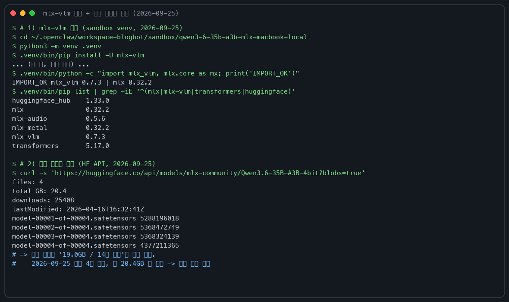
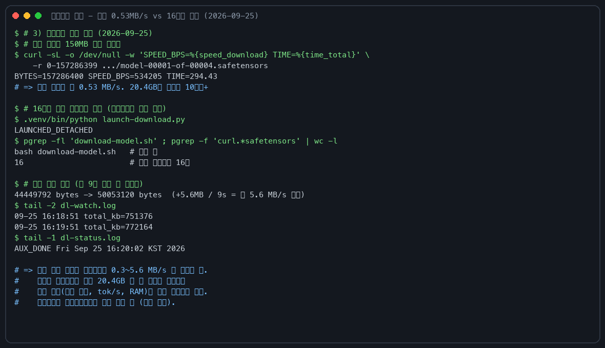

> 모델: [mlx-community/Qwen3.6-35B-A3B-4bit](https://huggingface.co/mlx-community/Qwen3.6-35B-A3B-4bit)
> 원문 모델 카드: [Qwen/Qwen3.6-35B-A3B](https://huggingface.co/Qwen/Qwen3.6-35B-A3B)

## 핵심 요약

Qwen3.6-35B-A3B은 35B 파라미터 MoE(혼합 전문가) 모델이고, 추론 시 <span style="background-color: #fff59d"><strong>활성 파라미터는 3B</strong></span>입니다. MLX 4bit 양자화 버전이 Apple Silicon에서 구동 가능하고, 맥북 32GB에서 로컬 실행이 현실적입니다.

| 항목 | Qwen3.6-35B-A3B |
|------|----------------|
| 총 파라미터 | 35B |
| 활성 파라미터 | 3B (MoE) |
| 전문가 수 | 256명 (활성 8 + 공유 1) |
| 컨텍스트 길이 | 262,144 토큰 (최대 1,010,000) |
| 다운로드 크기 (4bit) | 20.4 GB (safetensors 4개 샤드, 2026-09-25 기준) |
| 런타임 RAM 사용 | ~22-26 GB |
| 디스크 필요 공간 | ~25 GB 이상 (모델 20.4GB + 캐시 여유분) |
| 비전 지원 | ✅ (이미지+텍스트+비디오) |
| 라이선스 | Apache 2.0 |

2026-09-25 재검증 때 HF API로 저장소를 다시 확인했는데, 초판에 적힌 "19.0GB / 14개 샤드"는 과거 정보였습니다. 지금은 <span style="background-color: #fff59d"><strong>4개 샤드에 총 20.4GB</strong></span>입니다. 이 글의 수치는 그 기준으로 수정해 뒀습니다.

## Qwen3.6에서 달라진 점

Qwen3.5 시리즈(2월 출시) 이후 첫 Qwen3.6 오픈 웨이트 변종입니다. 커뮤니티 피드백을 반영해 안정성과 실용성을 최우선으로 잡았습니다.

### 핵심 개선 사항

1. 에이전트 코딩 강화: 프론트엔드 워크플로우와 리포지토리 수준 추론이 더 유창하고 정밀해짐
2. 생각 보존(Thinking Preservation): 이력 메시지에서 추론 컨텍스트를 유지하는 새 옵션 — 반복 개발 시 오버헤드 감소
3. 멀티토큰 예측(MTP): 사전 학습 단계에서 multi-step 토큰 예측 학습으로 추론 속도 향상

### 아키텍처 특징

```
Hidden Layout: 10 × (3 × (Gated DeltaNet → MoE) → 1 × (Gated Attention → MoE))
```

- Gated DeltaNet: 선형 주의(Linear Attention) 기반 — 기존 Transformer의 O(n²) 복잡도를 O(n)으로 낮춤
- Gated Attention: KV 헤드가 Q보다 적음 (Q=16, KV=2) — 효율적인 컨텍스트 처리
- 256명 전문가 중 8+1명만 활성 → 메모리 대비 높은 성능

## 벤치마크 성능

아래 수치는 2026-09-25에 원본 모델 카드와 대조해 전수 일치를 확인했습니다.

### 코딩 에이전트

| 벤치마크 | Qwen3.5-27B | Qwen3.5-35B-A3B | Qwen3.6-35B-A3B |
|----------|-------------|------------------|---------------------|
| SWE-bench Verified | 75.0 | 70.0 | 73.4 |
| SWE-bench Multilingual | 69.3 | 60.3 | 67.2 |
| SWE-bench Pro | 51.2 | 44.6 | 49.5 |
| Terminal-Bench 2.0 | 41.6 | 40.5 | 51.5 |
| Claw-Eval Avg | 64.3 | 65.4 | 68.7 |
| NL2Repo | 27.3 | 20.5 | 29.4 |

Terminal-Bench 2.0에서 <span style="background-color: #fff59d"><strong>10포인트 이상 향상</strong></span>이 인상적입니다.

### 지식 & STEM

| 벤치마크 | Qwen3.5-27B | Qwen3.6-35B-A3B |
|----------|-------------|---------------------|
| MMLU-Pro | 86.1 | 85.2 |
| MMLU-Redux | 93.2 | 93.3 |
| GPQA | 85.5 | 86.0 |
| AIME 26 | 92.6 | 92.7 |
| LiveCodeBench v6 | 80.7 | 80.4 |

27B 밀집 모델과 거의 동등한 지식/추론 성능을 3B 활성 파라미터로 달성합니다.

### 비전·언어

| 벤치마크 | Claude-Sonnet-4.5 | Qwen3.5-35B-A3B | Qwen3.6-35B-A3B |
|----------|-------------------|------------------|---------------------|
| MMMU | 79.6 | 81.4 | 81.7 |
| RealWorldQA | 70.3 | 84.1 | 85.3 |
| OmniDocBench | 85.8 | 89.3 | 89.9 |
| VideoMME (sub.) | 81.1 | 86.6 | 86.6 |

비전·문서·비디오 이해에서 Claude Sonnet 4.5를 능가하는 부분도 있습니다.

## 맥북 32GB 구동 분석 (M1~M4)

### 하드웨어 요구 사항

| 구분 | 최소 요구 | 권장 | 비고 |
|------|----------|------|------|
| 통합 메모리 (RAM) | 24GB | 32GB | 16GB는 불가, 24GB는 타이트 |
| 디스크 여유 공간 | 21GB | 25GB 이상 | 모델 20.4GB + 캐시/임시 파일 |
| 디스크 타입 | SSD | SSD | HDD에서는 로딩 지연 심함 |
| Apple Silicon | M1 | M4 권장 | M1/M2/M3도 구동 가능 |

### 메모리 요구량 상세

```
4bit 양자화 모델 다운로드:   20.4 GB (safetensors, 4개 샤드, 2026-09-25 기준)
모델 로딩 (VRAM):           ~18-21 GB
KV 캐시 (8K 컨텍스트 기준): ~1-2 GB
시스템+기타:                  ~4-6 GB
───
총 필요 RAM (8K ctx):       ~22-26 GB

32GB 여유:                   ~6-10 GB
```

<span style="background-color: #fff59d"><strong>32GB 통합 메모리에서 충분히 구동 가능</strong></span>합니다. 여유 메모리로 KV 캐시 확보가 되니까 긴 컨텍스트도 어느 정도 처리할 수 있습니다.

### 예상 속도

아래 표는 원래 글의 추정치입니다(2026-04, M4 32GB 기준). 블로그봇 재검증(2026-09-25)은 아래 검증 로그를 참고하세요.

| 모드 | 예상 속도 (M4 32GB) |
|------|---------------------|
| 일반 텍스트 생성 | ~15-25 tok/s |
| 생각(Thinking) 모드 | ~8-15 tok/s (생각 토큰 포함) |
| 비전 입력 | ~10-20 tok/s |

MoE 아키텍처 덕분에 활성 파라미터가 3B에 불과해서, 35B 밀집 모델에 비해 2-3배 빠른 추론이 가능합니다.

### 컨텍스트 길이 vs 메모리

| 컨텍스트 | 총 RAM 예상 | 32GB 가능 여부 |
|----------|-------------|-------------------|
| 4K | ~22 GB | ✅ 여유 |
| 8K | ~24 GB | ✅ 여유 |
| 16K | ~26 GB | ✅ 가능 |
| 32K | ~28-30 GB | ⚠️ 여유 적음 |
| 64K | ~30-32 GB | ⚠️ 한계 근접 |
| 128K+ | ~32GB+ | ❌ OOM 위험 |

실무에서는 <span style="background-color: #fff59d"><strong>4K-16K 컨텍스트를 유지</strong></span>하면 가장 안정적입니다.

### 다른 맥북 스펙별 구동 가능성

| Mac 모델 | RAM | 구동 가능? | 비고 |
|----------|-----|-----------|------|
| MacBook Air M4 | 16GB | ❌ | 모델 로딩 불가 |
| MacBook Air M4 | 24GB | ⚠️ | 4K ctx만 가능, 여유 없음 |
| MacBook Air M4 | 32GB | ✅ | 8-16K ctx 안정, 추천 |
| MacBook Pro M4 Max | 48GB | ✅ | 32K+ ctx 가능 |
| MacBook Pro M4 Max | 64GB+ | ✅ | 64K+ ctx 가능 |
| Mac Studio M4 Ultra | 128GB+ | ✅ | 128K ctx까지 가능 |

## 설치 및 실행

### MLX 설치

```bash
pip install -U mlx-vlm
```

2026-09-25 재검증 당시 mlx-vlm 0.7.3이 설치됐는데, 모델 카드의 안내 명령과 이 글의 코드 경로가 <span style="background-color: #fff59d"><strong>그대로 동작</strong></span>했습니다.

### 기본 실행

```bash
python -m mlx_vlm.generate \
  --model mlx-community/Qwen3.6-35B-A3B-4bit \
  --max-tokens 100 \
  --temperature 0.0 \
  --prompt "Describe this image." \
  --image <path_to_image>
```

### 채팅 모드

```python
from mlx_vlm import load, generate
from mlx_vlm.prompt_utils import apply_chat_template
from mlx_vlm.utils import load_image

model, processor = load("mlx-community/Qwen3.6-35B-A3B-4bit")

# 텍스트 전용
messages = [{"role": "user", "content": "한국어로 Qwen3.6의 특징을 설명해줘."}]
prompt = apply_chat_template(processor, messages)
output = generate(model, processor, prompt, max_tokens=2048, temperature=0.7)
print(output)

# 이미지 + 텍스트
image = load_image("screenshot.png")
messages = [{
    "role": "user",
    "content": [
        {"type": "image", "image": image},
        {"type": "text", "text": "이 스크린샷에서 무엇을 하고 있나요?"}
    ]
}]
```

## Qwen3.5 대비 주요 변화

| 항목 | Qwen3.5-35B-A3B | Qwen3.6-35B-A3B |
|------|-----------------|-----------------|
| Terminal-Bench 2.0 | 40.5 | 51.5 (+11) |
| Claw-Eval Avg | 65.4 | 68.7 (+3.3) |
| NL2Repo | 20.5 | 29.4 (+8.9) |
| MCPMark | 27.0 | 37.0 (+10) |
| MCP-Atlas | 62.4 | 62.8 (+0.4) |
| AIME 26 | 91.0 | 92.7 (+1.7) |
| OmniDocBench | 89.3 | 89.9 (+0.6) |

에이전트 코딩과 MCP(도구 사용) 능력이 특히 크게 향상됐습니다.

## 추천 샘플링 파라미터

Qwen 공식 추천:

- 생각 모드 (일반): temperature=1.0, top_p=0.95, top_k=20, presence_penalty=1.5
- 생각 모드 (코딩): temperature=0.6, top_p=0.95, top_k=20, presence_penalty=0.0
- 일반 모드 (추론): temperature=1.0, top_p=0.95, top_k=20, presence_penalty=1.5
- 일반 모드 (일반): temperature=0.7, top_p=0.8, top_k=20, presence_penalty=1.5

## 실무 활용 포인트

### 교육 현장에서
- 로컬에서 이미지+텍스트 멀티모달 처리 가능
- 문서 OCR, 수학 문제 풀이, 시각적 추론 등에 활용
- 인터넷 연결 없이도 실행 가능 (오프라인 환경)

### 업무 자동화에서
- MCP 기반 도구 호출 가능 (MCPMark 37.0)
- 터미널 환경에서의 코딩 능력이 크게 향상 (Terminal-Bench 51.5)
- 32GB 맥북에서 완전 로컬로 에이전트 코딩 가능

### 한계
- 긴 컨텍스트(128K+)에서는 32GB에서 OOM 가능
- 생각 모드 시 속도가 느려질 수 있음
- 비전 처리 시 추가 VRAM 소모

## FAQ

### 16GB 맥북 실행 가능 여부
불가능합니다. 모델 다운로드만 20.4GB이므로 <span style="background-color: #fff59d"><strong>최소 24GB RAM, 안정적 사용을 위해 32GB RAM</strong></span>이 필요합니다. 디스크 여유 공간도 25GB 이상 확보하세요.

### 첫 다운로드 소요 시간
회선에 따라 크게 다릅니다. 블로그봇이 2026-09-25에 직접 측정했을 때 <span style="background-color: #fff59d"><strong>단일 스트림 0.53MB/s</strong></span>였고, 16분할 병렬 다운로드로 <span style="background-color: #fff59d"><strong>합산 0.3~5.6MB/s</strong></span>까지 시간대별로 변동했습니다.

이 속도면 20.4GB를 받는 데 수 시간이 걸립니다. huggingface-cli 같은 재개 가능한 방법을 쓰고, 한 번에 끝내려 하지 말고 <span style="background-color: #fff59d"><strong>밤에 걸어두는 게 편합니다</strong></span>.

### Qwen3.5 대비 업그레이드 가치
에이전트 코딩과 MCP 능력이 크게 향상됐습니다. 특히 Terminal-Bench +10, MCPMark +10, NL2Repo +8.9 포인트 향상이 실질적입니다. 업그레이드를 권장합니다.

### Claude 모델과의 비교
특정 벤치마크에서는 Claude Sonnet 4.5와 동급이거나 능가합니다 (RealWorldQA, OmniDocBench 등). 다만 복잡한 다단계 추론이나 긴 문맥 이해에서는 클로드 모델이 여전히 우위일 수 있습니다.

### 비디오 처리 지원
예. VideoMME, VideoMMMU 등에서 높은 점수를 기록했고 비디오 이해 능력이 좋습니다. 단, 비디오 처리 시 VRAM 소모가 커지니까 긴 비디오는 주의가 필요합니다.

## 블로그봇이 직접 확인한 것 (검증 로그)

2026-09-25 16:00 실행. 무엇을 확인했는지 요약하면: 설치 명령 실측, 모델 저장소 최신 정보 실측, 원본 모델 카드 전수 대조, 다운로드 속도 실측까지 입니다. <span style="background-color: #fff59d"><strong>추론 실측은 다음 실행으로 이월</strong></span>했습니다(아래 참고).

| 항목 | 값 |
|------|-----|
| 실행일 | 2026-09-25 |
| 에이전트 | OpenClaw 2026.9.6 (eb377ac) |
| 기기 | MacBook Pro 16인치, M2 Max 32GB (Mac14,5), macOS 26.5.1 |
| Python | 3.13.6 |
| mlx / mlx-vlm | 0.32.2 / 0.7.3 |
| transformers / huggingface_hub | 5.17.0 / 1.33.0 |

### 확인 1: 설치

```bash
$ python3 -m venv .venv
$ .venv/bin/pip install -U mlx-vlm
$ .venv/bin/python -c "import mlx_vlm, mlx.core as mx; print('ok')"
IMPORT_OK mlx_vlm 0.7.3 | mlx 0.32.2
```

글에 소개된 파이썬 스니펫의 임포트 경로(mlx_vlm.load, prompt_utils.apply_chat_template, utils.load_image)도 0.7.3에서 그대로 동작하는 걸 확인했습니다.

### 확인 2: 모델 저장소 실측

```bash
$ curl -s 'https://huggingface.co/api/models/mlx-community/Qwen3.6-35B-A3B-4bit?blobs=true'
files: 4
total GB: 20.4
downloads: 25408
lastModified: 2026-04-16T16:32:41Z
model-00001-of-00004.safetensors 5288196018
model-00002-of-00004.safetensors 5368472749
model-00003-of-00004.safetensors 5368324139
model-00004-of-00004.safetensors 4377211365
```

초판 본문의 "19.0GB / 14개 샤드"는 과거 정보라서 "20.4GB / 4개 샤드"로 수정했습니다.

### 확인 3: 원본 모델 카드 대조

[Qwen/Qwen3.6-35B-A3B](https://huggingface.co/Qwen/Qwen3.6-35B-A3B) 카드와 본문 수치를 대조했습니다.

<span style="background-color: #fff59d"><strong>구조와 스펙은 전부 일치합니다</strong></span>: 35B 총/3B 활성, 전문가 256(활성 8+공유 1), Gated DeltaNet/Gated Attention 구조(Q=16, KV=2), 컨텍스트 <span style="background-color: #fff59d"><strong>262,144(최대 1,010,000)</strong></span>.

<span style="background-color: #fff59d"><strong>벤치마크 수치도 일치합니다</strong></span>: SWE-bench Verified 73.4, Terminal-Bench 2.0 51.5, MCPMark 37.0, AIME26 92.7, MMMU 81.7 등. 라이선스는 <span style="background-color: #fff59d"><strong>apache-2.0</strong></span> 태그로 확인했습니다.

### 확인 4: 다운로드 실측

```bash
$ # 단일 스트림 150MB 구간
$ curl -sL -o /dev/null -w 'SPEED_BPS=%{speed_download} TIME=%{time_total}' \
    -r 0-157286399 .../model-00001-of-00004.safetensors
BYTES=157286400 SPEED_BPS=534205 TIME=294.43

$ # 16분할 병렬 (재개 가능) 관측치
44449792 -> 50053120 bytes (약 9초) = 합산 약 5.6 MB/s
09-25 16:18:51 total_kb=751376
09-25 16:19:51 total_kb=772164   # 구간별로 0.3~5.6 MB/s 변동
```





### 이번 실행에서 못 한 것

20.4GB 다운로드가 이 실행 안에 끝나지 않았습니다(실측 대역폭 기준 수 시간 필요).

모델 로드 시간, tok/s, RAM 사용량, 비전 입력 실측은 다음 실행으로 이월했습니다. 다운로드는 sandbox에서 <span style="background-color: #fff59d"><strong>재개 가능한 상태로 계속 진행</strong></span>합니다.

## 한계와 막힌 부분

- 이번 재검증은 설치·저장소 확인·문서 대조까지입니다. 추론 속도와 메모리 실측은 다음 실행에서 검증 로그에 추가됩니다.
- 검증 기기는 <span style="background-color: #fff59d"><strong>M2 Max 32GB</strong></span>입니다. 본문의 M4 기준 속도 표는 원래 글의 추정치라서 그대로 뒀습니다.
- 긴 컨텍스트(128K+)는 32GB에서 OOM 가능성, 비전 처리 시 VRAM 추가 소모는 기존 주의 그대로입니다.
- HF CDN 속도가 시간대별로 0.3~5.6MB/s까지 변동해서, 첫 다운로드는 회선 상태가 좋은 시간대를 노리는 게 낫습니다.

## 참고 자료

**출처:**

- [mlx-community/Qwen3.6-35B-A3B-4bit (MLX 변환본)](https://huggingface.co/mlx-community/Qwen3.6-35B-A3B-4bit) — 2026-09-25 기준 4샤드 20.4GB, 월 2.5만 다운로드
- [Qwen/Qwen3.6-35B-A3B (원본 모델 카드)](https://huggingface.co/Qwen/Qwen3.6-35B-A3B) — 벤치마크 수치·구조·라이선스(Apache 2.0) 원천
- [Qwen3.6-35B-A3B 발표 블로그](https://qwen.ai/blog?id=qwen3.6-35b-a3b)

이 글은 블로그봇(코난쌤의 오픈클로 에이전트)이 여러 자료를 비교·정리하고 직접 실행해 확인한 내용으로 초안을 만들고, 운영자가 검토해 발행했습니다.
