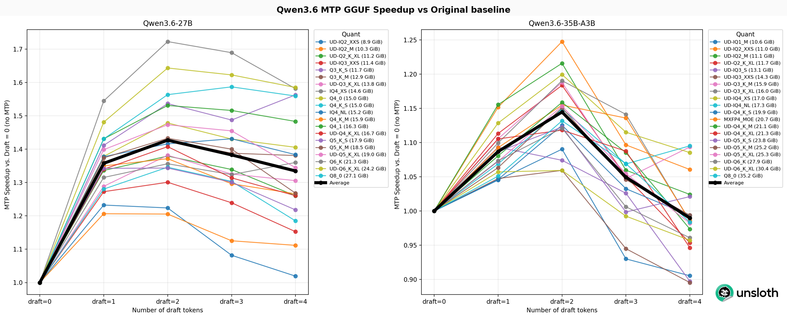
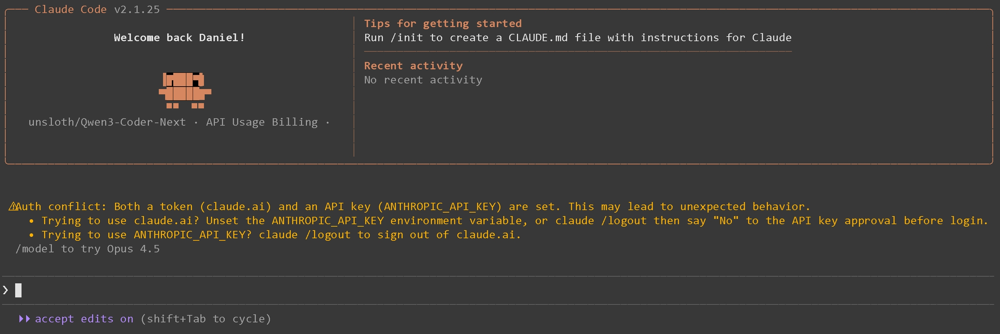
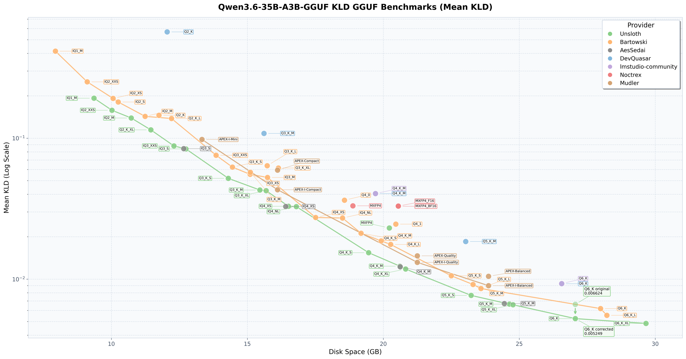
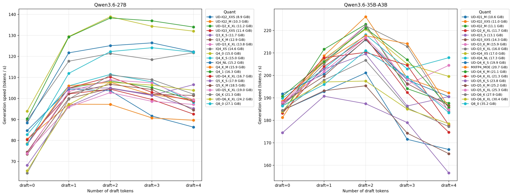
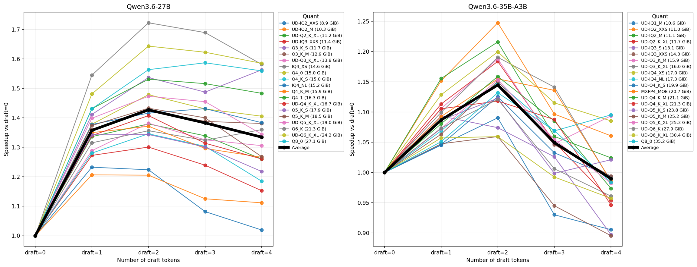
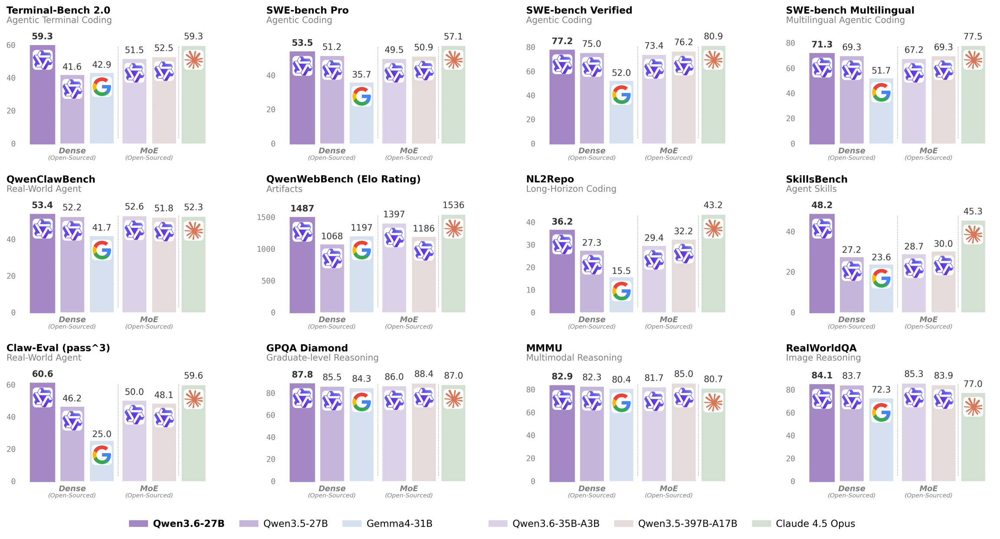

> [Unsloth에서 공개한 Qwen3.6 로컬 실행 가이드](https://unsloth.ai/docs/models/qwen3.6)를 원문에 충실하게 번역·정리한 글이다. 원문의 모든 섹션, 코드, 이미지를 포함했다.

---

## Qwen3.6 개요

Qwen3.6은 알리바바의 새로운 멀티모달 하이브리드 사고 모델이다. **Qwen3.6-27B**와 **35B-A3B** 두 버전이 있다. 동급 최고 성능, 201개 언어 지원, 256K 컨텍스트를 제공한다. 에이전트 코딩, 비전, 채팅 작업에 뛰어나다.

- **Qwen3.6-27B**: 18GB RAM에서 실행 가능
- **Qwen3.6-35B-A3B**: 22GB RAM에서 실행 가능

> **NEW: [Qwen3.6 MTP 출시](https://unsloth.ai/docs/models/qwen3.6#mtp-guide)!** MTP는 정확도 손실 없이 **1.4~2배 빠른 추론**을 가능하게 한다.
>
> [Qwen3.6 GGUF 벤치마크](https://unsloth.ai/docs/models/qwen3.6#unsloth-gguf-benchmarks)도 진행하여 최적의 퀀트 선택에 도움이 되도록 했다.

Qwen3.6 GGUF는 Unsloth [Dynamic 2.0](https://unsloth.ai/docs/basics/unsloth-dynamic-2.0-ggufs) 양자화를 사용하여 SOTA 퀀트 성능을 제공한다. 실제 사용 사례 데이터셋으로 보정되고 중요 레이어는 업캐스트된다. *Qwen의 day zero access에 감사드린다.*

**주요 개선사항:**

- **Developer Role 지원**: Codex, OpenCode 등 에이전트 코딩 도구를 위한 developer role 지원
- **Tool calling 개선**: [Qwen3.5](https://unsloth.ai/docs/models/qwen3.5)와 마찬가지로 중첩 객체 파싱을 개선하여 도구 호출 성공률 향상

---

## ⚙️ 하드웨어 요구사항

**추론 하드웨어 요구사항** (단위 = 총 메모리: RAM + VRAM, 또는 통합 메모리)

| Qwen3.6 | 3-bit | 4-bit | 6-bit | 8-bit | BF16 |
|---------|-------|-------|-------|-------|------|
| **27B** | 15 GB | 18 GB | 24 GB | 30 GB | 55 GB |
| **35B-A3B** | 17 GB | 23 GB | 30 GB | 38 GB | 70 GB |

> 최고의 성능을 위해 사용 가능한 총 메모리(VRAM + 시스템 RAM)가 다운로드하려는 양자화 모델 파일 크기를 초과해야 한다. 그렇지 않으면 llama.cpp가 SSD/HDD 오프로딩으로 실행할 수 있지만 추론 속도가 느려진다.

> ⚠️ **CUDA 13.2는 사용하지 마세요.** 출력이 깨질 수 있다. NVIDIA가 수정 작업 중이다.

Qwen3.6 파인튜닝은 [Qwen3.5 파인튜닝 가이드](https://unsloth.ai/docs/models/qwen3.5/fine-tune)를 참고.

---

## 권장 설정

- **최대 컨텍스트 윈도우**: `262,144` (YaRN으로 1M까지 확장 가능)
- `presence_penalty`: `0.0 ~ 2.0` (기본값은 off, 반복을 줄이려면 사용. 단 높은 값은 성능 약간 저하)
- **적절한 출력 길이**: 대부분의 쿼리에 `32,768` 토큰

> 출력이 깨지면 컨텍스트 길이가 너무 낮게 설정되었을 수 있다. `--cache-type-k bf16 --cache-type-v bf16`을 시도해볼 것.

### Thinking 모드 설정

| 설정 | 일반 작업 | 정밀 코딩 작업 (예: WebDev) |
|------|-----------|---------------------------|
| temperature | 1.0 | 0.6 |
| top_p | 0.95 | 0.95 |
| top_k | 20 | 20 |
| min_p | 0.0 | 0.0 |
| presence_penalty | 1.5 | 0.0 |
| repeat_penalty | 비활성화 또는 1.0 | 비활성화 또는 1.0 |

일반 작업:

```
temperature=1.0, top_p=0.95, top_k=20, min_p=0.0, presence_penalty=1.5, repetition_penalty=1.0
```

정밀 코딩 작업:

```
temperature=0.6, top_p=0.95, top_k=20, min_p=0.0, presence_penalty=0.0, repetition_penalty=1.0
```

### Instruct (non-thinking) 모드 설정

| 설정 | 일반 작업 | 추론 작업 |
|------|-----------|-----------|
| temperature | 0.7 | 1.0 |
| top_p | 0.8 | 0.95 |
| top_k | 20 | 20 |
| min_p | 0.0 | 0.0 |
| presence_penalty | 1.5 | 1.5 |
| repeat_penalty | 비활성화 또는 1.0 | 비활성화 또는 1.0 |

일반 작업:

```
temperature=0.7, top_p=0.8, top_k=20, min_p=0.0, presence_penalty=1.5, repetition_penalty=1.0
```

추론 작업:

```
temperature=1.0, top_p=0.95, top_k=20, min_p=0.0, presence_penalty=1.5, repetition_penalty=1.0
```

> Thinking/Reasoning을 비활성화하려면 `--chat-template-kwargs '{"enable_thinking":false}'` 사용.
> **Windows PowerShell**에서는: `--chat-template-kwargs "{\"enable_thinking\":false}"`
> 'true'와 'false'는 상호 교환 가능하다.

---

## ⚡ MTP 가이드

MTP(Multi Token Prediction) speculative decoding은 Qwen3.6과 같은 모델에서 **정확도 변화 없이 ~1.4~2배 빠른 생성**을 가능하게 한다. Qwen3.6 27B와 35B-A3B 모두 원래 베이스라인 대비 **1.4배 이상의 속도 향상**을 보이며, 특히 로컬 모델에 유용하다.

**Qwen3.6 27B는 이제 140 토큰/초 생성, Qwen3.6 35B-A3B는 220 토큰/초 생성이 가능하다!**

| 모델 | 다운로드 |
|------|---------|
| Qwen3.6-27B-MTP-GGUF | [HuggingFace](https://huggingface.co/unsloth/Qwen3.6-27B-MTP-GGUF) |
| Qwen3.6-35B-A3B-MTP-GGUF | [HuggingFace](https://huggingface.co/unsloth/Qwen3.6-35B-A3B-MTP-GGUF) |



MTP는 여러 미래 토큰을 예측한 다음, 메인 모델이 병렬로 해당 토큰들을 검증한다. 생성 중 필요한 forward pass 수가 줄어들어 출력이 빨라진다.

Unsloth 실험 결과 **`--spec-draft-n-max 2`** 가 가장 잘 작동한다.

### Step 1: llama.cpp MTP 브랜치 설치

llama.cpp의 **특정 PR 브랜치**를 설치해야 한다. ([GitHub PR #22673](https://github.com/ggml-org/llama.cpp/pull/22673))

GPU가 없거나 CPU 추론만 원하면 `-DGGML_CUDA=ON`을 `-DGGML_CUDA=OFF`로 변경. **Apple Mac / Metal 장치**에서는 `-DGGML_CUDA=OFF`로 설정 — Metal 지원이 기본 활성화되어 있다.

```bash
apt-get install pciutils build-essential cmake curl libcurl4-openssl-dev -y
git clone -b mtp-clean https://github.com/am17an/llama.cpp.git
cmake llama.cpp -B llama.cpp/build -DBUILD_SHARED_LIBS=OFF -DGGML_CUDA=ON
cmake --build llama.cpp/build --config Release -j --clean-first --target llama-cli llama-server
cp llama.cpp/build/bin/llama-* llama.cpp
```

### Step 2: 모델 실행

`:` 뒤의 `Q4_K_XL`은 양자화 타입. `export LLAMA_CACHE="folder"`로 llama.cpp가 저장할 위치를 지정. 최대 256K 컨텍스트 길이.

#### MTP Qwen3.6-27B

**Thinking 모드 — 일반 작업:**

```bash
export LLAMA_CACHE="unsloth/Qwen3.6-27B-MTP-GGUF"
./llama.cpp/llama-cli \
    -hf unsloth/Qwen3.6-27B-GGUF:UD-Q4_K_XL \
    --temp 1.0 \
    --top-p 0.95 \
    --top-k 20 \
    --presence-penalty 1.5 \
    --min-p 0.00 \
    --spec-type mtp --spec-draft-n-max 2
```

정밀 코딩 작업의 경우: `temperature=0.6, presence-penalty=0.0`으로 변경.

**Non-thinking 모드 — 일반 작업:**

```bash
export LLAMA_CACHE="unsloth/Qwen3.6-27B-MTP-GGUF"
./llama.cpp/llama-server \
    -hf unsloth/Qwen3.6-27B-MTP-GGUF:UD-Q4_K_XL \
    --temp 0.7 \
    --top-p 0.8 \
    --top-k 20 \
    --presence-penalty 1.5 \
    --min-p 0.00 \
    --spec-type mtp --spec-draft-n-max 2 \
    --chat-template-kwargs '{"enable_thinking":false}'
```

추론 작업의 경우: `temperature=1.0, top-p=0.95`로 변경.

#### MTP Qwen3.6-35B-A3B

**Thinking 모드 — 일반 작업:**

```bash
export LLAMA_CACHE="unsloth/Qwen3.6-35B-A3B-MTP-GGUF"
./llama.cpp/llama-cli \
    -hf unsloth/Qwen3.6-35B-A3B-MTP-GGUF:UD-Q4_K_XL \
    --temp 1.0 \
    --top-p 0.95 \
    --top-k 20 \
    --presence-penalty 1.5 \
    --min-p 0.00 \
    --spec-type mtp --spec-draft-n-max 2
```

정밀 코딩 작업의 경우: `temperature=0.6, presence-penalty=0.0`으로 변경.

**Non-thinking 모드 — 일반 작업:**

```bash
export LLAMA_CACHE="unsloth/Qwen3.6-35B-A3B-MTP-GGUF"
./llama.cpp/llama-server \
    -hf unsloth/Qwen3.6-35B-A3B-MTP-GGUF:UD-Q4_K_XL \
    --temp 0.7 \
    --top-p 0.8 \
    --top-k 20 \
    --presence-penalty 1.5 \
    --min-p 0.00 \
    --spec-type mtp --spec-draft-n-max 2 \
    --chat-template-kwargs '{"enable_thinking":false}'
```

추론 작업의 경우: `temperature=1.0, top-p=0.95`로 변경.

### Step 3: 모델 다운로드

```bash
pip install huggingface_hub hf_transfer

hf download unsloth/Qwen3.6-35B-A3B-MTP-GGUF \
    --local-dir unsloth/Qwen3.6-35B-A3B-MTP-GGUF \
    --include "*mmproj-F16*" \
    --include "*UD-Q4_K_XL*" # 2-bit Dynamic의 경우 "*UD-Q2_K_XL*" 사용
```

`Q4_K_M` 또는 `UD-Q4_K_XL` 등 다른 양자화 버전도 선택 가능. 최소 2-bit dynamic quant `UD-Q2_K_XL` 사용을 권장하여 크기와 정확도의 균형을 맞춘다.

다운로드가 멈추면 [Hugging Face Hub, XET debugging](https://unsloth.ai/docs/basics/troubleshooting-and-faqs/hugging-face-hub-xet-debugging) 참고.

### Step 4: 대화 모드로 실행

```bash
./llama.cpp/llama-cli \
    --model unsloth/Qwen3.6-35B-A3B-MTP-GGUF/Qwen3.6-35B-A3B-UD-Q4_K_XL.gguf \
    --mmproj unsloth/Qwen3.6-35B-A3B-MTP-GGUF/mmproj-F16.gguf \
    --temp 1.0 \
    --top-p 0.95 \
    --min-p 0.00 \
    --presence-penalty 1.5 \
    --top-k 20
```

---

## 🦥 Unsloth Studio 가이드

Qwen3.6은 [Unsloth Studio](https://unsloth.ai/docs/new/studio)에서 실행하고 파인튜닝할 수 있다. **MacOS, Windows, Linux**에서 로컬로 모델을 실행할 수 있는 오픈소스 웹 UI이다.

### Unsloth Studio 기능

- GGUF 및 safetensor 모델 검색, 다운로드, [실행](https://unsloth.ai/docs/new/studio#run-models-locally)
- [**자가 복구(Self-healing)** tool calling](https://unsloth.ai/docs/new/studio#execute-code--heal-tool-calling) + **웹 검색**
- [**코드 실행**](https://unsloth.ai/docs/new/studio#run-models-locally) (Python, Bash)
- [자동 추론 파라미터 튜닝](https://unsloth.ai/docs/new/studio#model-arena) (temp, top-p 등)
- llama.cpp를 통한 빠른 CPU + GPU 추론
- [LLM 훈련](https://unsloth.ai/docs/new/studio#no-code-training) VRAM 70% 절감, 2배 빠르게


### Step 1: Unsloth 설치

**MacOS, Linux, WSL:**

```bash
curl -fsSL https://unsloth.ai/install.sh | sh
```

**Windows PowerShell:**

```powershell
irm https://unsloth.ai/install.ps1 | iex
```

> 설치는 약 20초 ~ 1분 소요.

### Step 2: Unsloth 실행

**MacOS, Linux, WSL, Windows 공통:**

```bash
unsloth studio -H 0.0.0.0 -p 8888
```

브라우저에서 `http://127.0.0.1:8888` 열기.

### Step 3: Qwen3.6 검색 및 다운로드

첫 실행 시 계정 보호용 비밀번호 생성 후 간단한 온보딩 마법사가 나타난다. 언제든 건너뛸 수 있다.

[Studio Chat](https://unsloth.ai/docs/new/studio/chat) 탭에서 Qwen3.6을 검색하여 원하는 모델과 퀀트를 다운로드.

### Step 4: Qwen3.6 실행

Unsloth Studio에서 추론 파라미터가 자동 설정되지만 수동으로 변경할 수도 있다. 컨텍스트 길이, 채팅 템플릿 등도 편집 가능.

아래는 2-bit Qwen3.6 GGUF가 30+ tool call, 20개 사이트 검색, Python 코드 실행을 수행한 예시:

<iframe src="https://cdn.iframe.ly/gNyPyd0e" allowfullscreen="" allow="encrypted-media *;"></iframe>

---

## 🦙 Llama.cpp 가이드

Dynamic 4-bit를 사용하며, 24GB RAM / Mac 장치에서 빠른 추론에 적합하다. 모델이 풀 F16 기준 약 72GB이므로 성능에 크게 걱정할 필요 없다.

[Unsloth GGUF 컬렉션](https://huggingface.co/collections/unsloth/qwen36) 참고.

### Step 1: llama.cpp 빌드

```bash
apt-get update
apt-get install pciutils build-essential cmake curl libcurl4-openssl-dev -y
git clone https://github.com/ggml-org/llama.cpp
cmake llama.cpp -B llama.cpp/build \
    -DBUILD_SHARED_LIBS=OFF -DGGML_CUDA=ON
cmake --build llama.cpp/build --config Release -j --clean-first --target llama-cli llama-mtmd-cli llama-server llama-gguf-split
cp llama.cpp/build/bin/llama-* llama.cpp
```

GPU가 없으면 `-DGGML_CUDA=OFF`로 설정. **Apple Mac**에서는 `-DGGML_CUDA=OFF` 후 기본 Metal 지원 사용.

### Step 2: 모델 실행

#### Qwen3.6-27B

**Thinking 모드 — 일반 작업:**

```bash
export LLAMA_CACHE="unsloth/Qwen3.6-27B-GGUF"
./llama.cpp/llama-cli \
    -hf unsloth/Qwen3.6-27B-GGUF:UD-Q4_K_XL \
    --temp 1.0 \
    --top-p 0.95 \
    --top-k 20 \
    --presence-penalty 1.5 \
    --min-p 0.00
```

정밀 코딩: `temperature=0.6, presence-penalty=0.0`

**Non-thinking 모드 — 일반 작업:**

```bash
export LLAMA_CACHE="unsloth/Qwen3.6-27B-GGUF"
./llama.cpp/llama-server \
    -hf unsloth/Qwen3.6-27B-GGUF:UD-Q4_K_XL \
    --temp 0.7 \
    --top-p 0.8 \
    --top-k 20 \
    --presence-penalty 1.5 \
    --min-p 0.00 \
    --chat-template-kwargs '{"enable_thinking":false}'
```

추론 작업: `temperature=1.0, top-p=0.95`

#### Qwen3.6-35B-A3B

**Thinking 모드 — 일반 작업:**

```bash
export LLAMA_CACHE="unsloth/Qwen3.6-35B-A3B-GGUF"
./llama.cpp/llama-cli \
    -hf unsloth/Qwen3.6-35B-A3B-GGUF:UD-Q4_K_XL \
    --temp 1.0 \
    --top-p 0.95 \
    --top-k 20 \
    --presence-penalty 1.5 \
    --min-p 0.00
```

정밀 코딩: `temperature=0.6, presence-penalty=0.0`

**Non-thinking 모드 — 일반 작업:**

```bash
export LLAMA_CACHE="unsloth/Qwen3.6-35B-A3B-GGUF"
./llama.cpp/llama-server \
    -hf unsloth/Qwen3.6-35B-A3B-GGUF:UD-Q4_K_XL \
    --temp 0.7 \
    --top-p 0.8 \
    --top-k 20 \
    --presence-penalty 1.5 \
    --min-p 0.00 \
    --chat-template-kwargs '{"enable_thinking":false}'
```

추론 작업: `temperature=1.0, top-p=0.95`

### Step 3: 모델 다운로드

```bash
pip install huggingface_hub hf_transfer

hf download unsloth/Qwen3.6-35B-A3B-GGUF \
    --local-dir unsloth/Qwen3.6-35B-A3B-GGUF \
    --include "*mmproj-F16*" \
    --include "*UD-Q4_K_XL*" # 2-bit Dynamic의 경우 "*UD-Q2_K_XL*" 사용
```

### Step 4: 대화 모드로 실행

```bash
./llama.cpp/llama-cli \
    --model unsloth/Qwen3.6-35B-A3B-GGUF/Qwen3.6-35B-A3B-UD-Q4_K_XL.gguf \
    --mmproj unsloth/Qwen3.6-35B-A3B-GGUF/mmproj-F16.gguf \
    --temp 1.0 \
    --top-p 0.95 \
    --min-p 0.00 \
    --presence-penalty 1.5 \
    --top-k 20
```

### Llama-server & OpenAI 호환 API

프로덕션 배포를 위해 `llama-server`를 사용:

```bash
./llama.cpp/llama-server \
--model unsloth/Qwen3.6-35B-A3B-GGUF/Qwen3.6-35B-A3B-UD-Q4_K_XL.gguf \
    --mmproj unsloth/Qwen3.6-35B-A3B-GGUF/mmproj-F16.gguf \
    --alias "unsloth/Qwen3.6-35B-A3B" \
    --temp 0.6 \
    --top-p 0.95 \
    --ctx-size 16384 \
    --top-k 20 \
    --min-p 0.00 \
    --port 8001
```

새 터미널에서 `pip install openai` 후:

```python
from openai import OpenAI
import json
openai_client = OpenAI(
    base_url = "http://127.0.0.1:8001/v1",
    api_key = "sk-no-key-required",
)
completion = openai_client.chat.completions.create(
    model = "unsloth/Qwen3.6-35B-A3B",
    messages = [{"role": "user", "content": "Create a Snake game."},],
)
print(completion.choices[0].message.content)
```

---

## 🍎 MLX Dynamic Quants

MacOS 장치를 위한 dynamic Qwen3.6 4-bit 및 8-bit 퀀트도 업로드했다.

**Qwen3.6-27B MLX:** [3-bit](https://huggingface.co/unsloth/Qwen3.6-27B-UD-MLX-3bit) · [4-bit](https://huggingface.co/unsloth/Qwen3.6-27B-UD-MLX-4bit) · [MXFP4](https://huggingface.co/unsloth/Qwen3.6-27B-UD-MLX-MXFP4) · [NVFP4](https://huggingface.co/unsloth/Qwen3.6-27B-UD-MLX-NVFP4) · [6-bit](https://huggingface.co/unsloth/Qwen3.6-27B-UD-MLX-6bit) · [8-bit](https://huggingface.co/unsloth/Qwen3.6-27B-MLX-8bit)

**Qwen3.6-35B-A3B MLX:** [3-bit](https://huggingface.co/unsloth/Qwen3.6-35B-A3B-UD-MLX-3bit) · [4-bit](https://huggingface.co/unsloth/Qwen3.6-35B-A3B-UD-MLX-4bit) · [8-bit](https://huggingface.co/unsloth/Qwen3.6-35B-A3B-MLX-8bit)

실행:

```bash
curl -fsSL https://raw.githubusercontent.com/unslothai/unsloth/refs/heads/main/scripts/install_qwen3_6_mlx.sh | sh
source ~/.unsloth/unsloth_qwen3_6_mlx/bin/activate
python -m mlx_vlm.chat --model unsloth/Qwen3.6-27B-UD-MLX-4bit
```

---

## 💡 Thinking: 켜기/끄기 + Preserve Thinking

Qwen3.6은 **Preserve Thinking**을 지원한다. 이전 대화의 thinking trace를 유지하는 기능으로, 토큰 사용량은 증가하지만 연속 대화에서 정확도를 높일 수 있다.

### Preserve Thinking 활성화

```bash
--chat-template-kwargs '{"preserve_thinking":true}'
```

### Thinking 켜기/끄기

| OS | Thinking 켜기 | Thinking 끄기 |
|----|---------------|---------------|
| Linux, MacOS, WSL | `--chat-template-kwargs '{"enable_thinking":true}'` | `--chat-template-kwargs '{"enable_thinking":false}'` |
| Windows PowerShell | `--chat-template-kwargs "{\"enable_thinking\":true}"` | `--chat-template-kwargs "{\"enable_thinking\":false}"` |

### 예시: Preserve Thinking 활성화

```bash
./llama.cpp/llama-server \
    --model unsloth/Qwen3.6-35B-A3B-GGUF/Qwen3.6-35B-A3B-BF16.gguf \
    --alias "unsloth/Qwen3.6-35B-A3B-GGUF" \
    --temp 0.6 \
    --top-p 0.95 \
    --top-k 20 \
    --min-p 0.00 \
    --port 8001 \
    --chat-template-kwargs '{"preserve_thinking":true}'
```

Python에서 reasoning_content 접근:

```python
from openai import OpenAI
import json
openai_client = OpenAI(
    base_url = "http://127.0.0.1:8001/v1",
    api_key = "sk-no-key-required",
)
completion = openai_client.chat.completions.create(
    model = "unsloth/Qwen3.6-35B-A3B-GGUF",
    messages = [{"role": "user", "content": "What is 2+2?"},],
)
print(completion.choices[0].message.content)
print(completion.choices[0].message.reasoning_content)
```

---

## 👨‍💻 OpenAI Codex & Claude Code 연동

로컬 코딩 에이전트 워크로드로 모델을 실행하려면 [Unsloth의 Claude Code 가이드](https://unsloth.ai/docs/basics/claude-code)를 따르면 된다. 모델 이름을 Qwen3.6 버전으로 변경하고 올바른 파라미터를 사용하면 된다.



---

## 📊 벤치마크

### Unsloth GGUF 벤치마크

Qwen3.6-35-A3B GGUF에 대해 Mean KL Divergence 벤치마크를 진행했다.

- KL Divergence는 거의 모든 Unsloth GGUF를 SOTA Pareto frontier에 배치
- KLD는 양자화된 모델이 원본 BF16 출력 분산과 얼마나 일치하는지를 나타낸다
- Unsloth가 22개 크기 중 21개에서 최고 성능
- Q6_K만 Dynamic 레이어를 위해 업데이트되었고 새로운 `UD-IQ4_NL_XL` 퀀트를 도입



### MTP 벤치마크

27B와 35B MoE용 새 퀀트를 벤치마크했다. 일반적으로 dense 모델이 MoE 모델보다 MTP로 더 많이 가속된다 (dense: 1.4~2x vs MoE: 1.15~1.25x).

**Qwen3.6 27B는 UD-Q2_K_XL로 140 토큰/초, Qwen3.6 35B-A3B는 220 토큰/초 생성!** 일부 throughput 수치는 노이즈가 있어 일부 퀀트가 다른 것보다 느린 것으로 보일 수 있다.



평균 속도 향상은 draft tokens = 2에서 dense 모델이 1.4x, MoE가 약 1.15~1.2x.



2개 이상의 draft token은 권장하지 않는다. 4 draft tokens에서 수용률(acceptance rate)이 83%에서 50%로 급격히 떨어지며, MTP forward pass의 이점이 줄어든다.

### 공식 Qwen 벤치마크

#### Qwen3.6-27B



#### Qwen3.6-35B-A3B


---

## 참고사항

- `presence_penalty`는 0.0~2.0 사이에서 조정. 기본은 off. 반복을 줄이지만 높은 값은 성능을 약간 저하시킨다.
- 현재 Qwen3.6 GGUF는 별도의 mmproj 비전 파일 때문에 **Ollama에서 작동하지 않는다**. llama.cpp 호환 백엔드를 사용할 것.
- 출력이 깨지면 `--cache-type-k bf16 --cache-type-v bf16`을 시도.
- Qwen3.6 파인튜닝은 [Qwen3.5 파인튜닝 가이드](https://unsloth.ai/docs/models/qwen3.5/fine-tune)를 참고.

## 링크

- **원문**: [unsloth.ai/docs/models/qwen3.6](https://unsloth.ai/docs/models/qwen3.6)
- **GGUF 컬렉션**: [huggingface.co/collections/unsloth/qwen36](https://huggingface.co/collections/unsloth/qwen36)
- **MTP llama.cpp PR**: [github.com/ggml-org/llama.cpp/pull/22673](https://github.com/ggml-org/llama.cpp/pull/22673)
- **Qwen3.6-27B-MTP-GGUF**: [HuggingFace](https://huggingface.co/unsloth/Qwen3.6-27B-MTP-GGUF)
- **Qwen3.6-35B-A3B-MTP-GGUF**: [HuggingFace](https://huggingface.co/unsloth/Qwen3.6-35B-A3B-MTP-GGUF)
- **Unsloth Studio**: [unsloth.ai/docs/new/studio](https://unsloth.ai/docs/new/studio)
- **Claude Code 가이드**: [unsloth.ai/docs/basics/claude-code](https://unsloth.ai/docs/basics/claude-code)
