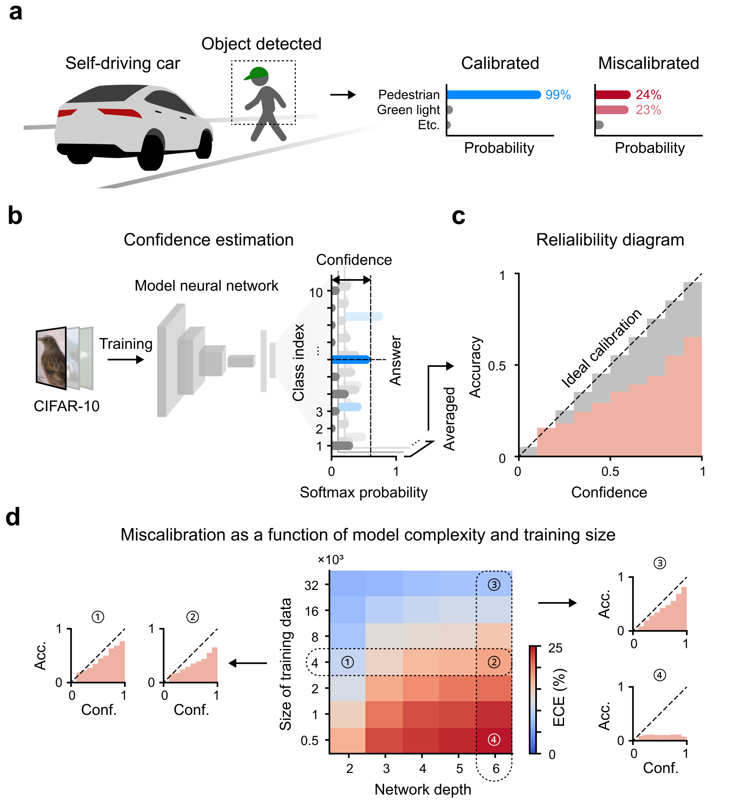
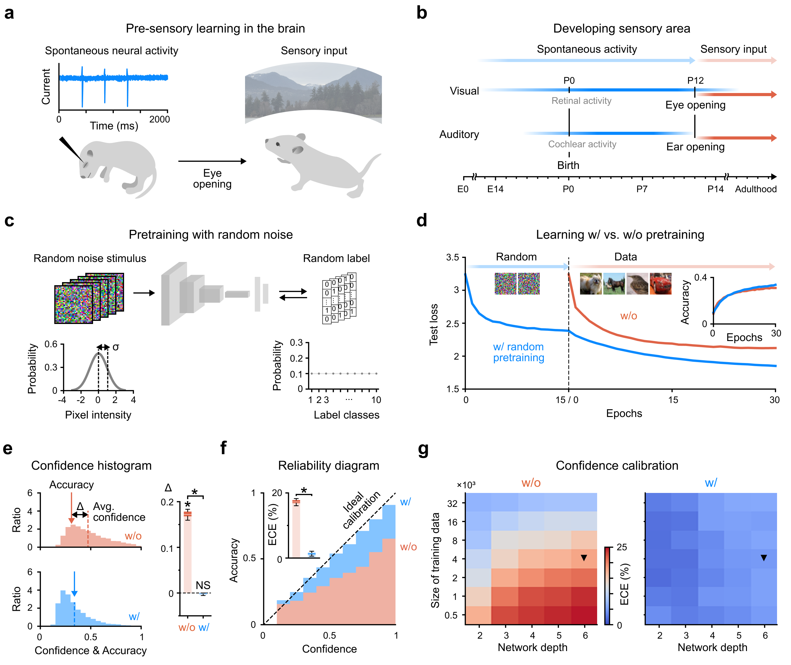
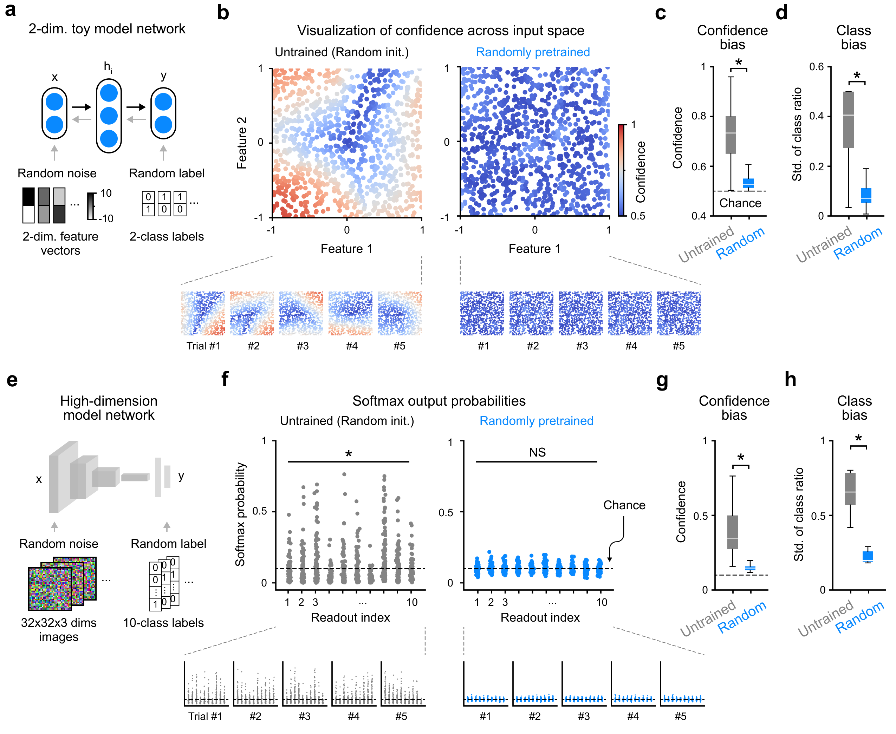
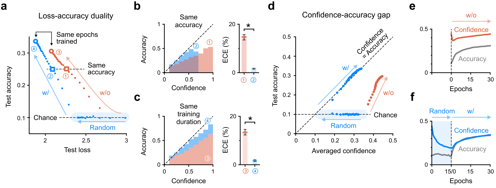
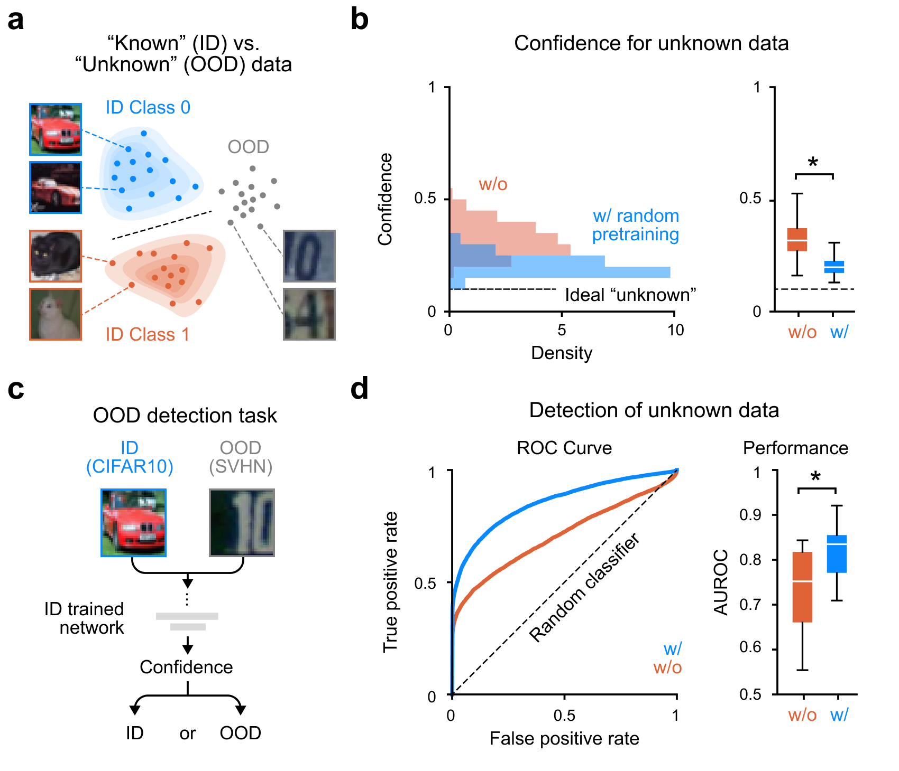
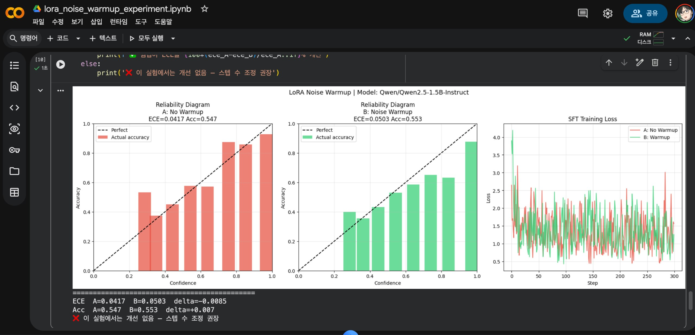

# 랜덤 노이즈 웜업으로 AI 과신 문제 해결? — KAIST Nature 논문 3인 심층 리뷰

1. AI가 틀리면서도 확신하는 문제 — 흔히 '환각(hallucination)'이라 부르는 것 — 은 딥러닝의 오래된 숙제임. 자율주행 차량이 잘못된 인식에 99% 확신을 보이거나, GPT 계열 모델이 없는 사실을 당당하게 말하는 것이 같은 뿌리에서 나온다.

2. KAIST 뇌인지과학과 천정환·박세범 교수팀이 2026년 4월 Nature Machine Intelligence에 낸 논문이 이 문제에 대해 흥미로운 주장을 한다. **과신의 근본 원인은 데이터 부족도, 모델 구조도 아니라 표준 가중치 초기화 자체다.** 그리고 해법은 놀랍도록 단순하다 — 진짜 데이터 학습 전에 잠깐 랜덤 노이즈로 훈련시키면 된다.

3. 논문 제목: *"Brain-inspired warm-up training with random noise for uncertainty calibration"*
   - 저널: Nature Machine Intelligence, Vol. 8, pp. 602–613 (2026)
   - 코드: https://github.com/cogilab/Random2 (MIT 라이선스, Python 3.12)
   - arXiv: https://arxiv.org/abs/2412.17411

---

## 핵심 아이디어

4. **방법은 두 단계다.** 첫째, 가우시안 랜덤 이미지 + 균등분포 랜덤 레이블로 ~25만 샘플을 훈련한다. 정확도는 우연 수준(10%)에 머문다. 둘째, 그 상태에서 진짜 데이터 학습을 시작한다.

5. **영감은 뇌 발달에서 왔다.** 태아 쥐의 시각피질은 눈이 열리기 전 '자발적 신경 활동(spontaneous neural activity)'을 경험한다. 아무 입력 없이 무작위 신호를 처리하며 구조를 잡는 것. 논문은 이것이 딥러닝 초기화 문제와 같은 역할을 한다고 본다.

6. **결과 수치:**
   - ECE(Expected Calibration Error): 모든 모델 크기·데이터 크기 조합에서 유의미하게 감소
   - ResNet-18: 처음부터 학습 및 ImageNet 파인튜닝 모두에서 보정 개선 (P<0.001)
   - 정확도 손실: 통계적으로 유의미하지 않음 (P>0.05)
   - OOD 탐지 AUROC: 유의미하게 향상 (P<10⁻³)

---

## 왜 초기화가 문제인가

7. 랜덤으로 초기화된 네트워크를 학습 전에 2D 입력 공간에서 시각화하면, 아무것도 본 적 없는데도 일부 입력 영역에서 근거 없는 높은 확신을 보인다. 이것이 Xavier·Kaiming 초기화의 숨겨진 편향이다.

8. 랜덤 노이즈 웜업 후에는 전체 입력 공간에 걸쳐 신뢰도가 균일하게 낮아진다 — 우연 수준으로. 이 상태에서 진짜 데이터를 학습하면 처음부터 신뢰도와 정확도가 같이 올라간다.

---

## 분포 외(OOD) 탐지 효과

9. 웜업 없는 네트워크는 학습 내내 신뢰도가 정확도를 앞서 달린다. 웜업한 네트워크는 처음부터 대각선에 붙어서 함께 올라간다. 신뢰도와 실제 정확도가 보조를 맞추는 것.

10. CIFAR-10으로 학습한 뒤 SVHN(전혀 다른 도메인)을 보여줬을 때 — 웜업 없는 네트워크는 본 적 없는 입력에 높은 확신을 보인다. 웜업한 네트워크는 모른다는 것을 안다. AUROC가 유의미하게 향상되었고 별도의 OOD 탐지 모듈이 필요 없다.

---

## 리뷰어 에이전트 3인 독립 평가

이 논문을 독립적인 관점 3개로 검토했다. 각 리뷰어는 상대방의 평가를 보지 않고 작성했다.

---

### Reviewer 1 — 학술 엄밀성 (Score: 5.5/10)

11. **신규성 (3/5):** "초기화가 과신의 근본 원인"이라는 진단적 프레이밍은 부분적으로 새롭다. 하지만 이미 Guo et al. (2017)이 깊이·BatchNorm을 주요 원인으로 지목했고, 랜덤 레이블 학습은 Mixup·레이블 스무딩과 개념적으로 인접하다. 이 논문이 채우는 빈칸은 실재하지만 좁다.

12. **방법론 (2.5/5):** 치명적 공백이 있다. Transformer 아키텍처가 없다. ImageNet 전체가 없다. NLP·표 데이터·회귀 작업이 없다. 파인튜닝 실험은 오히려 초기화 논증을 약화시킨다 — ImageNet 사전학습 가중치는 이미 랜덤이 아니기 때문이다. 웜업 하이퍼파라미터(0.25M 선택 기준) 민감도 분석도 없다.

13. **통계 (3/5):** Wilcoxon 비모수 검정 선택은 적절하다. 그러나 n=10–30은 "모든 딥러닝에 적용 가능"이라는 Nature급 주장을 뒷받침하기엔 얇다. 다중 비교 보정(Bonferroni 등)이 없고, 효과 크기(Cohen's d)가 보고되지 않았다.

14. **비교 기준선 (2/5):** 가장 심각한 약점. **Temperature Scaling과 직접 비교가 없다.** 온도 스케일링은 파라미터 하나로 ECE를 거의 최적화하고, 재학습 비용이 없다. 이 비교 없이는 실용적 기여를 입증할 수 없다. Label Smoothing, Deep Ensembles, MC Dropout도 빠져 있다.

15. **생물학적 유추 (2.5/5):** 태아 쥐 자발적 신경 활동은 공간적으로 상관된 패턴이다 — i.i.d. 가우시안이 아니다. 생물학적 레이블은 없다. 유추는 사후적 스토리텔링이지 메커니즘을 제약하지 않는다. "독립적 예측을 생성하는 과학적 발판"이 아니라 "서사 장치"다.

---

### Reviewer 2 — LLM 실용성 (Score: 2.5/10)

16. **아키텍처 격차:** CNN에서 메커니즘이 작동하는 이유는 ReLU 뉴런 포화 방지 때문이다. Transformer는 GELU·레이어 정규화·잔차 연결로 구성되어 고전적 뉴런 포화가 드물다. LLM의 과신은 초기화 편향이 아니라 어텐션 헤드 전문화·암기에서 온다. 메커니즘이 다르다.

17. **스케일 격차:** 논문의 웜업은 전체 학습량의 10%다 (0.25M/2.5M). GPT-3 수준(3000억 토큰)에 같은 비율을 적용하면 300억 토큰을 랜덤 노이즈에 쓴다. 이는 비용 문제가 아니라 개념 문제다 — 그 규모에서 랜덤 노이즈가 Adam 옵티마이저의 노이즈 바닥에 흡수될 가능성이 높다.

18. **"랜덤 노이즈"의 언어적 정의:** 이미지에서 가우시안 노이즈는 자연스럽다. 언어에서는? 랜덤 토큰 ID? 랜덤 임베딩? 균등 BPE 시퀀스? 어느 것도 논문이 의존하는 "최대 엔트로피 입력 도메인 사전"이라는 의미에서 깔끔하지 않다. 이 정의 없이 LLM 적용은 추측이다.

19. **지금 당장 가장 현실적인 적용점:** RLHF 보상 모델은 K-클래스 분류에 가까워서 논문 셋업과 가장 유사하다. SFT(지도 파인튜닝) 직전 랜덤 토큰 + 균등 레이블로 1000~5000 스텝 웜업도 저비용으로 테스트 가능하다. 하지만 이 가설을 검증한 실험이 논문에 없다.

20. **LLM 적용 가능성이 8+/10이 되려면:** Llama-3/Mistral 7B에서 직접 SFT 웜업 실험 → TruthfulQA·HaluEval 벤치마크 개선 → RLHF 이후에도 효과 유지 → "랜덤 노이즈"의 언어 도메인 정의를 메커니즘적으로 정당화. 이 실험들이 나올 때까지 LLM 주장은 가설이다.

---

### Reviewer 3 — 회의론적 평가 (Claim-to-evidence 격차: 7/10)

21. **"초기화가 근본 원인"은 증명되지 않았다.** 웜업이 도움이 됨은 보였다. 그러나 초기화를 고정하고 훈련 역학만 바꾼 비교가 없다. 랜덤 레이블 학습은 단순히 "최대 엔트로피 사전을 주입하는 데이터 증강"일 수 있고, 이는 초기화와 무관한 메커니즘이다.

22. **CIFAR-10은 2026년 Nature MI 기준으로 좁다.** 32×32, 10클래스, 클린 레이블. 회귀·멀티레이블·생성 모델에서 ECE는 정의 자체가 다르다. "모든 딥러닝에 적용 가능"이라는 주장을 이 데이터셋으로 뒷받침하기 어렵다.

23. **"정확도 손실 없음" 주장은 통계적으로 불충분하다.** P>0.05는 동등성 증명이 아니다. n=10–30에서 0.1~0.3% 정확도 저하를 탐지할 검정력이 없다. 동등성 검정(TOST)과 등가 경계(equivalence bound) 설정이 필요하다.

24. **기존 사전학습 모델에는 적용 불가.** GPT-4, Llama, Claude는 이미 존재한다. 웜업은 스크래치 학습 시에만 원래 논문 셋업으로 적용된다. 수백억 달러의 재학습 없이는 현재 배포된 모델에 소급 적용할 수 없다.

25. **논문이 실제로 확립한 것:** 피드포워드 네트워크와 ResNet-18의 이미지 분류에서 랜덤 노이즈 웜업이 ECE와 OOD AUROC를 개선한다. **주장했지만 확립하지 못한 것:** 초기화가 THE 근본 원인이라는 것, 생물학적 메커니즘의 대응, temperature scaling 대비 우월성, LLM 환각 감소, 회귀·생성 모델 적용 가능성.

---

## 종합: 이 논문을 어떻게 봐야 하나

26. **논문이 제대로 한 것:** 간단하고 재현 가능한 방법으로 이미지 분류 기준선에서 신뢰도 보정을 개선했다. 코드도 공개했다. 손실 지형(loss landscape) 평탄화라는 메커니즘 힌트도 제공했다. 이것만으로도 기여다.

27. **논문이 과장한 것:** "모든 딥러닝의 보편적 해법"이라는 프레이밍과 LLM 환각 감소 주장. Temperature Scaling과의 직접 비교 없이는 실용적 우월성이 미확인이다. 생물학적 유추는 서사 장치다.

28. **실무자 입장에서 할 일:** 스크래치 학습하는 분류 모델이 있다면 한번 써볼 만하다. 비용이 낮다. LLM 파인튜닝에서는 보상 모델(RLHF RM) 훈련 전 웜업을 테스트해볼 만한 가설이 있다. 하지만 기존 LLM의 환각 문제 해결책으로 기대하는 것은 시기상조다.

29. **3인 종합 점수:**

| 리뷰어 | 평가 관점 | 점수 |
|---|---|---|
| Reviewer 1 | 학술 엄밀성 | 5.5 / 10 |
| Reviewer 2 | LLM 실용성 (현재) | 2.5 / 10 |
| Reviewer 3 | 주장-증거 격차 | 3 / 10 (격차 7 = 적음) |

30. 논문이 제기하는 질문 — "초기화가 과신의 원인인가" — 은 좋은 질문이다. 현재 답변은 흥미로운 첫 단계다. Transformer 아키텍처, 언어 태스크, Temperature Scaling과의 비교, LLM 파인튜닝 실험이 나온 후보 시속 주목할 만하다.

---

## 직접 재현 실험: Qwen2.5-1.5B + LoRA

31. 리뷰어 평가에서 그치지 않고 직접 Google Colab(T4 GPU)에서 재현 실험을 돌렸다. 설정은 다음과 같다.

   - 모델: `Qwen/Qwen2.5-1.5B-Instruct` (fp16, HF 토큰 불필요)
   - LoRA: r=16, target=q/k/v/o_proj, 전체 파라미터의 약 0.3%
   - 웜업: 랜덤 토큰 입력 + 균등 랜덤 레이블, 500 스텝
   - SFT: MMLU 400샘플, 300 스텝
   - 평가: MMLU validation 300샘플, ECE + Reliability Diagram

32. **결과:**

   | 지표 | A: 웜업 없음 | B: 노이즈 웜업 | 변화 |
   |------|-------------|---------------|------|
   | ECE | 0.0417 | 0.0503 | **+0.0085 (악화)** |
   | Accuracy | 0.547 | 0.553 | +0.007 (미미한 개선) |

33. **노이즈 웜업이 ECE를 오히려 악화시켰다.** 이것은 음성 결과(negative result)이며, 리뷰어 R2가 예측한 내용과 정확히 일치한다.

34. 원인 분석:

   - **이미 보정된 모델에 웜업은 방해가 된다.** Qwen2.5-Instruct는 이미 RLHF/SFT로 잘 보정된 상태다. 논문의 실험은 완전 랜덤 초기화 → 스크래치 학습이지만, 여기선 수십억 토큰을 학습한 모델의 LoRA 어댑터(0.3%)만 건드린 것이다. 웜업이 기존 보정을 흔들기만 하고 이득은 없었다.

   - **LoRA 어댑터가 너무 작다.** 논문 메커니즘은 "전체 네트워크 출력 분포가 균일해져야" 작동한다. 전체 파라미터의 0.3%만 업데이트하면 베이스 모델의 강한 사전(prior)이 웜업 효과를 압도한다.

   - **웜업:SFT 비율이 역전됐다.** 논문은 웜업:실데이터 = 1:10이었으나 이 실험은 500:300으로 웜업이 더 길었다. 보정이 흐트러진 채로 SFT가 끝났다.

35. 이 결과가 말해주는 것: **논문의 방법은 LLM LoRA 파인튜닝에 직접 이식되지 않는다.** 보상 모델(RM) 처럼 분류 헤드를 새로 붙이는 경우, 또는 베이스 모델(instruction-tuned 아닌)을 스크래치에 가깝게 학습하는 경우라면 다른 결과가 나올 수 있다. 실험 코드는 공개돼 있으니 조건을 바꿔서 추가 검증이 가능하다.

---

*논문 DOI: 10.1038/s42256-026-01215-x | 코드: github.com/cogilab/Random2 | arXiv: 2412.17411*
