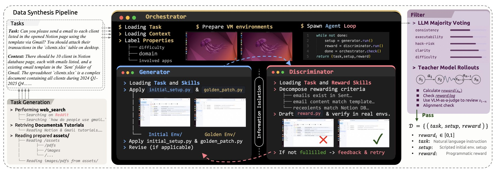
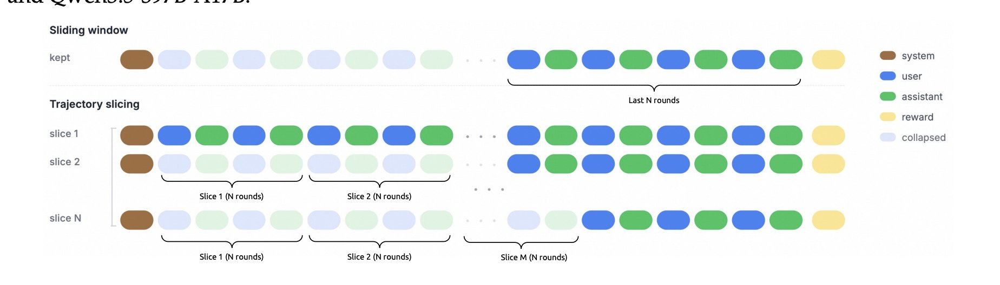
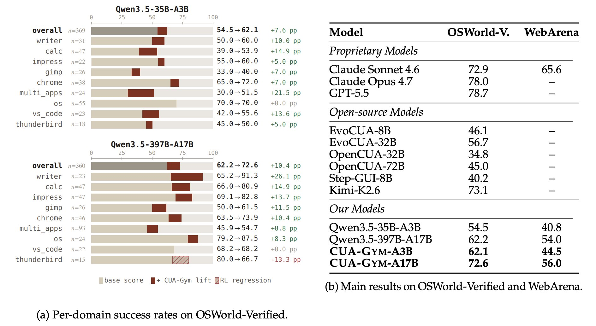
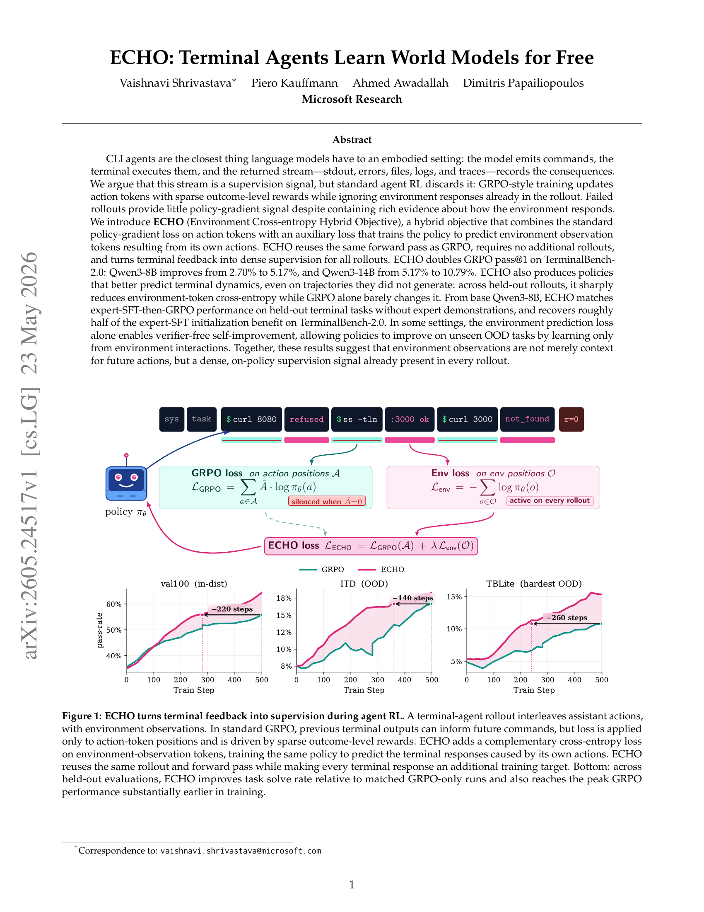
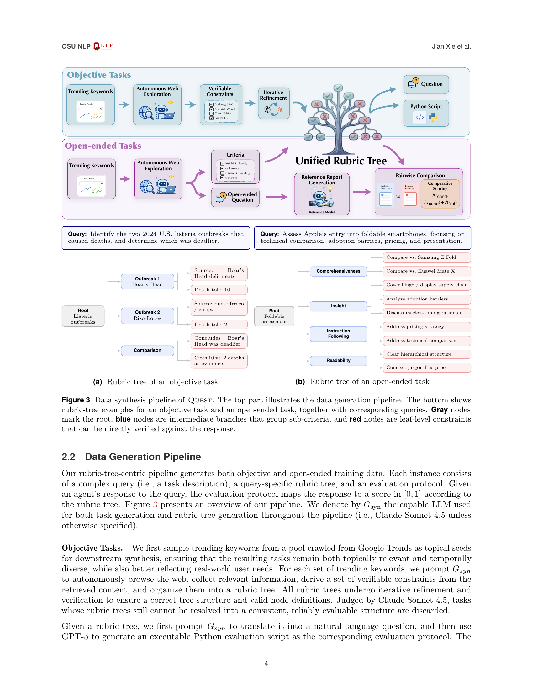
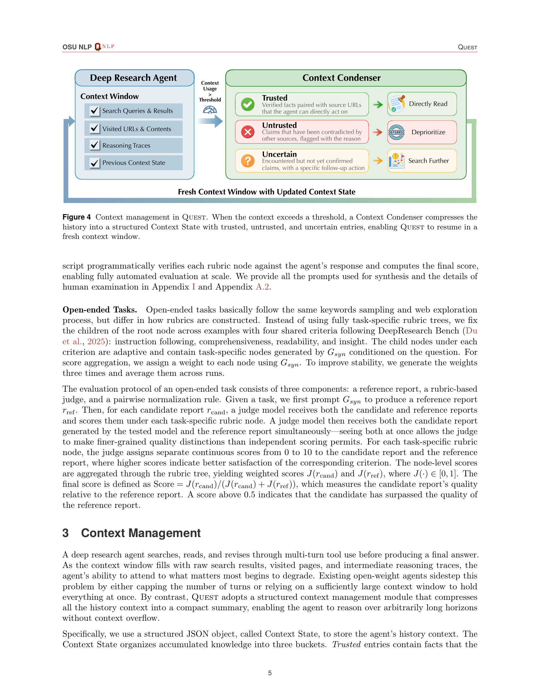

2025년 초만 해도 "에이전트에 RL을 쓴다"는 말은 거의 실험실 얘기였다. SFT만으로도 충분히 잘 돌아가니까. 그런데 2026년, 상황이 완전히 바뀌었다. 수학·코딩·도구 사용에서 RLVR(Reinforcement Learning with Verifiable Rewards)이 성능을 폭발시킨 뒤, 그 열기가 에이전트 영역으로 번지고 있다. 문제는 에이전트는 수학 문제처럼 정답이 깔끔하지 않다는 것. 웹을 탐색하고, 터미널을 조작하고, 리서치 보고서를 쓰는 행동은 연속적이고, 보상은 희소하고, 환경은 비싸다. 26년 5월 말에 나온 세 편의 논문이 이 문제를 각자 다른 각도에서 고민한 결과인듯하여 함께 소개한다.

---

## 1. CUA-Gym — 환경이 없으면 에이전트도 없다

> **논문** *CUA-Gym: Scaling Verifiable Training Environments and Tasks for Computer-Use Agents* — Qwen 팀, 2026.05
> **링크** [arxiv.org/abs/2605.25624](https://arxiv.org/abs/2605.25624)

컴퓨터 사용 에이전트(Computer-Use Agent)는 화면을 보고 클릭하고 타이핑하는 에이전트다. Claude Computer Use, Operator 같은 시스템이 대표적이다. 이 녀석들을 RL로 훈련하려면 **과제 지시문, 실행 가능한 환경, 검증 가능한 보상 함수** 세 가지가 동시에 필요하다.

기존엔 두 가지 극단만 있었다. 손으로 만든 벤치마크는 품질은 높은데 몇 개 안 되고, LLM-as-judge 방식은 스케일은 되는데 검증이 불안정하다. CUA-Gym은 이 사이를 채운다.

핵심은 **세 에이전트의 협업**이다. **Generator**가 과제 지시문에 맞춰 초기 환경 상태와 정답 상태를 구성한다. "받은 편지함에서 제목에 '프로젝트'가 들어간 메일을 모두 읽음 처리해라" 같은 과제라면, 메일이 있는 상태와 읽음 처리된 상태를 각각 만드는 식이다.

**Discriminator**는 같은 과제 명세를 받고 독립적으로 보상 함수를 작성한다. Generator가 만든 상태를 미리 알지 못하게 **정보 격리(information isolation)** 벽을 친다. 보상 함수를 짜는 에이전트가 정답을 알면 보상 함수가 정답 상태를 하드코딩하는 식의 보상 해킹(reward hacking)이 발생하기 쉽기 때문이다.

**Orchestrator**가 두 에이전트를 반복적으로 돌리며 실행 결과를 바탕으로 보완한다. 최종적으로 LLM 다수결 투표와 에이전트 롤아웃 필터를 거쳐 품질을 보증한다.

훈련 환경이 부족하면 데이터가 아무리 많아도 소용없다. CUA-Gym-Hub는 실제 소프트웨어 사용 패턴을 기반으로 mock 웹 애플리케이션을 합성한다. Gmail 비슷한 메일 클라이언트, Slack 비슷한 메신저, Notion 비슷한 문서 편집기 등 110개 환경을 만들어냈다.

110개 환경, 32,112개의 검증된 훈련 튜플을 만들었다. GSPO로 훈련한 결과, Qwen3.5-35B-A3B 베이스 54.5% → **CUA-Gym-A3B 62.1%**, Qwen3.5-397B-A17B 베이스 62.2% → **CUA-Gym-A17B 72.6%** 로 OSWorld-Verified 성능이 올라갔다. WebArena는 훈련에 쓰지 않은 held-out 벤치마크인데도 향상되었다. 과적합이 아니라 일반화 능력이 실제로 올라간 것이다.

---

## 2. ECHO — 실패한 롤아웃도 선생님이다

> **논문** *ECHO: Terminal Agents Learn World Models for Free* — Microsoft Research, 2026.05
> **링크** [arxiv.org/abs/2605.24517](https://arxiv.org/abs/2605.24517)

터미널 에이전트는 명령을 내리고, 터미널이 응답하고, 다시 명령을 내리는 식으로 동작한다. GRPO 같은 표준 RL에서는 **action 토큰**(에이전트가 생성한 명령어)에만 loss를 적용하고, **environment 토큰**(터미널의 응답)은 무시한다.

문제는 Qwen3-8B 기준으로 85% 이상의 롤아웃이 과제를 해결하지 못한다는 것. 성공한 롤아웃만 학습에 기여하고, 실패한 85%는 버려진다. 하지만 실패한 롤아웃에도 파일 목록, 에러 로그, 빌드 실패 메시지, grep 결과 같은 풍부한 정보가 들어있다.

ECHO(Environment Cross-entropy Hybrid Objective)의 수식은 놀라울 정도로 간단하다. GRPO loss에 환경 토큰에 대한 cross-entropy loss를 λ=0.05 비중으로 더하는 게 전부다. 추가 롤아웃도, 추가 forward pass도, teacher 모델도 필요 없다. 이미 계산된 로짓에서 관찰 위치만 마스킹해서 loss에 더하면 된다.

왜 효과가 있을까? 터미널 출력은 컨테이너 상태의 "손실 있는 텍스트 투영"이다. 파일 시스템 전체나 프로세스 트리는 안 보이지만, stdout, stderr, exit code, 파일 내용은 보인다. 이걸 잘 예측하려면 에이전트가 터미널의 동작 방식을 이해해야 한다. 즉, **환경 예측 = 암묵적 세계 모델 학습**이다.

결과가 인상적이다. Qwen3-8B에서 GRPO 단독 2.70% → **ECHO 5.17%**, Qwen3-14B에서 GRPO 단독 5.17% → **ECHO 10.79%**. 거의 2배다.

더 흥미로운 건 ECHO로 훈련한 모델이 **자기가 생성하지 않은 롤아웃의 환경 토큰도 더 잘 예측**한다는 것. Qwen3-32B가 만든 held-out 롤아웃에서 ECHO 모델의 환경 cross-entropy가 급격히 떨어지지만, GRPO 단독은 거의 변하지 않는다. 진짜로 세계 모델을 배운 것이다.

전문가 데모 15,000개로 SFT한 뒤 GRPO를 돌린 것과 비슷한 성능을, 데모 없이 ECHO만으로 달성한다. 어떤 설정에서는 verifier 없이도 환경 상호작용만으로 보이지 않는 OOD 과제에서 성능이 올라가는 현상도 관찰했다.

---

## 3. QUEST — 8K 합성 과제로 프론티어를 넘는 법

> **논문** *QUEST: Training Frontier Deep Research Agents with Fully Synthetic Tasks* — OSU NLP, 2026.05
> **링크** [arxiv.org/abs/2605.24218](https://arxiv.org/abs/2605.24218)

딥 리서치 에이전트는 검색 엔진의 진화형이다. 키워드 매칭 페이지를 넘어서, 여러 소스를 탐색하고 정보를 종합하고 인용이 가능한 보고서를 작성한다. OpenAI Deep Research, Gemini 리서치 기능이 상용으로 나와 있지만 오픈 소스 대안은 제한적이었다.

QUEST는 2B부터 35B까지의 모델 패밀리를 완전한 오픈 소스로 공개했다. 모델, 데이터, 훈련 스크립트 전부.

훈련은 세 단계로 구성된다. 첫째, **Mid-Training**에서 컨텍스트 요약과 관련 정보 추출 능력을 기른다. 약 130만 건의 데이터로 긴 문서를 읽고 핵심을 뽑아내는 능력을 학습한다. 둘째, **SFT**에서 객관식 팩트 체킹 과제와 개방형 보고서 작성 과제를 학습한다. 셋째, **RL**에서 합성된 과제로 강화학습 훈련을 진행한다. 여기서 Rubric Tree가 핵심이다.

RL의 고질적 문제는 "에이전트가 잘했는지 어떻게 알까?"다. LLM-as-judge는 불안정하고, 사람이 평가하면 스케일이 안 된다. QUEST의 답은 **Rubric Tree**다. 과제를 평가 기준의 트리 구조로 분해한다. 루트 노드는 과제의 핵심 질문, 중간 노드는 평가 차원(정확성, 포괄성, 통찰력 등), 리프 노드는 검증 가능한 개별 제약조건("출처를 인용했는가?", "삼성과의 비교가 포함되었는가?" 등)이다.

객관식 과제는 리프 노드 제약을 Python 스크립트로 자동 생성해서 평가한다. 개방형 과제는 페어와이즈 비교 방식으로 채점한다. 사람 주석이 전혀 필요 없다.

딥 리서치는 수십 번의 검색, 수십 개의 URL 방문, 긴 추론을 거친다. 컨텍스트 윈도우를 금방 채운다. QUEST는 **Context Condenser**를 내장했다. 검증된 사실은 직접 재사용하고, 모순된 주장은 우선순위를 낮추고, 불확실한 것은 추가 탐색을 유도한다. 컨텍스트가 한도를 넘으면 압축기가 작동하고, 에이전트는 깨끗한 컨텍스트로 작업을 이어간다.

QUEST-35B는 GAIA에서 GPT-5, Claude, Gemini를 모두 제치고 **80.8%** 를 기록했다. QUEST-30B는 LiveResearchBench에서 GPT-5의 73.1%를 넘어 **74.1%** 를 달성했다. RL 단계의 기여가 분명한데, 특히 DeepResearch Bench에서 SFT 36.4% → **RL 48.2%** 로 12%p 점프한다. BrowseComp은 SFT만으로도 충분하지만, 복잡한 리서치 과제일수록 RL 추가 효과가 크다.

---

## 세 논문을 하나로: 에이전트 RL의 세 축

세 편을 나란히 놓으면 에이전트 RL의 핵심 축 세 개가 보인다.

**축 1 — 환경(Environment).** RL은 환경과의 상호작용에서 배운다. CUA-Gym은 과제, 상태, 보상 함수를 세 에이전트가 협업해서 만들고, mock 앱 환경까지 자동 생성한다. 환경의 스케일링이 에이전트 RL의 첫 번째 병목이었고, CUA-Gym이 이를 열었다.

**축 2 — 보상(Reward).** 환경이 있어도 보상이 희소하면 학습이 안 된다. 터미널 에이전트의 85% 실패 롤아웃이 그 예다. ECHO는 롤아웃에 이미 있는 환경 관찰 토큰을 추가 학습 대상으로 삼아, 실패한 롤아웃에서도 밀도 있는 학습 신호를 얻는다. 추가 비용 없이 세계 모델을 부산물로 얻는다.

**축 3 — 데이터(Data).** 환경도 있고 보상도 밀도 높은데 훈련 과제가 부족하면? QUEST는 Rubric Tree 기반 합성 파이프라인으로 사람 주석 없이 훈련 데이터를 만든다. 8K개만으로도 프론티어급 성능에 도달한다.

세 축이 모두 "사람의 손을 빼는 방향"으로 움직이고 있다. 환경 합성, 실패 롤아웃 활용, 자동 보상 생성 — 모두 사람 주석 없이 동작한다. 이 세 축을 하나의 시스템으로 통합하면 자가 진화하는 에이전트가 나올 수 있다. 환경 합성 파이프라인에 ECHO 같은 밀도 보상을 붙이고, QUEST의 Rubric Tree로 과제를 자동 생성하면 된다.

2026년 중반, 에이전트 RL은 더 이상 실험실 이야기가 아니다.

---

## 참고 링크

- **CUA-Gym** [arxiv.org/abs/2605.25624](https://arxiv.org/abs/2605.25624) | [HuggingFace](https://huggingface.co/papers/2605.25624)
- **ECHO** [arxiv.org/abs/2605.24517](https://arxiv.org/abs/2605.24517) | [HuggingFace](https://huggingface.co/papers/2605.24517)
- **QUEST** [arxiv.org/abs/2605.24218](https://arxiv.org/abs/2605.24218) | [HuggingFace](https://huggingface.co/papers/2605.24218) | [모델](https://huggingface.co/osunlp/QUEST-30B-RL)
