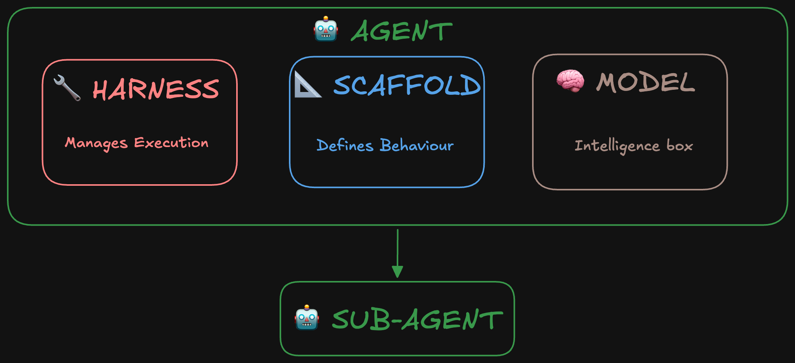
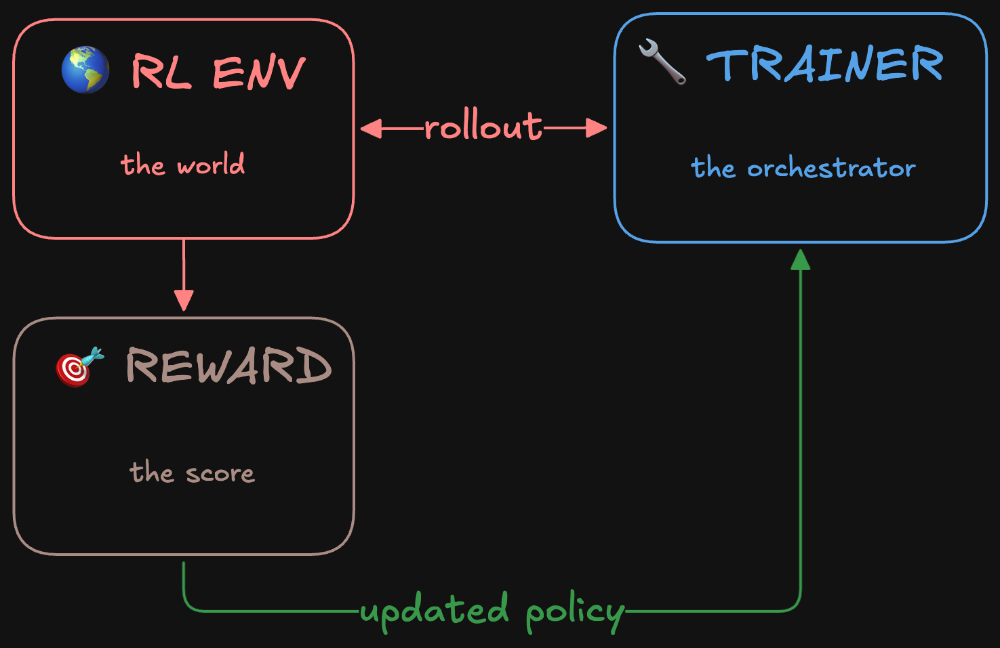

원문:

- [A Taxonomy of RL Environments for LLM Agents - Lee Han Chung](https://leehanchung.github.io/blogs/2026/03/21/rl-environments-for-llm-agents/) (2026.03.21)
- [Agent Glossary: Harness, Scaffold, and the AI Agent Terms Worth Getting Right - Hugging Face Blog](https://huggingface.co/blog/agent-glossary) (2026.05)


모델 아키텍처는 항상 주목받음. 포스트트레이닝 레시피도 관심이 많음. 근데 **강화학습(RL) 환경** — 모델이 실제로 무엇을 연습하고, 어떻게 평가받고, 어떤 도구를 쓸 수 있는지 — 은 대화에 거의 등장하지 않음. 그게 에이전트가 무엇을 학습할 수 있는지를 실제로 결정하는 부분인데도.

이 글에서는 두 가지를 다룸:

1. **RL 환경의 분류학** — LLM 에이전트 훈련 환경이 어떤 요소로 구성되는지
2. **에이전트 용어사전** — 하네스, 스캐폴딩, 정책 등 자주 혼동되는 개념을 명확히 정리

---

## 에이전트 핵심 용어 사전

Hugging Face가 ICLR 2026 이후 "하네스(harness)"와 "스캐폴딩(scaffolding)"의 의미가 왜 수렴하지 않는지에 대한 질문에서 출발한 용어 정리임.

### 모델 (Model)

LLM 그 자체: 텍스트를 받아서 텍스트를 내보냄 (Claude, Qwen, GPT, DeepSeek 등). 모델 자체로는 호출 간 메모리가 없고, 루프도 없음. 도구 호출 의도를 표현할 수 있지만, 실제로 실행하려면 **하네스**가 필요함.

### 스캐폴딩 (Scaffolding)

모델을 둘러싼 **행동 정의 레이어**: 시스템 프롬프트, 도구 설명, 응답 파싱 방식, 컨텍스트 관리 전략. 모델이 세상을 어떻게 보고 어떻게 행동할지를 형성함. 훈련 시에든 추론 시에든 동일하게 적용됨.

### 하네스 (Harness)

에이전트 내부의 **실행 레이어**: 모델을 호출하고, 도구 호출을 처리하고, 언제 멈출지 결정함. 스캐폴딩이 모델이 작업할 "재료"라면, 하네스는 모델을 구동시키는 "엔진"임.

**하네스 엔지니어링(harness engineering)**은 이 레이어를 잘 설계하는 작업: 에이전트가 언제 멈춰야 하는지, 에러를 어떻게 처리할지, 어떤 가드레일이 필요한지를 결정함. Addy Osmani의 [에이전트 하네스 엔지니어링 글](https://www.oreilly.com/radar/agent-harness-engineering/)과 OpenAI의 [Codex 활용 사례](https://openai.com/index/harness-engineering/)가 추론 측면에서 다룸.

### 에이전트 (Agent)

강화학습에서 가져온 용어. RL에서 에이전트는 관측(observation)을 받아 행동(action)을 반환하는 함수. 환경이 그 행동을 받아 새로운 관측을 반환하고 루프가 반복됨.

LLM 세계에서 의미가 확장됨: **에이전트 = 모델 + 하네스**. 원시 텍스트 생성을 루프 안에서 행동하는 것으로 바꿈 — 정보를 받아들이고, 무엇을 할지 결정하고, 결과에 따라 행동함.


*에이전트 = 모델 + 하네스. 모델이 아닌 모든 것이 하네스임.*

Claude Code, Codex, Cursor 같은 제품은 특정 모델 위에 구축된 특정 하네스임. 같은 모델을 써도 하네스가 다르면 완전히 다른 경험을 제공함.

### 컨텍스트 엔지니어링 (Context Engineering)

에이전트의 컨텍스트 윈도우에 무엇이 들어가는지 설계: 시스템 프롬프트, 도구 설명, 대화 기록, 검색된 지식. 일회성 결정이 아님 — 모델이 실행되는 동안 이전 턴이 미래 호출의 입력을 형성하고, 하네스가 이를 계속 관리함.

**단기 메모리**는 단일 실행 중 컨텍스트 윈도우에 남아있는 것 (대화 기록, 도구 결과). **장기 메모리**는 세션 간 지속되어 외부에 저장되고 필요시 검색되어 컨텍스트에 주입됨.

### 정책 (Policy)

에이전트가 따르는 행동 양식: 주어진 상황에서 각 가능한 행동의 확률을 정의함. LLM 시스템에서 정책의 일부는 모델 가중치에 학습되지만, 행동은 주변 스캐폴딩과 하네스에도 의존함.

**정책 ≠ 에이전트**. 정책은 행동을 정의하고, 에이전트는 환경 안에서 행동하는 전체 시스템임.

### 도구 사용 (Tool Use)

에이전트가 자신 밖으로 나가는 방법: API, 코드 인터프리터, 데이터베이스, 웹 검색, 파일 시스템. 모델이 구조화된 형식으로 도구 사용 의도를 표현하면, 하네스가 이를 받아 적절한 함수로 라우팅함.

### 스킬 (Skills)

재사용 가능한 구조화된 지식 패키지. 도구가 행동("이 명령 실행")이라면, 스킬은 목표를 달성하는 데 필요한 모든 것을 묶음("이 버그 조사하고, 가설 세우고, 수정사항 작성"). 에이전트 간 이식 가능하고 필요시 로드됨.

### 서브에이전트 (Sub-agents)

다른 에이전트에 의해 호출되어 특정 하위 작업을 처리하는 에이전트. 자체 모델과 스캐폴딩을 가지고 독립적으로 추론하며 결과를 반환함. 도구(함수 호출)나 스킬(패키지된 지식)과의 차이: 서브에이전트는 스스로 추론하고, 도구를 사용하고, 더 많은 서브에이전트를 호출할 수 있음.

---

## RL 훈련 용어

위 용어들은 훈련과 배포 모두에 적용됨. 아래 네 가지는 **훈련에 특화된** 개념 — 에이전트가 태스크를 실행하고, 점수를 받고, 모델 가중치가 업데이트되는 과정.


*RL 훈련 파이프라인: RL 환경, 트레이너, 보상이 롤아웃과 업데이트된 정책으로 연결됨.*

### RL 환경 (RL Environment)

상호작용 가능한 모든 것: 행동을 입력으로 받아 내부 상태를 업데이트하고 관측을 반환하는 상태 저장 객체. 파일시스템이 간단한 예: `touch foo.txt`라는 행동이 파일을 생성하면서 상태를 업데이트하고, 갱신된 파일 목록이 관측이 됨.

### 트레이너 (Trainer)

에이전트를 개선시키는 것: 많은 에이전트 에피소드를 실행하고, 결과를 평가하고, 내부 모델의 가중치를 업데이트함. TRL의 `GRPOTrainer`가 구체적인 예: 에피소드 생성, 보상 평가, 가중치 업데이트를 처리하는 단일 클래스.

### 롤아웃 (Rollout)

에이전트가 시작부터 끝까지 실행하는 전체 과정: 에이전트가 무엇을 보았고, 무엇을 했고, 각 단계에서 어떤 보상을 받았는지. 궤적(trajectory)이나 트레이스(trace)라고도 함. RL 알고리즘이 학습하는 원시 데이터.

### 보상 (Reward)

훈련 알고리즘에 모델이 나아지고 있는지 알려주는 점수. 검증 가능한 것(테스트 통과/실패, 정답 일치)일 수도 있고, 학습된 것(인간 선호도, LLM-as-judge)일 수도 있음. 희소한 것(에피소드 끝에 한 번)일 수도 있고, 조밀한 것(각 단계마다)일 수도 있음.

루브릭(rubrics)은 보상을 명시적인 차원과 가중치로 분해함. 단일 숫자가 아니라 여러 기준의 가중합.

---

## RL 환경의 분류학

단일 턴 Q&A로만 훈련된 모델은 50단계 기업 워크플로우에서 상태를 유지하라고 하면 바로 막힘. 보상 함수 설계가 잘못되면 메트릭만 게임하는 모델이 나옴. **RL 환경이 시스템의 절반임.**

### 정규 루프 (Canonical Loop)

강화학습의 핵심: 지능형 에이전트가 보상 신호를 최대화하기 위해 동적 환경에서 어떻게 행동해야 하는지를 다룸. 상태 집합 $S$, 행동 집합 $A$, 전이 후 즉각적 보상 $R_t$ 로 구성됨.

LLM 에이전트 훈련으로 가져오면, RL 환경은 다음 객체를 묶음:


형식적으로, 완전한 RL 환경은 집합:

$$E = \{T, H, V, S, C\}$$

- $T$ = 태스크 (Tasks)
- $H$ = 에이전트 하네스 (Agent Harness)
- $V$ = 검증기 (Verifier)
- $S$ = 상태 관리 (State Management)
- $C$ = 설정 (Configuration)

### $T$: 태스크 (Tasks)

에이전트가 환경 내에서 해결하려는 문제 집합. 난이도뿐 아니라 **구조적으로** 다름:

| 태스크 유형 | 에이전트가 해야 할 일 | 예시 시스템 |
|---|---|---|
| 단일 턴 Q&A | 하나의 프롬프트 → 하나의 응답 | 수학 벤치마크, SimpleQA |
| 멀티홉 검색 | 연속 검색, 출처 종합 | BrowseComp, WebWalkerQA |
| 개방형 연구 | 정답이 하나가 아님; 보고서 품질이 중요 | ADR-Bench, ResearchRubrics |
| 에이전트 도구 사용 | 순서대로 도구를 올바르게 호출 | tau-bench, 함수 호출 벤치마크 |
| 상태 저장 기업 | 영속적 DB 상태 수정, 접근 제어 내 작업 | EnterpriseOps-Gym |
| 코드 생성 | 코드 작성, 실행, 출력 확인 | SWE-Bench, LiveCodeBench |
| 코드 리뷰 & 수정 | 버그 탐지, 수정 제안, 패치 검증 | CodeReview-Bench, DebugBench |
| 리포지토리 수준 코딩 | 대규모 코드베이스 탐색, 다중 파일 편집 | SWE-Bench Verified, RepoBench |
| 생산성 워크플로우 | 이메일 작성, 캘린더 관리, 알림 분류 | WorkArena, OSWorld |

**궤적(trajectory)**: 상태-행동-보상의 시퀀스. **에피소드(episode)**: 시작부터 완료까지의 단일 실행. **롤아웃(rollout)**: 정책을 실행해 궤적을 생성하는 과정. **트레이스(trace)**: 도구 호출, 관측, 중간 출력을 포함한 에이전트 실행의 구조화된 로그.

**태스크 설계의 핵심 긴장**: 단일 턴 + 검증 가능한 정답이 가장 수집 비용이 낮음. 장기적 행동을 위한 가장 가치 있는 태스크는 구축 비용이 비쌈. 커리큘럼을 통해 점진적 난이도 상승이 가능함.

합성 데이터 전략:
- **역번역(Back translation)**: 원하는 출력에서 시작해 그것을 생성할 입력을 역추론
- **그래프 기반 합성**: 지식 그래프를 구축하고 멀티홉 쿼리를 생성

### $H$: 에이전트 하네스 (Agent Harness)

모델이 환경과 상호작용할 수 있게 하는 인프라. 모델이 "어떻게" 상호작용하는지를 제어하지만, 모델이 "무엇을" 아는지는 개선하지 않음.

```
H = {
  rollout_protocol,    # SingleTurn | MultiTurn | Agentic
  tools,               # 환경에서 사용 가능한 도구
  system_prompt,       # 에이전트 지침
  context_manager,     # 컨텍스트 오버플로우 처리
  turn_limit,          # 최대 상호작용 수
  sandbox,             # 코드 실행 샌드박스
  state                # 턴 간 지속 상태
}
```

롤아웃 프로토콜의 스펙트럼:

| 하네스 유형 | 설명 | 사용 시기 |
|---|---|---|
| 단일 턴 | 하나의 프롬프트, 하나의 응답 | 수학, 사실 Q&A |
| 멀티 턴 | 주고받는 대화 | 게임, 구조화된 태스크 |
| 도구 사용 | 모델이 도구 호출, 결과 수신 | 에이전트 벤치마크 |
| 상태 저장 도구 사용 | 도구가 영속적 상태 수정 | 기업 워크플로우, SWE-Bench |
| 에이전트 | 전체 관측→판단→결정→행동(OODA) 루프 | 심층 연구, 복잡한 워크플로우 |

현대 하네스 설계는 도구 수를 원자적 기본으로 줄이는 추세: `read`, `write`, `edit`, `bash`, 서브에이전트용 `tasks`, MCP 연결용 `mcp`, 에이전트 스킬 관리용 `skill` 등. 개별 API 호출이나 DB 연결을 수동으로 추가하던 초기와 다름.

**컨텍스트 관리**는 장기 태스크에 결정적. 600턴 연구 에피소드는 어떤 실용적 컨텍스트 윈도우도 초과함:

| 전략 | 설명 | 트레이드오프 |
|---|---|---|
| 최신성 기반 보존 | 최근 N턴 유지 | 간단하지만 초기 컨텍스트 손실 |
| 마르코프 재구성 | 매 턴 상태를 처음부터 재구성 | 원칙적이지만 비용 높음 |
| 참조 보존 요약 | 오래된 컨텍스트 요약, 인용 유지 | 검증 가능성 보존 |
| 참조 보존 폴딩 | 참조를 잃지 않고 컨텍스트 압축 | 연구 태스크에 최적 |

### $V$: 검증기 (Verifier)

완성을 보상에 매핑:

$$V: (\text{task prompt}, \text{completion}, \text{info}) \rightarrow [0, 1]$$

Atari에서는 점수가 명확함. 코딩에서는 테스트가 통과하면 간단하지만, 코드가 올바르더라도 스타일이 안 좋거나 비용이 비싸면? 심층 연구에서는 "좋은 답변"이 훨씬 모호함. 이것이 **생성-검증 갭**임: AI 에이전트로 출력을 생성하는 건 싸지만, 품질을 검증하는 건 태스크가 개방적일수록 점점 어려워짐.

| 유형 | 보상 신호 | 사용 시기 |
|---|---|---|
| 정확 일치 | 이진 (0/1) | 정답 사용 가능 |
| 코드 실행 | 이진 또는 부분 | 프로그래밍 방식 테스트 가능 |
| LLM-as-judge | 연속 [0,1] | 개방형 품질, 다른 옵션 없을 때 |
| 체크리스트 | 연속 | 다중 기준 연구 태스크 |
| 진화 루브릭 (RLER) | 연속 | 보상 해킹에 강함 |
| 과정 보상 모델 (PRM) | N단계별 연속 | 장기적 크레딧 할당 |
| 쌍별 비교 | 상대 순위 | 절대적보다 상대적 품질이 중요할 때 |
| 다중 기준 복합 | 가중합 | 여러 품질 차원 |

**실제로 중요한 원칙들:**

1. **검증 가능한 것이 판단 가능한 것보다 나음.** 프로그래밍 방식 검사가 LLM-as-judge보다 빠르고, 저렴하고, 일관됨. LLM-as-judge는 다른 옵션이 없을 때만 사용.

2. **보상 세분성은 보상 유형과 별개의 결정.** 궤적 수준(최종 출력이 통과했는가?), 턴 수준(각 도구 호출이 유용했는가?), 또는 과정 보상으로 단계별로 채점 가능. Nanbeige4.1은 최대 600개의 도구 호출에서 턴 수준 감독을 사용 — 모델이 23번째 턴의 잘못된 검색어가 문제였다는 것을 학습할 수 있음.

3. **정적 루브릭은 게임당함.** 모델이 문제를 해결하는 대신 루브릭에서 점수를 잘 받는 답변을 작성하는 법을 배움. RLER(Rubric-Level Evolving Reward)는 훈련 중 루브릭을 정책과 함께 공동 진화시킴. 움직이는 표적을 악용하기 어려움.

4. **노이즈 주입은 과소평가됨.** Step-DeepResearch는 훈련 중 의도적으로 5-10%의 도구 에러를 주입. 결과 모델은 프로덕션에서 불안정한 API와 예상치 못한 실패를 훨씬 잘 처리함.

### $S$: 상태 & $C$: 설정

에이전트마다 다른 환경이 필요함. 포켓몬 에이전트는 게임 자체를 플레이. 코딩 에이전트는 코드 저장소와 AGENTS.md가 있는 가상 머신에서 작동. 심층 연구 에이전트는 인터넷 접근이 가능한 VM에서 종합 연구 보고서를 작성.

**무상태 vs 상태 저장**: LeetCode 문제를 푸는 코딩 에이전트는 영속 상태가 필요 없음. 하지만 DB를 조작해야 하는 에이전트는 행동 간 상태를 가짐. EnterpriseOps-Gym은 164개 DB 테이블과 512개 도구를 에피소드 간 유지 — 한 태스크의 행동이 다음 태스크가 보는 상태에 영향을 미침.

**자동 환경 생성**: LLM 코딩 에이전트가 새 환경 코드를 작성. AutoEnv는 환경당 약 4달러의 평균 비용을 보고함.

**설정(Configuration)**: 턴 제한, 컨텍스트 예산, 샘플링 온도, 커리큘럼 스케줄링. 턴 제한 5 vs 600은 에이전트가 개발할 수 있는 스킬을 완전히 바꿈. AgentScaler는 2단계 커리큘럼 사용 — 기본 역량 먼저, 도메인 특화 태스크 나중에. Step-DeepResearch는 미드 트레이닝 중 컨텍스트 윈도우를 32K에서 128K로 점진 확장.

**배포 토폴로지**: 실제로 트레이너, 모델 추론 서버, 환경은 별도 프로세스로 API 통신. 이 분리를 통해 추론과 환경 실행을 독립적으로 스케일하고 모델을 교체할 수 있음.

---

## 벤치마크: 동결된 환경

벤치마크를 만들어본 적 있다면, 이미 RL 환경을 만든 것임 — 그냥 동결된 버전으로.

$$B = (\text{Request}, \text{Environment}, \text{Stopping Criteria}, \text{Scorer})$$

- **Request** → $T$ (태스크)
- **Environment** → $H$ (하네스) + $S$ (상태)의 부분집합
- **Stopping Criteria** → $C$ (설정)
- **Scorer** → $V$ (검증기)

**차이점**: 벤치마크는 재현성을 위해 모든 구성 요소를 동결함. 훈련 환경은 진화할 수 있음.

**태스크 자연스러움**: SWE-bench이 작동하는 이유는 실제 개발자가 등록한 실제 GitHub 이슈이기 때문. 연구자가 발명한 합성 문제가 아님. 벤치마크와 훈련 환경 모두에 적용됨: 실제로 아무도 만나지 않을 태스크로 훈련된 에이전트는 평가는 통과해도 유용해지지 못함.

**자동 검증 가능한 평가**: 벤치마크에 인간 심판이 필요하면 스케일이 안 됨. 훈련 환경에 인간 심판이 필요하면 훈련이 안 됨. 훈련 실행은 수백이 아니라 수백만 개의 보상 신호가 필요.

**난이도 보정**: Press는 최고 모델 정확도 0.1%-9%로 벤치마크를 출시할 것을 권장. 훈련의 아날로그: 태스크 분포가 너무 쉬우면 에이전트가 빨리 한계에 도달하고, 너무 어려우면 보상 신호가 너무 희소해서 학습이 안 됨.

**평가자 독립성**: 같은 모델 패밀리로 완성을 생성하고 평가하면 피드백 루프가 생김. 에이전트가 정답이 아닌 자기 판사에게 좋게 들리는 글을 쓰는 법을 배움. LLM-as-judge를 써야 한다면 판사는 정책과 다른 모델 클래스여야 함.

> 벤치마크와 훈련 환경의 차이: 벤치마크는 동결하고, 훈련 환경은 진화함. 태스크 분포는 커리큘럼으로 변화. 검증기 루브릭은 정책과 공동 진화(RLER). 설정 파라미터는 훈련 과정에서 스케일업. 하지만 기본 구성 요소와 그것을 좋게 만드는 원칙은 동일함.

---

## 추가 고려사항

**환경 다양성**이 환경 품질만큼 중요. AgentScaler의 핵심 발견: 환경의 이질성이 단순히 같은 분포에서 더 많은 데이터를 추가하는 것으로는 달성할 수 없는 방식으로 역량의 폭을 넓힘. **더 많은 종류의 환경이 필요함. 더 많은 환경이 아니라.**

**자동 환경 생성은 실행 가능함.** 환경당 4달러면 비용이 병목이 아님. 병목은 검증기 품질 — 약한 보상 함수로 자동 생성된 환경은 규모 있게 잘못된 행동을 가르침.

**환경-패키지 모델이 승리하고 있음.** Prime Intellect Environments Hub가 RL 환경을 중심으로 생태계를 만들고 있음. PyPI가 코드를, HuggingFace가 모델 가중치를 중심으로 생태계를 만든 것과 같은 방식. OpenReward는 330개 이상의 RL 환경을 관리형 API 엔드포인트로 제공 (450만+ 태스크, 자동 스케일 샌드박스). Open Reward Standard(ORS)는 MCP를 RL 프리미티브(에피소드, 보상 신호, 태스크 분할, 커리큘럼 관리)로 확장함.

**오염 저항성이 설계 요구사항이 될 것.** RL 환경이 연구실과 오픈소스 간에 재사용되면서 데이터 오염 — 모델이 사전 훈련에서 벤치마크 답을 암기 — 이 훈련 신호 유효성에 실제 위협이 됨. 보류된 태스크 분할, 동적 태스크 생성, 검증기 측의 답변 보류를 지원하는 환경이 정적 데이터셋보다 오래갈 것.

---

## 핵심 요약

에이전트 RL 훈련의 세계를 한 문장으로: **에이전트 = 모델 + 하네스, RL 환경 = {태스크, 하네스, 검증기, 상태, 설정}**.

용어가 중요한 이유는 대화가 정확해야 설계가 정확해지기 때문. 하네스와 스캐폴딩을 구분할 줄 알아야 훈련 파이프라인에서 이들을 분리해서 추론할 수 있음. 정책과 에이전트를 구분할 줄 알아야 같은 모델으로 다른 행동을 내는 이유를 이해할 수 있음.

그리고 환경 설계에서 가장 중요한 원칙 하나: **검증 가능한 것이 판단 가능한 것보다 낫다.** 프로그래밍 방식 검사를 최대한 사용하고, LLM-as-judge는 최후의 수단으로.
