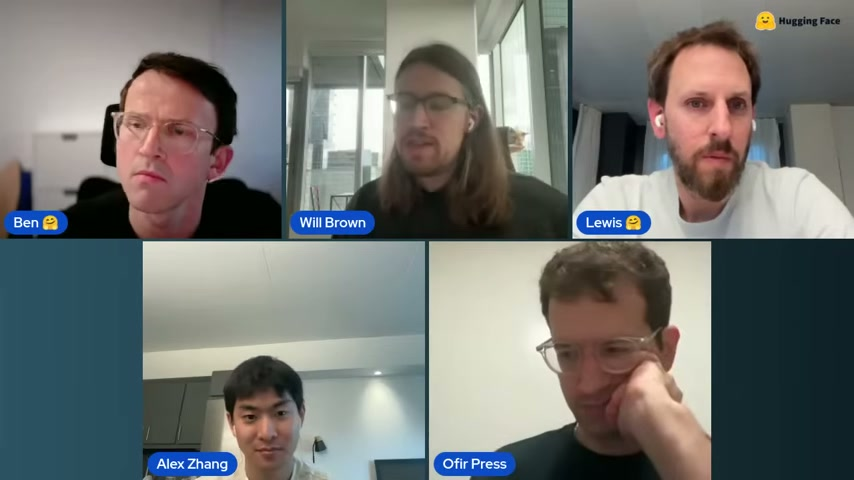
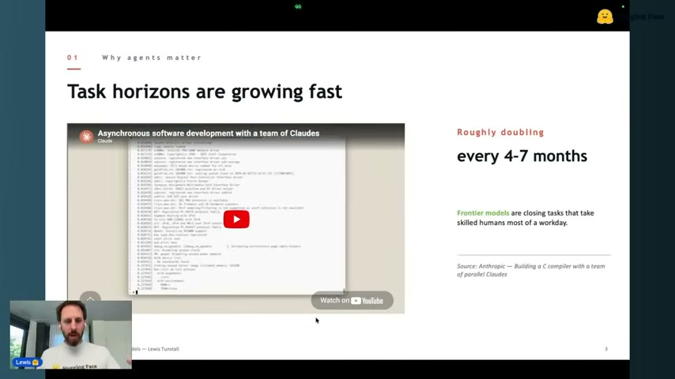
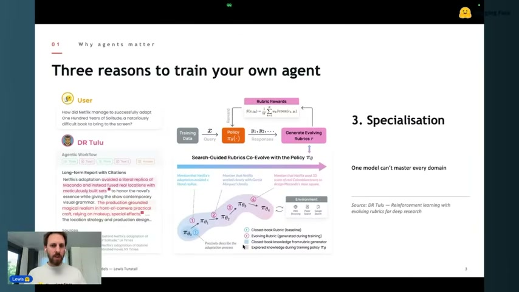
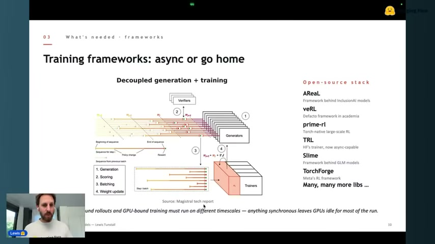
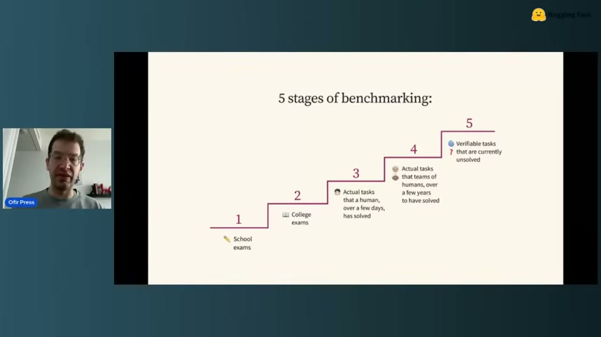
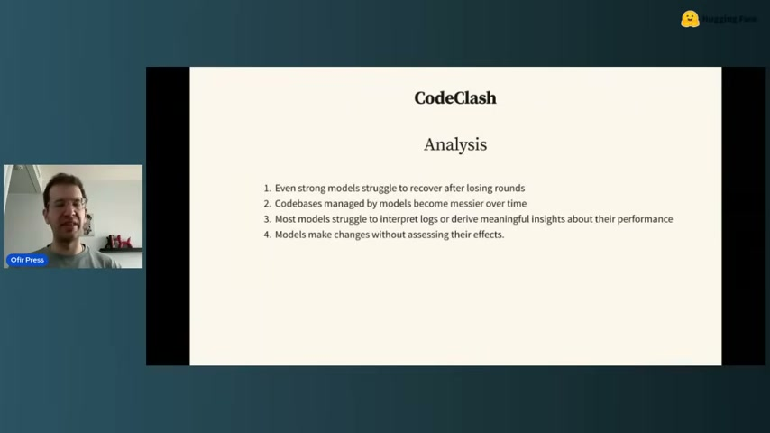
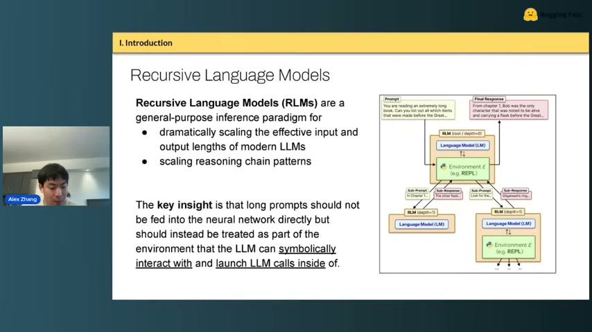
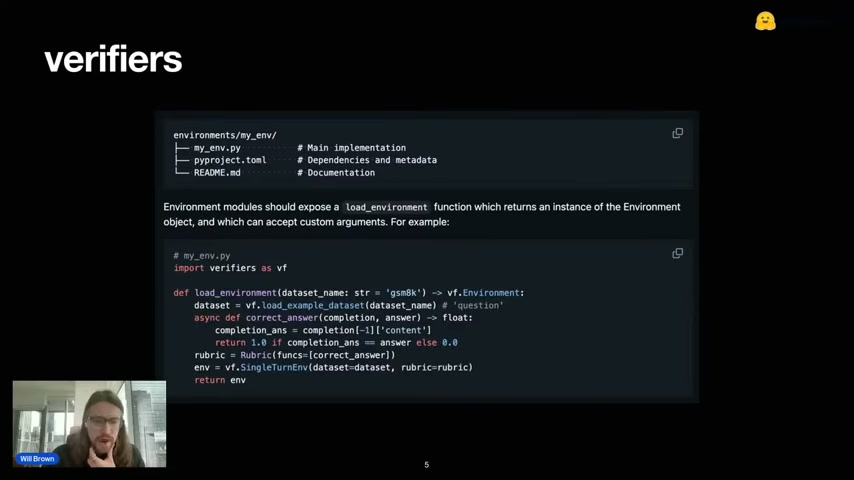

Hugging Face가 2026년 4월 22일 공개한 라이브 워크샵 **"RL for Agents — Deep Dive on Training Agents with RL and Open Source"**(1시간 54분)를 스피커별로 정리한다.

원본 영상: [YouTube 라이브 링크](https://www.youtube.com/live/cixmqTsi2A4)

**출연자 (모더레이터 Ben + 4 스피커)**

- **Lewis Tunstall** — Hugging Face
- **Ofir Press** — Princeton, SWE-Bench 팀
- **Alex Zhang** — MIT CSAIL, Recursive Language Models 저자
- **Will Brown** — Prime Intellect



## 1. Lewis Tunstall (Hugging Face) — "Training agents, not just models"

### 왜 지금 에이전트인가

Lewis는 최근 3년의 패러다임 전환을 ChatGPT → Cursor → **Claude Code**로 요약했다. 허깅페이스 내부에서도 최근 6개월 사이 코드 생산의 대부분이 에이전트 기반으로 옮겨갔다고 한다.

핵심은 **task horizon의 기하급수적 증가**다. METR의 유명한 플롯 기준, 숙련된 인간 기준 수행 시간이 **4~7개월마다 2배씩** 늘고 있다. 프론티어 모델(Opus, GPT-5.4 등)은 이미 "한 업무일 분량" 태스크를 넘어가는 중.



Anthropic이 공개한 **"Asynchronous software development with a team of Claudes"** 사례가 그 증거로 언급된다. 여러 Claude 인스턴스가 병렬로 코드베이스를 만드는 구조.

### 자기 에이전트를 훈련해야 하는 3가지 이유

Lewis는 "왜 API를 불러쓰지 않고 직접 훈련해야 하는가"에 대해 세 가지를 꼽았다.

1. **Custom rewards** — 내 도메인에 맞는 보상 설계
2. **Sovereignty / privacy** — 데이터가 외부로 나갈 수 없는 경우
3. **Specialisation** — 하나의 모델이 모든 도메인을 잘할 수는 없다



특히 **DR Tulu**의 "Search-Guided Rubrics Co-Evolve with the Policy" 사례가 인상적. Netflix의 『백년의 고독』 각색 연출 같은 long-form report 평가처럼, 정답이 없는 도메인에서도 **rubric 자체를 정책과 함께 진화시키는** 방식이 가능하다는 증명.

### 훈련 프레임워크 — "async or go home"

현재 오픈소스 RL 학습 프레임워크는 폭발적으로 증가 중. Lewis가 한 슬라이드에 나열한 것만 해도:

- **AReaL** — InclusionAI 모델 백엔드
- **veRL** — 학계의 사실상 표준
- **prime-rl** — Prime Intellect의 Torch-native 대규모 학습 프레임워크
- **TRL** — 허깅페이스 자체 트레이너, 이번에 async-capable로 업데이트됨
- **Slime** — GLM 모델의 백엔드
- **TorchForge** — Meta의 RL 프레임워크



공통 원리는 **Decoupled generation + training**. CPU-bound 롤아웃과 GPU-bound 학습이 서로 다른 타임스케일에서 돌기 때문에, 동기 방식은 GPU를 놀리게 된다. Magistral 테크 리포트 그림 참고.

### 남은 숙제

- **롱호라이즌(long-horizon)** — 랩 내부는 빠르게 진전 중이지만 오픈소스는 아직 갭
- **환경 자체의 수작업 의존** — 프레임워크가 늘어도 환경을 매번 손으로 만들어야 함

## 2. Ofir Press (Princeton, SWE-Bench) — 벤치마크의 5단계

Ofir는 10년간 LLM 연구를 하다 최근 4년은 벤치마킹 쪽으로 옮겼다고 한다. 그가 정리한 **벤치마킹의 5단계**는 다음과 같다.



1. **School exams** — GSM8K 같은 초등 수학 문제
2. **College exams** — MMLU 같은 학력 시험형
3. **Actual tasks (수일 단위)** — 인간이 며칠이면 풀 작업
4. **Actual tasks (수년 단위)** — 인간 팀이 수년 걸려 푼 과제
5. **Verifiable tasks that are currently unsolved** — 현재 아무도 못 푼 검증 가능한 과제

각 단계는 포화되면 다음 단계로 넘어간다. SWE-Bench는 3번에 해당하고, 이제 4번과 5번이 프론티어.

### CodeClash — 인간 vs 에이전트 갭이 큰 태스크 찾기

Ofir의 최신 작업 CodeClash(게임 아레나 스타일)에서 Claude 4.5/4.6조차 아직 숙련 인간에 크게 못 미친다. 재미있는 관찰:



1. 강한 모델도 한 번 라운드를 지면 회복하지 못함
2. 모델이 관리한 코드베이스는 시간이 지나면서 더 엉망이 됨
3. 대부분의 모델이 **로그를 읽고 자기 성능을 해석하지 못함**
4. 효과 검증 없이 코드를 바꿔버림

### 좋은 벤치마크 3원칙

Ofir 블로그([ofir.io](https://ofir.io/))에 정리된 세 원칙:

1. **Real-world usefulness와 상관관계가 있어야 한다**
2. **수명이 길어야 한다** (금방 포화되면 안 됨)
3. **Gameable하지 않아야 한다** (오버피팅 저항)

### SWE-Smith — 환경을 자동 생성한다

SWE-Bench 환경을 **수만 개 자동 생성**한 후속 연구. 저예산 학계도 무료 Modal 크레딧으로 32B 모델만 훈련해서 SWE-Bench 점수 개선을 증명했다. Ofir의 강조점:

> "데이터/환경 작업은 아주 적은 예산으로도 큰 임팩트가 가능하다. 학계가 해야 할 일이다."

## 3. Alex Zhang (MIT CSAIL) — Recursive Language Models (RLMs)

### 핵심 아이디어

> **"언어 모델이 가져야 할 유일한 도구는 코딩 도구다. 나머지 모든 도구는 그 코딩 환경 안에 임베디드돼야 한다."**



### 기존 에이전트와의 차이

| 기존 방식 | RLMs |
|---|---|
| JSON tool calling | REPL(Python/bash/IPython) 안 함수 호출 |
| 스캐폴드로 서브에이전트 고정 | 모델이 자기 실행 흐름을 recursive하게 설계 |
| human-in-the-loop 정책 | 모델이 스스로 sampling strategy를 생성 |

RLMs는 **서브에이전트를 "제안"하는 게 아니다**. 서브에이전트는 이미 있다. 핵심은 "LM이 REPL 안에서 다른 LM 호출을 first-class primitive로 부른다"는 것.

### 왜 중요한가

- 인간 엔지니어가 에이전트를 손수 설계하는 시대 이후의 방향
- Claude Code/Codex가 장문맥 회피용으로 쓰던 트릭을 정식화
- Programmatic tool calling이 JSON tool calling보다 일관되게 우수
- QED Nano, Long CoT 등 최근 연구와 결합 가능

## 4. Will Brown (Prime Intellect) — Verifiers & PrimRL

Will의 talk은 이 워크샵의 가장 실전적인 부분. "어떻게 open environment 생태계를 만들 것인가"에 대한 Prime Intellect의 답이다.

### Verifiers — 환경 정의 프레임워크



환경을 **독립 Python 패키지**로 배포한다. 구조는 단순:

```
environments/my_env/
├── my_env.py        # Main implementation
├── pyproject.toml   # Dependencies and metadata
└── README.md        # Documentation
```

각 환경은 `load_environment` 함수만 노출하면 된다.

```python
import verifiers as vf

def load_environment(dataset_name: str = 'gsm8k') -> vf.Environment:
    dataset = vf.load_example_dataset(dataset_name='question')
    async def correct_answer(completion, answer) -> float:
        completion_ans = completion[-1]['content']
        return 1.0 if completion_ans == answer else 0.0
    rubric = vf.Rubric(funcs=[correct_answer])
    env = vf.SingleTurnEnv(dataset=dataset, rubric=rubric)
    return env
```

이렇게 만들어놓으면 환경 허브에 올릴 수 있고, 다른 팀이 바로 재사용 가능.

### PrimRL — Apache 2.0 대규모 RL 학습

- Qwen 30B MoE 위에 **LoRA 어댑터**로 RL 학습
- **Hotswap LoRAs** — 서빙 중 어댑터 실시간 교체
- 로컬 GPU 개발 ↔ Prime Intellect 플랫폼 seamless
- `prime` CLI로 모델/환경 카탈로그 조회

### Will의 관점

> "개별 artifact(벤치/모델/데이터셋) 자체는 덜 귀해지고, 증분 개선이 쉬워진다. 대신 환경은 데이터셋과 비슷한 공급망 산업이 될 것이다."

## 5. 패널 Q&A

모더레이터 Ben이 4명에게 던진 질문들.

### 프론티어 close lab이 오픈소스보다 뭘 더 갖고 있나

- 오픈 인프라/아키텍처/레시피는 이미 충분히 좋음
- 차이는 **내부 환경과 데이터셋의 양**, 그리고 **verifiable + RLHF 혼합 보상 모델** 정제 노하우
- "알고리즘의 갭이 아니라 환경 라이브러리의 갭"

### Synthetic environment는 어디까지 왔나

같은 인터페이스(domain policy + user sim + tools + simulated backend)를 유지하되 **전혀 다른 세계로 재작성**하는 실험. 기존 telecom / library / airline에 더해 incident response / daily planning / EV charging 같은 새 도메인을 만드는 중.

### 환경 산업은 어떤 모습일 것인가

- 개별 artifact는 덜 귀해지지만 공급망이 커짐
- 더 작은 특화 모델 덕분에 "토큰당 컴퓨트"가 내려가면서 토큰 수요는 계속 증가
- **도메인 전문가가 ML 비전공자여도 환경을 만들 수 있는 인터페이스**가 필요

### LLM judge는 믿을 만한가

- **합리적 인간 다수가 같은 답을 낼 질문**만 judge에 맡기는 게 안전
- binary yes/no에 가까운 pseudo-verifiable 리워드는 OK
- 완전 주관적 평가는 여전히 위험

### 데이터 엔진 vs RL 환경의 경계

- 큰 모델 → 작은 모델 distillation은 엄밀히 "환경"이라기보다 **data engine**
- 그래도 같은 harness/환경 구조를 재사용할 수 있어 경계가 흐려지는 중
- SFT from a teacher model은 OOS 성능 저하 리스크가 있음 (조심)

## 6가지 테이크어웨이

1. **에이전트 시대의 병목은 모델이 아니라 환경이다**. 보상 모델, 롤아웃 엔진, 환경이 조각나 있고 프레임워크는 여럿.
2. **SWE-Bench → SWE-Smith처럼 환경을 자동 생성하는 방향**이 가장 저예산으로 임팩트 있는 연구 방향.
3. **RLMs는 "에이전트 프레임워크 자체를 모델 안으로 내재화"** 하자는 제안. 인간이 스캐폴드를 짜던 시대의 다음 단계.
4. **Verifiers + PrimRL**이 오픈소스 환경 허브의 가장 구체적인 후보.
5. **LLM judge는 binary-verifiable 영역에서만 안전** — 이게 보상 설계의 가드레일.
6. 오픈소스와 close lab의 차이는 **"얼마나 많은 환경을 정제했는가"** 에 있다. 알고리즘이 아니라 환경 자산이 해자.

## 참고

- 원본 영상: <https://www.youtube.com/live/cixmqTsi2A4>
- [METR — Measuring AI ability to complete long tasks](https://metr.org/)
- [SWE-Bench](https://swebench.com/)
- [Prime Intellect Verifiers](https://github.com/PrimeIntellect-ai/verifiers)
- [Ofir Press 블로그](https://ofir.io/)
- Alex Zhang, *Recursive Language Models* — arXiv 원문 직접 검색 권장

---

*전사: Whisper MLX whisper-small 2-pass (voice-memo-doc 스킬), 영상 다운로드: yt-dlp, 프레임 추출: ffmpeg. 2026-04-24 작성.*
