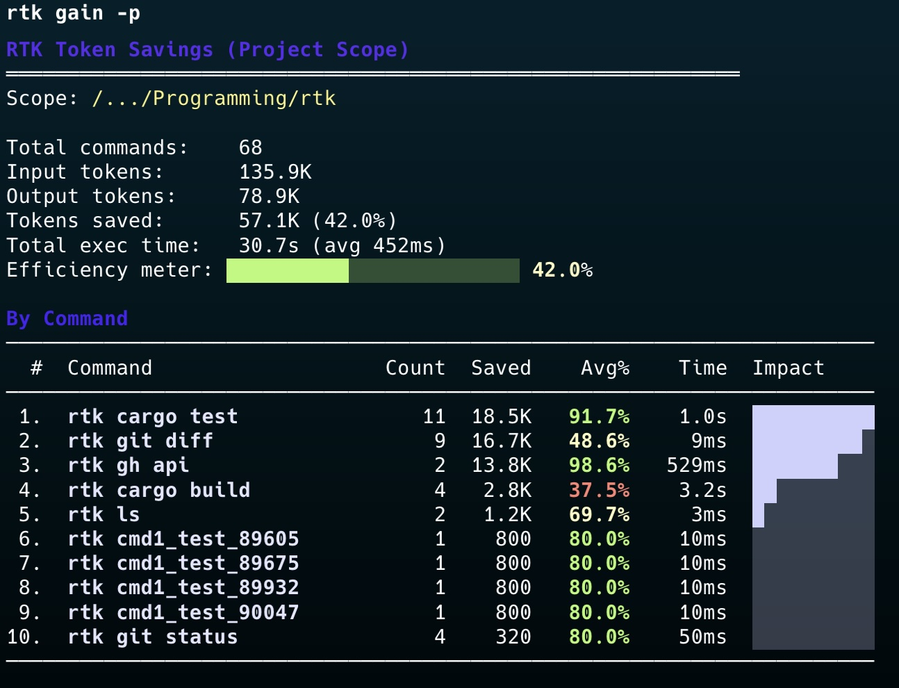

최근 AI 코딩 도구를 오래 써본 사람일수록 비슷한 지점에서 막힙니다.

- 모델은 점점 길게 읽을 수 있는데
- 실제 작업에서는 `git status`, `cat`, `grep`, `test` 같은 평범한 명령 출력이 너무 길고
- 결국 **중요한 사고 토큰은 덜 쓰고, 주변 로그를 읽는 데 비용을 더 쓰게 됩니다**

GitHub의 [rtk-ai/rtk](https://github.com/rtk-ai/rtk) 는 바로 이 문제를 겨냥한 도구입니다.

한 줄로 설명하면 이렇습니다.

> **RTK는 셸 명령 결과를 LLM에게 전달하기 전에 압축해서, AI 코딩 도구의 컨텍스트 낭비를 줄이는 CLI 프록시입니다.**

저장소 설명도 꽤 직설적입니다. `CLI proxy that reduces LLM token consumption by 60-90% on common dev commands.`

## RTK가 왜 흥미로운가

처음 보면 단순한 유틸리티처럼 보일 수 있습니다. 하지만 조금만 뜯어보면, 이 프로젝트는 단순 요약기가 아니라 **AI 코딩 워크플로우의 입출력 계층을 다시 설계하는 도구**에 가깝습니다.

예를 들어 코딩 에이전트는 이런 명령을 끊임없이 호출합니다.

- `ls`, `tree`
- `cat`, `head`, `tail`
- `rg`, `grep`, `find`
- `git status`, `git diff`, `git log`
- `cargo test`, `pytest`, `npm test`, `go test`
- `eslint`, `tsc`, `ruff`, `golangci-lint`

이때 원본 출력 전체를 모델이 그대로 읽으면, 실제로 생각해야 할 핵심보다 **주변 소음(noise)** 이 훨씬 많아집니다.

RTK는 그 소음을 줄입니다.

- 불필요한 주석, 공백, 보일러플레이트 제거
- 유사한 항목끼리 그룹화
- 반복 로그 중복 제거
- 실패/에러 중심 재구성
- 구조만 중요할 때는 값 대신 스키마만 전달

즉, “모델이 읽어야 할 것”을 줄이되, “판단에 필요한 구조”는 남기는 방식입니다.

## README에서 보이는 핵심 메시지

프로젝트 README에서 가장 먼저 강조하는 수치는 **60~90% 토큰 절감**입니다.

대표 예시는 이렇습니다.

| 작업 | 일반 출력 | RTK 출력 | 절감 |
|---|---:|---:|---:|
| `ls/tree` | 2,000 | 400 | -80% |
| `cat/read` | 40,000 | 12,000 | -70% |
| `git status` | 3,000 | 600 | -80% |
| `cargo test` / `npm test` | 25,000 | 2,500 | -90% |

중요한 건 숫자 자체보다 **절감되는 구간이 정확히 실무에서 자주 쓰는 명령들**이라는 점입니다.

이 말은 결국,

> AI 코딩 도구의 성능은 모델 스펙만이 아니라, 모델에 들어가기 전 출력이 얼마나 잘 정리되는가에도 크게 좌우된다는 뜻입니다.

## 어떻게 동작하나

RTK 아키텍처 문서를 보면 구조가 꽤 깔끔합니다.

1. 사용자가 명령 실행
2. RTK가 명령을 가로채거나 프록시처럼 앞단에 위치
3. 실제 명령 실행
4. 결과를 명령 유형에 맞는 필터로 압축
5. 축약된 결과만 LLM 컨텍스트로 전달
6. 원본 대비 절감량은 SQLite 기반 tracking으로 저장

이 과정에서 눈에 띄는 설계 원칙이 있습니다.

### 1) 실패하면 원본으로 돌아가는 fail-safe
필터링에 문제가 있으면 원본 출력을 사용하도록 설계했습니다. “압축하다가 중요한 걸 망친다”는 우려를 줄이려는 접근입니다.

### 2) exit code 보존
이건 의외로 중요합니다. 테스트나 린트에서 실패 여부는 출력보다 **종료 코드**가 훨씬 중요합니다. RTK는 underlying tool의 exit code를 그대로 보존해 CI/CD 신뢰성을 해치지 않도록 설계했습니다.

### 3) 명령별 맞춤 필터
모든 출력을 한 방식으로 요약하지 않습니다.

- git은 stats extraction
- lint는 규칙별 grouping
- 로그는 deduplication
- 테스트는 failure focus
- JSON은 structure only
- 코드 파일은 filter level 기반 축약

이 점이 좋았습니다. “하나의 요약기”가 아니라 **출력 타입별 압축 전략 집합**에 가깝습니다.

## RTK가 특히 잘 맞는 사람

이 프로젝트는 모든 사용자에게 동일하게 유효하진 않습니다. 하지만 아래 유형에는 꽤 잘 맞습니다.

### 1) Claude Code, Codex, Gemini CLI 같은 AI 코딩 툴을 오래 쓰는 사람
짧은 Q&A보다, 실제 개발 세션처럼 셸 호출이 많은 경우 체감 효과가 큽니다.

### 2) 테스트/린트 로그가 큰 프로젝트를 다루는 사람
프론트엔드 모노레포, Rust 프로젝트, Python 테스트 스위트처럼 출력이 커지기 쉬운 환경에 특히 유리합니다.

### 3) “모델 성능”보다 “전체 워크플로우 효율”을 보는 사람
좋은 모델을 쓰는 것과 별개로, **입력되는 컨텍스트 품질을 높이는 것**이 훨씬 현실적인 개선일 때가 많습니다.

## 지원 범위가 넓은 것도 강점

README 기준으로 RTK는 꽤 많은 AI 코딩 도구와 연결점을 제공합니다.

- Claude Code
- GitHub Copilot
- Cursor
- Gemini CLI
- Codex
- Windsurf
- Cline / Roo Code
- OpenCode
- OpenClaw

특히 눈에 띈 건 **OpenClaw 플러그인**입니다.

저장소 안 `openclaw/README.md` 를 보면, OpenClaw의 `exec` 도구 호출 전 `before_tool_call` 훅에서 명령을 RTK 형태로 재작성하는 구조를 설명합니다. 즉, OpenClaw 내부에서도 `git status` 같은 셸 명령을 자동으로 더 압축된 출력으로 바꿔줄 수 있다는 뜻입니다.

이 포인트는 꽤 중요합니다. 앞으로 에이전트 시스템은 단순히 “어떤 모델을 썼는가”보다, **도구 출력이 얼마나 모델 친화적으로 정리되는가**가 점점 중요해질 가능성이 높기 때문입니다.

## 설치도 비교적 단순하다

README 기준 설치 경로는 세 가지가 대표적입니다.

```bash
brew install rtk
```

```bash
curl -fsSL https://raw.githubusercontent.com/rtk-ai/rtk/refs/heads/master/install.sh | sh
```

```bash
cargo install --git https://github.com/rtk-ai/rtk
```

그리고 AI 도구별 초기화도 간단한 편입니다.

```bash
rtk init -g
rtk init -g --gemini
rtk init -g --codex
rtk init -g --agent cursor
```

이런 식으로 각 도구에 맞는 hook 또는 설정 파일을 생성해 줍니다.

## 인상적이었던 부분 3가지

### 1) “토큰 절약”을 추상 개념이 아니라 운영 지표로 다룬다
`rtk gain`, `rtk discover`, `rtk session` 같은 명령은 단순한 마케팅 포인트가 아니라, 실제로 얼마나 절약했는지 추적하게 만듭니다.

이건 좋습니다. 비용 절감은 체감만으로 판단하면 흐려지기 쉬운데, RTK는 이를 사용 기록과 함께 보여주려 합니다.

### 2) Rust 단일 바이너리라는 배포 장점
Rust 기반 단일 바이너리라 배포/휴대가 단순합니다. 특히 개발 도구는 설치 복잡도가 높으면 금방 외면받는데, 이 프로젝트는 그 부분을 꽤 신경 쓴 편입니다.

### 3) 단순 요약이 아니라 “명령 의미”를 보존하려는 태도
`git push -> ok main`, `git commit -> ok abc1234`처럼 결과를 짧게 만들되, 사용자가 정말 확인해야 할 의미는 남기려는 의도가 보입니다.

## 아쉬운 점도 있다

물론 한계도 보입니다.

### 1) 절감률은 프로젝트 규모와 명령 패턴에 따라 달라질 수 있다
README의 수치는 인상적이지만, 모든 환경에서 그대로 나오진 않을 겁니다. 특히 원래 출력이 짧은 프로젝트에서는 체감이 제한적일 수 있습니다.

### 2) 내장 도구와 셸 도구의 경계가 있다
문서에서도 분명히 말하듯, 어떤 AI 툴은 내장 Read/Grep/Glob 도구가 별도로 존재합니다. 이런 경우 bash hook만으로는 전부 커버되지 않습니다.

즉, RTK는 **셸 경로를 최적화하는 도구**이지, 모든 컨텍스트 입력을 무조건 줄여주는 만능 계층은 아닙니다.

### 3) 결국 “무엇을 잘라낼 것인가”는 트레이드오프다
실패 중심 요약, 그룹화, 구조 축약은 대부분 유용하지만, 특정 순간에는 원본 세부 정보가 필요할 수 있습니다. 다행히 verbose 모드와 raw output fallback이 있어 완화는 됩니다.

## 그래서 이 프로젝트를 어떻게 봐야 하나

저는 RTK를 “AI 시대의 `grep` 같은 필수 기본 도구”라고까지는 아직 말하지 않겠습니다. 하지만 방향은 분명히 좋아 보입니다.

이 프로젝트가 의미 있는 이유는, AI 코딩 경험을 개선하는 방법을 **더 큰 모델**이나 **더 긴 컨텍스트**에서만 찾지 않았기 때문입니다.

대신 이런 질문을 던집니다.

> 정말로 모델에게 이 모든 로그를 다 보여줘야 하나?

이 질문은 꽤 본질적입니다.

AI 개발 환경이 성숙할수록, 경쟁력은 단순히 “최신 모델 사용”이 아니라

- 어떤 출력을 먼저 보여줄지
- 무엇을 생략할지
- 실패 정보를 어떻게 구조화할지
- 사람이 다시 원본을 보고 싶을 때 어떻게 복구할지

같은 **컨텍스트 엔지니어링** 쪽으로 이동할 가능성이 큽니다.

그 점에서 RTK는 꽤 좋은 사례입니다.

## 한 줄 결론

**RTK는 AI 코딩 도구의 토큰 낭비를 줄이는 작은 유틸리티가 아니라, 셸 출력 자체를 LLM 친화적으로 재설계하는 인프라 도구에 가깝습니다.**

AI 에이전트나 코딩 도구를 자주 쓰는 분이라면, 한 번쯤 직접 써보고 `rtk gain`으로 체감 수치를 확인해볼 만합니다.

## 함께 보면 좋은 링크

- GitHub 저장소: https://github.com/rtk-ai/rtk
- 공식 사이트: https://www.rtk-ai.app
- 아키텍처 문서: https://github.com/rtk-ai/rtk/blob/master/ARCHITECTURE.md
- OpenClaw 플러그인 설명: https://github.com/rtk-ai/rtk/blob/master/openclaw/README.md
