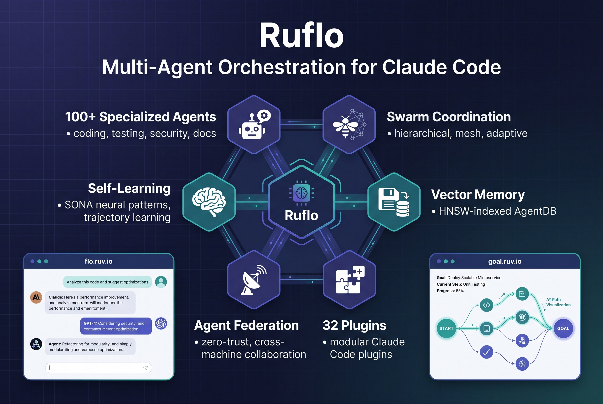

# Ruflo: Claude Code에 스웜·자가학습·페더레이션을 얹은 멀티에이전트 오케스트레이터

에이전트 하나가 코드를 짜는 건 이제 놀랍지 않다. 문제는 에이전트가 열 개, 스무 개가 되었을 때다. 서로 기억을 못 공유하고, 같은 파일을 동시에 건드리고, 실패하면 처음부터 다시 시작하는 구조면 에이전트가 많을수록 더 느려진다.

[Ruflo](https://github.com/ruvnet/ruflo)는 이 지점에서 시작한다. Claude Code를 쓰는 사람이 에이전트를 100개 이상 돌려도 혼란 없이 조정할 수 있게 만든 오케스트레이션 플랫폼이다.



## Q. Ruflo가 뭔가요?

한 줄로 말하면 **Claude Code용 멀티에이전트 오케스트레이터**다.

원래 프로젝트 이름은 Claude Flow였다. rUv라는 개발자가 이름을 Ruflo로 바꿨는데, "Ru"는 자기 이름에서 따오고 "flo"는 flow state에서 따왔다. 핵심 엔진은 Rust로 짠 WASM 커널이 돌린다.

구조를 그리면 이렇다:

```
사용자 → Ruflo (CLI/MCP) → 라우터 → 스웜 → 에이전트 → 메모리 → LLM
                              ↑                         |
                              +------ 학습 루프 ←-------+
```

에이전트가 일을 끝내면 결과가 메모리에 들어가고, 메모리는 다음 작업의 라우팅에 영향을 준다. 즉 쓰면 쓸수록 판단이 좋아지는 구조다.

## Q. "에이전트 100개"가 실제로 의미가 있나요?

있다. 단순히 숫자가 많은 게 아니라 역할이 나뉘어 있다.

코딩, 테스트, 코드 리뷰, 보안 스캔, 문서 생성, 아키텍처 설계, 데이터베이스 마이그레이션 등 각자 전문 영역이 정해져 있다. 그리고 이 에이전트들이 **스웜**이라는 단위로 조정된다.

스웜 조정 방식은 세 가지다:

1. **계층형 (Hierarchical)** — Queen 에이전트가 지시를 내리고 나머지가 실행한다
2. **메시형 (Mesh)** — 에이전트끼리 직접 통신한다
3. **적응형 (Adaptive)** — 상황에 따라 자동으로 토폴로지를 바꾼다

Raft, Byzantine, Gossip 같은 합의 알고리즘도 내장되어 있어서, 에이전트 간 의견 충돌이 있을 때 투표로 결정한다.

## Q. 자가학습이라는 건 구체적으로 어떤 건가요?

SONA(Self-Organizing Neural Architecture)라는 시스템이 핵심이다.

에이전트가 성공한 작업 패턴을 학습해서 다음에 비슷한 작업이 들어오면 이전 성공 경로를 먼저 시도한다. ReasoningBank에 추론 궤적이 저장되고, trajectory learning으로 과거 해결책을 재사용한다.

메모리는 AgentDB라는 벡터 데이터베이스에 저장된다. HNSW 인덱싱을 써서 무차별 대입 검색보다 150배~12,500배 빠르다고 한다. 세션이 끝나도 메모리가 남아 있어서, 다음에 새 세션을 시작해도 이전 맥락을 불러올 수 있다.

## Q. 플러그인은 몇 개인가요?

**32개**의 네이티브 Claude Code 플러그인이 있다. 카테고리별로 정리하면:

**핵심 오케스트레이션:**
- ruflo-core: 서버, 상태 체크, 플러그인 탐색
- ruflo-swarm: 에이전트 팀 조정
- ruflo-autopilot: 에이전트 자율 루프 실행
- ruflo-federation: 다른 머신의 에이전트와 안전한 협업

**메모리와 지식:**
- ruflo-agentdb: 벡터 데이터베이스
- ruflo-rag-memory: 하이브리드 검색, 그래프 홉, 다양성 랭킹
- ruflo-knowledge-graph: 엔티티 관계 맵 구축

**지능과 학습:**
- ruflo-intelligence: 과거 성공에서 학습
- ruflo-goals: 큰 목표를 하위 계획으로 분해

**코드 품질:**
- ruflo-testgen: 누락된 테스트 자동 생성
- ruflo-browser: Playwright 브라우저 테스트
- ruflo-jujutsu: git diff 분석, 리스크 평가, 리뷰어 추천

**보안:**
- ruflo-security-audit: 취약점·CVE 스캔
- ruflo-aidefence: 프롬프트 인젝션 차단, PII 탐지

설치는 Claude Code에서 `/plugin install ruflo-core@ruflo` 한 줄이면 된다.

## Q. 페더레이션이라는 게 눈에 띄는데요?

**에이전트판 Slack**이라고 생각하면 된다.

다른 머신, 다른 조직, 다른 클라우드 리전에 있는 에이전트끼리 안전하게 작업을 주고받는 기능이다. 핵심 원칙은 **제로트러스트**.

1. 원격 에이전트는 처음에 무조건 신뢰 불가 상태로 시작한다
2. mTLS + ed25519 챌린지-리스폰스로 신원을 증명한다
3. 모든 아웃바운드 메시지에서 PII를 자동 제거한다
4. 행동 기반 신뢰 점수로 권한을 관리한다 — 신뢰는 서서히 올라가고, 문제가 생기면 즉시 강등된다

14종 탐지 파이프라인이 이메일, 주민번호, 비밀번호 등을 스캔하고, 신뢰 수준에 따라 차단·마스킹·해시·통과 정책을 적용한다.

실제 사용 시나리오: A팀과 B팀이 고객 데이터를 공유하지 않으면서 사기 패턴 분석 결과만 주고받는 식이다.

## Q. Web UI도 있나요?

**[flo.ruv.io](https://flo.ruv.io/)**에서 바로 쓸 수 있다. 계정도 API 키도 없이.

6개 프롬프트 모델이 기본 지원된다:
- Qwen 3.6 Max (기본)
- Claude Sonnet 4.6
- Claude Haiku 4.5
- Gemini 2.5 Pro
- Gemini 2.5 Flash
- OpenAI

모델 하나의 응답에서 4~6개 툴이 동시에 실행된다. 병렬 처리가 기본이다. "내가 좋아하는 색은 남색이야"라고 말해두고 몇 주 뒤에 물어봐도 기억한다.

직접 호스팅도 가능하다. Docker 이미지로 배포되고, Cloud Run, Fly.io, Kubernetes, docker-compose 어디든 올릴 수 있다.

## Q. Goal Planner도 있다면서요?

**[goal.ruv.io](https://goal.ruv.io/)**에서 자연어로 목표를 적으면 Ruflo가 알아서 분해한다.

"인증 리팩토링을 테스트와 PR까지 끝내줘"라고 적으면:
1. 성공 기준을 추출하고
2. 전제조건과 행동으로 분해하고
3. A\* 탐색으로 최적 경로를 찾고
4. 라이브 에이전트에게 작업을 배정한다

실패하면 처음부터 다시 시작하지 않고 현재 상태에서 다시 A\*를 돌린다. 실패가 학습이 되는 구조다.

[/agents](https://goal.ruv.io/agents) 대시보드에서는 각 에이전트의 역할, 현재 단계, 메모리 네임스페이스, 토큰 예산, 상태를 실시간으로 볼 수 있다.

## Q. Claude Code 단독과 뭐가 다른가요?

| 항목 | Claude Code 단독 | + Ruflo |
|---|---|---|
| 에이전트 협업 | 격리, 공유 컨텍스트 없음 | 공유 메모리 + 합의 기반 스웜 |
| 조정 | 수동 | Queen 중심 계층 + 자동 라우팅 |
| 메모리 | 세션만 유지 | HNSW 벡터 메모리, 밀리초 단위 검색 |
| 학습 | 정적 | SONA 자가학습 |
| 백그라운드 작업 | 없음 | 12개 자동 트리거 워커 |
| LLM | Anthropic만 | Claude, GPT, Gemini, Cohere, Ollama + 페일오버 |
| 보안 | 기본 | CVE 강화, AIDefence |

## Q. 어떻게 시작하나요?

**Claude Code 플러그인 (권장):**
```bash
/plugin marketplace add ruvnet/ruflo
/plugin install ruflo-core@ruflo
/plugin install ruflo-swarm@ruflo
```

**CLI 설치:**
```bash
npx ruflo@latest init --wizard
```

**MCP 서버:**
```bash
claude mcp add ruflo -- npx -y @claude-flow/cli@latest
```

init 한 번이면 끝이다. 그 다음은 평소처럼 Claude Code를 쓰면 된다. hooks 시스템이 백그라운드에서 작업을 라우팅하고, 에이전트를 조정하고, 성공 패턴을 학습한다.

## Q. 누가 쓰면 좋은가요?

- **혼자 Claude Code를 쓰는데 에이전트 하나로는 부족한 사람** — 스웜으로 여러 에이전트를 동시에 돌릴 수 있다
- **팀 단위로 에이전트를 쓰는 사람** — 페더레이션으로 다른 머신의 에이전트와 안전하게 협업한다
- **에이전트가 반복적으로 비슷한 실수를 하는 사람** — SONA 자가학습으로 패턴을 개선한다
- **로컬에서 프라이버시를 유지하면서 쓰고 싶은 사람** — Ollama 연동으로 완전 오프라인 실행도 가능하다

## Q. 한계는 없나요?

있다.

- **Web UI가 아직 베타다.** 멀티모델 채팅과 툴 호출은 되지만, 프로덕션급 안정성은 아직이다.
- **플러그인이 32개면 러닝 커브가 있다.** init 후 기본으로 쓰면 되지만, 커스터마이징하려면 어떤 플러그인을 조합할지 결정해야 한다.
- **페더레이션은 아직 로드맵 단계가 많다.** [이슈 #1669](https://github.com/ruvnet/ruflo/issues/1669)에서 전체 아키텍처와 로드맵을 볼 수 있다.
- **Rust/WASM 기반이라 기여 진입 장벽이 있다.** 핵심 엔진 수정하려면 Rust 경험이 필요하다.

## Q. 총평을 해주세요

Ruflo는 "에이전트 하나 잘 쓰기"에서 "에이전트 여럿이 협업하기"로 넘어가는 시점에 나온 도구다.

강점은 세 가지다:

1. **조정 구조가 명확하다.** Queen-led 계층, 메시, 적응형 중 선택할 수 있고, 합의 알고리즘이 내장되어 있다.
2. **학습이 누적된다.** SONA가 성공 패턴을 기억해서 세션이 바뀌어도 판단이 좋아진다.
3. **보안이 기본이다.** 페더레이션에서 PII 자동 제거, 행동 기반 신뢰 점수, 감사 추적이 기본 제공된다.

약점도 명확하다:

- Web UI가 베타라 프로덕션에 바로 쓰기는 이르다
- 플러그인이 많아서 처음에 조합을 결정하기 어렵다
- 핵심 기여에 Rust가 필요하다

에이전트 하나로 충분하면 굳이 지금 Ruflo를 쓸 필요는 없다. 하지만 에이전트를 여러 개 돌려야 하거나, 다른 팀의 에이전트와 작업을 주고받아야 하거나, 반복 작업에서 에이전트가 학습되길 원한다면 살펴볼 가치가 있다.

👉 **레포:** <https://github.com/ruvnet/ruflo>
👉 **Web UI:** <https://flo.ruv.io/>
👉 **Goal Planner:** <https://goal.ruv.io/>
